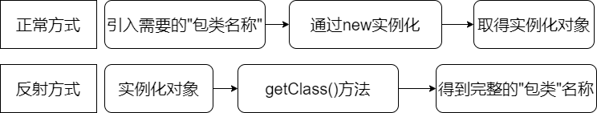

# 注解

## 1、内置注解

| 注解                  | 作用                                                         |
| --------------------- | ------------------------------------------------------------ |
| **@Override**         | 限定重写父类方法。对于子类中被@Override 修饰的方法，如果存在对应的被重写的父类方法，则正确；如果不存在，则报错。@Override 只能作用于方法，不能作用于其他程序元素。 |
| **@Deprecated**       | 用于表示某个程序元素（类、方法等）已过时。如果使用了被@Deprecated修饰的类或方法等，编译器会发出警告。 |
| **@SuppressWarnings** | 抑制编译器警告。指示被@SuppressWarnings修饰的程序元素（以及该程序元素中的所有子元素，例如类以及该类中的方法.....）取消显示指定的编译器警告。 |

## 2、元注解

* 元注解的作用就是负责注解其他注解，Java定义了四个标准的meta-annotation类型，他们被用来提供对其他annotation类型作说明
* 这些类型和他们所支持的类在java.lang.annotation包中可以找到(@Target,@Retention,@Document,@Inherited)
  * **@Target:** 用于描述注解的使用范围(即:被描述的注解可以用在什么地方)
  * **@Retention:** 表示需要在什么级别保存该注解信息,用于描述注解的生命周期
    * (SOURCE<CLASS<**RUNTIME**)
  * **@Document:** 说明该注解将包含在javadoc中
  * **@Inherited:** 说明子类可以**继承**父类中的该注解
  
  > **以下使用元注解创建自定义注解实例**
  
  > ```java
  > import java.lang.annotation.*;
  > //定义一个注解
  > //Target 表示注解可以用在哪些地方
  > @Target(value = {ElementType.METHOD,ElementType.TYPE})
  > 
  > //Retention 表示我们的注解在什么地方还有效果
  > // SOURCE<CLASS<RUNTIME
  > @Retention(value = RetentionPolicy.RUNTIME)
  > 
  > // Documented表示是否将我们的直接生成在JAVADOC中
  > @Documented
  > 
  > //Inherited 子类可以继承父类的注解
  > @Inherited
  > 
  > public @interface MyAnnotation {
  >     String value();
  > }
  > ```
  
  > **使用自定义注解**
  
  > ```java
  > @MyAnnotation("name")
  > public class MyTest {
  >     public void test(){
  >     }
  > }
  > ```


## 3、自定义注解

- 自定义注解示例

  > ```java
  > import java.lang.annotation.ElementType;
  > import java.lang.annotation.Retention;
  > import java.lang.annotation.RetentionPolicy;
  > import java.lang.annotation.Target;
  > 
  > @Target({ElementType.TYPE,ElementType.METHOD})
  > @Retention(RetentionPolicy.RUNTIME)
  > public @interface MyAnnotation2 {
  >     //注解参数: 参数类型 + 参数名();
  >         String name() default "";
  >         int age() default 0;
  >         int id() default -1;    //如果默认为-1,代表不存在
  >         String[] school() default {"1","2"};
  >  }
  > ```
  >
  > ```java
  > public class MyTest2 {
  >     @MyAnnotation2(age=18,name="Jerry")
  >     public void test(){
  >     }
  > }
  > ```

# 反射

**动态语言和静态语言**

* **动态语言**

  是一类在运行是可以改变其数据结构的语言，常见动态语言有(Object-C、C++、JavaScript、PHP、Python)
* **静态语言**

   * 运行时结构不可变，如Java、C、C++
   * Java不是动态语言，但Java可以称为“准动态语言”。即Java有一定的动态性，可以利用反射机制获取类的动态语言的特性。

## 1、概念

**Reflection(反射)是Java被视为动态语言的关键，反射机制允许程序在执行期间借助于Reflection API取得任何类的内部信息，并能直接操作任意对象的内部属性及方法。**

```java
Class c = Class.forName("java.lang.String")
```

**加载完类之后，在堆内存的方法区中就产生了一个Class类型的对象(一个类中只有一个Class对象), 这个对象就包含了完整的类的结构信息。  我们可以以通过这个对象看到类的内部结构这就称为反射。**



```java
public class Test extends Object{
    public static void main(String[] args) throws ClassNotFoundException {
        //通过反射获取类的Class对象
        Class c1 = Class.forName("com.reflection.User");
        System.out.println(c1);

        //一个类在内存中只有一个Class对象
        //一个类被加载后, 类的整个结构都会被封装在Class对象中
        Class c2 = Class.forName("com.reflection.User");
        System.out.println(c2.hashCode());
        System.out.println(c1.hashCode());
    }
}


//实体类
class User{
    private String name;
    private int age;
    private int id;

    public User() {
    }

    public User(String name, int age, int id) {
        this.name = name;
        this.age = age;
        this.id = id;
    }

    public String getName() {
        return name;
    }

    public void setName(String name) {
        this.name = name;
    }

    public int getAge() {
        return age;
    }

    public void setAge(int age) {
        this.age = age;
    }

    public int getId() {
        return id;
    }

    public void setId(int id) {
        this.id = id;
    }

    @Override
    public String toString() {
        return "User{" +
                "name='" + name + '\'' +
                ", age=" + age +
                ", id=" + id +
                '}';
    }
}
```

反射相关的主要API

>java.lang.Class: 代表一个类
>
>java.lang.reflect.Method: 代表类的方法
>
>java.lang.relfect.Field: 代表类的成员变量
>
>java.lang.relfect.Contructor: 代表类的构造器

## 2、反射源头Class类

在Object类中定义了一下的方法，此方法将被所有的子类继承

```java
 public final Class getClass()
```

此方法返回值的类型是一个Class类，此类是Java反射的源头，实际上所谓的反射从程序的运行结果来看也很好理解，即：通过对象反射求出类的名称。

对象通过反射后可以得到的信息：某个类的属性、方法和构造器、某个类到底实现了那些接口。对于每个类而言，JRE都为其保留一个不变的Class类型的对象。一个Class对象包含了特定的某个结构(**class/interface/enum/annotation/primitive type/void[]**)的有关信息。

* Class 本身也是一个类
* Class 对象只能由系统建立对象
* 一个加载的类在JVM中只有一个Class的实例
* 一个Class对象对应的是一个加载到JVM中的.class文件
* 每个类的实例都会记得自己是由哪个Class实例产生的
* 通过Class可以完整地得到一个类中地所有被加载的结构
* Class类是Reflection的根源，针对任何你想动态加载、运行的类，唯有想获得相应的Class对象

Class类中的常用方法

| 方法名 | 功能说明|
| ---- | ---- |
| **Class.forName();** | **动态加载类。** |
| **newInstance() ：** | **根据对象的class新建一个对象** |
| **getSuperclass()** | **获取继承的父类** |
| **getInterfaces()** | **获取继承的接口** |
| **getDeclaredFields()** | **获取字段名字** |
| **getDeclaredMethods();** | **获取当前类的所有方法。** |
| **getConstructors()** | **获得所有的构造函数。** |
| **getModifiers() ：** | **反射中获得修饰符** |
| **getPackage() ：** | **反射中获得package** |
| **getField(String name)：** | **反射中获得域成员。** |
| **getFields() :** | **获得域数组成员。** |
| **isAnnotation() ：** | **判断是否为注解类型。** |
| **isPrimitive() ：** | **判断是否为基本类型。** |
| **isArray() ：** | **判断是否为数组类型。** |
| **isEnum() ：** | **判断是否为枚举类型。** |
| **getClassLoader() ：** | **获得类的类加载器** |
| **getMethods()** | **获得公共的方法。** |


## 3、获取Class类的实例的三种方法

1. 若已知具体的类，通过类的class属性获取，该方法最为可靠，程序性能最高

```java
Class clazz = Person.class;
```

2. 已知某个类的实例，调用该实例的getClass()方法获取Class对象

```java
Class clazz = person.getClass();
```


3. 已知一个类的全类名，且该类在类路径下，可通过Class类的静态方法forName()获取

```java
Class clazz = Class.forName("demo01.Student");
```


## 4、Class对象

| **class: 外部类，成员(成员内部类，静态内部类)，局部内部类，匿名内部类** |
| ------------------------------------------------------------ |
| **interface: 接口**                                          |
| **[]: 数组**                                                 |
| **enum: 枚举**                                               |
| **annotation: 注解@interface**                               |
| **primitive type: 基本数据类型**                             |
| **void**                                                     |

> ```java
> package com.reflection;
> 
> import java.lang.annotation.ElementType;
> 
> public class Test04 {
>     public static void main(String[] args) {
>         Class c1 = Object.class; //类
>         Class c2 = Comparable.class; //接口
>         Class c3 = String[].class; //一维数组
>         Class c4 = int[][].class; //二维数组
>         Class c5 = Override.class; //注解
>         Class c6 = ElementType.class; //枚举
>         Class c7 = Integer.class; //基本数据类型
>         Class c8 = void.class; //void
>         Class c9 = Class.class; //Class
> 
>         System.out.println(c1);
>         System.out.println(c2);
>         System.out.println(c3);
>         System.out.println(c4);
>         System.out.println(c5);
>         System.out.println(c6);
>         System.out.println(c7);
>         System.out.println(c8);
>         System.out.println(c9);
>     }
> }
> ```


## 5、类的初始化

### 类的主动引用(一定会发生类的初始化)

1. 当虚拟机启动，先初始化main方法l所在的类
2. new一个类的对象
3. 调用类的静态的成员(除了final常量)和静态方法
4. 使用java.lang.reflect包的方法对其类进行反射调用
5. 当初始化一个类，如果其父类没有被初始化，则先会初始化他的父类

### 类的被动引用(不会发生类的初始化)

1. 当访问一个静态域时，只有真正声明这个域的类才会被初始化。如：当子类引用父类的静态变量，不会导致子类被初始化
2. 通过数组定义类应用，不会触发此类的初始化
3. 引用常量不会触发此类的初始化**(常量在链接阶段就存入调用类的常量池中了**)

```java
package com.reflection;

// 测试类什么时候会初始化
public class Test06 {

    static {
        System.out.println("Main类被加载");
    }

    public static void main(String[] args) throws ClassNotFoundException {

        //1.主动引用
       // Son son = new Son();

        //反射也会产生主动引用
        //Class c1 = Class.forName("com.reflection.Son");
        //Class.forName("com.reflection.Father");

        //2.被动引用
        //System.out.println(Son.b);

        //数组引用
        //Son[] array = new Son[5];

        //常量引用
        System.out.println(Son.M);
    }
}

class Father{

    static int b= 200;

    static {
        System.out.println("父类被加载");
    }
}

class Son extends Father{

    static {
        System.out.println("子类被加载");
        m = 300;
    }
    static int m = 100;
    static final int M = 1;
}

```

## 6、 Java 内存分析(堆、栈、方法区)


```java
package com.reflection;

public class Test05 {
    public static void main(String[] args) {
        A a = new A();
        System.out.println(A.m);
    }
}

class A{
    static {
        System.out.println("A类的静态代码块初始化");
        m = 300;
    }
    static int m = 100;

    public A(){
        System.out.println("A类的无参构造初始化");
    }
}
```

## 7、类加载器

```java
package com.reflection;

public class Test07 {
    public static void main(String[] args) throws ClassNotFoundException {

        //1.获取系统类的加载器
        ClassLoader systemClassLoader = ClassLoader.getSystemClassLoader();
        System.out.println(systemClassLoader);

        //2.获取系统类加载器的父类加载器-->扩展类加载器
        ClassLoader parent = systemClassLoader.getParent();
        System.out.println(parent);

        //3.获取扩展类加载器的父类加载器-->根加载器(C/c++)
        ClassLoader parent1 = parent.getParent();
        System.out.println(parent1);

        //测试当前类是哪个加载器加载的
        Class c1 = Class.forName("com.reflection.Test07");
        ClassLoader classLoader = c1.getClassLoader();
        System.out.println(classLoader);

        //测试系统类时是哪个加载器加载的
        Class c2 = Class.forName("java.lang.Object");
        ClassLoader classLoader1 = c2.getClassLoader();
        System.out.println(classLoader1);

        System.out.println(System.getProperty("java.class.path"));    

        /*
        * D:\JDK8\jre\lib\charsets.jar;D:\JDK8\jre\lib\deploy.jar;
        * D:\JDK8\jre\lib\ext\access-bridge-64.jar;
        * D:\JDK8\jre\lib\ext\cldrdata.jar;
        * D:\JDK8\jre\lib\ext\dnsns.jar;
        * D:\JDK8\jre\lib\ext\jaccess.jar;
        * D:\JDK8\jre\lib\ext\jfxrt.jar;
        * D:\JDK8\jre\lib\ext\localedata.jar;
        * D:\JDK8\jre\lib\ext\nashorn.jar;
        * D:\JDK8\jre\lib\ext\sunec.jar;
        * D:\JDK8\jre\lib\ext\sunjce_provider.jar;
        * D:\JDK8\jre\lib\ext\sunmscapi.jar;
        * D:\JDK8\jre\lib\ext\sunpkcs11.jar;
        * D:\JDK8\jre\lib\ext\zipfs.jar;
        * D:\JDK8\jre\lib\javaws.jar;
        * D:\JDK8\jre\lib\jce.jar;
        * D:\JDK8\jre\lib\jfr.jar;
        * D:\JDK8\jre\lib\jfxswt.jar;
        * D:\JDK8\jre\lib\jsse.jar;
        * D:\JDK8\jre\lib\management-agent.jar;
        * D:\JDK8\jre\lib\plugin.jar;
        * D:\JDK8\jre\lib\resources.jar;
        * D:\JDK8\jre\lib\rt.jar;
        * H:\web\javabase\out\production\java-annotation;
        * C:\JetBrains\IntelliJ IDEA 2020.3.1\lib\idea_rt.jar
        * */
    }
}

```


## 8、获取类的运行时结构

> ```java
> /**
>  * 获取class对象
> */
> Class c1 = Class.forName("com.reflection.User");
> ```

> **(1)、获取类名信息**
>
> ```java
> /**
>  *1、获取到当前类的包名+类名
> */
> System.out.println(c1.getName());
> ```
> ```java
> /**
>  *2、获取到当前类的类名
> */
> System.out.println(c1.getSimpleName());
> ```

> **(2)、获取类的属性**
>
> ```java
> /**
>  *3、获取到当前类的public属性
> */
> Field[] fields = c1.getFields();
> ```
>
> ```java
> /**
>  *获取所有属性包括私有属性
> */
> Field[] fields = c1.getDeclaredFields(); 
> ```
>
> ```java
> /**
>  *获取指定的属性
> */
> Field name1 = c1.getDeclaredField("name");
> ```
>
> 

> **(3)、获取类的方法**
>
> ```java
> /**
>  *1、获得本类以及父类的所有public方法
> */
> Method[] methods = c1.getMethods(); 
> ```
>
> ```java
> /**
>  *2、获取本类的所有方法
> */
> Method[] methods1 = c1.getDeclaredMethods();
> ```
>
> ```java
> /**
>  *3、获得指定方法
> */
> Method getName = c1.getMethod("getName",null);
> Method setName = c1.getMethod("setName", String.class);
> ```
>
> 

> **(4)、获取类的构造器**
>
> ```java
> /**
>  *1、获取类中的所有public构造器
> */
> Constructor[] constructors = c1.getConstructors();
> ```
>
> ```java
> /**
>  *2、获取类中的所有构造器
> */
> Constructor[] declaredConstructors = c1.getDeclaredConstructors();
> ```
>
> ```java
> /**
>  *3、获取指定构造器
>  *无参构造器
> */
> Constructor constructor1 = c1.getConstructor();
> ```
>
> ```java
> /**
>  *4、获取指定构造器
>  *有参构造器
> */
> Constructor declaredConstructor1 = c1.getDeclaredConstructor(String.class,int.class,int.class); 
> ```

**所有代码示例**

> ```java
> package com.reflection;
> 
> import java.lang.reflect.Constructor;
> import java.lang.reflect.Field;
> import java.lang.reflect.Method;
> 
> public class Test08 {
>     public static void main(String[] args) throws ClassNotFoundException, NoSuchFieldException, NoSuchMethodException {
>         Class c1 = Class.forName("com.reflection.User");
> 
>         //获取类名
>         System.out.println(c1.getName()); //包名+类名
>         System.out.println(c1.getSimpleName());
>         
>         //获取类的属性
>         Field[] fields = c1.getFields(); //只能找到public属性
>         for (Field field : fields) {
>             System.out.println(field);
>         }
> 
>         fields = c1.getDeclaredFields(); //找到所有属性
>         for (Field field : fields) {
>             System.out.println(field);
>         }
> 
>         //获得指定属性
>         Field name1 = c1.getDeclaredField("name");
>         System.out.println(name1);
> 
>         //获得类的方法
>         Method[] methods = c1.getMethods(); //获得本类以及父类的所有public方法
>         for (Method method : methods) {
>             System.out.println("getMethods: "+method);
>         }
>         Method[] methods1 = c1.getDeclaredMethods(); //获取本来的所有方法
>         for (Method method : methods1) {
>             System.out.println("getDeclaredMethods: "+methods1);
>         }
> 
>         //获得指定方法
>         Method getName = c1.getMethod("getName",null);
>         Method setName = c1.getMethod("setName", String.class);
>         System.out.println(getName);
>         System.out.println(setName);
> 
> 
>         //获得类构造器
>         System.out.println("=======================================");
>         Constructor[] constructors = c1.getConstructors();
>         for (Constructor constructor : constructors) {
>             System.out.println(constructor);
>         }
> 
>         Constructor[] declaredConstructors = c1.getDeclaredConstructors();
>         for (Constructor declaredConstructor : declaredConstructors) {
>             System.out.println(declaredConstructor);
>         }
> 
>         //获得指定的构造器
> 
>         Constructor constructor1 = c1.getConstructor();
>         System.out.println("指定: "+constructor1);
> 
> 
>         Constructor declaredConstructor1 = c1.getDeclaredConstructor(String.class,int.class,int.class);
>         System.out.println("指定: " +declaredConstructor1);
> 
>     }
> }
> ```

## 9、动态创建对象的执行方法

​	**(1)、使用无参构造方法创建**

> ```java
> /**
>  *隐式调用无参构造方法创建对象
>  *注意:如果类中没有声明无参构造方法则无法使用此方法创建对象
> */
> User user1 = (User) c1.newInstance(); //调用无参构造器
> ```

​	**(2)、使用有参构造方法创建**

> ```java
> /**
>  *调用有参构造方法创建对象
>  *注意:要是使用此方法创建对象，必须使用反射获取到类中的特定的构造器然后才能使用此构造器进行对象创建
> */
> /*1、获取特定构造器*/
> Constructor declaredConstructor = c1.getDeclaredConstructor(String.class, int.class, int.class);
> /*2、对象创建*/
> User user2 = (User) declaredConstructor.newInstance("Jerry", 001, 002);
> ```

## 10、通过反射操作类中的方法和属性

> ```java
> User user3 = (User) c1.newInstance();
> ```

**注意: 不能直接操作私有属性,我们需要关掉程序的安全检测,属性或者方法的setAccessible(ture)**

**(1)、反射操作方法**

> ```java
> /**
>  * 1、通过反射获取到对应的方法
>  * 2、使用invoke方法进行操作
>  *  	invole方法第一个参数为操作的对象示例，后面是方法的参数
> */
> Method setName = c1.getDeclaredMethod("setName", String.class);
> setName.invoke(user3,"Jerry");
> ```

**(2)、反射操作属性**

> ```java
> /**
>  * 1、通过反射获取到对应的属性
>  * 2、使用set方法进行操作
>  *  	set方法第一个参数为操作的对象示例，后面的实际参数
> */
> Field name = c1.getDeclaredField("name");
> name.setAccessible(true);
> name.set(user4,"Jerry");
> ```

**所有代码示例**

> ```java
> package com.reflection;
> 
> import java.lang.reflect.Constructor;
> import java.lang.reflect.Field;
> import java.lang.reflect.InvocationTargetException;
> import java.lang.reflect.Method;
> 
> //通过反射动态创建对象
> public class Test09 {
>     public static void main(String[] args) throws ClassNotFoundException, IllegalAccessException, InstantiationException, NoSuchMethodException, InvocationTargetException, NoSuchFieldException {
>         //获得Class对象
>         Class c1 = Class.forName("com.reflection.User");
> 
>         //构造一个对象
>         User user1 = (User) c1.newInstance(); //调用无参构造器
>         System.out.println(user1);
> 
>         //通过构造器创建对象
>         Constructor declaredConstructor = c1.getDeclaredConstructor(String.class, int.class, int.class);
>         User user2 = (User) declaredConstructor.newInstance("Jerry", 001, 002);
>         System.out.println(user2);
> 
> 
>         //通过反射调用普通方法
>         User user3 = (User) c1.newInstance();
>         Method setName = c1.getDeclaredMethod("setName", String.class);
>         setName.invoke(user3,"Jerry");
>         System.out.println(user3.getName());
> 
> 
>         //通过反射获取属性
>         User user4 = (User) c1.newInstance();
>         Field name = c1.getDeclaredField("name");
> 
>         //不能直接操作私有属性,我们需要关掉程序的安全检测,属性或者方法的setAccessible(ture)
>         name.setAccessible(true);
>         name.set(user4,"Jerry");
>         System.out.println(user4.getName());
>     }
> }
> ```


## 11、获取泛型信息

[Java泛型机制](./docs/Generic.md)

```java
package com.reflection;

import java.lang.reflect.Method;
import java.lang.reflect.Parameter;
import java.lang.reflect.ParameterizedType;
import java.lang.reflect.Type;
import java.util.List;
import java.util.Map;

//通过反射获取泛型
public class Test11 {

    public void test01(Map<String,User> map, List<User> list){
        System.out.println("test01");
    }

    public Map<String,User> test02(){
        System.out.println("test02");
        return null;
    }

    public static void main(String[] args) throws NoSuchMethodException {
        Method method = Test11.class.getDeclaredMethod("test01", Map.class, List.class);
        Type[] genericParameterTypes = method.getGenericParameterTypes();
        for (Type genericParameterType : genericParameterTypes) {
            System.out.println("#"+genericParameterType);
                if(genericParameterType instanceof ParameterizedType){
                    Type[] actualTypeArguments = ((ParameterizedType) genericParameterType).getActualTypeArguments();
                    for (Type actualTypeArgument : actualTypeArguments) {
                        System.out.println(actualTypeArgument);
                    }
                }
        }

        System.out.println("================================");
        method = Test11.class.getMethod("test02",null);
        Type genericReturnType = method.getGenericReturnType();
        if(genericReturnType instanceof ParameterizedType){
            Type[] actualTypeArguments = ((ParameterizedType) genericReturnType).getActualTypeArguments();
            for (Type actualTypeArgument : actualTypeArguments) {
                System.out.println(actualTypeArgument);
            }
        }
    }
}
```

## 12、性能对比分析

```java
package com.reflection;

import java.lang.reflect.InvocationTargetException;
import java.lang.reflect.Method;

//分析性能问题
public class Test10 {
    //普通方法调用
    public static void test01(){
        User user = new User();
        long statTime = System.currentTimeMillis();

        for (int i = 0; i < 1000000000; i++) {
            user.getName();
        }

        long endTime = System.currentTimeMillis();

        System.out.println(endTime-statTime+"ms");
    }
    //反射方式调用
    public static void test02() throws NoSuchMethodException, InvocationTargetException, IllegalAccessException {
        User user = new User();
        Class c1 = user.getClass();
        Method getName = c1.getDeclaredMethod("getName", null);
        long statTime = System.currentTimeMillis();

        for (int i = 0; i < 1000000000; i++) {
            getName.invoke(user,null);
        }

        long endTime = System.currentTimeMillis();

        System.out.println(endTime-statTime+"ms");
    }
    //关闭安全检测
    public static void test03() throws NoSuchMethodException, InvocationTargetException, IllegalAccessException {
        User user = new User();
        Class c1 = user.getClass();
        Method getName = c1.getDeclaredMethod("getName", null);
        getName.setAccessible(true);
        long statTime = System.currentTimeMillis();

        for (int i = 0; i < 1000000000; i++) {
            getName.invoke(user,null);
        }

        long endTime = System.currentTimeMillis();

        System.out.println(endTime-statTime+"ms");
    }

    public static void main(String[] args) throws NoSuchMethodException, IllegalAccessException, InvocationTargetException {
        test01();
        test02();
        test03();

    }
}


```


# 注解和反射


**使用反射获取注解信息**

> ```java
> Class c1 = Class.forName("com.reflection.Student2");
> ```

**(1)、使用注解获取类上的注解信息**

> ```java
> /**
>  *1、使用反射获取类上面的所有注解
> */
> Annotation[] annotations = c1.getAnnotations();
> ```

> ```java
> /**
>  *2、使用反射获取类详细的注解和注解的参数
> */
> Table_01 table_01 = (Table_01) c1.getAnnotation(Table_01.class);
> String value = table_01.value();
> ```

> ```java
> /**
>  * @Table_01 注解
> */
> @Target(ElementType.TYPE)
> @Retention(RetentionPolicy.RUNTIME)
> @interface Table_01{
>     String value();
> }
> ```

**(2)、使用注解获取属性上的注解信息**

> ```java
> /**
>  *1、首先得通过注解获取到属性
>  *2、然后才能获取到对应的注解信息
> */
> Field f = c1.getDeclaredField("name");
> Table_02 table_02 = f.getAnnotation(Table_02.class);
> 
> /**
>  *2、注解可以有多个方法
> */
> String columnName = table_02.columnName();
> String type = table_02.type();
> int length = table_02.length();
> ```

> ```java
> /**
>  * @Table_02 注解
> */
> @Target(ElementType.FIELD)
> @Retention(RetentionPolicy.RUNTIME)
> @interface Table_02{
>     String columnName();
>     String type();
>     int length();
> }
> ```

**(3)、使用注解获取方法上的注解信息**

> ```java
> /**
>  *1、首先得通过注解获取到方法
>  *2、然后才能获取到对应的注解信息
> */
> Method getId = c1.getDeclaredMethod("getId", null);
> Table_03 table_03 = getId.getAnnotation(Table_03.class);
> 
> Sring value = table_03.value();
> ```

> ```java
> /**
>  * @Table_03 注解
> */
> @Target(ElementType.METHOD)
> @Retention(RetentionPolicy.RUNTIME)
> @interface Table_03{
>     String value();
> }
> ```


**应用场景:ORM(Object relationship Mapping)**

* 类和表结构对应
* 属性和字段对应
* 对象与记录对应

>要求：利用注解和反射完成类和表结构的映射关系

> ```java
> package com.reflection;
> 
> import java.lang.annotation.*;
> import java.lang.reflect.Field;
> import java.lang.reflect.Method;
> 
> public class Test12 {
>     public static void main(String[] args) throws ClassNotFoundException, NoSuchFieldException, NoSuchMethodException {
>         Class c1 = Class.forName("com.reflection.Student2");
> 
>         //通过反射获得注解
>         Annotation[] annotations = c1.getAnnotations();
>         for (Annotation annotation : annotations) {
>             System.out.println(annotation);
>         }
> 
>         //获得注解的value的值
>         Table_01 table_01 = (Table_01) c1.getAnnotation(Table_01.class);
>         String value = table_01.value();
>         System.out.println(value);
> 
>         //获得类指定注解
>         Field f = c1.getDeclaredField("name");
>         Table_02 table_02 = f.getAnnotation(Table_02.class);
>         System.out.println(table_02.columnName());
>         System.out.println(table_02.type());
>         System.out.println(table_02.length());
> 
>         Method getId = c1.getDeclaredMethod("getId", null);
>         Table_03 table_03 = getId.getAnnotation(Table_03.class);
>         System.out.println(table_03.value());
> 
> 
>         System.out.println(c1.getDeclaredMethod("getId", null).getAnnotation(Table_03.class));
>     }
> }
> 
> @Table_01("Student2")
> class Student2{
> 
>     @Table_02(columnName = "db_id",type = "int",length = 10)
>     private int id;
>     @Table_02(columnName = "db_name",type = "String",length = 10)
>     private String name;
>     @Table_02(columnName = "db_age",type = "int",length = 10)
>     private int age;
> 
>     public Student2() {
>     }
> 
>     public Student2(int id, String name, int age) {
>         this.id = id;
>         this.name = name;
>         this.age = age;
>     }
> 
>     @Table_03("id")
>     public int getId() {
>         return id;
>     }
> 
>     public void setId(int id) {
>         this.id = id;
>     }
> 
>     public String getName() {
>         return name;
>     }
> 
>     public void setName(String name) {
>         this.name = name;
>     }
> 
>     public int getAge() {
>         return age;
>     }
> 
>     public void setAge(int age) {
>         this.age = age;
>     }
> 
>     @Override
>     public String toString() {
>         return "Student2{" +
>                 "id=" + id +
>                 ", name='" + name + '\'' +
>                 ", age=" + age +
>                 '}';
>     }
> }
> 
> @Target(ElementType.TYPE)
> @Retention(RetentionPolicy.RUNTIME)
> @interface Table_01{
>     String value();
> }
> 
> @Target(ElementType.FIELD)
> @Retention(RetentionPolicy.RUNTIME)
> @interface Table_02{
>     String columnName();
>     String type();
>     int length();
> }
> 
> @Target(ElementType.METHOD)
> @Retention(RetentionPolicy.RUNTIME)
> @interface Table_03{
>     String value();
> }
> ```