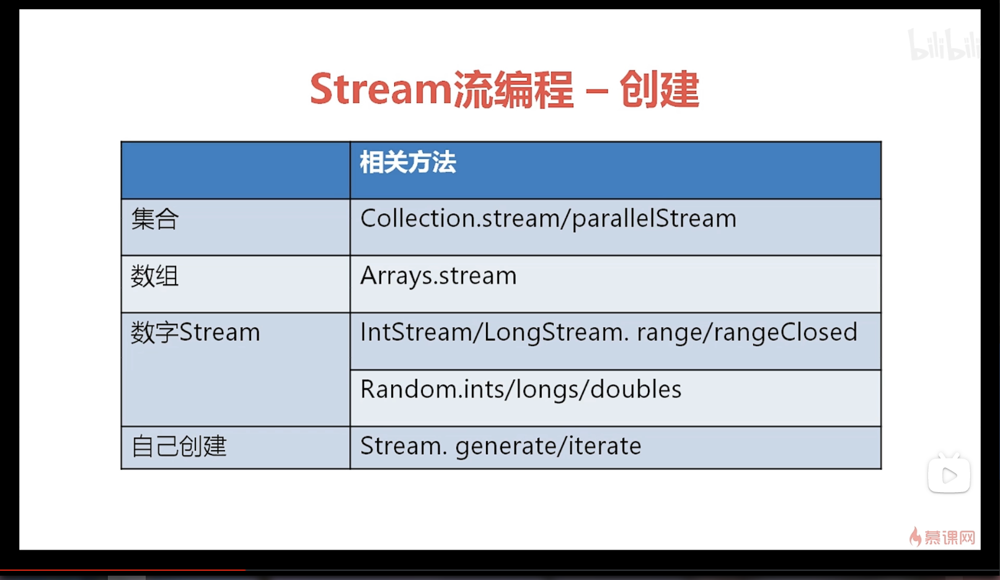
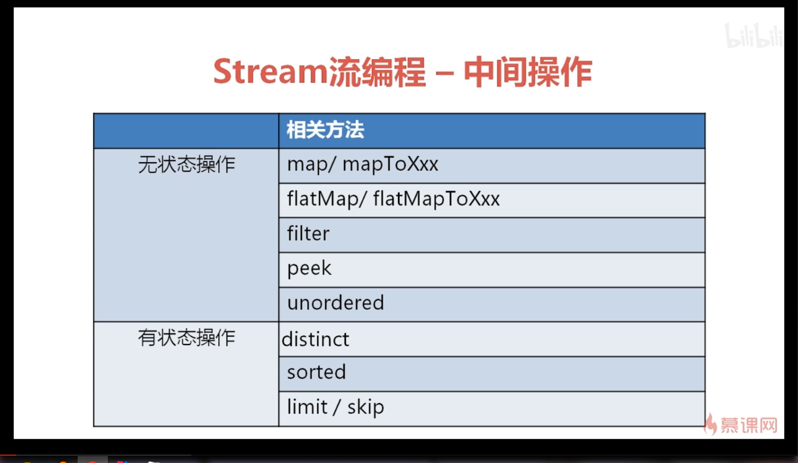
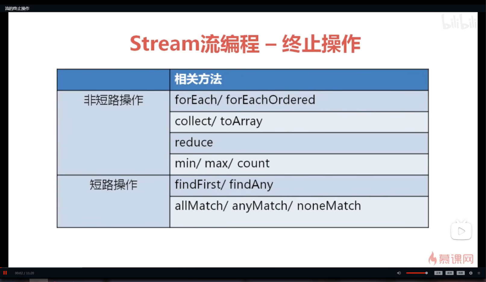

## 函数式接口

字节码查看工具

Bytecode viewer

### 1. 内部类

内部类使用外部变量必须是final类型的

在jdk8里面也可以不是final类型，但是使用的final变量不能在外部被修改，否者会引发错误

实际上这是防止两边修改引发错误而作的一个措施


```java
public class TestLambda01 {
    /*
    * 2.静态内部类
    * **/
    static class MyLambda01Impl02 implements MyLambda01{
        @Override
        public void Lambda(int a) {
            System.out.println("Lambda02..."+"a="+a);
        }
    }

    public static void main(String[] args) {
        /*
         * 3.局部内部类
         * */
        class MyLambda01Impl03 implements MyLambda01{
            @Override
            public void Lambda(int a) {
                System.out.println("Lambda03..."+"a="+a);
            }
        }

        /*
         * 4.匿名内部类
         * */
        MyLambda01 myLambdaImpl04 = new MyLambda01() {
            @Override
            public void Lambda(int a) {
                System.out.println("Lambda04..."+"a="+a);
            }
        };


        MyLambda01 myLambdaImpl01 = new MyLambda01Impl1();
        myLambdaImpl01.Lambda(1);

        MyLambda01Impl02 myLambdaImpl02 = new MyLambda01Impl02();
        myLambdaImpl02.Lambda(2);

        MyLambda01Impl03 myLambdaImpl03 = new MyLambda01Impl03();
        myLambdaImpl03.Lambda(3);

        myLambdaImpl04.Lambda(4);
    }
}


interface MyLambda01{
	void Lambda(int a);
}
 
/*
* 1.内部类
* **/
class MyLambda01Impl1 implements MyLambda01{
	@Override
 	public void Lambda(int a) {
     	System.out.println("Lambda01..."+"a="+a);
    }
}
```


### 2. Lambda表达式和方法引用


**Java Lambda 表达式语法**

Java Lambda 表达式的语法结构如下

```
parameter -> expression body
```


**有参数且只有一条语句时**

```java
(a,b) -> a + b
```


**只有一个参数时**

```java
a  -> a
```


**没有参数时**

```java
()  -> System.out.println("简单教程")
```


**有多条语句时**

```java
(a,b) -> {
    int c = a + b;
    System.out.println("简单教程")
}
```

针对这个 Java Lambda 表达式语法，有几个重要的特征需要说明

- **可选的参数类型声明** ： 无需声明参数的类型。编译器可以从参数的值推断出相同的值。
- **可选的参数周围的小括号  `()`** ： 如果只有一个参数，可以忽略参数周围的小括号。但如果有多个参数，则必须添加小括号。
- **可选的大括号 `{}`**  : 如果 Lambda 表达式只包含一条语句，那么可以省略大括号。但如果有多条语句，则必须添加大括号。
- **可选的 `return` 关键字** ： 如果 Lambda 表达式只有一条语句，那么编译器会自动 `return` 该语句最后的结果。但如果显式使用了 `return` 语句，则必须添加大括号 `{}` ，哪怕只有一条语句。


#### Java Lambda 表达式的原理

后面我们会讲到，Java 8 中的 Lambda 表达式其实是一个特殊的只有一个方法的类的实例。

这些类是 Java 8 内部已经定义好的，而且实现了 `java.lang.FunctionalInterface` 这个接口。

这个 `java.lang.FunctionalInterface` 接口是一种信息性注解类型，用于标识一个接口类型声明为函数接口（ functional interface ）。

从某些方面说，Java 8 的 Lambda 表达式是使用匿名内部类的语法创建了 `java.util.function` 包下相应签名的接口的或者其它自定义的只有一个方法的接口实例。

但是，实际上，Java 8 中的 Lambda 不仅仅是使用匿名内部类，还使用了 Java 8 接口的默认方法和一些其它的功能。这方面，有空我会写一篇文章。


**范例一： Java Lambda 表达式**

Lambda 比较常见的使用场景就是 `new Runnable` 匿名内部类的使用

**LambdaTester.java**

```java
public class LambdaTester{
    
    public static void main(String[] args){
        
        Runnable r = () -> System.out.println("你好，简单教程，你好，简单编程");
        Thread th = new Thread(r);
        th.start(); 
        
     }
}
```

运行结果如下

```
[yufei@www.twle.cn helloworld]$ javac LambdaTester.java && java LambdaTester
你好，简单教程，你好，简单编程
```


**范例二**

**LambdaTester.java**

```java
public class LambdaTester {

   public static void main(String args[])
   {
      LambdaTester tester = new LambdaTester();

      // 有声明参数类型
      MathOperation addition = (int a, int b) -> a + b;

      // 没有声明参数类型
      MathOperation subtraction = (a, b) -> a - b;

      // 使用 return 语句显式返回值需要添加大括号
      MathOperation multiplication = (int a, int b) -> { return a * b; };

      // 如果只有一条语句，那么可以省略大括号，Java 会返回表达式的值
      MathOperation division = (int a, int b) -> a / b;

      System.out.println("10 + 5 = " + tester.operate(10, 5, addition));
      System.out.println("10 - 5 = " + tester.operate(10, 5, subtraction));
      System.out.println("10 x 5 = " + tester.operate(10, 5, multiplication));
      System.out.println("10 / 5 = " + tester.operate(10, 5, division));
   }

   interface MathOperation {
      int operation(int a, int b);
   }

   private int operate(int a, int b, MathOperation mathOperation) {
      return mathOperation.operation(a, b);
   }
}
```

运行结果如下

```
[yufei@www.twle.cn helloworld]$ javac LambdaTester.java && java LambdaTester
10 + 5 = 15
10 - 5 = 5
10 x 5 = 50
10 / 5 = 2
```

Java Lambda 表达式的缺点

不知道大家有没有从上面的表达式中看到一些端倪，好像，好像 Java 8 中的 Lambda 不能凭空出现。

Java Lambda 表达式最大的缺点，就是不能像其它语言的 Lambda 表达式一样凭空出现。

Java 中的 Lambda 表达式需要有一个函数接口声明作为模板。这个模板定义了 Lambda 表达式的参数类型和返回值类型。

例如下面的代码，我们先要声明一个函数接口类型，然后才能定义一个参数和返回值都一样的表达式

LambdaTester.java

```java
public class LambdaTester {

   // 先声明一个函数接口
   interface GreetingService {
      void sayMessage(String message);
   }

   public static void main(String args[]){
      LambdaTester tester = new LambdaTester();
      
      // 省略小括号
      GreetingService greetService1 = message -> System.out.println("你好，" + message);

      // 有小括号
      GreetingService greetService2 = (message) -> System.out.println("你好，" + message);

      greetService1.sayMessage("简单教程");
      greetService2.sayMessage("简单编程");
   }
}
```

运行结果如下

```
[yufei@www.twle.cn helloworld]$ javac LambdaTester.java && java LambdaTester
你好，简单教程
你好，简单编程
```


#### Lambda 表达式作用域 ( scope )

因为 Java 8 的 lambda 表达式其实是函数接口的内联实现，也就是匿名内部类，因此，可以引用任何外部的变量或者常量。

但是，lambda 对这些外部的变量是有要求的： 它们必须使用 `final` 修饰符修饰。

如果一个变量允许被第二次赋值，则 Lambda 表达式会抛出编译错误。

> 注意： 其实这条规则并不是非常严格执行的，普通变量也是可以的，只要，只要不进行第二次赋值就可以。
>
> 注意： 刚刚测试了下，其实只要不是当前作用域声明的变量，可以随意第二次赋值，也不会报错


**范例一**

Java 8 lambda 表达式使用外部 **final** 变量

**LambdaTester.java**

```java
public class LambdaTester{

   final static String salutation = "你好，";

   public static void main(String args[]){
      GreetingService greetService1 = message -> System.out.println(salutation + message);
      greetService1.sayMessage("简单教程");
   }

   interface GreetingService {
      void sayMessage(String message);
   }
}
```

运行结果如下

```
[yufei@www.twle.cn helloworld]$ javac LambdaTester.java && java LambdaTester
你好，简单教程
```


**范例二**

lambda 引用的普通的变量也是可以的，**只要这个变量没有第二次被赋值**，不管是任何地方。

**LambdaTester.java**

```java
public class LambdaTester{

   static String salutation = "你好，";

   public static void main(String args[]){
      GreetingService greetService1 = message -> System.out.println(salutation + message);
      greetService1.sayMessage("简单教程");
   }

   interface GreetingService {
      void sayMessage(String message);
   }
}
```

运行结果如下

```
[yufei@www.twle.cn helloworld]$ javac LambdaTester.java && java LambdaTester
你好，简单教程
```


**范例三**

如果 lambda 表达式引用的是当前作用域下的普通的变量，而该变量又在某个地方第二次被赋值，则会抛出一个编译错误

**LambdaTester.java**

```java
public class LambdaTester{
    
   public static void main(String args[]){
       
      String salutation = "你好，";

      GreetingService greetService1 = message -> System.out.println(salutation + message);
      greetService1.sayMessage("简单教程");
      salutation = "Hello，";
   }

   interface GreetingService {
      void sayMessage(String message);
   }
}
```

运行结果如下 

```
[yufei@www.twle.cn helloworld]$ javac LambdaTester.java && java LambdaTester
LambdaTester.java:8: 错误: 从lambda 表达式引用的本地变量必须是最终变量或实际上的最终变量
      System.out.println(salutation + message);
                         ^
1 个错误
```


**范例四**

如果 lambda 表达式引用的变量并**不是当前作用域下声明**的，也可以随意赋值，并不会报错

**LambdaTester.java**

```java
public class LambdaTester{
    
   static String salutation = "你好，";
    
   public static void main(String args[]){
       
      salutation = "Hello，";
       
      GreetingService greetService1 = message -> System.out.println(salutation + message);
      greetService1.sayMessage("简单教程");
      salutation = "你好，";
   }

   interface GreetingService {
      void sayMessage(String message);
   }
}
```

运行结果如下 

```
[yufei@www.twle.cn helloworld]$ javac LambdaTester.java && java LambdaTester
Hello，简单教程
```

**总结**

**Java lambda 表达式可以随意引用外部变量，但如果外部变量是在当前作用域声明的，则一定不可以进行第二次赋值，哪怕是在 lambda 语句之后。**


#### lambda 表达式语法

lambda 表达式语法非常易于阅读和理解

lambda 表达式语法看起来像

```
(Argument  part)  -> Body part 
```

例如

1. 如果某个方法没有参数，并打印信息，则可能像下面这样

   ```
   () -> System.out.println("Your message");
   ```

2. 如果某个方法接受两个参数，执行一些业务逻辑并返回值，则看起来可能像下面这样

   ```
   (int a, int b) ->  a+b;
   ```

   表达式会返回 `a+b` 的计算结果

3. 如果某个方法接受一个参数，并执行一些计算，则可能像下面这样

   ```
   (String s) ->  s + "Hello World";
   ```


#### Java 8 lambda 表达式的一些使用范例


##### 在 `Runnable` 中使用 lambda 表达式

下面这个范例中，我们将运行一个 Runnable 线程。

在 Java 8 之前，在 lambda 表达式出现前，要实现 Runnable 线程，我们需要定义一个实现 Runnable 接口的类来获取 Runnable 对象。


**LambdaTester.java**

```java
public class LambdaTester{
    
   public static void main(String args[])
   {
      Runnable r = new Runnable() {

         @Override
         public void run() {
            System.out.println("你好，简单教程，简单编程");
         }
      };

      Thread thread = new Thread(r);
      thread.run();
   }
}
```

运行结果如下

```
[yufei@www.twle.cn helloworld]$ javac LambdaTester.java && java LambdaTester
你好，简单教程，简单编程
```

现在，我们来看看如何使用 lambda 表达式实现相同的对象。


**LambdaTester.java**

```java
public class LambdaTester
{
   public static void main(String args[])
   {
      Runnable r = () -> System.out.println("你好，简单教程，简单编程");

      Thread thread = new Thread(r);
      thread.run();
   }
}
```

运行结果如下

```
[yufei@www.twle.cn helloworld]$ javac LambdaTester.java && java LambdaTester
你好，简单教程，简单编程
```

没有对比，就没有伤害，使用 lambda 表达式真的是简单明了，代码又少。


##### 在用户自定义的函数接口中使用 lambda 表达式

在下面这个范例中，我们将创建自己的函数接口，我们先用普通的方式来实现一下


**LambdaTester.java**

```java
public class LambdaTester
{
   public static void main(String args[])
   {
      Calculator cal = new Calculator() {
         @Override
         public int add(int n1, int n2 ) {
            return n1 + n2;
         }
      };

      System.out.println(cal.add(5,8));
   }

   public interface Calculator {

      public int add(int n1, int n2);    
   }
}
```

运行结果如下

```
[yufei@www.twle.cn helloworld]$ javac LambdaTester.java && java LambdaTester
13
```

匿名内部类实现已经很简洁了。但，如果你看了 lambda 的实现，就会发现，匿名内部类还是有点复杂的


**LambdaTester.java**

```java
public class LambdaTester{
    
   public static void main(String args[]){
       
      Calculator cal = (n1,n2) -> n1 + n2;
      System.out.println(cal.add(5,8));
   }

   public interface Calculator {
      public int add(int n1, int n2);    
   }
}
```

运行结果如下

```
[yufei@www.twle.cn helloworld]$ javac LambdaTester.java && java LambdaTester
13
```

代码少的有点不像话了.....


##### 在 `Comparator` 中使用 lambda 表达式

现在，我们来看看 `Comparator` 接口，了解下如何使用 lambda 表达式对包含字符串的集合进行排序。


**LambdaTester.java**

```java
import java.util.Arrays;
import java.util.Collections;
import java.util.Comparator;
import java.util.List;
public class LambdaTester {

    public static void main(String[] args)
    {
        List<String> list = Arrays.asList("Ram","Shyam","Kabir");
        System.out.println("...排序之前...");
        for(String s : list){
            System.out.println(s);
        } 


        //定义一个 comparator
        Comparator<String> comp= (String s1, String s2) -> s1.compareTo(s2);
        Collections.sort(list, comp);

        System.out.println("...排序之后...");
        for(String s : list){
            System.out.println(s);
        }
    }
}
```

运行结果如下

```
[yufei@www.twle.cn helloworld]$ javac LambdaTester.java && java LambdaTester
...排序之前...
Ram
Shyam
Kabir
...排序之后...
Kabir
Ram
Shyam
```


##### 使用 Lambda 表达式实现函数接口来迭代集合

Java 8 中引入了 `java.util.function` 包。这个包提供了 `java.util.function.Function` 接口，我们可以在这个接口的帮助下，使用 Lambda 表达式来迭代集合。

`java.util.function.Function` 只有一个方法 `apply()` ，这个方法可以在用户定义的函数中调用。我们可以使用 `Function` 接口实现一个自定义的打印方法

```java
public String customShow( Function<String,String> fun) {
    return fun.apply(this);
}
```

然后，我们就可以使用 Lambda 来实现这个接口了


**LambdaTester.java**

```java
import java.util.ArrayList;
import java.util.List;
import java.util.function.Function;

public class LambdaTester {

    public static void main(String[] args){
        LambdaTester tester = new LambdaTester();
        tester.run();
    }

    public void run(){
        List<LambdaTester.Student> list = new ArrayList<LambdaTester.Students>();

        list.add(new LambdaTester.Student("Ram",20));
        list.add(new LambdaTester.Student("Shyam",22));
        list.add(new LambdaTester.Student("Kabir",18));
        for(Student st: list){
            System.out.println(st.customShow(s->s.getName()+": "+s.getAge()));
        }
    }

    public class Student{
        
        private String name;
        private int age;
        public Student(String name,int age){
            this.name = name;
            this.age = age;
        }

        public String getName() {
            return name;
        }

        public void setName(String name) {
            this.name = name;
        }

        public int getAge() {
            return age;
        }

        public void setAge(int age) {
            this.age = age;
        }

        public  String customShow(Function<Student,String> fun){
            return fun.apply(this);
        }
    }
}
```

运行结果如下

```
Ram: 20
Shyam: 22
Kabir: 18
```


### 3. Java 8 方法引用

Java 8 中新增加了 **方法引用** 这个概念。 但，什么是方法引用呢 ？

我们先来看一个例子，下面这个范例演示了如何遍历字符串列表并进行一些操作


**LambdaTester.java**

```java
import java.util.Arrays;
import java.util.List;
import java.util.function.Function;

public class LambdaTester {

    public static void main(String[] args){
        LambdaTester tester = new LambdaTester();
        tester.run();
    }

    public void run(){
        List<String> list = Arrays.asList("Ram","Shyam","Kabir");

        // 输出
        for(String st: list){
            System.out.println(st);
        }

        // 转换为大写
        for(String st: list){
            upperAndPrint(st);
        }
    }

    public static void upperAndPrint(String s){
        System.out.println(s.toUpperCase());
    }
}
```

运行结果如下

```
[yufei@www.twle.cn helloworld]$ javac LambdaTester.java  && java LambdaTester
Ram
Shyam
Kabir
RAM
SHYAM
KABIR
```

有简洁代码倾向的我们，看到那重复的 `for(String st: list)` 就会想如何能够直接把代码改的更简洁一些。

第一个想到的，肯定是使用 Java 8 新增的 lambda 表达式和 `forEach` 改造下


**LambdaTester.java**

```java
import java.util.Arrays;
import java.util.List;
import java.util.function.Function;

public class LambdaTester {

    public static void main(String[] args){
        LambdaTester tester = new LambdaTester();
        tester.run();
    }

    public void run(){
        List<String> list = Arrays.asList("Ram","Shyam","Kabir");

        // 输出
        list.forEach(item -> System.out.println(item));


        // 转换为大写
        list.forEach(item -> upperAndPrint(item));
    }

    public static void upperAndPrint(String s){
        System.out.println(s.toUpperCase());
    }
}
```


哇，使用 Lambda 表达式真的是简洁了不少，但是，还能更简单一点吗？

比如 `item -> System.out.println(item)` 这个表达式，其实就是调用 `System.out.println()` 方法，并把 `forEach` 迭代列表生成的唯一参数 `item` 传给它而已

比如 `item -> upperAndPrint(item)` 这个表达式，也是一样啊，就是把 `forEach` 生成的唯一参数 `item` 传给给 `upperAndPrint()` 方法而已。

既然这样，我们为什么不能直接传递方法名给 `forEach` 呢？ 

对吧，所以我们改改，改成如下这种方式


```java
import java.util.Arrays;
import java.util.List;
import java.util.function.Function;

public class LambdaTester {

    public static void main(String[] args){
        LambdaTester tester = new LambdaTester();
        tester.run();
    }

    public void run(){
        List<String> list = Arrays.asList("Ram","Shyam","Kabir");

        // 输出
        list.forEach(System.out.println);

        // 转换为大写
        list.forEach(upperAndPrint);
    }

    public static void upperAndPrint(String s){
        System.out.println(s.toUpperCase());
    }
}
```

运行结果如下

```
[yufei@www.twle.cn helloworld]$ javac LambdaTester.java  && java LambdaTester
LambdaTester.java:18: 错误: 找不到符号
        list.forEach(System.out.println);
                               ^
  符号:   变量 println
  位置: 类型为PrintStream的变量 out
LambdaTester.java:21: 错误: 找不到符号
        list.forEach(upperAndPrint);
                     ^
  符号:   变量 upperAndPrint
  位置: 类 LambdaTester
2 个错误
```

这在所有的 Java 版本中都会报错，但是自 Java 8 开始，还真是可以直接传递方法名的，只是我们使用的方式不对而已。

加入我们改成下面这样，就会正确了

```java
import java.util.Arrays;
import java.util.List;
import java.util.function.Function;

public class LambdaTester {

    public static void main(String[] args){
        LambdaTester tester = new LambdaTester();
        tester.run();
    }

    public void run(){
        List<String> list = Arrays.asList("Ram","Shyam","Kabir");

        // 输出
        list.forEach(System.out::println);

        // 转换为大写
        list.forEach(LambdaTester::upperAndPrint);
    }

    public static void upperAndPrint(String s){
        System.out.println(s.toUpperCase());
    }
}
```

运行结果如下

```
[yufei@www.twle.cn helloworld]$ javac LambdaTester.java  && java LambdaTester
Ram
Shyam
Kabir
RAM
SHYAM
KABIR
```

哈哈哈，正确了。

在这个正确的方法中，有两个重点：

1. **方法名和类名之间不是使用点号 ( `.` ) 而是使用两个冒号 `::` 。**
2. **提供的方法名必须包含类名，如果没有引入该类名，则需要使用全限定类名，也就是需要添加包名作为前缀。**

**这种使用方法名做参数的做法，在 Java 8 中称之为 「 方法引用 」**


**Java 8 方法引用**

**方法引用** 是 Java 8 新增加的功能。方法引用有点类似于 [C / C++](https://www.twle.cn/l/yufei/cprogramming/cprogramming-basic-index.html) 中的 **函数指针** ，通过方法名称指向方法。

Java 8 中的方法引用通过 `::` 符号引用方法，而且支持一下类型的方法引用

1. 静态方法
2. 实例方法
3. 使用 `new` 运算符的构造函数。例如 `TreeSet::new`


**范例**

我们重写一下上面的范例，演示下如何引用静态方法和实例方法

```java
import java.util.Arrays;
import java.util.List;
import java.util.function.Function;

public class LambdaTester {

    public static void main(String[] args){
        LambdaTester tester = new LambdaTester();
        tester.run();
    }

    public void run(){
        List<String> list = Arrays.asList("Ram","Shyam","Kabir");

        // 输出
        list.forEach(System.out::println);

        // 转换为大写
        list.forEach(LambdaTester::upperAndPrint);

        // 转换为小写并输出
        list.forEach(this::lowerAndPrint);
    }

    public void lowerAndPrint(String s){
        System.out.println(s.toLowerCase());
    }

    public static void upperAndPrint(String s){
        System.out.println(s.toUpperCase());
    }
}
```

运行结果如下

```
[yufei@www.twle.cn helloworld]$ javac LambdaTester.java  && java LambdaTester
Ram
Shyam
Kabir
RAM
SHYAM
KABIR
ram
shyam
kabir
```


#### 1.静态方法的方法引用

```java
public class Dog {

    private String name = "哈皮";

    public static void bark(Dog dog){
        System.out.println(dog+"叫了...");
    }

    @Override
    public String toString(){
        return this.name;
    }

}
```

```java
//测试类
    @Test
    public void testStaticMethod(){
        //方法引用
        Consumer<Dog> consumer = System.out::println;
        consumer.accept(new Dog());

        //静态方法的方法引用
        Consumer<Dog> consumer1 = Dog::bark;
        consumer1.accept(new Dog());

    }
```

#### 2.非静态方法的方法引用

```java
public class Dog {

    private String name = "哈皮";

    private int food = 10;


    public static void bark(Dog dog){
        System.out.println(dog+"叫了...");
    }


    /**
     * 冷知识: jdk默认把当前对象实例传入到成员方法的参数, 参数名为this, 位置是第一个
     * public int eadFood(Dog this,int num)和 public int eadFood(int num) 实际上是同一个方法
     * @param num 吃掉的狗粮
     * @return 返回吃剩下的狗粮数
     */
    public int eadFood(int num){
        System.out.print("一共"+food+"斤"+"\t"+"吃了"+num+"斤\t");
        food -= num;
        return this.food;
    }

    @Override
    public String toString(){
        return this.name;
    }

}
```


```java
    /**
     * 非静态方法的方法引用
     * 第一种方法:传递一个实例对象给方法参数
     */
    @Test
    public void testMemberMethod(){
        Dog dog = new Dog();
        //方式一
        Function<Integer,Integer> function = dog::eadFood;
        System.out.println("还剩"+function.apply(3)+"斤狗粮...");
        //方式二
        UnaryOperator<Integer> unaryOperator = dog::eadFood;
        System.out.println("还剩"+unaryOperator.apply(6)+"斤狗粮...");
        //方式三
        IntUnaryOperator intUnaryOperator = dog::eadFood;
        System.out.println("还剩"+intUnaryOperator.applyAsInt(1)+"斤狗粮...");
    }


    /**
     * 非静态方法的方法引用
     * 第二种方法:使用类名来使用方法引用
     * 此方法本质上与前面的静态方法引用没有什么区别，本质上都是通过传递对象示例给方法参数进行方法引用
     * 冷知识: jdk默认把当前对象实例传入到成员方法的参数, 参数名为this, 位置是第一个
     * 所以 int eadFood(Dog this,int num)和 int eadFood(int num) 实际上是同一个方法
     */
    @Test
    public void testMemberMethod02(){
        BiFunction<Dog,Integer,Integer> biFunction = Dog::eadFood;
        System.out.println("还剩下"+biFunction.apply(new Dog(), 3)+"斤...");
    }

```

#### 3.构造函数的方法引用

```java
    /**
     * 构造函数的方法引用
     * 无参构造函数的方法引用
     */
    @Test
    public void testConstruction01(){
        //无参构造方法的方法应用
        Supplier<Dog> supplier = Dog::new; //构造函数的方法名为new
        System.out.println("创建了新对象"+supplier.get()+"...");
    }
```

增加构造方法

```java
    public Dog() {
    }

    public Dog(String name) {
        this.name = name;
    }
```

```java
    /**
     * 构造函数的方法引用
     * 有参构造函数的方法引用
     */
    @Test
    public void testConstruction02(){
        Function<String,Dog> function = Dog::new; //构造函数放回一个对象实例，只需要将构造函数的参数放到前面即可
        System.out.println("创建了新对象:"+function.apply("新哈皮")+".");
    }
```


### 4. 几个函数式接口


### 5.类型推断


```java
package com.qibria.func.method_ref;

@FunctionalInterface
interface IMath{
    int add(int x,int y);
}

@FunctionalInterface
interface IMath2{
    int sub(int x,int y);
}

/**
 * 类型推断
 */
public class TypeDemo {

    public static void main(String[] args) {

        //变量类型定义
        IMath lambda02 = (x, y) -> x+y;

        //数组
        IMath[] lambda03 = {((x, y) -> x+y)};

        //对象强转
        Object lambda04 = (IMath) (x,y)->x+y;

        //返回类型
        IMath createLambda =createLambda();


        TypeDemo typeDemo = new TypeDemo();

        //方法两义性，无法找到正确的返回类型
        //typeDemo.test(((x, y) -> x+y));


        typeDemo.test((IMath) ((x, y) -> x + y));

        typeDemo.test((IMath2) ((x, y) -> x + y));


    }


    private void test(IMath iMath){
    }

    private void test(IMath2 iMath){
    }

    private static IMath createLambda(){
        return (x,y)->x+y;
    }

}
```


### 6. 级联表达式与柯里化

```java
/**
 * 级联表达式与柯里化
 * 柯里化: 把多个参数的函数表达式转换成只有一个参数的函数表达式
 * 柯里化目的: 函数标准化
 */
public class CurryDemoTest {

    @Test
    public void curryTest(){
        Function<Integer , Function<Integer,Integer>> function = x-> y->x+y;
        System.out.println(function.apply(3).apply(6));

        Function<Integer,Function<Integer,Function<Integer,Integer>>> functionFunction = x->y->z->x+y+z;
        System.out.println(functionFunction.apply(2).apply(3).apply(4));

    }

}
```


### 7. Stream流的处理


#### 1. 流操作

```java
//流操作
@Test
public void streamDemo01(){
   int sum = IntStream.of(num).sum();
   System.out.println(sum);
}
```


#### 2. 惰性求值

惰性操就是没有终止操作的时候，前面的操作都不会被执行

```java
    /**
     * 惰性操就是没有终止操作的时候，前面的操作都不会被执行
     * map()返回的是流，属于中间操作
     * sum()返回的是具体的数据类型，属于终止操作
     */
    @Test
    public void streamDemo02(){
        System.out.println(Arrays.toString(num));
        int sum = IntStream.of(num).map(StreamDemoTest::DoubleNum).sum();
        System.out.println("sum:"+sum);
        IntStream.of(num).map(StreamDemoTest::DoubleNum);
    }

    public static int DoubleNum(int x){
        System.out.println(x+"->"+"执行了乘以二.");
        return 2*x;
    }

```

```shell
[3, 4, 1, 7, 10, 9, 6]
3->执行了乘以二.
4->执行了乘以二.
1->执行了乘以二.
7->执行了乘以二.
10->执行了乘以二.
9->执行了乘以二.
6->执行了乘以二.
sum:80
```


#### 3. 流创建




```java
    /**
     * 创建各种形式的流
     */
    @Test
    public void streamDemo03(){
        ArrayList<String > list = new ArrayList<>();
        list.add("aaa");
        list.add("bbb");

        //集合中创建
        Stream<String> stream1 = list.stream();
        //并行流
        Stream<String> stringStream = list.parallelStream();


        //数组中创建
        IntStream stream = Arrays.stream(new int[]{111, 222});


        //创建数字流
        IntStream intStream = IntStream.of(1, 2, 3);

        //使用Random创建无限流
        IntStream ints = new Random().ints();
        //使用limit限制流
        IntStream limit = new Random().ints().limit(10);

        //手动创建流
        Random random = new Random();
        Stream.generate(()->random.nextInt()).limit(10);
    }
```

#### 4. 中间操作

无状态操作:  当前操作不依赖于其他的操作关系

有状态操作：当前操作有前后依赖操作关系 



```java
    /**
     * 流的中间操作
     */
    @Test
    public void streamDemo04(){

        String string = new String("my name is oo3");
        Stream.of(string.split(" ")).forEach(System.out::println);

        //map对流进行处理，例如将字符串传递进去获取字符串的长度并返回 mapToInt(x->x.length())
        //mapToInt其实是map的变种，明确返回的是Int类型的流
        System.out.println("------------map---------------");
        Stream.of(string.split(" ")).mapToInt(x->x.length()).forEach(System.out::println);

        //添加filter
        //过滤掉长度小于3的字符串
        System.out.println("------------filter---------------");
        Stream.of(string.split(" ")).filter(x->x.length()>=3).mapToInt(x->x.length()).forEach(System.out::println);

        //flatmap A->B属性(是个集合)，最终得到的是A元素里面的所有B属性集合
        //intStream/longStream 并不是Stream的子类，所以要装箱boxed()
        System.out.println("------------flatmap---------------");
        String s1 = new String("my name is 007");
        Stream.of(s1.split(" ")).flatMap(s -> s.chars().boxed()).forEach(System.out::println);
        Stream.of(s1.split(" ")).flatMap(s -> s.chars().boxed()).forEach(i-> System.out.println((char)i.intValue()));


        //peek是中间操作 用于debug操作 和foreach不同的是foreach是终止操作
        System.out.println("------------peek---------------");
        Stream.of(s1.split(" ")).peek(System.out::println).forEach(System.out::println);


        //limit 操作, 常用于无限流
        System.out.println("------------limit---------------");
        new Random().ints().filter(x->x>10&&x<100).limit(10).forEach(System.out::println);
        
    }
```

#### 5. 终止操作



> 短路操作就是无需等待所有结果都计算完就返回想要的结果


```java
    /**
     * 流的终止操作
     */
    @Test
    public void streamDemo05(){
        String str = "my name is 003";
        //使用并行流
        str.chars().parallel().forEach(i-> System.out.print((char) i+"\t"));
        //output: i	a	s	n	 	e	m	y	 	m	0	 	3	0
        System.out.println();
        //使用forEachOrdered() 保证并行流的顺序
        System.out.println("------------------forEachOrdered--------------------");
        str.chars().parallel().forEachOrdered(i-> System.out.print((char) i+"\t"));
        //output: m	y	 	n	a	m	e	 	i	s	 	0	0	3


        System.out.println();
        System.out.println("------------------collect--------------------");
        //使用collect()将结果转换成集合
        List<String> collect = Stream.of(str.split(" ")).collect(Collectors.toList());


        System.out.println("------------reduce--------------------");
        //使用reduce拼接字符串
        Optional<String> reduce = Stream.of(str.split(" ")).reduce((s1, s2) -> s1 + "|" + s2);
        String s = reduce.get();
        String aa = reduce.orElse("aa");
        System.out.println(aa);
        System.out.println(s);
        //带初始化值的reduce reduce("", (s1, s2) -> s1 + "|" + s2) 第一个参数传入初始化值，不用做额外判断，直接返回对象
        String reduce1 = Stream.of(str.split(" ")).reduce("", (s1, s2) -> s1 + "|" + s2);

        //计算字符串总长度
        Integer reduce2 = Stream.of(str.split(" ")).map(a -> a.length()).reduce(0, (s1, s2) -> s1 + s2);
        System.out.println(reduce2);


        System.out.println("------------max--------------------");
        Optional<String> max = Stream.of(str.split(" ")).max((s1, s2) -> s1.length()-s2.length());
        System.out.println(max.get());

        System.out.println("------------findFirst--------------------");
        OptionalInt first = new Random().ints().filter(i->i>10&&i<100).findFirst();
        int asInt = first.getAsInt();
        System.out.println(asInt);

    }
```

#### 6. 并行流

```java
    @Test
    public void palletDemo01(){

        //并行运行
        long count = IntStream.range(1, 100)
                .parallel().peek(PalletStreamDemoTest::debug)
                .count();
        System.out.println(count);
    }


    public static void debug(int i){
        System.out.println("i:"+i);
        try {
            TimeUnit.MICROSECONDS.sleep(800);
        } catch (InterruptedException e) {
            e.printStackTrace();
        }
    }
```

并行流和串行流同时使用

```java
    /**
     * 同时调用并行和串行会以最后的调用为准parallel/sequential
     */
    @Test
    public void palletDemo02(){
        long count02 = IntStream.range(1, 100)
                //parallel 并行流
                .parallel().peek(PalletStreamDemoTest::debug)
                //sequential 串行流
                .sequential().peek(PalletStreamDemoTest::debug02)
                .count();
        System.out.println(count02);
    }


    public static void debug02(int i){
        System.err.println("i:"+i);
        try {
            TimeUnit.MICROSECONDS.sleep(800);
        } catch (InterruptedException e) {
            e.printStackTrace();
        }
    }
```

并行流默认使用发的线程池

```java
    /**
     *  并行流使用的线程 ForkJoinPool.commonPool-worker
     *  使用的线程数是当前cpu核心个数
     */
    @Test
    public void palletDemo03(){

        //修改并行线程数
        System.setProperty("java.util.concurrent.ForkJoinPool.common.parallelism","20");

        long count02 = IntStream.range(1, 100)
                .parallel().peek(PalletStreamDemoTest::debug03)
                .count();
        System.out.println(count02);
    }

    public static void debug03(int i){
        System.err.println(Thread.currentThread().getName()+"->\t[debug]\t"+"i:"+i);
        try {
            TimeUnit.MICROSECONDS.sleep(800);
        } catch (InterruptedException e) {
            e.printStackTrace();
        }
    }

```

自定义线程池

```java
    /**
     * 自定义线程池
     */
    @Test
    public void palletDemo04(){
        ForkJoinPool pool = new ForkJoinPool(20);
        pool.submit(()->IntStream.range(1, 100)
                .parallel().peek(PalletStreamDemoTest::debug03)
                .count());
        pool.shutdown();

        synchronized (pool){
            try {
                pool.wait();
            } catch (InterruptedException e) {
                e.printStackTrace();
            }
        }

    }

    public static void debug04(int i){
        System.err.println(Thread.currentThread().getName()+"->\t[debug]\t"+"i:"+i);
        try {
            TimeUnit.MICROSECONDS.sleep(800);
        } catch (InterruptedException e) {
            e.printStackTrace();
        }
    }
```


#### 7. 收集器

```java
class Student {
    /**
     * 姓名
     */
    private String name;

    /**
     * 年龄
     */
    private int age;

    /**
     * 性别
     */
    private Gender gender;

    /**
     * 班级
     */
    private Grade grade;

    public Student(String name, int age, Gender gender, Grade grade) {
        super();
        this.name = name;
        this.age = age;
        this.gender = gender;
        this.grade = grade;
    }

    public String getName() {
        return name;
    }

    public void setName(String name) {
        this.name = name;
    }

    public int getAge() {
        return age;
    }

    public void setAge(int age) {
        this.age = age;
    }

    public Grade getGrade() {
        return grade;
    }

    public void setGrade(Grade grade) {
        this.grade = grade;
    }

    public Gender getGender() {
        return gender;
    }

    public void setGender(Gender gender) {
        this.gender = gender;
    }

    @Override
    public String toString() {
        return "[name=" + name + ", age=" + age + ", gender=" + gender
                + ", grade=" + grade + "]";
    }

}

/**
 * 性别
 */
enum Gender {
    MALE, FEMALE
}

/**
 * 班级
 */
enum Grade {
    ONE, TWO, THREE, FOUR;
}

public class CollectDemo {

    public static void main(String[] args) {
        // 测试数据
        List<Student> students = Arrays.asList(
                new Student("小明", 10, Gender.MALE, Grade.ONE),
                new Student("大明", 9, Gender.MALE, Grade.THREE),
                new Student("小白", 8, Gender.FEMALE, Grade.TWO),
                new Student("小黑", 13, Gender.FEMALE, Grade.FOUR),
                new Student("小红", 7, Gender.FEMALE, Grade.THREE),
                new Student("小黄", 13, Gender.MALE, Grade.ONE),
                new Student("小青", 13, Gender.FEMALE, Grade.THREE),
                new Student("小紫", 9, Gender.FEMALE, Grade.TWO),
                new Student("小王", 6, Gender.MALE, Grade.ONE),
                new Student("小李", 6, Gender.MALE, Grade.ONE),
                new Student("小马", 14, Gender.FEMALE, Grade.FOUR),
                new Student("小刘", 13, Gender.MALE, Grade.FOUR));

        // 得到所有学生的年龄列表
        // s -> s.getAge() --> Student::getAge , 不会多生成一个类似 lambda$0这样的函数
        Set<Integer> ages = students.stream().map(Student::getAge)
                .collect(Collectors.toCollection(TreeSet::new));
        System.out.println("所有学生的年龄:" + ages);


        // 统计汇总信息
//        IntSummaryStatistics agesSummaryStatistics = students.stream()
//                .collect(Collectors.summarizingInt(Student::getAge));
//        System.out.println("年龄汇总信息:" + agesSummaryStatistics);

        IntSummaryStatistics intSummaryStatistics = students.stream().collect(Collectors.summarizingInt(students01 -> students01.getAge()));
        System.out.println(intSummaryStatistics);

        // 分块
        Map<Boolean, List<Student>> genders = students.stream().collect(
                Collectors.partitioningBy(s -> s.getGender() == Gender.MALE));
        System.out.println("男女学生列表:" + genders);


        // 分组
        Map<Grade, List<Student>> grades = students.stream()
                .collect(Collectors.groupingBy(Student::getGrade));
        System.out.println("grades:"+grades);

        // 得到所有班级学生的个数
        Map<Grade, Long> gradesCount = students.stream()
                .collect(Collectors.groupingBy(Student::getGrade, Collectors.counting()));
        System.out.println(gradesCount);

    }

}
```

#### 8. Stream运行机制

```java
package com.qibria.func.method_ref;

import java.util.Random;
import java.util.concurrent.TimeUnit;
import java.util.stream.Stream;

/**
 * 验证stream运行机制
 *
 * 1. 所有操作是链式调用, 一个元素只迭代一次
 * 2. 每一个中间操作返回一个新的流. 流里面有一个属性sourceStage
 *     指向同一个 地方,就是Head
 * 3. Head->nextStage->nextStage->... -> null
 * 4. 有状态操作会把无状态操作阶段,单独处理
 * 5. 并行环境下, 有状态的中间操作不一定能并行操作.
 *
 * 6. parallel/ sequetial 这2个操作也是中间操作(也是返回stream)
 * 		但是他们不创建流, 他们只修改 Head的并行标志
 *
 * @author 晓风轻
 *
 */
public class RunStream {

    public static void main(String[] args) {
        Random random = new Random();
        // 随机产生数据
        Stream<Integer> stream = Stream.generate(() -> random.nextInt())
                // 产生500个 ( 无限流需要短路操作. )
                .limit(500)
                // 第1个无状态操作
                .peek(s -> print("peek: " + s))
                // 第2个无状态操作
                .filter(s -> {
                    print("filter: " + s);
                    return s > 1000000;
                })
                // 有状态操作
                .sorted((i1, i2) -> {
                    print("排序: " + i1 + ", " + i2);
                    return i1.compareTo(i2);
                })
                // 又一个无状态操作
                .peek(s -> {
                    print("peek2: " + s);
                }).parallel();

        // 终止操作
        stream.count();
    }

    /**
     * 打印日志并sleep 5 毫秒
     *
     * @param s
     */
    public static void print(String s) {
        // System.out.println(s);
        // 带线程名(测试并行情况)
        System.out.println(Thread.currentThread().getName() + " > " + s);
        try {
            TimeUnit.MILLISECONDS.sleep(5);
        } catch (InterruptedException e) {
        }
    }

}
```


