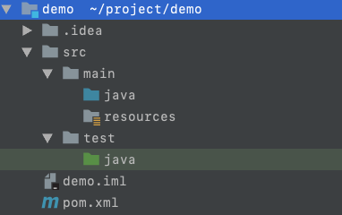

## 1. Maven: 依赖管理


### 1. 创建一个maven项目

1. 使用Idea创建一个maven项目

   - File>New>Project,
   - 左侧选择Maven，右侧选择Project SDK为1.8，点击Next
   - 输入项目GroupId、ArtifactId，点击Next
   - 点击Finish

2. 项目目录结构
   

   ```mipsasm
   ｜demo
       ｜src
           ｜main
               ｜java # 源码目录
               ｜resources # 资源目录
           ｜test
               ｜java # 测试源码目录
       ｜pom.xml # 项目配置文件
   ```

3. pom文件

   ```xml
   <?xml version="1.0" encoding="UTF-8"?>
   <project xmlns="http://maven.apache.org/POM/4.0.0"
            xmlns:xsi="http://www.w3.org/2001/XMLSchema-instance"
            xsi:schemaLocation="http://maven.apache.org/POM/4.0.0 http://maven.apache.org/xsd/maven-4.0.0.xsd">
       <modelVersion>4.0.0</modelVersion>
       <groupId>com.john.example</groupId>
       <artifactId>demo1</artifactId>
       <version>1.0-SNAPSHOT</version>
   </project>
   ```

### 2. 约定优于配置

1. 项目目录结构遵循约定
   创建的maven空项目已经包含了一定的目录结构，需要开发者遵循这种目录约定，这是使用maven简洁配置需要付出的代价。

   | 目录                                   | 说明                    |
   | -------------------------------------- | ----------------------- |
   | {project.basedir}                      | 存放pom文件和项目子模块 |
   | {project.basedir}/src/main/java        | 源码目录                |
   | {project.basedir}/src/main/resources   | 资源目录                |
   | {project.basedir}/src/test/java        | 测试源码目录            |
   | {project.basedir}/src/test/resources   | 测试资源目录            |
   | ${project.basedir}/target              | 包输出目录              |
   | ${project.basedir}/target/classes      | 编译输出目录            |
   | ${project.basedir}/target/test-classes | 测试编译输出目录        |

### 3. pom文件

1. 说明
   POM（Project Object Model，项目对象模型）定义了项目的基本信息，用于描述项目如何构建、声明项目依赖。
2. 简单配置
   - `<?xml>`: xml头信息，定义xml文档的版本和编码方式。
   - `<project>`: 所有pom.xml的根元素，声明了pom相关的命名空间和xsd元素。
   - `<modelVersion>`: 指定当前pom模型的版本，对于maven2/3，只能是4.0.0。
   - `<groupId>`: 定义当前maven项目隶属的实际项目。
   - `<artifactId>`: 定义实际项目中的一个maven模块/项目。
   - `<version>`: 定义maven项目当前所处的版本
   - `groupId\artifactId\version`: 定义了一个项目基本的坐标。
3. 其他配置
   - 项目依赖
   - 插件
   - 执行目标
   - 项目构建profile

### 4. maven坐标

1. 说明
   Maven定义了一组规则：世界上任何一个构件都可以使用Maven坐标唯一标识。
   Maven坐标元素包括`groupId`, `artifactId`, `version`, `packaging`, `classifier`。
2. 坐标元素
   - `groupId`: 定义当前maven项目隶属的实际项目。
   - `artifactId`: 定义实际项目中的一个maven模块/项目。
   - `version`: 定义maven项目当前所处的版本。
   - `packaging`: 定义maven项目的打包方式。打包方式与生成构件的文件扩展名对应，默认为`jar`， 常用的打包方式有`jar`， `war`， `pom`。
   - `classifier`: 帮助定义构建输出的附属构件。附属构件与主构件对应。如demo1-1.0-SNAPSHOT-`sources`.jar这个构件，包含了主构件的源代码。不能直接定义项目的classifier，因为附属构件不是项目直接默认生成的，而是通过附加插件帮助生成的。
3. 项目构件的文件名
   - 一般规则为： `artifactId-version[-classifier].packaging`

### 5. maven依赖

1. 使用maven怎么引入依赖？

   - 如果要引入第三方jar包，需要知道jar的坐标，然后放入pom.xml中的`dependencies`元素中。
     示例如下：

     ```xml
     <project>
         <dependencies>
             <!-- 添加依赖 -->
             <dependency>
                 <groupId></groupId>
                 <artifactId></artifactId>
                 <version></version>
                 <type></type>
                 <scope></scope>
                 <optional></optional>
                 <exclusions>
                     <exclusion></exclusion>
                     <exclusion></exclusion>
                 </exclusions>
             </dependency>
         </dependencies>
     </project>
     ```

   - `dependencies`元素包含多个`dependency`，每个`dependency`代表项目依赖的一个构件信息。

   - `dependency`元素中的 `groupId`， `artifactId`，`version`定义了一个构件的基本坐标。

   - `type`被依赖构件的类型，对应于被依赖构件的`packaging`。默认为`jar`, 表示被依赖的构件是一个jar包。

   - `scope`表示依赖的范围，参考 **2.maven依赖范围**。

   - `optional`表示依赖是否可选，参考可选依赖。

   - `exclusions`用来排除传递依赖。

2. **maven依赖范围**

   > 依赖范围就是用来控制依赖与三种classpath(编译classpath，运行classpath，测试classpath【编译测试代码、运行测试代码】)的关系。

   - `compile`: 编译依赖范围。如果未指定，默认使用该依赖范围。**对于编译、测试、运行3种classpath都有效**。比如spring-web。

   - `test`: 测试依赖范围。只对测试classpath有效，**在编译主代码、运行项目时无法使用此依赖**。比如JUnit。

   - `provided`: 已提供依赖范围。**对于编译、测试classpath有效，但在运行时无效**。比如servlet-api，在运行项目的时候容器已经提供了。

   - `runtime`: 运行时依赖范围。**对于测试、运行classpath有效，但在编译主代码时无效**。比如jdbc驱动实现，运行的时候才需要具体的jdbc驱动实现。

   - `system`: 系统依赖范围。该依赖与三种classpath的关系，和provided依赖范围完全一致。但是，使用system范围的依赖时必须通过systemPath元素显示指定依赖文件的路径。建议谨慎使用。

     ```xml
     <dependency>
         <groupId>com.john</groupId>
         <artifactId>rt</artifactId>
         <version>1.8</version>
         <scope>system</scope>
         <systemPath>${java.home}/lib/rt.jar</systemPath>
     </dependency>
     ```

   - `import`: 导入依赖范围。在maven依赖和dependencyManagement时候用到。

3. **依赖范围与classpath的关系**

   | 依赖范围 （scope） | 对于编译classpath有效 | 对于测试classpath有效 | 对于运行classpath有效 | 举例         |
   | ------------------ | --------------------- | --------------------- | --------------------- | ------------ |
   | compile            | Y                     | Y                     | Y                     | spring-web   |
   | test               | --                    | Y                     | --                    | JUnit        |
   | provided           | Y                     | Y                     | --                    | servlet-api  |
   | runtime            | --                    | Y                     | Y                     | JDBC驱动实现 |
   | system             | Y                     | Y                     | --                    | 本地的jar包  |

4. **scope与运行classpath**
   scope如果对于运行范围有效，是指依赖的jar包会被打包到项目的运行包中，最后运行的时候会被添加到classpath中运行。
   如果scope对于运行项目无效，那么项目打包的时候，这些依赖不会被打包到运行包中。

### 6. 传递性依赖

1. 说明

   - 在项目中引入groupId:junit, artifactId:junit, version:4.12, scope:test的依赖，查看项目依赖，发现项目依赖junit，而junit又依赖org.hamcrest:hamcrest-core:1.3，该依赖也被自动加进来，这个叫做依赖的传递。
   - `假设`A依赖于B，B依赖于C，我们说A对于B是`第一直接依赖`，B对于C是`第二直接依赖`，而A对于C是`传递性依赖`。
   - 第一直接依赖的范围和第二直接依赖的范围决定了传递依赖的范围。

2. 依赖范围对传递性依赖的影响

   | 第一直接依赖`\`第二直接依赖 | compile  | test | provided | runtime  |
   | --------------------------- | -------- | ---- | -------- | -------- |
   | compile                     | compile  | --   | --       | runtime  |
   | test                        | test     | --   | --       | test     |
   | provided                    | provided | --   | provided | provided |
   | runtime                     | runtime  | --   | --       | runtime  |

**总结**

- 当C在B中的scope为test时，A不依赖C，C直接被丢弃
- 当C在B中的scope为provided时，只有当B在A中的scope也是provided时，A才会依赖C，这时候C在A的scope是provided
- 当C在B中的scope为compile或runtime时，A依赖C，此时C在A中的scope继承自B在A的scope。注意，如果C的scope是runtime，B的scope是compile，此时C在A的scope是runtime，而不是compile


### 7. 依赖调解

1. 第一原则：路径近者优先。
   - `A->B->C->Y(1.0)，A->D->Y(2.0)`，Y的2.0版本距离A更近一些，所以maven会选择2.0
2. 第二原则：第一声明者优先。
   - `A->B->Y(1.0)，A->D->Y(2.0)`，Y的1.0版先声明，所以maven会选择1.0版本。

### 8. 可选依赖

```bash
    A->B, scope:compile
    B->X, scope:compile，optional:true
    B->Y, scope:compile，optional:true
```

- X、Y是可选依赖，依赖不会由B传至A。X、Y不会对A造成影响。
- 理想情况下，不应该使用可选依赖。

### 9. 依赖管理最佳实践

1. 排除依赖

   - 前提

     ```bash
         A->B, scope:compile
         B->C, scope:compile
     ```

   - 目的：A不想引入传递性依赖C

   - 使用`exclusions`元素声明排除依赖，`exclusions`元素可以包含多个`exclusion`元素。

   - 声明`exclusion`元素时只需要`groupId`和`artifactId`

2. 归类依赖

   - 使用`properties`元素定义maven属性

     ```xml
     <properties>
         <springframework.version>5.2.1.RELEASE</springframework.version>
     </properties>
     ```

3. 优化依赖

   - 查看当前项目的已解析依赖(Resolved Dependency)

     ```bash
     john:demo1 john$ mvn dependency:list
     [INFO] Scanning for projects...
     [INFO] 
     [INFO] ---------------------------< com.john:demo1 >---------------------------
     [INFO] Building demo1 1.0-SNAPSHOT
     [INFO] --------------------------------[ jar ]---------------------------------
     [INFO] 
     [INFO] --- maven-dependency-plugin:2.8:list (default-cli) @ demo1 ---
     [INFO] 
     [INFO] The following files have been resolved:
     [INFO]    org.hamcrest:hamcrest-core:jar:1.3:test
     [INFO]    org.springframework:spring-beans:jar:5.2.1.RELEASE:compile
     [INFO]    org.springframework:spring-core:jar:5.2.1.RELEASE:compile
     [INFO]    org.springframework:spring-jcl:jar:5.2.1.RELEASE:compile
     [INFO]    junit:junit:jar:4.12:test
     [INFO]    org.springframework:spring-web:jar:5.2.1.RELEASE:compile
     [INFO] 
     [INFO] ------------------------------------------------------------------------
     [INFO] BUILD SUCCESS
     [INFO] ------------------------------------------------------------------------
     [INFO] Total time: 0.905 s
     [INFO] Finished at: 2019-12-14T18:34:26+08:00
     [INFO] ------------------------------------------------------------------------
     ```

   - 查看当前项目的依赖树

     ```bash
     john:demo1 john$ mvn dependency:tree
     [INFO] Scanning for projects...
     [INFO] 
     [INFO] ---------------------------< com.john:demo1 >---------------------------
     [INFO] Building demo1 1.0-SNAPSHOT
     [INFO] --------------------------------[ jar ]---------------------------------
     [INFO] 
     [INFO] --- maven-dependency-plugin:2.8:tree (default-cli) @ demo1 ---
     [INFO] com.john:demo1:jar:1.0-SNAPSHOT
     [INFO] +- org.springframework:spring-web:jar:5.2.1.RELEASE:compile
     [INFO] |  +- org.springframework:spring-beans:jar:5.2.1.RELEASE:compile
     [INFO] |  \- org.springframework:spring-core:jar:5.2.1.RELEASE:compile
     [INFO] |     \- org.springframework:spring-jcl:jar:5.2.1.RELEASE:compile
     [INFO] \- junit:junit:jar:4.12:test
     [INFO]    \- org.hamcrest:hamcrest-core:jar:1.3:test
     [INFO] ------------------------------------------------------------------------
     [INFO] BUILD SUCCESS
     [INFO] ------------------------------------------------------------------------
     [INFO] Total time: 0.938 s
     [INFO] Finished at: 2019-12-14T18:35:31+08:00
     [INFO] ------------------------------------------------------------------------
     ```

   - 分析当前项目的依赖

     ```bash
     john:demo1 john$ mvn dependency:analyze
     [INFO] Scanning for projects...
     [INFO] 
     [INFO] ---------------------------< com.john:demo1 >---------------------------
     [INFO] Building demo1 1.0-SNAPSHOT
     [INFO] --------------------------------[ jar ]---------------------------------
     [INFO] 
     [INFO] >>> maven-dependency-plugin:2.8:analyze (default-cli) > test-compile @ demo1 >>>
     [INFO] 
     [INFO] --- maven-resources-plugin:2.6:resources (default-resources) @ demo1 ---
     [WARNING] Using platform encoding (UTF-8 actually) to copy filtered resources, i.e. build is platform dependent!
     [INFO] skip non existing resourceDirectory /Users/john/Desktop/demo1/demo1/src/main/resources
     [INFO] 
     [INFO] --- maven-compiler-plugin:3.1:compile (default-compile) @ demo1 ---
     [INFO] Nothing to compile - all classes are up to date
     [INFO] 
     [INFO] --- maven-resources-plugin:2.6:testResources (default-testResources) @ demo1 ---
     [WARNING] Using platform encoding (UTF-8 actually) to copy filtered resources, i.e. build is platform dependent!
     [INFO] skip non existing resourceDirectory /Users/john/Desktop/demo1/demo1/src/test/resources
     [INFO] 
     [INFO] --- maven-compiler-plugin:3.1:testCompile (default-testCompile) @ demo1 ---
     [INFO] Nothing to compile - all classes are up to date
     [INFO] 
     [INFO] <<< maven-dependency-plugin:2.8:analyze (default-cli) < test-compile @ demo1 <<<
     [INFO] 
     [INFO] 
     [INFO] --- maven-dependency-plugin:2.8:analyze (default-cli) @ demo1 ---
     [WARNING] Unused declared dependencies found:
     [WARNING]    org.springframework:spring-web:jar:5.2.1.RELEASE:compile
     [INFO] ------------------------------------------------------------------------
     [INFO] BUILD SUCCESS
     [INFO] ------------------------------------------------------------------------
     [INFO] Total time: 1.285 s
     [INFO] Finished at: 2019-12-14T18:41:43+08:00
     [INFO] ----
     ```


## 2. [Maven学习: 仓库](https://segmentfault.com/a/1190000021291114)


### 1. 引入

- maven坐标和依赖是一个构件在maven世界中的`逻辑表示方式`，而构件的`物理表示方式`是文件。
- maven通过仓库来统一管理这些构件。
- maven项目将不再各自存储其依赖文件，只需要声明依赖坐标。
- **maven采用引用的方式将依赖的jar引入进来，不对真实的jar进行拷贝，但是打包的时候，运行需要用到的jar都会被拷贝到安装包**

### 2. 仓库分类

- 本地仓库
- 远程仓库: 中央仓库、私服、其他公共仓库

#### 2.1 本地仓库

- 在安装maven后本地仓库并不存在，当我们执行第一条maven命令的时候才会创建本地仓库。

- 默认情况下，maven本地仓库默认地址是`~/.m2/respository`目录，

- 用户可以自定义本地仓库目录，在`~/.m2/settings.xml`文件中进行修改：

  ```xml
  <localRepository>/Users/john/dev/repository</localRepository>
  ```

- 下载构件：从远程仓库下载到本地仓库目录中

- 使用本地项目构件：将本地项目构件安装到maven本地仓库

  ```bash
  john:demo1 john$ mvn clean install
  ```

#### 2.2 远程仓库

- 本地仓库不存在构件时，需要从远程仓库下载构件。

#### 2.3 中央仓库

- 在maven的超级pom中可以看到默认的中央仓库。

  - 超级pom：所有maven项目都会继承，其中的配置会自动继承。

  - 超级pom所在文件：`${M2_HOME}/lib/maven-model-builder-3.6.3.jar`

  - 解压jar文件

  - 查看lib/org/apache/maven/model/pom-4.0.0.xml

  - 找到中央仓库的默认配置：

    ```xml
      <repositories>
        <repository>
          <id>central</id>
          <name>Central Repository</name>
          <url>https://repo.maven.apache.org/maven2</url>
          <layout>default</layout>
          <snapshots>
            <!-- 不从该中央仓库下载快照版本的构件 -->
            <enabled>false</enabled>
          </snapshots>
        </repository>
      </repositories>
    ```

- 默认的中央仓库：

  - [https://repo.maven.apache.org/maven2/](https://link.segmentfault.com/?enc=7tXefv6NT%2FcnrHPGuKUh7A%3D%3D.OkPqZ3DYEzVp7S1w1XsJjb2kvfZSsaBDfnznwfj%2FeycJzxojaldBISQwNZK0TMh%2B)

#### 2.4 私服

- 私服是一种特殊的远程仓库，是架设在局域网内的仓库服务。
- 私服代理广域网上的远程仓库，供局域网内的maven用户使用。
- 私服的好处：
  - 节省自己的外网带宽。
  - 加速maven构建。
  - 部署第三方构件。
  - 提高稳定性，增强控制。
  - 降低中央仓库的负荷。

#### 2.5 其他远程仓库

- aliyun：[http://maven.aliyun.com/nexus...](https://link.segmentfault.com/?enc=tRsluMTRy2aDtiXE7eJTTg%3D%3D.3sI1BhEUelWBBPv%2Bh4dCZGq5Jz2Ipga6AUf0TnS%2BVq%2B%2FLTQmaOu3XIdTqfoOQh7%2F7Ta9EqInczXhituh3uYmVw%3D%3D)

### 3. 远程仓库配置

#### 3.1 在项目POM中配置远程仓库（项目）

1. 说明：该配置只对当前项目有效。

2. 配置信息

   ```xml
   <project>
   ...
       <repositories>
           <repository>
               <id>aliyun-repo</id>
               <name>aliyun repo</name>
               <url>https://maven.aliyun.com/repository/public</url>
               <releases>
                   <enabled>true</enabled>
                   <!-- updatePolicy 默认值daily -->
                   <updatePolicy>daily</updatePolicy>
                   <checksumPolicy>ignore</checksumPolicy>
               </releases>
               <snapshots>
                   <!-- 不下载快照版本构件 --> 
                   <enabled>false</enabled>
               </snapshots>
               <layout>default</layout>
           </repository>
       </repositories>
   ...
   </project>
   ```

3. `repositories->repository`元素说明

   - `repositories`元素下可以使用`repository`子元素声明一个或多个远程仓库。
   - `id`：远程仓库标识，id名称唯一。注意：maven自带的中央仓库id为`central`，如果其他的仓库声明也使用该id，会覆盖中央仓库的配置。
   - `url`：远程仓库地址。
   - `releases`：用来控制对于发布版本构件的下载。
     - `enabled`属性表示是否开启发布版本的下载支持。
     - `updatePolicy`：用来配置maven从远程仓库更新的频率。
       - 默认为`daily`，表示每天检查一次。
       - `never`，从不检查更新。
       - `always`，每次构建都检查更新。
       - `interval: X`，每隔X分钟检查更新一次（X为任意整数）
     - `checksumPolicy`：用来配置maven检查校验和文件的策略。
       - 默认为`warn`，执行构建时给出警告信息。
       - `fail`，遇到校验和错误，就让构建失败。
       - `ignore`，让maven完全忽略校验和错误。
   - `snapshots`：用来控制对于快照版本构件的下载。
     - `enabled`属性表示是否开启快照版本的下载支持。
     - 快照版本的构件以`-SNAPSHOT`结尾，发布版本没有这个标识。
   - `layout`：`default`表示仓库的布局是maven2或者maven3的默认布局，而不是maven1的布局。

4. 测试远程仓库能否正常拉取依赖

   - 以项目demo1为例。

   - 首先，删除`${localRepository}`/org/springframework/spring-web目录文件，此时本地仓库无依赖。

   - 切换到项目目录`/Users/john/Desktop/demo1`，在终端执行`mvn compile`

   - 查看终端输出。

     ```bash
     john:demo1 john$ mvn compile
     [INFO] Scanning for projects...
     [INFO] 
     [INFO] ---------------------------< com.john:demo1 >---------------------------
     [INFO] Building demo1 1.0-SNAPSHOT
     [INFO] --------------------------------[ jar ]---------------------------------
     Downloading from aliyun-repo: https://maven.aliyun.com/repository/public/org/springframework/spring-web/5.2.1.RELEASE/spring-web-5.2.1.RELEASE.pom
     Downloaded from aliyun-repo: https://maven.aliyun.com/repository/public/org/springframework/spring-web/5.2.1.RELEASE/spring-web-5.2.1.RELEASE.pom (1.9 kB at 5.0 kB/s)
     Downloading from aliyun-repo: https://maven.aliyun.com/repository/public/org/springframework/spring-web/5.2.1.RELEASE/spring-web-5.2.1.RELEASE.jar
     Downloaded from aliyun-repo: https://maven.aliyun.com/repository/public/org/springframework/spring-web/5.2.1.RELEASE/spring-web-5.2.1.RELEASE.jar (1.4 MB at 6.3 MB/s)
     [INFO] 
     [INFO] --- maven-resources-plugin:2.6:resources (default-resources) @ demo1 ---
     [WARNING] Using platform encoding (UTF-8 actually) to copy filtered resources, i.e. build is platform dependent!
     [INFO] skip non existing resourceDirectory /Users/john/Desktop/demo1/demo1/src/main/resources
     [INFO] 
     [INFO] --- maven-compiler-plugin:3.1:compile (default-compile) @ demo1 ---
     [INFO] Nothing to compile - all classes are up to date
     [INFO] ------------------------------------------------------------------------
     [INFO] BUILD SUCCESS
     [INFO] ------------------------------------------------------------------------
     [INFO] Total time: 1.565 s
     [INFO] Finished at: 2019-12-15T13:38:51+08:00
     [INFO] ------------------------------------------------------------------------
     ```

   - 观察`Downloading from aliyun-repo`后面就是在pom文件中配置的远程仓库，`aliyun-repo`是定义的仓库id。 在本地仓库缺少依赖后，就会从配置的远程仓库下载依赖。

#### 3.2 在用户配置中配置镜像仓库（全局）

1. 说明：该配置对所有使用该配置的项目都有效。

2. 什么是镜像仓库？

   - 如果仓库X可以提供仓库Y所有的内容，那么就可以认为X是Y的一个镜像。
   - 任何一个可以从Y获取的构件，都可以从它的镜像中获取。
   - 可以采用镜像的方式配置远程仓库，镜像在settings.xml中进行配置，对所有使用该配置的maven项目起效。

3. 配置镜像仓库

   ```xml
   <mirrors>
       <mirror>
         <id>aliyun-maven</id>
         <name>aliyun maven</name>
         <url>http://maven.aliyun.com/nexus/content/groups/public/</url>
         <mirrorOf>central</mirrorOf>        
       </mirror>
   </mirrors>
   ```

4. 配置解释

   - `mirrors`元素下包含多个`mirror`子元素，每个mirror元素表示一个远程镜像。
   - `id`：镜像id，唯一标识。
   - `name`：镜像名称。
   - `url`：镜像地址
   - `mirrorOf`：指定**哪些远程仓库的id使用这个镜像去下载构件**，这个对应pom.xml文件中repository元素的id。就是表示这个镜像是给哪些pom.xml文件中的远程仓库使用的，这里面需要列出远程仓库的id，多个之间用逗号隔开。
   - `mirrorOf`配置语法：
     - `<mirrorOf> * </mirrorOf>`：匹配所有远程仓库。
     - `<mirrorOf>external: * </mirrorOf>`：匹配所有不在本机上的远程仓库。
     - `<mirrorOf> repo1, repo2 </mirrorOf>`：匹配仓库repo1和repo2，多个仓库之间使用逗号分割。
     - `<mirrorOf> *, !repo1 </mirrorOf>`：匹配所有远程仓库，除了仓库repo1，使用感叹号(`!`)将仓库从匹配中排除。

5. 注意
   镜像仓库完全屏蔽了被镜像仓库，当镜像仓库不稳定或者停止服务的时候，maven无法自动切换到被镜像仓库，因此将会无法下载构件。

6. 结合私服使用
   **由于私服可以代理所有远程仓库（包含中央仓库），因此对于组织内部的maven用户来说，使用一个私服地址就等于使用了所有需要的外部仓库。**

### 4. 仓库布局

1. 仓库布局方式
   任何一个构件都有其唯一的坐标，根据坐标可以定义其在仓库中的唯一路径。

2. 举例

   - 以spring-web的依赖为例

   - 项目demo1 pom文件的依赖

     ```xml
     <dependency>
         <groupId>org.springframework</groupId>
         <artifactId>spring-web</artifactId>
         <version>5.2.1.RELEASE</version>
     </dependency>
     ```

   - 查看spring-web的jar包在本地仓库中的位置。

     - `/Users/john/dev/repository/org/springframework/spring-web/5.2.1.RELEASE/spring-web-5.2.1.RELEASE.jar`
     - `/Users/john/dev/repository`是本地仓库目录。
     - 构件的目录路径为`groupId/artifactId/version/`
     - 构件名称为：`artifactId-version[-classifier].packaging`， packaging默认为jar。

3. maven如何定位构件路径

   1. 将groupId中的句点分隔符(`.`)转换成路径分隔符(`/`)，同时在后面追加一个路径分隔符(`/`)。
      - `org.springframework`--->`org/springframework/`
   2. 将artifactId拼接在1的路径上, 同时在后面追加一个路径分隔符(`/`)。
      - `org/springframework/spring-web/`
   3. 将version拼接在2的路径上，同时在后面追加一个路径分隔符(`/`)。
      - `org/springframework/spring-web/5.2.1.RELEASE/`
   4. 将构件名称拼接在3的路径上。
      - `org/springframework/spring-web/5.2.1.RELEASE/spring-web-5.2.1.RELEASE.jar`

### 5. 仓库如何解析依赖

1. 当本地仓库没有依赖构件的时候，maven会自动从远程仓库下载；
2. 当依赖版本为快照版本的时候，maven会自动找到最新的快照。
3. 依赖解析机制：
   - 依赖范围是system的时候，maven直接从本地文件系统解析构件。
   - 根据依赖坐标计算仓库路径后，尝试直接从本地仓库寻找构件，如发现相应构件，则解析成功。
   - 如果本地仓库构件不存在，并且依赖的版本是显示的发布版本构件，则遍历所有的远程仓库，发现后 下载并解析使用。

### 6. 仓库检索

1. Sonatype（中央仓库）：[https://search.maven.org/](https://link.segmentfault.com/?enc=7803GsC690b3eDkS9m1ttQ%3D%3D.o9b%2BImoLLoMmynmF22dInSeqjooPV7PxgwpKmgDGQCg%3D)
2. Sonatype Nexus： [https://repository.sonatype.org/](https://link.segmentfault.com/?enc=yLFPtkT6vcmHn%2BktGNtyhA%3D%3D.fikdysyiNkuzG4aVrtVHB39hSTDJpYVMMOrZhrxkXdxhhowdqYvPu52nAzlfdcSB)
3. MVNRepository：[https://mvnrepository.com/](https://link.segmentfault.com/?enc=XH72%2FD%2FoKECMSIVsQwxPSQ%3D%3D.JPZwG1j6HqbFJscGTkzM1rmyzSiA5aYHPAcyS8HBcrI%3D)


## 3. Maven学习: 私服


### 1. 仓库管理软件

1. Sonatype Nexus：
   - 如oss的nexus： [https://oss.sonatype.org/](https://link.segmentfault.com/?enc=g2gxAZtdU9WZuXdLribROw%3D%3D.dfAqO%2Bew5riLWXP68U1bJjePOpSdH8EGbPBYFQ%2FLbF8%3D)
2. JFrog Artifactory： [https://jfrog.com/artifactory/](https://link.segmentfault.com/?enc=Pv8EcCWi8%2Bw7ZxI42tbhhg%3D%3D.k7tIXtvIUeRZmbNTbssL7jVUn7hIggkiKDLW7cdJVZY%3D)

### 2. 搭建Nexus服务

这里学习nexus的服务搭建，JFrog的后续再写。

#### 1. 环境

- Centos：7.6
- jdk：1.8u231
- maven：3.6.3

#### 2.搭建

1. 下载，下载安装包到`/opt/nexus`目录

   ```bash
   [root@john nexus]# pwd
   /opt/nexus
   [root@john nexus]# ll
   total 132256
   -rw-r--r-- 1 root root 135426386 Nov 14 00:31 latest-unix.tar.gz
   ```

2. 解压

   ```bash
   [root@john nexus]# tar -zxvf latest-unix.tar.gz
   [root@john nexus]# ll
   total 132264
   -rw-r--r-- 1 root root 135426386 Nov 14 00:31 latest-unix.tar.gz
   drwxr-xr-x 9 root root      4096 Dec 15 15:50 nexus-3.19.1-01
   drwxr-xr-x 3 root root      4096 Dec 15 15:50 sonatype-work
   ```

3. 启动服务

   ```bash
   [root@john /]# cd /opt/nexus/nexus-3.19.1-01/bin/
   [root@john bin]# ./nexus start
   ```

4. 开放端口

   - 编辑iptables文件

     ```bash
     [root@john bin]# vim /etc/sysconfig/iptables
     ```

   - 打开nexus服务默认端口8081

     ```bash
     # 添加一行内容
     -A INPUT -p tcp -m state --state NEW -m tcp --dport 8081 -j ACCEPT
     ```

   - 重启防火墙

     ```autoit
     [root@john bin]# systemctl restart iptables.service
     ```

5. 访问nexus服务

   - 地址：`http://nexus服务器ip:8081`
   - 登录：
     - user: `admin`
     - password: 初始密码存放在`/opt/nexus/sonatype-work/nexus3/admin.password`文件中。
   - 修改密码

### 3. Nexus仓库分类

#### 3.1 介绍

登录nexus后，发现nexus内置了三种类型的仓库。

- 代理仓库(proxy)
- 宿主仓库(hosted)
- 仓库组(group)
  

#### 3.2 代理仓库(proxy)

1. 介绍
   maven从代理仓库下载构件，代理仓库会间接地从远程仓库下载并缓存构件。
2. 创建代理仓库，代理aliyun仓库。
   - 切换顶部菜单到server administration and configuration （设置页面）。
   - 选择Repository > Repositories，点击Create repository。
   - 选择maven2(proxy)
   - 填写`Name`: maven-aliyun
   - 选择`Maven2 > Version Policy`：表示该仓库为发布版本（Release）仓库还是快照（Snapshot）版本仓库，这里选择Release。
   - 填写`Proxy > Remote storage` ：阿里云仓库地址(`https://maven.aliyun.com/repository/public`，该地址是个仓库组，具体可查看[https://maven.aliyun.com/mvn/view](https://link.segmentfault.com/?enc=bU6CiBRenFIMjTcq7ObEEA%3D%3D.TbcqTn5sVWA57UL%2Bn1lgNebplC07NwV9bbSTgIsiQt1OKTFIRnh%2BFBiwx7nVC4BP))
   - 点击底部的Create repository，完成代理仓库的创建。

#### 3.3 宿主仓库

1. 介绍
   宿主仓库主要是储存组织内部的，或者一些无法从公共仓库获得的第三方构件，供大家下载使用。
2. 创建宿主仓库
   - 选择Repository > Repositories，点击Create repository。
   - 选择maven2(hosted)
   - 填写`Name`: maven-test-releases
   - 选择`Maven2 > Version Policy`：这里选择Relase，表明该仓库为发布版本仓库。
   - 点击底部的Create repository，完成代理仓库的创建。
3. 部署构件：
   - **手动部署**：将第三方构件通过nexus中网页的方式上传到宿主仓库。
   - **maven部署**：将项目构件部署到指定的nexus的宿主仓库.

#### 3.4 仓库组(group)

1. 什么是仓库组？
   - 仓库组对多个仓库地址进行聚合，本身不包含实际内容，通过转向组内包含的宿主仓库或者代理仓库获得实际构件的内容。
2. 为什么使用仓库组？
   - 通过访问一个仓库组就可以间接的访问这个组内所有的仓库。
   - 组内可以包括多个代理仓库或者宿主仓库。
3. 组内仓库顺序
   - 仓库组所包含的仓库的顺序决定了仓库组遍历组内仓库的次序。
   - 一般将常用的仓库放在前面。

### 4. 配置maven从Nexus下载构件

#### 4.1 项目级别的配置

1. 在项目pom文件配置仓库(`${project.basedir}/pom.xml`)

   ```xml
   <repositories>
        <repository>
            <id>maven-nexus</id>
            <url>http://nexus服务ip:8081/repository/maven-public/</url>
            <releases>
                <enabled>true</enabled>
            </releases>
            <snapshots>
                <enabled>true</enabled>
            </snapshots>
        </repository>
    </repositories>
   ```

2. 在用户配置中配置仓库认证信息（`~/.m2/setting.xml`）

   ```xml
   <server>
     <!-- 注意：这里id的值和`pom.xml中repository->id`的值一致 -->
     <id>maven-nexus</id>
     <username>repouser</username>
     <password>repopwd</password>
   </server>
   ```

3. 构件下载验证

   - 删除demo1项目使用到本地仓库中的`org.springframework:spring-web:5.2.1.RELEASE`构件。

   - 在demo1项目根目录执行`mvn compile`

   - 查看命令执行结果

     ```stylus
     [INFO] Scanning for projects...
     [INFO] 
     [INFO] -----------------------< com.john.example:demo1 >-----------------------
     [INFO] Building HellMaven 1.0
     [INFO] --------------------------------[ jar ]---------------------------------
     Downloading from maven-nexus: http://nexus服务ip:8081/repository/maven-public/org/springframework/spring-web/5.2.1.RELEASE/spring-web-5.2.1.RELEASE.pom
     Downloaded from maven-nexus: http://nexus服务ip:8081/repository/maven-public/org/springframework/spring-web/5.2.1.RELEASE/spring-web-5.2.1.RELEASE.pom (1.9 kB at 15 kB/s)
     ...
     [INFO] 
     [INFO] --- maven-resources-plugin:2.6:resources (default-resources) @ demo1 ---
     [WARNING] Using platform encoding (UTF-8 actually) to copy filtered resources, i.e. build is platform dependent!
     [INFO] Copying 0 resource
     [INFO] 
     [INFO] --- maven-compiler-plugin:3.1:compile (default-compile) @ demo1 ---
     [INFO] Nothing to compile - all classes are up to date
     [INFO] ------------------------------------------------------------------------
     [INFO] BUILD SUCCESS
     [INFO] ------------------------------------------------------------------------
     [INFO] Total time:  26.582 s
     [INFO] Finished at: 2019-12-17T23:30:09+08:00
     [INFO] ------------------------------------------------------------------------
     ```

#### 4.2 用户级别的配置（镜像）

1. 修改用户配置文件（`~/.m2/setting.xml`）,配置镜像

   ```xml
   <mirror>
     <id>mirror-nexus</id>
     <mirrorOf>*</mirrorOf>
     <name>nexus镜像</name>
     <url>http://nexus服务ip:8081/repository/maven-public/</url>
   </mirror>
   ```

2. 配置仓库认证信息（`~/.m2/setting.xml`）。

   ```xml
   <server>
     <!-- 注意：这里id的值和`pom.xml中repository->id`的值一致 -->
     <id>mirror-nexus</id>
     <username>repouser</username>
     <password>repopwd</password>
   </server>
   ```

3. 构件下载验证。

   - 删除项目pom文件中仓库的配置。

   - 删除demo1项目使用到本地仓库中的`org.springframework:spring-web:5.2.1.RELEASE`构件。

   - 在demo1项目根目录执行`mvn compile`

   - 查看命令执行结果

     ```stylus
     [INFO] Scanning for projects...
     [INFO] 
     [INFO] -----------------------< com.john.example:demo1 >-----------------------
     [INFO] Building HellMaven 1.0
     [INFO] --------------------------------[ jar ]---------------------------------
     Downloading from mirror-nexus: http://nexus服务ip:8081/repository/maven-public/org/springframework/spring-web/5.2.1.RELEASE/spring-web-5.2.1.RELEASE.pom
     Downloaded from mirror-nexus: http://nexus服务ip:8081/repository/maven-public/org/springframework/spring-web/5.2.1.RELEASE/spring-web-5.2.1.RELEASE.pom (1.9 kB at 16 kB/s)
     [INFO] 
     [INFO] --- maven-resources-plugin:2.6:resources (default-resources) @ demo1 ---
     [WARNING] Using platform encoding (UTF-8 actually) to copy filtered resources, i.e. build is platform dependent!
     [INFO] Copying 0 resource
     [INFO] 
     [INFO] --- maven-compiler-plugin:3.1:compile (default-compile) @ demo1 ---
     [INFO] Nothing to compile - all classes are up to date
     [INFO] ------------------------------------------------------------------------
     [INFO] BUILD SUCCESS
     [INFO] ------------------------------------------------------------------------
     [INFO] Total time:  26.202 s
     [INFO] Finished at: 2019-12-17T23:49:22+08:00
     [INFO] ------------------------------------------------------------------------
     ```

### 5. 部署构件到Nexus

#### 5.1 使用maven部署构件

1. 快照版本构件

   - 日常开发生成的快照版本构件，部署到Nexus中策略为Snapshot的宿主仓库中。

2. 发布版本构件

   - 项目正式发布的构件，部署到Nexus中策略为Release的宿主仓库中。

3. 项目pom配置(`${project.basedir}/pom.xml`)

   ```xml
   <distributionManagement>
       <!-- Release 仓库 -->
       <repository>
           <id>nexus-releases</id>
           <name>nexus私服中宿主仓库->存放/下载发布版本的构件</name>
           <url>http://nexus服务ip:8081/repository/maven-releases/</url>
       </repository>
   
       <!-- Snapshot 仓库 -->
       <snapshotRepository>
           <id>nexus-snapshots</id>
           <name>nexus私服中宿主仓库->存放/下载快照版本的构件</name>
           <url>http://nexus服务ip:8081/repository/maven-snapshots/</url>
       </snapshotRepository>
   </distributionManagement>
   ```

4. 配置仓库认证信息（`~/.m2/setting.xml`）

   ```xml
   <server>
     <!-- 注意: `id`的值和pom.xml中的`distributionManagement->repository->id`的值一致。-->
     <id>nexus-releases</id>
     <username>repouser</username>
     <password>repopwd</password>
   </server>
   
   <server>
     <!-- 注意: `id`的值和pom.xml中的`distributionManagement->snapshotRepository->id`的值一致。-->
     <id>nexus-snapshots</id>
     <username>repouser</username>
     <password>repopwd</password>
   </server>
   ```

5. 部署项目(`mvn deploy`)

   - 根据项目的版本，决定是部署到Release策略的仓库还是Snapshot策略的仓库。
   - `<version>1.0-SNAPSHOT</version>`: Uploaded to nexus-snapshots。
   - `<version>1.0</version>`: Uploaded to nexus-releases。

6. 注意

   - snapshot版本的构件支持重复部署到私服。
   - release版本的构件默认不支持重复部署。这与要部署仓库的Deployment policy设置有关。

#### 5.2 手动部署第三方构件

1. 上传时，首先选择要上传构件的宿主仓库。
2. 然后选择本地文件，输入构件坐标。


## 4. Maven学习: 聚合和继承


### 1. maven聚合

#### 1.1 为什么使用聚合？

假设一个项目包含两个模块，我们想要一次构建两个模块，而不是到两个模块的目录下分别执行mvn命令，这时就需要用到聚合。

#### 1.2 聚合配置

1. 聚合模块pom配置

   - 聚合模块`packaging`类型为 `pom`

   - 聚合模块包含 `modules`元素，每个`module`对应一个要被聚合的子模块。

   - `module`的值是当前pom的相对目录。

   - 具体配置

     ```xml
     <modules>
         <module>模块1</module>
         <module>模块2</module>
         <module>模块3</module>
     </modules>
     ```

2. 聚合模块相对位置

   - 通常将聚合模块放在项目目录的最顶层，其他模块作为聚合模块的子目录。

3. 聚合模块意义

   - 聚合模块仅仅是帮助聚合其他模块构建的工具，本身并无实质内容。
   - 解决同时构建多个模块的问题。

4. 聚合模块构建

   - maven首先会解析聚合模块的pom，分析要构建的模块，并计算出一个**反应堆构建顺序（Reactor Build Order）**，然后根据这个顺序依次构建各个模块。

### 2. maven继承

#### 2.1 为什么使用继承？

解决重复配置问题。

#### 2.2 继承配置

1. 项目继承的配置

   - 父模块的`packaging`类型为`pom`。

   - 子模块需要配置`project -> parent`元素信息

     - 父模块坐标配置，groupId:artifactId:version
     - `relativePath`: 父模块pom文件所在路径，默认父pom在上一层目录下（即 `../pom.xml`）。
     - 构建过程中，maven会根据relativePath检查父pom，如果找不到，再从本地仓库查找。

   - 子模块继承父模块的配置

     ```xml
     <parent>
         <groupId>父构件groupId</groupId>
         <artifactId>父构件artifactId</artifactId>
         <version>父构件的版本号</version>
         <relativePath>父构件pom.xml路径</relativePath>
     </parent>
     ```

2. 可继承的pom元素

   - groupId：项目组ID，项目坐标的核心元素。
   - version：项目版本，项目坐标的核心元素。
   - description：项目的描述信息。
   - organization：项目的组织信息。
   - inceptionYear：项目的创始年份。
   - url：项目的url地址。
   - developers：项目的开发者信息。
   - contributors：项目的贡献者信息。
   - distributionManagement：项目的部署配置信息。
   - issueManagement：项目的缺陷跟踪系统信息。
   - ciManagement：项目的持续集成系统信息。
   - scm：项目的版本控制系统信息。
   - mailingLists：项目的邮件列表信息。
   - properties：自定义的maven属性配置信息。
   - dependencyManagement：项目的依赖管理配置。
   - repositories：项目的仓库配置。
   - build：包括项目的源码目录配置、输出目录配置、插件配置、插件管理配置等信息。
   - reporting：包括项目的报告输出目录配置、报告插件配置等信息。

3. 依赖管理

   - maven提供的`dependencyManagement`元素既能让子模块继承到父模块的依赖配置，又能保证子模块依赖使用的灵活性.

   - **在`dependencyManagement`元素下的依赖声明`不会引入实际的依赖`，但是它能约束对`dependencies`下的依赖使用。**

   - `import`依赖范围：

     - 将目标pom中`dependencyManagement`配置导入，并合并到当前项目的`dependencyManagement`元素中。

     - 不想使用继承的方式，来达到使用目标pom中的依赖的目的。

     - import依赖范围一般都指向打包类型为pom的模块。

       ```xml
       <dependencyManagement>
           <dependencies>
               <dependency>
                   <groupId>targetGroupId</groupId>
                   <artifactId>targetArtifactId</artifactId>
                   <version>targetVersion</version>
                   <type>pom</type>
                   <scope>import</scope>
               </dependency>
               <dependency>构件1</dependency>
               <dependency>构件2</dependency>
           </dependencies>
       </dependencyManagement>
       ```

   

   

   它只使用在<dependencyManagement>中，表示从其它的pom中导入dependency的配置，例如 (B项目导入A项目中的包配置)：

   想必大家在做SpringBoot应用的时候，都会有如下代码：

   

   ```xml
   <parent>
       <groupId>org.springframework.boot</groupId>
       <artifactId>spring-boot-starter-parent</artifactId>
       <version>1.3.3.RELEASE</version>
   </parent>
   ```

   继承一个父模块，然后再引入相应的依赖。

   

   假如说，我不想继承，或者我想继承多个，怎么做？

   我们知道Maven的继承和Java的继承一样，是无法实现多重继承的，如果10个、20个甚至更多模块继承自同一个模块，那么按照我们之前的做法，这个父模块的dependencyManagement会包含大量的依赖。如果你想把这些依赖分类以更清晰的管理，那就不可能了，import scope依赖能解决这个问题。你可以把dependencyManagement放到单独的专门用来管理依赖的pom中，然后在需要使用依赖的模块中通过import scope依赖，就可以引入dependencyManagement。例如可以写这样一个用于依赖管理的pom：

   

   ```xml
   <project>
       <modelVersion>4.0.0</modelVersion>
       <groupId>com.test.sample</groupId>
       <artifactId>base-parent1</artifactId>
       <packaging>pom</packaging>
       <version>1.0.0-SNAPSHOT</version>
       <dependencyManagement>
           <dependencies>
               <dependency>
                   <groupId>junit</groupId>
                   <artifactid>junit</artifactId>
                   <version>4.8.2</version>
               </dependency>
               <dependency>
                   <groupId>log4j</groupId>
                   <artifactid>log4j</artifactId>
                   <version>1.2.16</version>
               </dependency>
           </dependencies>
       </dependencyManagement>
   </project>
   ```

   然后我就可以通过非继承的方式来引入这段依赖管理配置

   

   ```xml
   <dependencyManagement>
       <dependencies>
           <dependency>
               <groupId>com.test.sample</groupId>
               <artifactid>base-parent1</artifactId>
               <version>1.0.0-SNAPSHOT</version>
               <type>pom</type>
               <scope>import</scope>
           </dependency>
       </dependencies>
   </dependencyManagement>
    
   <dependency>
       <groupId>junit</groupId>
       <artifactid>junit</artifactId>
   </dependency>
   <dependency>
       <groupId>log4j</groupId>
       <artifactid>log4j</artifactId>
   </dependency>
   ```

   注意：import scope只能用在dependencyManagement里面

   这样，父模块的pom就会非常干净，由专门的packaging为pom来管理依赖，也契合的面向对象设计中的单一职责原则。此外，我们还能够创建多个这样的依赖管理pom，以更细化的方式管理依赖。这种做法与面向对象设计中使用组合而非继承也有点相似的味道。

   那么，如何用这个方法来解决SpringBoot的那个继承问题呢？

   配置如下：

   

   ```xml
   <dependencyManagement>
       <dependencies>
           <dependency>
               <groupId>org.springframework.boot</groupId>
               <artifactId>spring-boot-dependencies</artifactId>
               <version>1.3.3.RELEASE</version>
               <type>pom</type>
               <scope>import</scope>
           </dependency>
       </dependencies>
   </dependencyManagement>
    
   <dependencies>
       <dependency>
           <groupId>org.springframework.boot</groupId>
           <artifactId>spring-boot-starter-web</artifactId>
       </dependency>
   </dependencies>
   ```

   这样配置的话，自己的项目里面就不需要继承SpringBoot的module了，而可以继承自己项目的module了。

   

   

4. 插件管理

   - maven中提供了dependencyManagement来帮助管理依赖继承，也提供了`pluginManagement`元素帮助管理插件继承。

   - 在父模块pom中该元素的配置不会造成实际的插件调用行为，只有在子pom.xml中配置`plugins -> plugin`元素声明该插件的时候，插件才会起效。

   - 子pom插件中只需要写`groupId、artifactId`，其他信息都可以从父pom中传递过来。

   - 举例，使用maven-source-plugin插件生成项目源码包，将该插件的jar-no-fork目标绑定到default生命周期的verify阶段。

     - 父pom插件管理配置

       ```xml
       <build>
           <pluginManagement>
               <plugins>
                   <plugin>
                       <groupId>org.apache.maven.plugins</groupId>
                       <artifactId>maven-source-plugin</artifactId>
                       <version>3.2.1</version>
                       <executions>
                           <execution>
                               <id>attach-source</id>
                               <phase>verify</phase>
                               <goals>
                                   <goal>jar-no-fork</goal>
                               </goals>
                           </execution>
                       </executions>
                   </plugin>
               </plugins>
           </pluginManagement>
       </build>
       ```

     - 子pom插件声明配置

       ```xml
       <build>
           <plugins>
               <plugin>
                   <groupId>org.apache.maven.plugins</groupId>
                   <artifactId>maven-source-plugin</artifactId>
               </plugin>
           </plugins>
       </build>
       ```

### 3. 聚合与继承

1. 目的
   - 聚合主要是为了方便快速构建多模块项目。
   - 继承主要是为了消除重复配置。
2. 与其他模块关系
   - 对于聚合模块来说，聚合模块知道有哪些被聚合的模块，而被聚合模块不知道聚合模块的存在。
   - 对于继承来说，父模块是不知道有哪些子模块继承它，而子模块需要使用`parent`来引用父模块。
3. 共同点
   - 聚合模块和继承中的父模块的packaging属性都必须是pom类型的。
   - 同时，聚合模块和父模块除了pom.xml，一般都没有实际内容。
4. 实际使用
   - 将聚合和继承一起使用，能同时使用到两者的优点。

### 4. 反应堆

#### 4.1 介绍

1. 反应堆
   - 在**多模块的maven项目**中，反应堆（Reactor）是指**所有模块组成的一个构建结构**。
2. 单模块项目的反应堆
   - 就是该模块本身。
3. 多模块项目的反应堆
   - 包含模块之间继承与依赖的关系，从而能够自动计算出合理的模块构建顺序。

#### 4.2 反应堆构建顺序

- maven按聚合配置中的顺序读取pom。
- 如果该pom没有依赖模块，那么就构建该模块，否则就先构建其依赖的模块，如果该依赖还依赖于其他模块，则进一步先构建依赖的依赖。

#### 4.3 裁剪反应堆

1. 说明
   - 一般情况下，用户会选择构建整个项目或者选择构建单个模块。
   - 如果想要仅仅构建完整反应堆中的某些模块，就需要实时的裁剪反应堆
2. 裁剪反应堆选项
   - 执行`mvn -h`可以看到裁剪反应堆的选项。
   - `-am`：--also-make， 同时构建**所列模块**的依赖模块。
   - `-amd`：-also-make-dependencies，同时构建**依赖于所列模块**的模块。
   - `-pl`：--projects <arg>，构建指定的模块，模块之间使用逗号分隔
   - `-rf`：-resume-from <arg>，从指定的模块继续反应堆


## 5. Maven学习: 多环境构建

### 1. 灵活构建

#### 1.1 三大特性

- 属性
- 资源过滤
- Profile

#### 1.2 属性

1. **自定义属性**

   - 用户可以在项目的pom文件的<properties>元素中自定义maven属性。

   - 在pom文件的其他地方，使用${属性名称}引用该属性。

   - 意义在于**消除重复**，示例代码如下。

     ```xml
     <project>
         <properties>
             <springframework.groupId>org.springframework</springframework.groupId>
             <springframework.version>5.2.1.RELEASE</springframework.version>
         </properties>
         <dependencies>
             <dependency>
                 <groupId>${springframework.groupId}</groupId>
                 <artifactId>spring-web</artifactId>
                 <version>${springframework.version}</version>
             </dependency>
             <dependency>
                 <groupId>${springframework.groupId}</groupId>
                 <artifactId>spring-aop</artifactId>
                 <version>${springframework.version}</version>
             </dependency>
         </dependencies>
     </project>
     ```

2. **内置属性**
   两个常用的内置属性：

   - `${basedir}`: 项目根目录，即包含pom文件的目录
   - `${version}`: 项目版本

3. **pom属性**
   用户可以使用该类属性引用pom文件中对应元素的值。
   常用的pom属性如下：

   - `${project.build.sourceDirectory}`: 项目的主源码目录，默认为src/main/java/
   - `${project.build.testSourceDirectory}`:项目的测试源码目录，默认为src/test/java/
   - `${project.build.directory}`:项目的构建输出目录，默认为target/
   - `${project.outputDirectory}`: 项目的主代码编译输出目录，默认为target/classes/
   - `${project.testOutputDirectory}`: 项目的测试代码编译输出目录，默认为target/test-classes/
   - `${project.groupId}`: 项目的groupId
   - `${project.artifactId}`: 项目的artifactId
   - `${project.version}`: 项目的版本,与${version}等价。
   - `${project.build.finalName}`: 项目打包输出文件的名称。默认为${project.artifactId}-${project.version}

4. settings属性
   用户可以使用该类属性引用settings文件中对应元素的值。

   - `${settings.localRepository}`:用户本地仓库

5. Java系统属性

   - 所有Java系统属性都可以使用Maven属性引用。
   - 使用`mvn help:system`查看所有的Java系统属性。
   - `${user.home}`：用户目录

6. 环境变量属性

   - 所有环境变量都可以使用env.开头的Maven属性引用。
   - 使用`mvn help:system`查看所有的环境变量属性。
   - `${env.JAVA_HOME}`: JAVA_HOME环境变量的值。

#### 1.3 资源过滤

1. 遇到的问题

   - 多环境配置：项目不同的环境对应着不同的数据库配置，手动更改这些配置往往比较低效。

2. 解决

   1. 使用maven属性将这些会发生变化的部分提取出来。
   2. 然后开启资源目录的过滤功能，就可以解决这一问题。

3. 示例

   - 数据库配置

     ```properties
     # src/main/resources/application.properties
     database.jdbc.driverClass=${db.driver}
     database.jdbc.connectionUrl=${db.url}
     database.jdbc.username=${db.user}
     database.jdbc.password=${db.pw}
     ```

   - 开启资源过滤

     ```xml
     <project>    
         <properties>
             <db.driver>com.mysql.jdbc.Driver</db.driver>
             <db.url>jdbc:mysql//localhost:3306/test</db.url>
             <db.user>dev-user</db.user>
             <db.pw>dev-pwd</db.pw>
         </properties>
     
         <build>
             <resources>
                 <resource>
                     <directory>${project.basedir}/src/main/resources</directory>
                     <filtering>true</filtering>
                 </resource>
             </resources>
         </build>
     </project>    
     ```

   - 编译代码`mvn compile`

     - 查看主代码编译输出目录下的资源文件，已经得到了替换。

     ```ini
     database.jdbc.driverClass=com.mysql.jdbc.Driver
     database.jdbc.connectionUrl=jdbc:mysql//localhost:3306/test
     database.jdbc.username=aaa
     database.jdbc.password=aaa-pwd
     ```

#### 1.4 maven profile

1. 针对不同环境的profile

   - 示例：基于开发和测试环境的profile

     ```xml
         <project>    
         <profiles>
             <profile>
                 <id>dev</id>
                 <properties>
                     <db.driver>com.mysql.jdbc.Driver</db.driver>
                     <db.url>jdbc:mysql//localhost:3306/test</db.url>
                     <db.user>dev</db.user>
                     <db.pw>dev-pwd</db.pw>
                 </properties>
             </profile>
     
             <profile>
                 <id>test</id>
                 <properties>
                     <db.driver>com.mysql.jdbc.Driver</db.driver>
                     <db.url>jdbc:mysql//localhost:3306/test</db.url>
                     <db.user>test</db.user>
                     <db.pw>test-pwd</db.pw>
                 </properties>
             </profile>
         </profiles>
     </project>    
     ```

2. 激活profile

   1. 命令行激活

      - 使用maven命令行参数` -P `加上profile的` id `，多个id之间逗号分隔
      - 如：`mvn clean compile -Pdev`

   2. 默认激活

      - 配置`profile > activation > activationByDefault`元素的值为`true`,该profile默认激活

        ```xml
        <project>    
            <profiles>
                <profile>
                    <id>dev</id>
                    <activation>
                        <activeByDefault>true</activeByDefault>
                    </activation>
                    <properties>
                        <db.driver>com.mysql.jdbc.Driver</db.driver>
                        <db.url>jdbc:mysql//localhost:3306/test</db.url>
                        <db.user>dev</db.user>
                        <db.pw>dev-pwd</db.pw>
                    </properties>
                </profile>
            </profiles>
        </project>    
        ```

   3. 系统属性激活

      - `mvn ... -D属性xx=属性xx的值`

      - 指定的属性存在，激活profile

      - 指定的属性存在，并且值等于x时，激活profile

        ```xml
        <project>    
            <profiles>
                <profile>
                    <id>dev</id>
                    <activation>
                        <property>
                            <name>test</name>
                            <value>x</value>
                        </property>
                    </activation>
                    <properties>
                        <db.driver>com.mysql.jdbc.Driver</db.driver>
                        <db.url>jdbc:mysql//localhost:3306/test</db.url>
                        <db.user>dev</db.user>
                        <db.pw>dev-pwd</db.pw>
                    </properties>
                </profile>
            </profiles>
        </project>    
        ```

   4. 文件存在与否激活

      ```xml
      <project>    
          <profiles>
              <profile>
                  <id>dev</id>
                  <activation>
                      <file>
                          <exists>x.properties</exists>
                          <missing>y.properties</missing>
                      </file>
                  </activation>
                  <properties>
                      <db.driver>com.mysql.jdbc.Driver</db.driver>
                      <db.url>jdbc:mysql//localhost:3306/test</db.url>
                      <db.user>dev</db.user>
                      <db.pw>dev-pwd</db.pw>
                  </properties>
              </profile>
          </profiles>
      </project>    
      ```

3. 查看当前激活的profile

   - `mvn help:active-profiles`

4. 列出所有的profile

   - `mvn help:all-profiles`


## 6. Maven 生命周期及其阶段

Maven 基于生命周期的核心概念。有三个内置的生命周期：

- `clean`：负责清理项目；
- `default`：负责构建项目；
- `site`：负责建立项目站点。

每个生命周期都包含一些阶段（`phase`），用户与 Maven 最直接的交互方式就是调用这些生命周期的阶段。

### 1. clean 生命周期及其阶段

`clean` 生命周期包含以下阶段：

- `pre-clean`：在清理之前完成一些所需的工作；
- `clean`：删除之前构建出的所有文件；
- `post-clean`：在清理之后完成一些所需的工作。

### 2. default 生命周期及其阶段

`default` 生命周期包含了实际构建时需要执行的所有步骤，是最重要的生命周期。该生命周期包含以下阶段：

- `validate`：验证项目是否正确，所有必要信息是否可用；
- `initialize`：初始化构建状态，例如设置 property 或创建目录；
- `generate-sources`：生成要包含在编译中的任何源代码；
- `process-sources`：处理源代码，例如替换所有引用的值；
- `generate-resources`：生成要包含在包中的资源；
- `process-resources`：将资源复制并处理到目标目录中，准备打包；
- `compile`：编译项目的源代码；
- `process-classes`：对编译生成的文件进行后期处理，例如对 Java 类进行字节码增强；
- `generate-test-sources`：生成要包含在编译中的任何测试源代码；
- `process-test-sources`：处理测试源代码，例如替换所有引用的值；
- `generate-test-resources`：为测试创建资源；
- `process-test-resources`：将资源复制并处理到测试目标目录中；
- `test-compile`：将测试源代码编译到测试目标目录中；
- `process-test-classes`：对测试编译生成的文件进行后期处理，例如对 Java 类进行字节码增强；
- `test`：使用合适的单元测试框架运行测试。这些测试不应要求打包或部署代码；
- `prepare-package`：在实际打包之前，执行准备打包所需的任何操作。这通常会生成已处理但尚未打包的所有文件和目录;
- `package`：获取编译后的代码，并将其打包为可分发的格式，如 JAR；
- `pre-integration-test`：在执行集成测试之前执行所需的操作。这可能涉及一些事项，如设置所需环境等；
- `integration-test`：如有必要，处理包并将其部署到可以运行集成测试的环境中；
- `post-integration-test`：执行集成测试后执行所需的操作。这可能包括清理环境；
- `verify`：运行任何检查以验证包是否有效并符合质量标准；
- `install`：将包安装到本地仓库中，作为本地其他项目中的依赖项使用；
- `deploy`：在集成或发布环境中完成，将最终包复制到远程仓库，以便与其他开发人员和项目共享。

### 3. site 生命周期及其阶段

- `pre-site`：在生成实际的项目站点之前执行所需的流程；
- `site`：生成项目的站点文档；
- `post-site`：执行完成站点生成所需的流程；
- `site-deploy`：将生成的站点文档部署到指定的 web 服务器。

### 4. 常见的命令行调用

**每个生命周期内的阶段都是有顺序的，且后面的阶段依赖于前面的阶段。当调用某个生命周期的某个阶段时，则会尝试先依次调用该生命周期内位于该阶段前面的各个阶段**。比如，当调用 `clean` 生命周期的 `pre-clean` 阶段时，仅有 `pre-clean` 阶段得以执行；当调用 `clean` 生命周期的 `clean` 阶段时，则会依次执行 `pre-clean` 、`clean` 阶段；当调用 `clean` 生命周期的 `post-clean` 阶段时，则会依次执行 `pre-clean` 、`clean` 、`post-clean` 阶段。

**这三个生命周期彼此都是独立的**，用户可以仅调用 `clean` 生命周期的某个阶段，或者仅仅调用 `default` 生命周期的某个阶段，而不会对其他生命周期产生影响。

如果想要 jar 包，请运行 `mvn package`。如果要运行单元测试，请运行 `mvn test`。

如果你不确定你想要什么，那就调用 `mvn verify` 命令。在 `verify` 阶段执行验证之前，将按顺序执行 `default` 生命周期中在 `verify` 阶段之前的其他每个阶段（`validate`、`compile`、`package` 等），即只需要调用要执行的最后一个构建阶段即可。在大多数情况下，调用 `verify` 的效果与 `package` 相同。但是，如果存在集成测试，也将执行这些阶段。在 `verify` 阶段，可以进行一些额外的检查。例如，如果您的代码是根据预定义的 checkstyle 规则编写的。

在构建环境中，使用 `mvn clean deploy` 以下调用来干净地构建工件并将其部署到共享仓库中。同一命令可用于多模块场景（即具有一个或多个子项目的项目），Maven 将遍历每个子项目并执行 `clean`，然后执行 `deploy`（包括所有先前的构建阶段步骤）。


## 7. Maven 插件

**概述**

Maven 的生命周期是抽象的，这意味着生命周期本身不做任何实际的工作，实际的任务都是依靠插件来完成。每个构建步骤都可以绑定一个或多个插件行为，Maven 为大多数构建步骤编写并绑定了默认插件。当用户有特殊需要的时候，可以自己配置插件来定制构建行为，甚至可以使用自己编写的 Maven 插件。

### 1.  插件目标及其与阶段的绑定

插件往往能够完成多个任务。比如，`maven-dependency-plugin` 插件能够基于项目依赖做很多事情，它能够分析项目依赖来帮助找出潜在的无用依赖，它能够列出项目的依赖树来帮助分析依赖来源，它能够列出项目所有已解析的依赖等等。**插件里的每项功能就是一个插件目标（`plugin goal`）**。上述提到的几个功能分别对应的插件目标为`dependency:analyze`、`dependency:tree` 和 `dependency:list`。这是一种通用的写法，**冒号前面是插件前缀，冒号后面是该插件的目标**。类似地，还可以写出 `compiler:compile` （这是 `maven-compiler-plugin` 的 `compile` 目标）和 `surefire:test`（这是 `maven-surefire-plugin` 的 `test` 目标)。

**Maven 生命周期中的阶段与插件目标相互绑定，用以完成实际的构建任务。插件目标可能绑定到零个或多个构建阶段。未绑定到任何阶段的插件目标可以通过直接调用从而在生命周期之外执行。执行顺序取决于调用插件目标和阶段的顺序**。例如，下面的命令中的 `clean` 和 `package` 参数是构建阶段，而`dependency:copy-dependencies` 是插件的目标。

```shell
mvn clean dependency:copy-dependencies package
```

如果要执行上面的操作，将首先执行 `clean` 阶段（这意味着它将运行 `clean` 生命周期中位于 `clean` 阶段之前的所有阶段，加上 `clean` 阶段本身），然后执行 `dependency:copy-dependencies` 插件目标，最后执行 `package` 阶段（以及 `default` 生命周期中位于 `package` 阶段之前的所有阶段）。

**如果一个插件目标绑定到一个或多个阶段，那么将在所有这些阶段中调用该插件目标。此外，某个阶段也可以有零个或多个插件目标。如果某个阶段没有绑定插件目标，则该阶段将不会执行，但如果该构建阶段有一个或多个插件目标，则该构建阶段将执行所有这些插件目标**。

注意：**在 Maven 2.0.5 及更高版本中，绑定到一个阶段的多个插件目标的执行顺序与 POM 中插件目标的声明顺序相同，但是不支持同一插件的多个实例。在 Maven 2.0.11 及更高版本中，同一插件的多个实例按分组来一起执行和排序**。


#### 不从命令行调用的阶段

**用连字符（`pre-\*`、`post-\*`、或 `process-\*`）命名的阶段通常不会从命令行直接调用。这些阶段对构建进行排序，在构建之外生成没有用处的中间结果。比如，在调用 `integration-test` 时，环境可能处于挂起状态**。

代码覆盖工具（如 Jacoco）和容器插件（如 Tomcat、Cargo 和 Docker）将目标绑定到 `pre-integration-test` 阶段，以准备集成测试的容器环境。这些插件还将目标绑定到 `post-integration-test` 阶段，以收集覆盖率统计信息或停用集成测试容器。

故障保护和代码覆盖插件将目标绑定到 `integration-test` 和 `verify` 阶段。最终结果是测试和覆盖率报告在 `verify` 阶段之后可用。如果非要从命令行调用 `integration-test`，则不会生成任何报告。更糟糕的是，集成测试容器环境处于挂起状态（空跑），Tomcat WebServer 或 Docker 实例保持运行，Maven 甚至可能不会自行终止。

### 2. 内置绑定

为了能让用户几乎不用任何配置就能构建 Maven 项目，Maven 为一些主要的生命周期阶段绑定了很多插件目标，当用户通过命令行调用这些内置绑定好的阶段时，对应的插件目标就会执行相应的任务。Maven 在 `META-INF/plexus/components.xml` 文件中定义了 3 个生命周期及其绑定。

#### clean 生命周期中各阶段绑定的插件目标

Maven 在 `META-INF/plexus/components.xml` 中关于 `clean` 生命周期中各阶段及其绑定的目标如下：

```xml
<phases>
  <phase>pre-clean</phase>
  <phase>clean</phase>
  <phase>post-clean</phase>
</phases>
<default-phases>
  <clean>
    org.apache.maven.plugins:maven-clean-plugin:2.5:clean
  </clean>
</default-phases>
```

#### default 生命周期中各阶段绑定的插件目标

Maven 在 `META-INF/plexus/components.xml` 中关于 `default` 生命周期及其绑定的目标如下：

```xml
<phases>
  <phase>validate</phase>
  <phase>initialize</phase>
  <phase>generate-sources</phase>
  <phase>process-sources</phase>
  <phase>generate-resources</phase>
  <phase>process-resources</phase>
  <phase>compile</phase>
  <phase>process-classes</phase>
  <phase>generate-test-sources</phase>
  <phase>process-test-sources</phase>
  <phase>generate-test-resources</phase>
  <phase>process-test-resources</phase>
  <phase>test-compile</phase>
  <phase>process-test-classes</phase>
  <phase>test</phase>
  <phase>prepare-package</phase>
  <phase>package</phase>
  <phase>pre-integration-test</phase>
  <phase>integration-test</phase>
  <phase>post-integration-test</phase>
  <phase>verify</phase>
  <phase>install</phase>
  <phase>deploy</phase>
</phases>
```

default 生命周期的定义没有绑定任何插件，插件绑定在 `META-INF/plexus/default-bindings.xml` 文件中单独定义，因为每个打包类型都不同。

##### pom 打包所绑定的插件目标

在 `META-INF/plexus/default-bindings.xml` 文件中关于 `pom` 打包类型的默认绑定如下：

```xml
<phases>
  <install>
    org.apache.maven.plugins:maven-install-plugin:2.4:install
  </install>
  <deploy>
    org.apache.maven.plugins:maven-deploy-plugin:2.7:deploy
  </deploy>
</phases>
```

##### jar 打包所绑定的插件目标

在 `META-INF/plexus/default-bindings.xml` 文件中关于 jar 打包类型的默认绑定如下：

```xml
<phases>
  <process-resources>
    org.apache.maven.plugins:maven-resources-plugin:2.6:resources
  </process-resources>
  <compile>
    org.apache.maven.plugins:maven-compiler-plugin:3.1:compile
  </compile>
  <process-test-resources>
    org.apache.maven.plugins:maven-resources-plugin:2.6:testResources
  </process-test-resources>
  <test-compile>
    org.apache.maven.plugins:maven-compiler-plugin:3.1:testCompile
  </test-compile>
  <test>
    org.apache.maven.plugins:maven-surefire-plugin:2.12.4:test
  </test>
  <package>
    org.apache.maven.plugins:maven-jar-plugin:2.4:jar
  </package>
  <install>
    org.apache.maven.plugins:maven-install-plugin:2.4:install
  </install>
  <deploy>
    org.apache.maven.plugins:maven-deploy-plugin:2.7:deploy
  </deploy>
</phases>
```

##### ejb 打包所绑定的插件目标

在 `META-INF/plexus/default-bindings.xml` 文件中关于 `ejb` 打包类型的默认绑定如下：


```xml
<phases>
  <process-resources>
    org.apache.maven.plugins:maven-resources-plugin:2.6:resources
  </process-resources>
  <compile>
    org.apache.maven.plugins:maven-compiler-plugin:3.1:compile
  </compile>
  <process-test-resources>
    org.apache.maven.plugins:maven-resources-plugin:2.6:testResources
  </process-test-resources>
  <test-compile>
    org.apache.maven.plugins:maven-compiler-plugin:3.1:testCompile
  </test-compile>
  <test>
    org.apache.maven.plugins:maven-surefire-plugin:2.12.4:test
  </test>
  <package>
    org.apache.maven.plugins:maven-ejb-plugin:2.3:ejb
  </package>
  <install>
    org.apache.maven.plugins:maven-install-plugin:2.4:install
  </install>
  <deploy>
    org.apache.maven.plugins:maven-deploy-plugin:2.7:deploy
  </deploy>
</phases>
```

##### maven-plugin 打包所绑定的插件目标


```xml
<phases>
  <process-resources>
    org.apache.maven.plugins:maven-resources-plugin:2.6:resources
  </process-resources>
  <compile>
    org.apache.maven.plugins:maven-compiler-plugin:3.1:compile
  </compile>
  <process-classes>
    org.apache.maven.plugins:maven-plugin-plugin:3.2:descriptor
  </process-classes>
  <process-test-resources>
    org.apache.maven.plugins:maven-resources-plugin:2.6:testResources
  </process-test-resources>
  <test-compile>
    org.apache.maven.plugins:maven-compiler-plugin:3.1:testCompile
  </test-compile>
  <test>
    org.apache.maven.plugins:maven-surefire-plugin:2.12.4:test
  </test>
  <package>
    org.apache.maven.plugins:maven-jar-plugin:2.4:jar,
    org.apache.maven.plugins:maven-plugin-plugin:3.2:addPluginArtifactMetadata
  </package>
  <install>
    org.apache.maven.plugins:maven-install-plugin:2.4:install
  </install>
  <deploy>
    org.apache.maven.plugins:maven-deploy-plugin:2.7:deploy
  </deploy>
</phases>
```

##### war 打包所绑定的插件目标

在 `META-INF/plexus/default-bindings.xml` 文件中关于 `war` 打包类型的默认绑定如下：


```xml
<phases>
  <process-resources>
    org.apache.maven.plugins:maven-resources-plugin:2.6:resources
  </process-resources>
  <compile>
    org.apache.maven.plugins:maven-compiler-plugin:3.1:compile
  </compile>
  <process-test-resources>
    org.apache.maven.plugins:maven-resources-plugin:2.6:testResources
  </process-test-resources>
  <test-compile>
    org.apache.maven.plugins:maven-compiler-plugin:3.1:testCompile
  </test-compile>
  <test>
    org.apache.maven.plugins:maven-surefire-plugin:2.12.4:test
  </test>
  <package>
    org.apache.maven.plugins:maven-war-plugin:2.2:war
  </package>
  <install>
    org.apache.maven.plugins:maven-install-plugin:2.4:install
  </install>
  <deploy>
    org.apache.maven.plugins:maven-deploy-plugin:2.7:deploy
  </deploy>
</phases>
```

##### ear 打包所绑定的插件目标

在 `META-INF/plexus/default-bindings.xml` 文件中关于 `ear` 打包类型的默认绑定如下：


```xml
<phases>
  <generate-resources>
    org.apache.maven.plugins:maven-ear-plugin:2.8:generate-application-xml
  </generate-resources>
  <process-resources>
    org.apache.maven.plugins:maven-resources-plugin:2.6:resources
  </process-resources>
  <package>
    org.apache.maven.plugins:maven-ear-plugin:2.8:ear
  </package>
  <install>
    org.apache.maven.plugins:maven-install-plugin:2.4:install
  </install>
  <deploy>
    org.apache.maven.plugins:maven-deploy-plugin:2.7:deploy
  </deploy>
</phases>
```

##### rar 打包所绑定的插件插件目标

在 `META-INF/plexus/default-bindings.xml` 文件中关于 `rar` 打包类型的默认绑定如下：


```xml
<phases>
  <process-resources>
    org.apache.maven.plugins:maven-resources-plugin:2.6:resources
  </process-resources>
  <compile>
    org.apache.maven.plugins:maven-compiler-plugin:3.1:compile
  </compile>
  <process-test-resources>
    org.apache.maven.plugins:maven-resources-plugin:2.6:testResources
  </process-test-resources>
  <test-compile>
    org.apache.maven.plugins:maven-compiler-plugin:3.1:testCompile
  </test-compile>
  <test>
    org.apache.maven.plugins:maven-surefire-plugin:2.12.4:test
  </test>
  <package>
    org.apache.maven.plugins:maven-rar-plugin:2.2:rar
  </package>
  <install>
    org.apache.maven.plugins:maven-install-plugin:2.4:install
  </install>
  <deploy>
    org.apache.maven.plugins:maven-deploy-plugin:2.7:deploy
  </deploy>
</phases>
```

#### site 生命周期中各阶段绑定的插件目标

Maven 在 `META-INF/plexus/components.xml` 中关于 site 生命周期中各阶段及其绑定的目标如下：


```xml
<phases>
  <phase>pre-site</phase>
  <phase>site</phase>
  <phase>post-site</phase>
  <phase>site-deploy</phase>
</phases>
<default-phases>
  <site>
    org.apache.maven.plugins:maven-site-plugin:3.3:site
  </site>
  <site-deploy>
    org.apache.maven.plugins:maven-site-plugin:3.3:deploy
  </site-deploy>
</default-phases>
```

### 3. 配置插件

在Maven中，有两种插件，构建和报告：

- 构建插件在构建期间执行，并在 `<build/>` 元素中配置。
- 报告插件在站点生成期间执行，并在 `<reporting/>` 元素中配置。

所有插件都应该具有最少的[必需信息](https://links.jianshu.com/go?to=https%3A%2F%2Fmaven.apache.org%2Fref%2Fcurrent%2Fmaven-model%2Fmaven.html%23class_plugin)：`groupId`、`artifactId` 和 `version`。**建议始终定义每个插件的版本，以保证构建的可复制性。一个好的做法是在 `<build><pluginManagement/></build>` 元素中指定每个构建插件的版本。对于报告插件，请在 `<reporting><plugins/></reporting>` 元素中指定每个插件版本。通常会在父级 POM 中定义一个 `<pluginManagement/>` 元素来统一管理各插件的版本**。

#### 一般配置

**Maven 插件（构建插件和报告插件）通过指定 `<configuration>` 元素进行配置，其中 `<configuration>` 元素的子元素映射到 [Mojo](https://links.jianshu.com/go?to=https%3A%2F%2Fmaven.apache.org%2Fgeneral.html%23What_is_a_Mojo) 类中的字段或 setter。Mojo 是 `Maven plain Old Java Object` 的缩写，Mojo 映射到一个插件目标，插件由一个或多个 Mojo 组成**。例如，一个 Mojo 使用指定的超时时间和选项列表对特定的 URL 执行查询。Mojo 的定义可能如下所示：

```java
/**
 * @goal query
 */
public class MyQueryMojo extends AbstractMojo {
    @Parameter(property = "query.url", required = true)
    private String url;
 
    @Parameter(property = "timeout", required = false, defaultValue = "50")
    private int timeout;
 
    @Parameter(property = "options")
    private String[] options;
 
    public void execute() throws MojoExecutionException {
        ...
    }
}
```

要使用所需的 URL、超时时间和选项，则需要从 POM 配置该 Mojo：

```xml
<project>
  ...
  <build>
    <plugins>
      <plugin>
        <artifactId>maven-myquery-plugin</artifactId>
        <version>1.0</version>
        <configuration>
          <url>http://www.foobar.com/query</url>
          <timeout>10</timeout>
          <options>
            <option>one</option>
            <option>two</option>
            <option>three</option>
          </options>
        </configuration>
      </plugin>
    </plugins>
  </build>
  ...
</project>
```

**配置中的元素与 Mojo 中的字段名称相匹配。映射机制可以通过检查字段的类型并确定是否可能进行适当的映射来处理数组。映射是直接进行的**。比如，url 元素映射到 url 字段，timeout 元素映射到 timeout 字段，options 元素映射到 options 字段。

**对于打算直接从 CLI 执行的 Mojo，其参数通常提供通过系统属性（Java 的 `-D` 选项可用于提供系统属性）而不是通过 POM 中的 `<configuration>` 部分进行配置。这些参数的插件注解将列出对应系统属性的表达式**。在上面的 Mojo 中，参数 `url` 与表达式 `${query.url}` 相关联，这意味着它的值可以由系统属性 `query.url` 指定，如下所示：

```shell
mvn myquery:query -Dquery.url=http://maven.apache.org
```

**系统属性的名称不一定与 mojo 参数的名称匹配。虽然这是一种相当常见的做法，但经常会有插件为系统属性使用了一些前缀，以避免名称与其他系统属性冲突。也可能有少数插件参数使用与参数名称完全无关的系统属性（例如出于历史原因），因此，请务必仔细阅读插件文档**。

#### help 目标

大多数 Maven 插件都有一个 `help` 目标，即打印插件及其参数和类型的描述。例如，要查看 javadoc 目标的帮助，请键入：

```shell
mvn javadoc:help -Ddetail -Dgoal=javadoc
```

#### 配置参数

##### 映射简单类型

映射简单类型（如布尔或整数）非常简单。`<configuration>` 元素可能如下所示：

```xml
...
<configuration>
  <myString>a string</myString>
  <myBoolean>true</myBoolean>
  <myInteger>10</myInteger>
  <myDouble>1.0</myDouble>
  <myFile>c:\temp</myFile>
  <myURL>http://maven.apache.org</myURL>
</configuration>
...
```

##### 映射复杂对象

映射复杂类型也相当简单。让我们看一个简单的示例，其中我们尝试映射 Person 对象的配置。`<configuration/>` 元素可能如下所示：

```xml
...
<configuration>
  <person>
    <firstName>Jason</firstName>
    <lastName>van Zyl</lastName>
  </person>
</configuration>
...
```

映射复杂对象的规则如下所示：

- 必须有一个私有字段对应于要映射的元素的名称。因此在我们的例子中，person 元素必须映射到 Mojo 中的 person 字段。

- 实例化的对象必须与 Mojo 本身在同一个包中。因此，如果您的 Mojo 位于 `com.mycompany.mojo.query` 中，那么映射机制将在该包中查找名为 Person 的对象。该机制将元素名称的第一个字母大写，并使用该名称搜索要实例化的对象。

- 如果希望将要实例化的对象放在另一个包中，或使用更复杂的名称，请使用以下实现属性指定该名称：

  

  ```xml
  ...
  <configuration>
    <person implementation="com.mycompany.mojo.query.SuperPerson">
      <firstName>Jason</firstName>
      <lastName>van Zyl</lastName>
    </person>
  </configuration>
  ...
  ```

配置映射机制可以轻松地处理大多数集合，因此让我们通过几个示例向您展示它是如何完成的：

##### 映射 List 类型

映射列表的工作方式与映射到数组的工作方式大致相同，在数组中，元素列表将映射到列表。因此，如果你有一种如下的 Mojo：

```java
public class MyAnimalMojo extends AbstractMojo {
    @Parameter(property = "animals")
    private List animals;
 
    public void execute()
        throws MojoExecutionException
    {
        ...
    }
}
```

如果有一个名为 animals 的字段，则插件的配置如下所示：

```xml
<project>
  ...
  <build>
    <plugins>
      <plugin>
        <artifactId>maven-myanimal-plugin</artifactId>
        <version>1.0</version>
        <configuration>
          <animals>
            <animal>cat</animal>
            <animal>dog</animal>
            <animal>aardvark</animal>
          </animals>
        </configuration>
      </plugin>
    </plugins>
  </build>
  ...
</project>
```

其中列出的每种动物都是 `animals` 字段中的条目。与数组不同，集合没有特定的组件类型。为了推导出列表项的类型，使用以下策略：

- 如果 XML 元素包含 `implementation` 提示属性，则使用该属性；
- 如果 XML 元素包含 `.` 号，将尝试将其作为完全限定的类名；
- 尝试将 XML 标记（首字母大写）作为与正在配置的 mojo/object 所在包中的类；
- 如果 XML 元素没有内容，则假定其类型为 `String`。否则，配置将失败。

##### 映射 Map 类型

同样，您可以按如下方式定义 Map：

```java
...
    @Parameter(property = "myMap")
    private Map myMap;
...
```


```xml
...
  <configuration>
    <myMap>
      <key1>value1</key1>
      <key2>value2</key2>
    </myMap>
  </configuration>
...
```

##### 映射 Properties 类型

Properties 的定义应如下所示：

```java
...
    @Parameter(property = "myProperties")
    private Properties myProperties;
...
```


```xml
...
  <configuration>
    <myProperties>
      <property>
        <name>propertyName1</name>
        <value>propertyValue1</value>
      </property>
      <property>
        <name>propertyName2</name>
        <value>propertyValue2</value>
      </property>
    </myProperties>
  </configuration>
...
```

#### 配置构建插件

以下仅用于在 `<build>` 元素中配置构建插件。

##### 使用 `<executions>` 元素

您还可以使用 `<executions>` 元素配置 Mojo。这最常用于打算参与构建生命周期的某些阶段的 Mojo。以 `MyQueryMoo` 为例，您可能会看到如下内容：

```xml
<project>
  ...
  <build>
    <plugins>
      <plugin>
        <artifactId>maven-myquery-plugin</artifactId>
        <version>1.0</version>
        <executions>
          <execution>
            <id>execution1</id>
            <phase>test</phase>
            <configuration>
              <url>http://www.foo.com/query</url>
              <timeout>10</timeout>
              <options>
                <option>one</option>
                <option>two</option>
                <option>three</option>
              </options>
            </configuration>
            <goals>
              <goal>query</goal>
            </goals>
          </execution>
          <execution>
            <id>execution2</id>
            <configuration>
              <url>http://www.bar.com/query</url>
              <timeout>15</timeout>
              <options>
                <option>four</option>
                <option>five</option>
                <option>six</option>
              </options>
            </configuration>
            <goals>
              <goal>query</goal>
            </goals>
          </execution>
        </executions>
      </plugin>
    </plugins>
  </build>
  ...
</project>
```

id 为 `execution1` 的第一个 `<execution>` 元素将此配置绑定到 `test` 阶段。

第二个 `<execution>` 元素没有 `<phase>` 子元素，将会如何执行呢？**目标可以有一个默认的阶段绑定，通过 Mojo 类的 `@phase` 注释来指定。如果目标有一个默认的阶段绑定，那么它将在该阶段执行。但是如果目标没有绑定到任何生命周期阶段，那么它就不会在构建生命周期中执行**。

请注意，**虽然某个 `<execution>` 元素的 id 必须在 POM 中单个插件的所有 `<execution>` 元素中都是唯一的，但它们不必在 POM 的继承层次结构中也是唯一的，将会合并来自不同 POM 的相同 id 的 `<execution>` 元素。这同样适用于由 profile 定义的 `<execution>` 元素**。

如果我们有一个绑定了不同阶段的多个 `<execution>` 元素，将会如何执行呢？让我们再次使用上面的示例 POM，但这次我们将把 id 为 `execution2` 的 `<execution>` 元素绑定到一个阶段。

```xml
<project>
  ...
  <build>
    <plugins>
      <plugin>
        ...
        <executions>
          <execution>
            <id>execution1</id>
            <phase>test</phase>
            ...
          </execution>
          <execution>
            <id>execution2</id>
            <phase>install</phase>
            <configuration>
              <url>http://www.bar.com/query</url>
              <timeout>15</timeout>
              <options>
                <option>four</option>
                <option>five</option>
                <option>six</option>
              </options>
            </configuration>
            <goals>
              <goal>query</goal>
            </goals>
          </execution>
        </executions>
      </plugin>
    </plugins>
  </build>
  ...
</project>
```

**如果有多个 `<execution>` 元素绑定到不同的阶段，那么 Mojo 将针对指定的每个阶段都执行一次**。也就是说，当构建阶段为 `test` 阶段时，将应用`<configuration>` 中的设置来执行 `execution1`，当构建阶段已处于 `install` 阶段时，将应用 `<configuration>` 中的设置来执行 `execution2`。

现在，让我们来看另一个 Mojo 示例，它显示了 default 生命周期阶段绑定。

```java
/**
 * @goal query
 * @phase package
 */
public class MyBoundQueryMojo extends AbstractMojo {
    @Parameter(property = "query.url", required = true)
    private String url;
 
    @Parameter(property = "timeout", required = false, defaultValue = "50")
    private int timeout;
 
    @Parameter(property = "options")
    private String[] options;
 
    public void execute() throws MojoExecutionException {
        ...
    }
}
```

在上面的 Mojo 示例中，`MyBoundQueryMojo` 默认绑定到 `package` 阶段（请参见 Mojo 类的 `@phase` 注释）。但是如果我们想在 `install` 阶段而不是在 `package` 执行这个 Mojo，我们**可以使用 `<execution>` 下的 `<phase>` 子元素来将 Mojo 重新绑定到一个新的生命周期阶段**。

```xml
<project>
  ...
  <build>
    <plugins>
      <plugin>
        <artifactId>maven-myquery-plugin</artifactId>
        <version>1.0</version>
        <executions>
          <execution>
            <id>execution1</id>
            <phase>install</phase>
            <configuration>
              <url>http://www.bar.com/query</url>
              <timeout>15</timeout>
              <options>
                <option>four</option>
                <option>five</option>
                <option>six</option>
              </options>
            </configuration>
            <goals>
              <goal>query</goal>
            </goals>
          </execution>
        </executions>
      </plugin>
    </plugins>
  </build>
  ...
</project>
```

现在，`MyBoundQueryMo` 默认阶段已经从  `package` 阶段被 `install` 阶段所覆盖。

注意：`<executions>` 元素内部的配置与 `<executions>` 外部的配置不同，`<executions>` 内部的配置不能从直接命令行调用中使用，它们仅在所绑定的阶段被调用时应用。因此，如果想将 `<configuration>` 部分全局应用于插件的所有调用，则需要将其移到 `<executions>` 之外。

**从 Maven 3.3.1 开始，您可以在命令行上指定插件目标所调用的 `<execution>` 的 id**。因此，如果要从命令行运行上述插件及其特定的 `execution1` 配置，可以执行：

```shell
mvn myqyeryplugin:queryMojo@execution1
```

##### 使用 `<dependencies>` 元素

您可以配置构建插件的依赖项，通常使用较新的依赖项版本。例如，Maven Antrun 插件版本 1.2 使用 1.6.5 版本的 Ant ，如果您想在运行此插件时使用最新的Ant 版本，则需要添加 `<dependencies>` 元素，如下所示：

```xml
<project>
  ...
  <build>
    <plugins>
      <plugin>
        <groupId>org.apache.maven.plugins</groupId>
        <artifactId>maven-antrun-plugin</artifactId>
        <version>1.2</version>
        ...
        <dependencies>
          <dependency>
            <groupId>org.apache.ant</groupId>
            <artifactId>ant</artifactId>
            <version>1.7.1</version>
          </dependency>
          <dependency>
            <groupId>org.apache.ant</groupId>
            <artifactId>ant-launcher</artifactId>
            <version>1.7.1</version>
          </dependency>
         </dependencies>
      </plugin>
    </plugins>
  </build>
  ...
</project>
```

##### 在构建插件中使用 `<inherited>` 元素

**默认情况下，插件配置应该传播到子 POM，因此要中断继承，可以将 `<inherited>` 元素值设置为 `false`**：

```xml
<project>
  ...
  <build>
    <plugins>
      <plugin>
        <groupId>org.apache.maven.plugins</groupId>
        <artifactId>maven-antrun-plugin</artifactId>
        <version>1.2</version>
        <inherited>false</inherited>
        ...
      </plugin>
    </plugins>
  </build>
  ...
</project>
```

#### 配置报告插件

以下仅用于在 `<reporting>` 元素中配置报告插件。

在 pom 中的 `<reporting>` 元素与  `<build>` 元素中配置报告插件的行为不同。

`mvn site` 仅使用 `<reporting>` 元素中指定的每个报告插件的 `<configuration>` 元素中定义的参数，即 `site` 始终忽略 `<build>` 中指定的每个插件的 `<configuration>` 元素中定义的参数。

`mvn aplugin:areportgoal` 首先使用 `<reporting>` 元素中指定的每个报告插件的 `<configuration>` 元素中定义的参数；如果未找到参数，它将查找在`<build>` 中指定的每个插件的 `<configuration>` 元素中定义的参数。

##### 使用 `<reportSets>` 元素

可以使用 `<reportSets>` 元素配置报告插件。在运行 `mvn site` 时，最常用于有选择地生成报告。以下内容将仅生成项目团队报告。

```xml
<project>
  ...
  <reporting>
    <plugins>
      <plugin>
        <groupId>org.apache.maven.plugins</groupId>
        <artifactId>maven-project-info-reports-plugin</artifactId>
        <version>2.1.2</version>
        <reportSets>
          <reportSet>
            <reports>
              <report>project-team</report>
            </reports>
          </reportSet>
        </reportSets>
      </plugin>
    </plugins>
  </reporting>
  ...
</project>
```

要排除所有报告，则 `<reports>` 元素中不要设置任何值：

```xml
  <reportSets>
    <reportSet>
      <reports/>
    </reportSet>
  </reportSets>
```

参考每个插件文档（比如 plugin-info.html）来了解可用的报告目标。

##### 在报告插件中使用 <`inherited>` 标记

**默认情况下，插件配置应该传播到子 POM，因此要中断继承，可以将 `<inherited>` 元素值设置为 `false`**：

```xml
<project>
  ...
  <reporting>
    <plugins>
      <plugin>
        <groupId>org.apache.maven.plugins</groupId>
        <artifactId>maven-project-info-reports-plugin</artifactId>
        <version>2.1.2</version>
        <inherited>false</inherited>
      </plugin>
    </plugins>
  </reporting>
  ...
</project>
```


## 8. Maven依赖中scope的含义

scope元素的作用：控制 dependency 元素的使用范围。通俗的讲，就是控制 Jar 包在哪些范围被加载和使用。
 scope具体含义如下：

### compile（默认）

含义：compile 是默认值，如果没有指定 scope 值，该元素的默认值为 compile。被依赖项目需要参与到当前项目的编译，测试，打包，运行等阶段。打包的时候通常会包含被依赖项目。

### provided

含义：被依赖项目理论上可以参与编译、测试、运行等阶段，相当于compile，但是再打包阶段做了exclude的动作。
 适用场景：例如， 如果我们在开发一个web 应用，在编译时我们需要依赖 servlet-api.jar，但是在运行时我们不需要该 jar 包，因为这个 jar 包已由应用服务器提供，此时我们需要使用 provided 进行范围修饰。

### runtime

含义：表示被依赖项目无需参与项目的编译，但是会参与到项目的测试和运行。与compile相比，被依赖项目无需参与项目的编译。
 适用场景：例如，在编译的时候我们不需要 JDBC API 的 jar 包，而在运行的时候我们才需要 JDBC 驱动包。

### test

含义： 表示被依赖项目仅仅参与测试相关的工作，包括测试代码的编译，执行。
 适用场景：例如，Junit 测试。

### system

含义：system 元素与 provided 元素类似，但是被依赖项不会从 maven 仓库中查找，而是从本地系统中获取，systemPath 元素用于制定本地系统中 jar 文件的路径。例如：


```xml
<dependency>
    <groupId>org.open</groupId>
    <artifactId>open-core</artifactId>
    <version>1.5</version>
    <scope>system</scope>
    <systemPath>${basedir}/WebContent/WEB-INF/lib/open-core.jar</systemPath>
</dependency>
```

### import

它只使用在<dependencyManagement>中，表示从其它的pom中导入dependency的配置，例如 (B项目导入A项目中的包配置)：

想必大家在做SpringBoot应用的时候，都会有如下代码：


```xml
<parent>
    <groupId>org.springframework.boot</groupId>
    <artifactId>spring-boot-starter-parent</artifactId>
    <version>1.3.3.RELEASE</version>
</parent>
```

继承一个父模块，然后再引入相应的依赖。
 假如说，我不想继承，或者我想继承多个，怎么做？

我们知道Maven的继承和Java的继承一样，是无法实现多重继承的，如果10个、20个甚至更多模块继承自同一个模块，那么按照我们之前的做法，这个父模块的dependencyManagement会包含大量的依赖。如果你想把这些依赖分类以更清晰的管理，那就不可能了，import scope依赖能解决这个问题。你可以把dependencyManagement放到单独的专门用来管理依赖的pom中，然后在需要使用依赖的模块中通过import scope依赖，就可以引入dependencyManagement。例如可以写这样一个用于依赖管理的pom：


```xml
<project>
    <modelVersion>4.0.0</modelVersion>
    <groupId>com.test.sample</groupId>
    <artifactId>base-parent1</artifactId>
    <packaging>pom</packaging>
    <version>1.0.0-SNAPSHOT</version>
    <dependencyManagement>
        <dependencies>
            <dependency>
                <groupId>junit</groupId>
                <artifactid>junit</artifactId>
                <version>4.8.2</version>
            </dependency>
            <dependency>
                <groupId>log4j</groupId>
                <artifactid>log4j</artifactId>
                <version>1.2.16</version>
            </dependency>
        </dependencies>
    </dependencyManagement>
</project>
```

然后我就可以通过非继承的方式来引入这段依赖管理配置


```xml
<dependencyManagement>
    <dependencies>
        <dependency>
            <groupId>com.test.sample</groupId>
            <artifactid>base-parent1</artifactId>
            <version>1.0.0-SNAPSHOT</version>
            <type>pom</type>
            <scope>import</scope>
        </dependency>
    </dependencies>
</dependencyManagement>
 
<dependency>
    <groupId>junit</groupId>
    <artifactid>junit</artifactId>
</dependency>
<dependency>
    <groupId>log4j</groupId>
    <artifactid>log4j</artifactId>
</dependency>
```

注意：import scope只能用在dependencyManagement里面

这样，父模块的pom就会非常干净，由专门的packaging为pom来管理依赖，也契合的面向对象设计中的单一职责原则。此外，我们还能够创建多个这样的依赖管理pom，以更细化的方式管理依赖。这种做法与面向对象设计中使用组合而非继承也有点相似的味道。

那么，如何用这个方法来解决SpringBoot的那个继承问题呢？

配置如下：


```xml
<dependencyManagement>
    <dependencies>
        <dependency>
            <groupId>org.springframework.boot</groupId>
            <artifactId>spring-boot-dependencies</artifactId>
            <version>1.3.3.RELEASE</version>
            <type>pom</type>
            <scope>import</scope>
        </dependency>
    </dependencies>
</dependencyManagement>
 
<dependencies>
    <dependency>
        <groupId>org.springframework.boot</groupId>
        <artifactId>spring-boot-starter-web</artifactId>
    </dependency>
</dependencies>
```

这样配置的话，自己的项目里面就不需要继承SpringBoot的module了，而可以继承自己项目的module了。

### scope的依赖传递

A–>B–>C。当前项目为A，A依赖于B，B依赖于C。知道B在A项目中的scope，那么怎么知道C在A中的scope呢？答案是：
 当C是test或者provided时，C直接被丢弃，A不依赖C；
 否则A依赖C，C的scope继承于B的scope。

