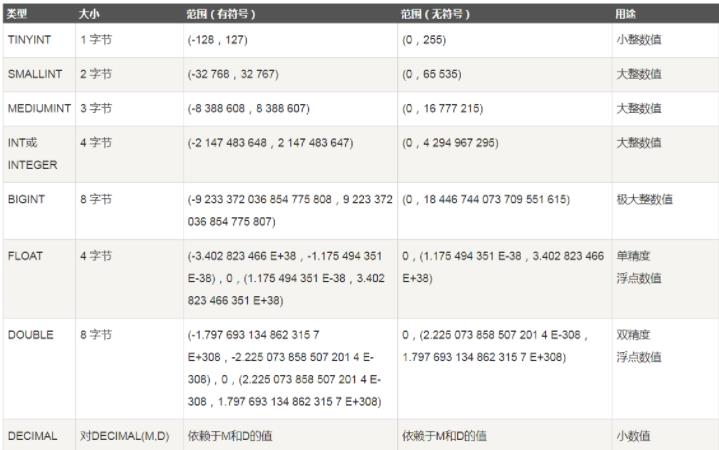

## 1、概述

**数据库**

DataBase（DB）：指长期保存在计算机的存储设备上，按照一定规则组织起来，可以
被各种用户或应用共享的数据集合即存储、维护和管理数据的集合。


**数据库管理系统**

DataBase Management System（DBMS）：指一种操作和管理数据库的大型软件，用于建立、使用和维护数据库，对数据库进行统一管理和控制，以保证数据库的安全性和完整性。用户通过数据库管理系统访问数据库中的数据。数据库软件应该为数据库管理系统，数据库是通过数据库管理系统创建和操作的。


**数据库的作用**

1. 存储大量数据，方便检索和访问
2. 保持数据信息的一致、完整
3. 共享和安全
4. 通过组合分析，产生新的有用信息


**数据库分类**

数据库分类，按照不同维度可分为：关系/非关系，大型/中小型，收费/免费等
本节主要介绍关系型数据库

- 关系型
  RDBMS Relational Database Management System
- 非关系型
  NOSQL Not Only SQL
- 数据存储方式不同
  关系数据库是表格式的
  非关系数据库是键值，文档，图形结构
- 扩展方式不同
  关系数据库是纵向扩展，提高机器的性能来提高数据的处理能力
  非关系数据库天然是分布式的，可以增加数据库节点来提高数据处理能力
- 对事务性的支持不同
  关系数据库全面支持事物
  非关系数据库大部分不支持事物


**关系型数据库有什么特点**

* 二维表格形式
* 通过SQL来存取
* 在保持数据库安全和数据一致性方面功能很强


**什么是SQL**

Structure Query Language，结构化查询语言。
国际化标准组织（ISO）采纳为关系数据库语言的国际标准。

* 各数据库厂商都支持ISO的SQL标准。
* 各数据库厂商在标准的基础上做了自己的扩展。


**数据库语句类型划分**

**(1) DDL**

**（Data Definition Language，数据库定义语言）：定义了不同的数据库、数据库表、列、索引等数据库对象的定义。**

> 例：create（创建表）、drop/truncate（删除表）、alter（修改表）和show（查表询）。

**(2) DML**

**（Data Manipulation Language，数据操控语言）：用于添加、删除、变更和查询数据库记录。**

> ​	例：insert（添加数据）、delete（删除数据）、update（更新数据）

**(3) DCL**

**（Data Control Language，数据控制语言）：控制不同数据库段直接访问和访问级别的语句。**

> ​	例：grant（授权）

**(4) DQL**

**（Data Query Language,数据查询语言）：用来查询记录（数据）。**

> ​	例：select


**范式**

**什么是范式（Normal form）**
设计关系数据库时，遵从不同的规范要求，设计出合理的关系型数据库，这些不同的规范要求
被称为不同的范式。

**范式有哪几种？**
目前关系数据库有六种范式：**第一范式（1NF）、第二范式（2NF）、第三范式（3NF）、巴斯**
**-科德范式（BCNF）、第四范式(4NF）和第五范式（5NF，又称完美范式）。**

> 注意：一般项目中满足第三种范式就足够了。


**数据库范式**

**（一）第一范式（1NF）：每一列保持原子特征。**

列是基本数据项，原子的，否则设计成一对多的关系。不满足第一范式不能称之为关系型数据
库。通俗讲就是：一个字段只存储一项信息。
示例如下:
学生表中只有一个字段
学生表（学生信息），里面存的数据为 张三是高一2班的男学生。这种表是不符合1NF的。
拆分改造后：
学生表（学生名称，性别，学生年级，学生班级）
对应的数据为 学生名称:张三，性别:男，年级:高一，班级:2

**（二）第二范式（2NF）：属性完全依赖于主键（针对联合主键进行消除部分依赖）**

1NF基础上，非主属性完全依赖于主键。如果不是依赖主键，应该拆分成新的主体，拆分成一
对多的关系。通俗讲就是：表要有主键，并且其他字段都依赖于主键，不能给无关的表使用
示例如下:
学生表（学生ID、姓名、性别、年龄、省、市、区）
其中省、市、区 并不是完全依赖学生ID。
拆分改造后：
学生表（学生ID、姓名、性别、年龄、地址ID）——主键：学生ID
地址表（地址ID、省、市、区）——主键：地址ID
键（学生ID，地址ID）

**（三）第三范式（3NF）：**

2NF基础上，属性不依赖于其它非主属性（消除依赖传递）。通俗讲就是：一个数据库表中不
包含已在其它表中已包含的非主关键字信息，即表与表之间的非主键信息不能重复。
示例如下:
学生表（学生ID、学生姓名、学生性别、学院名称、学院电话）——主键：学生ID
学院表（学院ID、学院名称、学院电话）——主键：学院ID
拆分改造后：
学生表（学生ID、学生姓名、学生性别、学院ID）——主键：学生ID
学院表（学院ID、学院名称、学院电话）——主键：学院ID
备注:通过范式学习，应用范式越高表越多。表多带来的问题：（1）查询时需要连接多个表，
增加了查询的复杂性。（2）查询时需要连接多个表，降低了数据库查询的性能。
一般满足第三范式即可。


**数据库应用范式的好处**

（1）减少数据冗余（最主要的好处，其它好处因此附带 ）
（2）消除异常（插入异常、更新异常、删除异常）
（3）让数据组织的更加和谐


**数据库设计**

是指对于一个给定的应用环境，构造优化的数据库逻辑模式和物理结构，并据此建立数据库及
其应用系统，使之能够有效地存储和管理数据，满足各种用户的应用需求，包括信息管理要求
和数据操作要求。
数据库设计的6个基本步骤：

* 需求分析

* 概念结构设计

* 逻辑结构设计

* 物理结构设计

* 数据库实施

* 数据库运行和维护 

  

## 2、基本概念

**（1）数据块（Data Blocks）**
数据块是Oracle最小的存储单位，Oracle数据存放在“块”中。一个块占用一定的磁盘空间。
**（2）数据区（Extent）**
是一组连续的数据块。当一个表、回滚段或临时段创建或需要附加空间时，系统总是为之分配一个新
的数据区。
**（3）段（Segment）**
是由多个数据区构成的，它是为特定的数据库对象（如表段、索引段、回滚段、临时段）分配的一系
列数据区。
**（4）表空间（tablespace）**
是数据库的逻辑划分。任何数据库对象在存储时都必须存储在某个表空间中。
每个数据库至少有一个表空间（system tablespace）是数据库逻辑结构与物理文件之间的一个映射。


**相关术语**

* 数据库：数据库是一些关联表的集合。
* 数据表：表是数据的矩阵。在一个数据库中的表看起来像一个简单的电子表格。
* 列：一列（数据元素）包含了相同的数据，列如姓名的数据。
* 行：一行（元组或记录）是一组相关的数据，列如一个学生的基本信息的数据。
* 冗余：存储两倍数据，冗余降低了性能，但是提高了数据的安全性（查询的效率）。
* 主键：主键是唯一的。一个数据表中只能包含一个主键。你可以使用主键来查询数据。
* 外键：外键用于关联两个表。
* 复合键：复合键（组合键）将多个列作为一个索引键，一般用于复合索引。


## 3、MySQL数据库的数值类型

**(1)、整数类型及浮点数类型**



**(2) 日期/时间类型**

包括 YEAR、TIME、DATE、DATETIME 和 TIMESTAMP

**(3) 字符串类型**

包括 CHAR、VARCHAR、BINARY、VARBINARY、BLOB、TEXT、ENUM 和 SET 等

**(4) 二进制类型**

包括 BIT、BINARY、VARBINARY、TINYBLOB、BLOB、MEDIUMBLOB 和 LONGBLOB其中TEXT、带有VAR字段的都是可变长度类型


## 4、数据表结构

一个数据库中包含多个数据表。
MySQL中，表的结构定义为：**Field | Type | Null | Key | Default | Extra |**
其中，各个字段的含义如下：

| **Null**    | **表示该列是否可以存储 NULL 值。**                           |
| ----------- | ------------------------------------------------------------ |
| **Key**     | **表示该列是否已编制索引。PRI 表示该列是表主键的一部分，UNI 表示该列是 UNIQUE索引的一部分，MUL 表示在列中某个给定值允许出现多次。** |
| **Default** | **表示该列是否有默认值，如果有，值是多少。**                 |
| **Extra**   | **表示可以获取的与给定列有关的附加信息，如 AUTO_INCREMENT 等。** |


**针对表的表的结构定义，可根据需要对不同的字段设置约束关系**

| **主键约束**   | **PRIMARY**              |
| -------------- | ------------------------ |
| **外键约束**   | **FORGIVEN…REFERENCES…** |
| **唯一约束**   | **UNIQUE**               |
| **检查约束**   | **CHECK**                |
| **默认值约束** | **DEFAULT**              |
| **非空约束**   | **NOT NULL**             |


## 5、数据表操作


**创建数据表**

> ```java
> CREATE TABLE 数据表名 (字段名 字段类型);
> ```

> ```mysql
> CREATE TABLE flea_market(
> 	item VARCHAR(100) NOT NULL,
> 	price INT UNSIGNED ,
> 	expire_date DATE DEFAULT'2099-12-31'
> )ENGINE=InnoDB DEFAULT CHARSET=utf8;
> ```

> ```mysql
> create table if not exists  `student`(
> 	`id` int not null auto_increment comment'主键',
>     `name` varchar(30) not null default'匿名' comment'姓名',
> 	`pwd` varchar(30) not null default'密码' comment'密码',
>     primary key(`id`)
> )engine=INNODB default charset=utf8
> ```


**查看数据表**

> ```mysql
> #查看数据库中所有表信息
> SHOW TABLES;
> #查看数据表字段信息
> DESCRIBE 数据表名;
> DESCRIBE flea_market;
> ```


**修改数据表**

> ```mysql
> #重命名
> ALTER TABLE flea_market RENAME TO fm;
> ```


**删除数据表**

> ```mysql
> #删除数据表
> DROP TABLE 数据表名;
> 
> DROP TABLE fm;
> ```


**添加字段**

> ```mysql
> ALTER TABLE flea_market ADD item_type VARCHAR(10) NOT NULL DEFAULT 'NULL';
> ```

**修改字段**

> ```mysql
> #修改字段类型
> ALTER TABLE flea_market MODIFY item_type CHAR(100);
> ```
>
> ```mysql
> #修改字段名称和类型
> ALTER TABLE flea_market CHANGE item_type item_status CHAR(10);
> ```


## 6、数据库数据操作

**(1)、添加数据**

> ```mysql
> #插入一条数据
> insert into table value()
> ```
>
> ```mysql
> #插入多条数据
> insert into table values(),(),...()
> ```

**(2)、删除数据**

> ```mysql
> DELETE FROM table [WHERE condition]
> ```

**(3)、修改数据**

> ```mysql
> UPDATE table SET column = value [, column = value, ...][WHERE condition]
> ```

**(4)、查询数据**

> ```mysql
> SELECT field1, field2,...fieldN FROM table_name1, table_name2...
> WHERE condition1 AND / OR condition2.....
> ```

> ```mysql
> #特定字段查询
> SELECT item FROM flea_market;
> ```
>
> ```mysql
> #去重查询
> SELECT DISTINCT distinct item FROM flea_market;
> ```
>
> ```mysql
> #设置别名
> SELECT item, price FROM flea_market AS f1 where f1.price=36;
> ```
>
> ```mysql
> #区间查询
> between ...and 或 >、<
> 
> select * from emp where salary between 3000 and 4000;
> select id,name,salary from emp where salary >= 3000 and salary <= 4000;
> ```
>
> ```mysql
> #like查询
> select name,salary from emp where name like '%o%';
> # %o以o结尾
> # o%以o开头
> # %o%全匹配
> ```
>
> ```mysql
> # not in查询
> select * from emp where salary not in (20000,18000,10000);
> ```
>
> ```mysql
> # null查询
> # 注意null不能使用=号 使用is
> select name,post from emp where post_comment is NULL;#这样才能有结果
> select name,post from emp where post_comment is not NULL;
> ```

**分组查询与聚合函数**

> ```mysql
> # 分组后取出的是每个组的第一条数据
> select post from emp group by post; 
> ```
>
> ```mysql
> #分组查询和聚合函数
> select post,max(salary) from emp group by post;# 每个部门的最高工资
> select post,min(salary) from emp group by post;# 每个部门的最低工资
> select post,avg(salary) from emp group by post;# 每个部门的平均工资
> select post,sum(salary) from emp group by post;# 每个部门的工资总和
> select post,count(id) from emp group by post;# 每个部门的人数
> ```
>
> ```mysql
> #having查找
> select 查询字段1,查询字段2,... from 表名
> where 过滤条件
> group by分组依据
> having 过滤条件
> 
> select post,avg(salary) from emp
> where age >= 30
> group by post
> having avg(salary) > 10000;
> ```

> ```mysql
> #order by 查找
> select * from emp order by salary asc; #默认升序排
> select * from emp order by salary desc; #降序排
> ```
>
> ```mysql
> # 限制展示条数
> select * from emp limit 3;
> 
> # 查询工资最高的人的详细信息
> select * from emp order by salary desc limit 1;
> 
> # limit查询 0起始位置 现实条数
> select * from emp limit 0,5;
> ```

**多表查询**

> ```mysql
> #查询员工及所在部门的信息
> select * from user,dep where user.dep_id = dep.id;
> ```
>
> ```mysql
> #查询部门为技术部的员工及部门信息
> select * from user,dep where user.dep_id = dep.id and dep.name = '技术';
> ```
>
> ```mysql
> #将两张表关联到一起的操作，有专门对应的方法
> #内连接：只取两张表有对应关系的记录
> select * from user inner join dep on user.dep_id = dep.id;
> select * from user inner join dep on user.dep_id = dep.id
> where dep.name = "技术";
> ```

> ```mysql
> #左连接: 在内连接的基础上保留左表没有对应关系的记录
> select * from user left join dep on user.dep_id = dep.id;
> ```
>
> ```mysql
> #右连接: 在内连接的基础上保留右表没有对应关系的记录
> select * from user right join dep on user.dep_id = dep.id;
> ```
>
> ```mysql
> #全连接：在内连接的基础上保留左、右面表没有对应关系的的记录
> select * from user left join dep on user.dep_id = dep.id
> union
> select * from user right join dep on user.dep_id = dep.id;
> ```
>
> ```mysql
> #子查询
> #查询部门是技术或者人力资源的员工信息
> #先获取技术部和人力资源部的id号，再去员工表里面根据前面的id筛选出符合要求的员工信息
> select id,name from dep where name in ("技术","人力资源");
> select * from user where dep_id in (select id from dep where name in ("技术","人力资源"));
> ```

**日期查询**

> ```mysql
> # Date()函数
> DATE_FORMAT(NOW(),'%b %d %Y %h:%i %p')
> DATE_FORMAT(NOW(),'%m-%d-%Y')
> DATE_FORMAT(NOW(),'%d %b %y')
> DATE_FORMAT(NOW(),'%d %b %Y %T:%f')
> 
> Dec 29 2008 11:45 PM
> 12-29-2008
> 29 Dec 08
> 29 Dec 2008 16:25:46.635
> ```
>
> ```mysql
> SELECT *
> FROM `dateTest` 
> where  DATE_FORMAT(date,'%Y-%m-%d %H:%i:%S') = '2017-08-09 19:50:50'
> #tips 使用时间范围查询尽量使用between and查询可以避免使用><导致的专业问题 >< 转义 &gt &lt
> ```

```java
@RequestMapping("/getDate")
public Map getDate(@JsonFormat(pattern = "yyyy-MM-dd HH:mm:ss", timezone = "GMT+8") Date time){
    Map date = new HashMap();
    SimpleDateFormat simpleDateFormat = new SimpleDateFormat("yyyy-MM-dd HH:mm:ss");
    date.put("time", simpleDateFormat.format(time));
    return date;
}
```


## 7、数据库索引

索引是 MySQL 中一种十分重要的数据库对象。它是数据库性能调优技术的基础，常用于实现
数据的快速检索。
索引就是根据表中的一列(一个字段)或若干列按照一定顺序建立的列值与记录行之间的对应关系
表，实质上是一张描述索引列的列值与原表中记录行之间一一对应关系的有序表。

在 MySQL 中，通常有以下两种方式访问数据库表的行数据：

1. 顺序访问
   顺序访问是在表中实行全表扫描，从头到尾逐行遍历，直到在无序的行数据中找到符合条件的
   目标数据。这种方式实现比较简单，但是当表中有大量数据的时候，效率非常低下。例如，在
   几千万条数据中查找少量的数据时，使用顺序访问方式将会遍历所有的数据，花费大量的时间，
   显然会影响数据库的处理性能

2. 索引访问
   索引访问是通过遍历索引来直接访问表中记录行的方式。使用这种方式的前提是对表建立一个索
   引，在列上创建了索引之后，查找数据时可以直接根据该列上的索引找到对应记录行的位置，从
   而快捷地查找到数据。索引存储了指定列数据值的指针，根据指定的排序顺序对这些指针排序。


根据检索方式的物理和逻辑上的不同，索引又分为以下几种:
**物理索引：**
二叉树索引 BTree
哈希索引 Hash
**逻辑索引：**
普通索引 INDEX / KEY
唯一索引 UNIQUE
主键索引 PRIMARY KEY
空间索引 GEOMETRY
全文索引


**创建普通索引**

> ```mysql
> CREATE TABLE flea_market2(
> 	item VARCHAR(100) NOT NULL, # 非空约束
> 	price INT DEFAULT 0,
> 	expire_date DATE DEFAULT '2099-12-31',
> 	status CHAR(10) DEFAULT 'NONE',
> 	INDEX(item) #索引
> ) ENGINE=InnoDB DEFAULT CHARSET=utf8;
> 
> DESCRIBE flea_market2; #执行后查看 
> #DESCRIBE一下可以看到KEY这一列出现了MUL，则该字段是非唯一索引的第一列，允许在列中多次出现给定值。
> ```

**为已有表添加索引**

> ```mysql
> CREATE INDEX 索引名 ON 数据表名 (字段名);
> ```
>
> ```mysql
> CREATE INDEX index1 ON flea_market (item);
> 
> #可以看到KEY这一列出现了MUL
> DESCRIBE flea_market; 
> ```
>
> ```mysql
> #创建唯一索引
> CREATE UNIQUE INDEX index3 ON flea_market (price);
> ```

**删除索引**

> ```mysql
> DROP INDEX index1 ON flea_market;
> SHOW INDEX FROM flea_market; #查看索引
> ```


## 8、数据库视图

视图是一个虚拟表，同真实表一样，视图包含一系列带有名称的列和行数据，但视图并不是数据库
真实存储的数据表。
视图是数据的窗口，而表是内容。表是实际数据的存放单位，而视图只是以不同的显示方式展示数
据，其数据来源还是实际表。
视图的建立和删除只影响视图本身，不影响对应的基本表。

**创建视图**

> ```mysql
> CREATE VIEW 视图名 AS <SELECT语句>;
> CREATE VIEW view_flea_market AS SELECT * FROM flea_market;
> 或者
> 
> 
> CREATE VIEW view_flea_market
> (s_item,s_price)
> AS SELECT item,price
> FROM flea_market;
> ```

**查看视图**

> ```mysql
> DESCRIBE view_flea_market;
> #或者
> select * from view_flea_market;
> ```

**删除视图**

> ```mysql
> DROP VIEW view_flea_market;
> DESCRIBE view_flea_market; #查询视图
> ```


## 9、数据库函数

**创建函数**

> ```mysql
> CREATE FUNCTION PriceIs2299()RETURNS VARCHAR(100)
> RETURN(SELECT item FROM flea_market WHERE price=2299);
> ```

**调用函数**

> ```mysql
> # SELECT <自定义函数名>;
> SELECT PriceIs2299();
> ```

## 10、数据库存储过程

存储过程是一组为了完成特定功能的 SQL 语句集合。使用存储过程的目的是将常用或复杂的工作
预先用 SQL 语句写好并用一个指定名称存储起来，这个过程经编译和优化后存储在数据库服务器
中，因此称为存储过程。当以后需要数据库提供与已定义好的存储过程的功能相同的服务时，只需
调用CALL 存储过程名即可自动完成
存储过程是用户定义的一系列sql语句的集合，涉及特定表或其它对象的任务，用户可以调用存储过
程，而函数通常是数据库已定义的方法，它接收参数并返回某种类型的值并且不涉及特定用户表。

存储过程和函数存在以下几个区别：
	1）一般来说，存储过程实现的功能要复杂一点，而函数的实现的功能针对性比较强。存储过程，功能强大，可以执行包括修改表等一系列数据库操作；用户定义函数不能用于执行一组修改全局数据库状态的操作。
	2）对于存储过程来说可以返回参数，如记录集，而函数只能返回值或者表对象。函数只能返回一个变量；而存储过程可以返回多个。存储过程的参数可以有IN,OUT,INOUT三种类型，而函数只能有IN类。存储过程声明时不需要返回类型，而函数声明时需要描述返回类型，且函数体中必须包含一个有效的RETURN语句。
	3）存储过程，可以使用非确定函数，不允许在用户定义函数主体中内置非确定函数。
	4）存储过程一般是作为一个独立的部分来执行（ EXECUTE 语句执行），而函数可以作为查询语句的一个部分来调用（SELECT调用）,由于函数可以返回一个表对象，因此它可以在查询语句中位于FROM关键字的后面。 SQL语句中不可用存储过程，而可以使用函数。

**不带参数存储过程**

> ```mysql
> # 创建存储过程
> # DELIMITER将结束符从 ; 变成//
> 
> DELIMITER //
> CREATE PROCEDURE MediumPriceItem()
> BEGIN
> SELECT item FROM flea_market WHERE price<=500 AND price>=200;
> END //
> ```

> ```mysql
> # 调用存储过程
> # 先将结束符变回; DELIMITER和分号之间的空格不要漏了
> DELIMITER ;
> CALL MediumPriceItem();
> ```
>
> ```mysql
> # 删除存储过程
> # DROP PROCEDURE 存储过程名;
> DROP PROCEDURE MediumPriceItem;
> ```

**带参数存储过程**

> ```mysql
> CREATE PROCEDURE GetPrice
> (IN parameter VARCHAR(100))
> BEGIN
> SELECT price FROM flea_market WHERE item=parameter;
> END
> ```

**调用存储过程**

> ```mysql
> CALL GetPrice('iPad2018');
> ```


## 11、数据库触发器

触发器是一个特殊的存储过程，不同的是执行存储过程要使用 CALL 语句来调用，而触发器的执行
不需要使用 CALL 语句来调用，也不需要手工启动，只要一个预定义的事件发生就会被 MySQL自
动调用。
MySQL中的触发器中按照条件分类有：INSERT 触发器、UPDATE 触发器和 DELETE 触发器。按照
作用时间分类有：BEFORE触发器、AFTER触发器。BEFORE和AFTER的区别有点类似与C语言中的
i++和++i，自行体会。
引发触发器执行的事件一般如下：
1.增加一条学生记录时，会自动检查年龄是否符合范围要求(BEFORE INSERT)
2.每当删除一条学生信息时，自动删除其成绩表上的对应记录(AFTER DELETE)
3.每当更新一条数据时，在数据库存档表中保留原版本备份副本(BEFORE UPDATE)


数据库触发器有以下的作用:

1. **安全性。可以基于数据库的值使用户具有操作数据库的某种权利。**
   - 可以基于时间限制用户的操作，例如不允许下班后和节假日修改数据库数据。
   - 可以基于数据库中的数据限制用户的操作，例如不允许股票的价格的升幅一次超过10%。

2. **审计。可以跟踪用户对数据库的操作。**
   - 审计用户操作数据库的语句。
   - 把用户对数据库的更新写入审计表。
3. **实现复杂的数据完整性规则**
   - 实现非标准的数据完整性检查和约束。触发器可产生比规则更为复杂的限制。与规则不同，触
     发器可以引用列或数据库对象。例如，触发器可回退任何企图吃进超过自己保证金的期货。
   - 提供可变的缺省值。

4. **实现复杂的非标准的数据库相关完整性规则。**触发器可以对数据库中相关的表进行连环更新。例
   如，在auths表author_code列上的删除触发器可导致相应删除在其它表中的与之匹配的行。
   - 在修改或删除时级联修改或删除其它表中的与之匹配的行。
   - 在修改或删除时把其它表中的与之匹配的行设成NULL值。
   - 在修改或删除时把其它表中的与之匹配的行级联设成缺省值。
   - 触发器能够拒绝或回退那些破坏相关完整性的变化，取消试图进行数据更新的事务。当插入一
     个与其主健不匹配的外部键时，这种触发器会起作用。
5. **同步实时地复制表中的数据。**
6. **自动计算数据值，如果数据的值达到了一定的要求，则进行特定的处理。**例如，如果公司的帐号
   上的资金低于5万元则立即给财务人员发送警告数据。


举个例子，比如现在有两个表【用户表】和【日志表】，当一个用户被创建的时候，就需要在日志
表中插入创建的log日志，如果在不使用触发器的情况下，你需要编写程序语言逻辑才能实现，但
是如果你定义了一个触发器，触发器的作用就是当你在用户表中插入一条数据的之后帮你在日志表
中插入一条日志信息。当然触发器并不是只能进行插入操作，还能执行修改，删除。


## 远程访问

Tried

```sql
mysql> GRANT ALL PRIVILEGES ON *.* TO 'root'@'%' IDENTIFIED BY 'root' WITH GRANT OPTION;
```

Getting

> ERROR 1064 (42000): You have an error in your SQL syntax; check the manual that corresponds to your MySQL server version for the right syntax to use near 'IDENTIFIED BY 'root' WITH GRANT OPTION' at line 1.

Note: The same is working when tried in previous versions.

Also tried

```sql
mysql> GRANT ALL PRIVILEGES ON *.* TO 'root'@'%' WITH GRANT OPTION;
```


Starting with MySQL 8 you no longer can (implicitly) create a user using the `GRANT` command. Use [CREATE USER](https://dev.mysql.com/doc/refman/8.0/en/create-user.html) instead, followed by the [GRANT](https://dev.mysql.com/doc/refman/8.0/en/grant.html) statement:

```sql
mysql> CREATE USER 'root'@'%' IDENTIFIED BY 'PASSWORD';
mysql> GRANT ALL PRIVILEGES ON *.* TO 'root'@'%' WITH GRANT OPTION;
mysql> FLUSH PRIVILEGES;
```


```shell
mysql> SELECT User, Password, Host FROM user;
```

If you would somehow run into the following error:

> ERROR 1130 (HY000): Host ‘1.2.3.4’ is not allowed to connect to this MySQL server

You need add/change the following two lines in `/etc/mysql/my.cnf` and restart mysql:

```sql
bind-address           = 0.0.0.0
skip-networking
```


