# [Spring MVC源码解读『Idea如何构建Spring MVC应用』](http://lidol.top/frame/3225/)

2020-12-13 分类：[Spring MVC源码](http://lidol.top/category/frame/sprinmvc_sc/) / [框架](http://lidol.top/category/frame/) 阅读(464) 评论(0)

从工作几乎一直在使用开箱即用的Spring Boot，很少使用Spring MVC。在上篇文章介绍Spring MVC示例中搭建那个HelloWorld demo过程中，还费了一些周折。想着可能很多人的Java Web之旅都是从Spring Boot开启的，本篇文章我们就来介绍一下如何使用Idea构建Spring MVC应用，以及通过Idea部署Spring MVC应用。

## 1. Idea构建并部署Spring MVC应用

### 1.1 创建Web应用

这里我们来看一个最简单的问题，如何通过Idea构建并部署Spring MVC应用，代码我们还用上篇文章中介绍的HelloWorld，这里重点关注如何构建并部署的过程。

[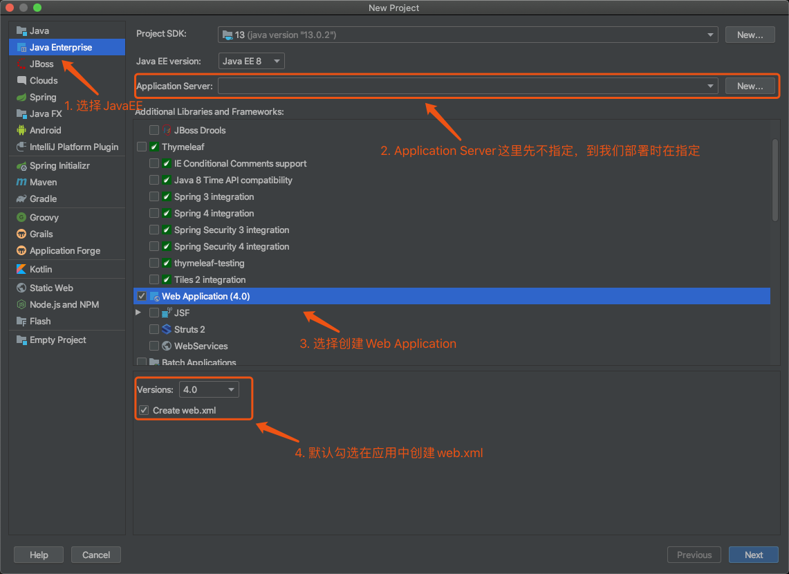](http://cdn.lidol.top/lidol_blog/20201216075302.png)

这里我没有用Spring脚手架搭建，而是通过JavaEE创建Web Application方式 构建的。这样，一个空的Web Application就创建好了，如下：

[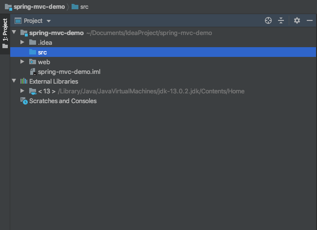](http://cdn.lidol.top/lidol_blog/20201216075605.png)

由于我这里想使用Maven来管理jar，所以接下来为我们的Web应用添加Maven支持。右键应用程序名，选择“Add Framework Support”，勾选“Maven”，并点击确定：

[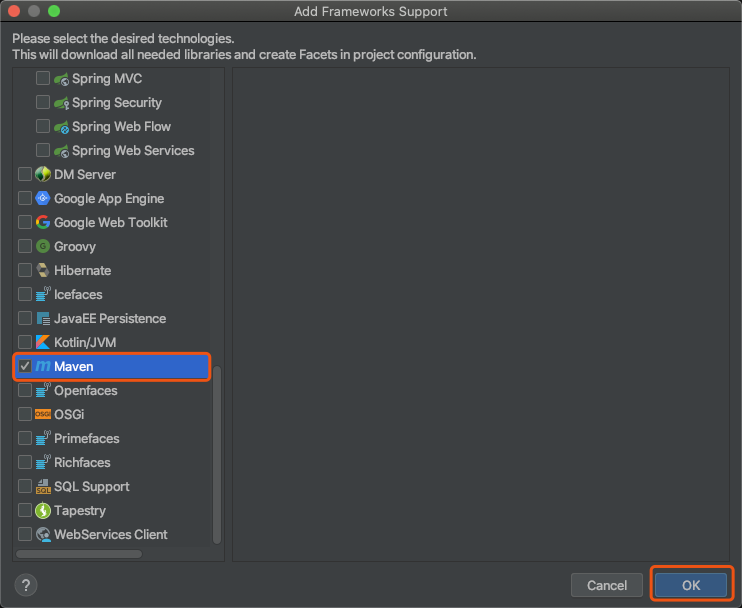](http://cdn.lidol.top/lidol_blog/20201216075933.png)

这样我们的应用就变成一个Maven应用了。

[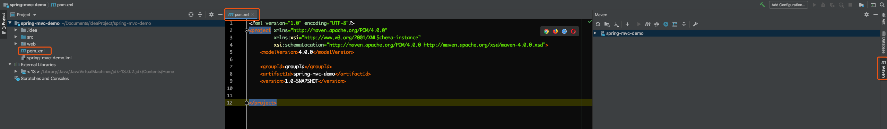](http://cdn.lidol.top/lidol_blog/20201216080137.png)

### 1.2 使用Spring MVC开发应用

首先我们在pom.xml中添加Spring依赖，并通过Maven讲相关依赖包加载到应用中来：

[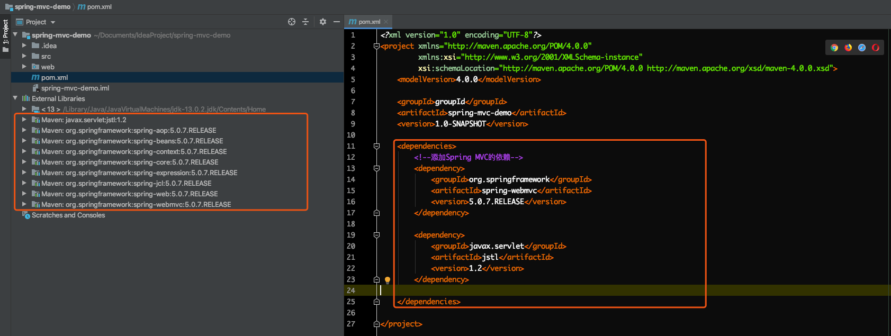](http://cdn.lidol.top/lidol_blog/20201216080658.png)

这里之所以在“pom.xml”中添加jstl依赖，是因为我们加下来使用到了视图解析器要用到这个包，不然接口调用时就会报错。

然后我们在“src/main/java” Source Root下创建package “com.zhuoli.service.spring.mvc.demo”，并添加HelloController：

[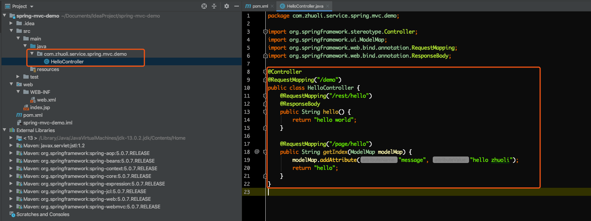](http://cdn.lidol.top/lidol_blog/20201216081501.png)

然后，我们在“src/main/resources”classPath中添加上篇文章中提到的两个配置文件，spring.xml和Spring-mvc.xml：

[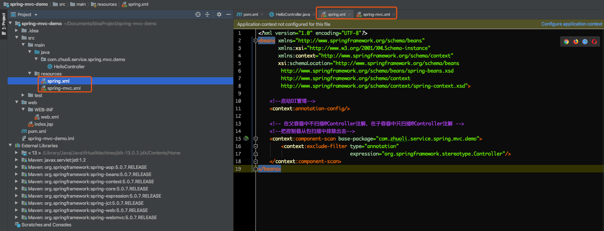](http://cdn.lidol.top/lidol_blog/20201216081633.png)

spring.xml配置如下：

```
<?xml version="1.0" encoding="UTF-8"?>
<beans xmlns="http://www.springframework.org/schema/beans"
       xmlns:xsi="http://www.w3.org/2001/XMLSchema-instance"
       xmlns:context="http://www.springframework.org/schema/context"
       xsi:schemaLocation="http://www.springframework.org/schema/beans
        http://www.springframework.org/schema/beans/spring-beans.xsd
        http://www.springframework.org/schema/context
        http://www.springframework.org/schema/context/spring-context.xsd">

    <!--启动DI管理-->
    <context:annotation-config/>

    <!-- 在父容器中不扫描@Controller注解，在子容器中只扫描@Controller注解 -->
    <!--把控制器从包扫描中排除出去-->
    <context:component-scan base-package="com.zhuoli.service.spring.mvc.demo">
        <context:exclude-filter type="annotation"
                                expression="org.springframework.stereotype.Controller"/>
    </context:component-scan>
</beans>
```

spring-mvc.xml配置如下：

```
<?xml version="1.0" encoding="UTF-8"?>
<beans xmlns="http://www.springframework.org/schema/beans"
       xmlns:xsi="http://www.w3.org/2001/XMLSchema-instance"
       xmlns:context="http://www.springframework.org/schema/context"
       xmlns:mvc="http://www.springframework.org/schema/mvc"
       xsi:schemaLocation="
        http://www.springframework.org/schema/beans
        http://www.springframework.org/schema/beans/spring-beans.xsd
        http://www.springframework.org/schema/context
        http://www.springframework.org/schema/context/spring-context.xsd
        http://www.springframework.org/schema/mvc
        http://www.springframework.org/schema/mvc/spring-mvc.xsd">


    <!-- 启用Spring基于annotation的DI, 使用户可以在Spring MVC中使用Spring的强大功能。
        激活 @Required, @Autowired,JSR 250's @PostConstruct, @PreDestroy and @Resource 等标注 -->
    <context:annotation-config/>

    <!--包扫描-->
    <!--DispatcherServlet上下文,只管理@Controller的bean,忽略其他类型的bean, 例如@Service-->
    <context:component-scan base-package="com.zhuoli.service.spring.mvc.demo">
        <context:include-filter type="annotation" expression="org.springframework.stereotype.Controller"/>
    </context:component-scan>


    <!-- 扩充了注解驱动，可以将请求参数绑定到控制器参数 -->
    <!-- 简化配置：
        (1)自动注册DefaultAnootationHandlerMapping,AnotationMethodHandlerAdapter
        (2)提供一些列：数据绑定，数字和日期的format @NumberFormat, @DateTimeFormat, xml,json默认读写支持
    -->
    <mvc:annotation-driven>
        <!--解决以@ResponseBody直接返回字符串时中文乱码问题-->
        <mvc:message-converters register-defaults="true">
            <bean class="org.springframework.http.converter.StringHttpMessageConverter">
                <constructor-arg value="UTF-8"/>
            </bean>
        </mvc:message-converters>
    </mvc:annotation-driven>

    <!--前缀加上后缀生成一个完整的jsp路径-->
    <bean class="org.springframework.web.servlet.view.InternalResourceViewResolver">
        <property name="viewClass" value="org.springframework.web.servlet.view.JstlView"/>
        <property name="prefix" value="/WEB-INF/jsp/"/>
        <property name="suffix" value=".jsp"/>
    </bean>
</beans>
```

最后我们需要配置一下“web/WEB-INF/”下的web.xml，并创建jsp文件：

```
<?xml version="1.0" encoding="UTF-8"?>
<web-app xmlns="http://xmlns.jcp.org/xml/ns/javaee"
         xmlns:xsi="http://www.w3.org/2001/XMLSchema-instance"
         xsi:schemaLocation="http://xmlns.jcp.org/xml/ns/javaee http://xmlns.jcp.org/xml/ns/javaee/web-app_4_0.xsd"
         version="4.0">

    <display-name>Archetype Created Web Application</display-name>

    <!--指定Spring的配置文件地址-->
    <context-param>
        <param-name>contextConfigLocation</param-name>
        <param-value>classpath:spring.xml</param-value>
    </context-param>

    <!--Tomcat Context生命周期监听器-->
    <listener>
        <listener-class>org.springframework.web.context.ContextLoaderListener</listener-class>
    </listener>

    <!--配置Spring MVC 的DispatcherServlet,指定配置文件的路径,拦截所有的请求-->
    <servlet>
        <!--这个名称如果不特别指定的话，跟配置文件名称有关联。如果特别指定配置文件了，则此名称就无所谓了-->
        <servlet-name>springMvc</servlet-name>
        <servlet-class>org.springframework.web.servlet.DispatcherServlet</servlet-class>
        <init-param>
            <!--contextConfigLocation这个参数可以不配置，如果不配置的话，那么默认的value就是/WEB-INF/[servlet名字]-servlet.xml-->
            <param-name>contextConfigLocation</param-name>
            <param-value>classpath:spring-mvc.xml</param-value>
        </init-param>
        <!--表示启动容器时初始化该Servlet-->
        <load-on-startup>1</load-on-startup>
    </servlet>

    <servlet-mapping>
        <servlet-name>springMvc</servlet-name>
        <!--DispatcherServlet拦截所有的请求-->
        <url-pattern>/</url-pattern>
    </servlet-mapping>
</web-app>
```

[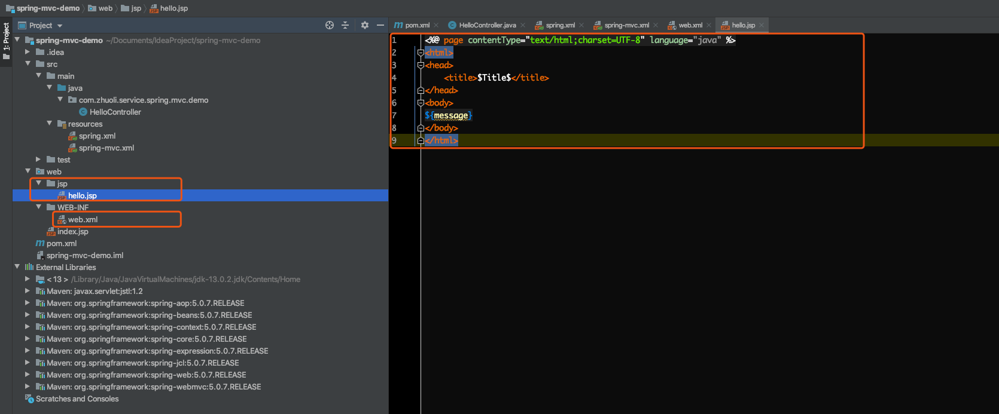](http://cdn.lidol.top/lidol_blog/20201216082048.png)

到这里，我们的应用代码就写完了，接下来就是通过Idea部署我们的Spring MVC应用了。

### 1.3 使用Idea部署Spring MVC应用

[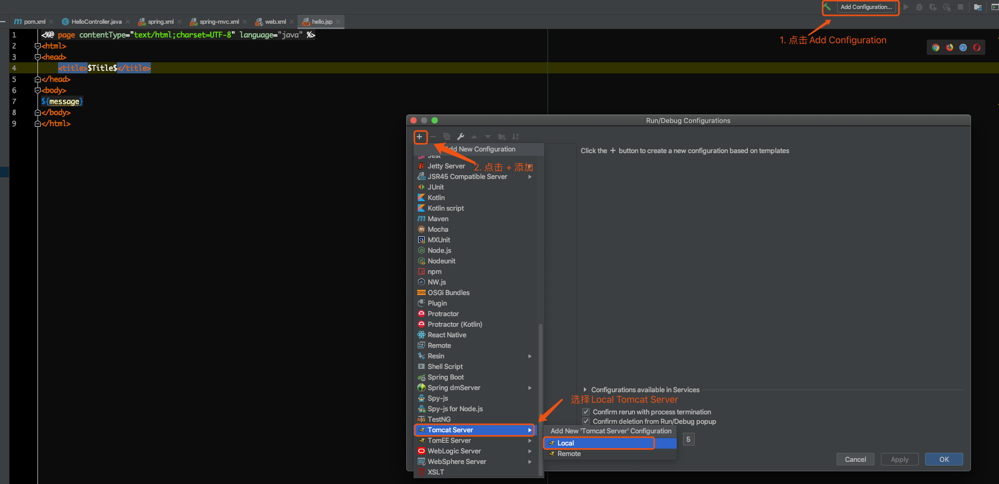](http://cdn.lidol.top/lidol_blog/20201216083213.png)

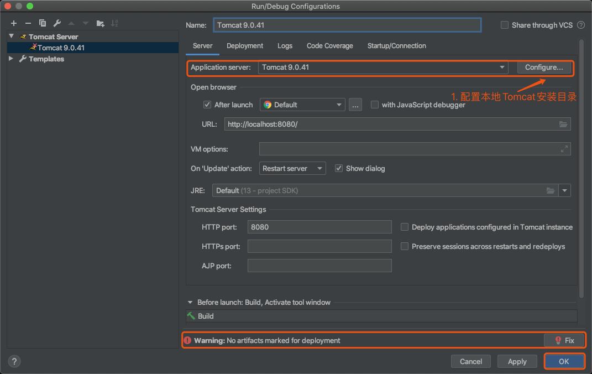

这里我们配置了本地的Tomcat地址后发现下方还有个Warning提醒，”No artifacts marked for deployment”，意思是说我们还没有标记部署的项目，点击右面的fix按钮，Idea会自动帮我们修复该问题，然后发现Warning就消失了。

[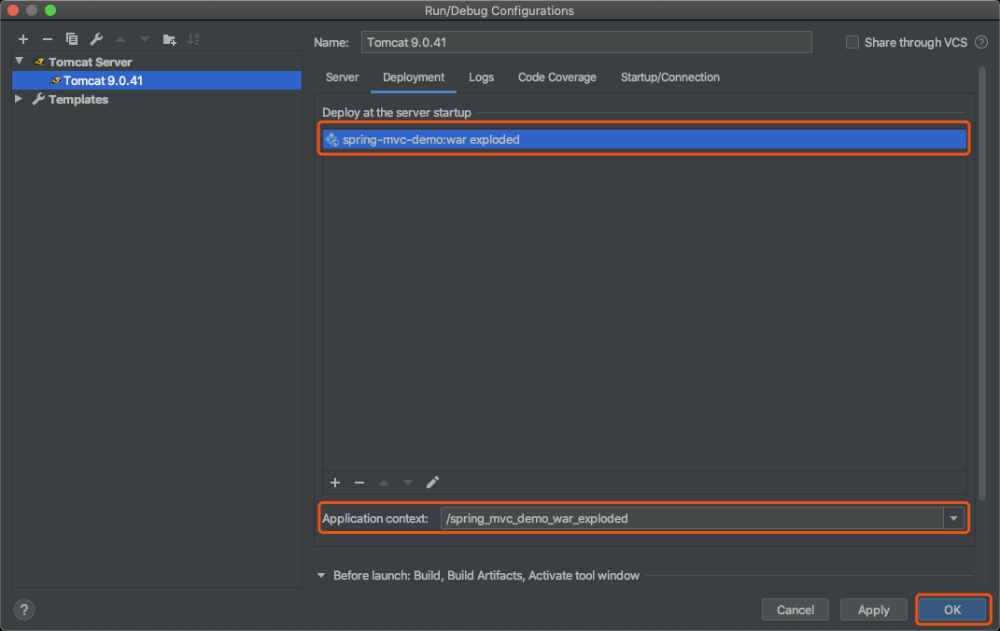](http://cdn.lidol.top/lidol_blog/20201217074054.png)

上图点击fix后，会自动跳转到该图，这里的Application context跟我们最终访问应用的uri有关，比如这里配置为”/spring_mvc_demo_war_exploded”，那么最终访问的路径就是“http://localhost:8080/spring_mvc_demo_war_exploded/demo/rest/hello”。通过之前的文章我们也可以知道，这里的这个Application context配置肯定跟Tomcat配置文件的<context>节点的path属性有关。这里为了方便我们把配置改为”/”，直接通过”http://localhost:8080/demo/rest/hello”就能访问接口。

然后点击确定，我们的Tomcat Server就配置好了。点击运行

[](http://cdn.lidol.top/lidol_blog/20201217075017.png)

理论上就会默认开启一个浏览器tab，并访问链接”http://localhost:8080/”，但是发现浏览器tab确迟迟未打开，查看tomcat启动日志，发现报了ClassNotFound异常，如下：

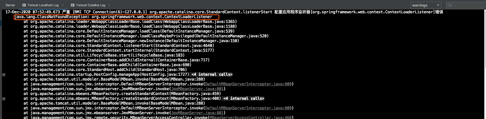

后来解决方案如下：

[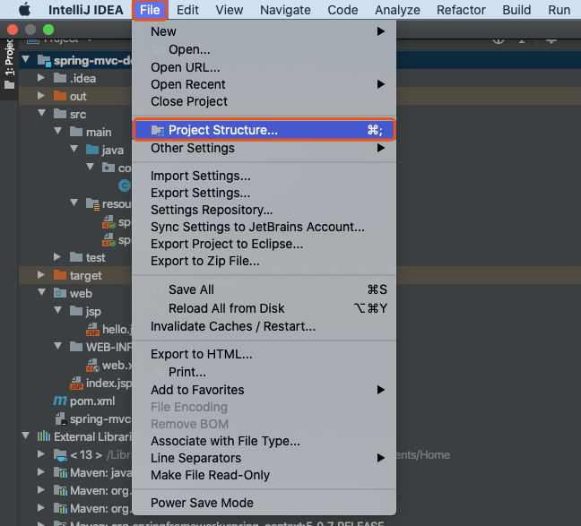](http://cdn.lidol.top/lidol_blog/20201217075809.png)

[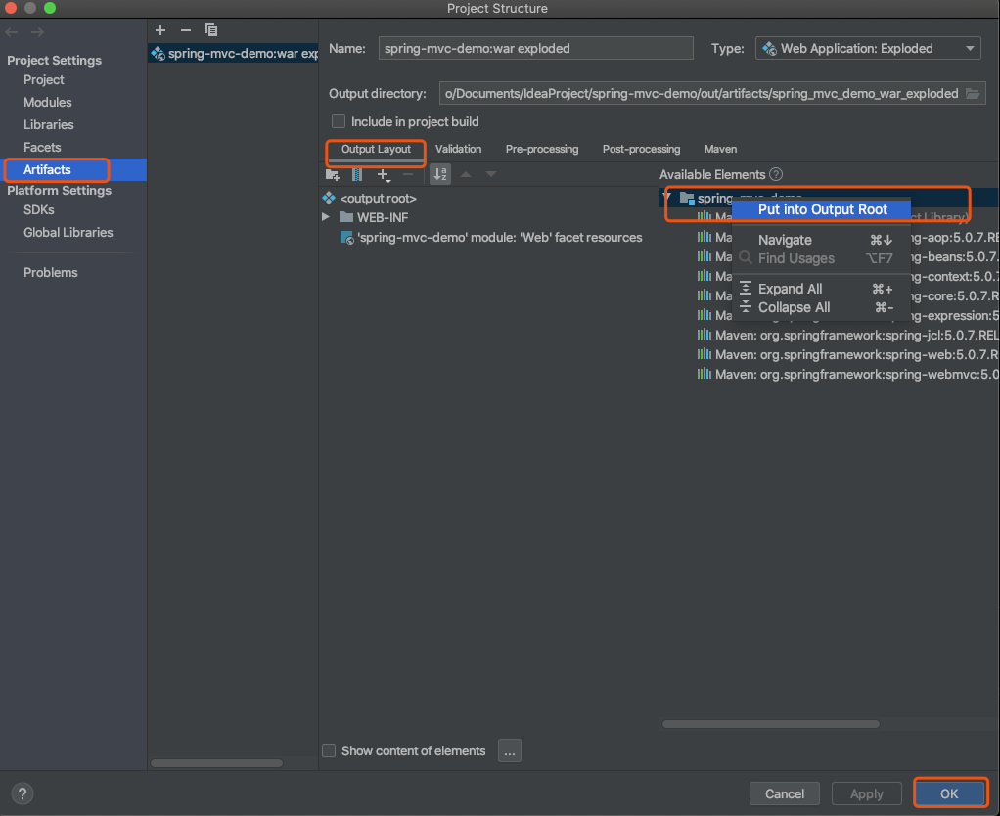](http://cdn.lidol.top/lidol_blog/20201217075934.png)

“Put into Output Root”，其实是将应用以来的jar添加到WEB-INF\classes\lib目录下，这里不知道为什么不会帮我们自动添加（大部分ClassNotFound问题都是这个原因导致的，通过这种方式就能解决）。之后重新运行项目，发现浏览器自动访问了我们的默认路径”http://localhost:8080″：

[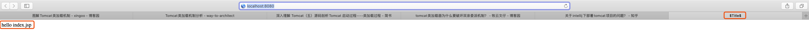](http://cdn.lidol.top/lidol_blog/20201217082031.png)

## 2. Idea部署Spring MVC应用原理

### 2.1 手动启动Tomcat应用

我们本机安装了Tomcat的，如果我们要启动Tomcat，一般会到Tomcat的安装目录(“CATALINA_HOME”)下的bin目录，运行”./catalina.sh start”，就可以启动了。然后我们访问”http://localhost:8080″，就能看到那只熟悉的猫：

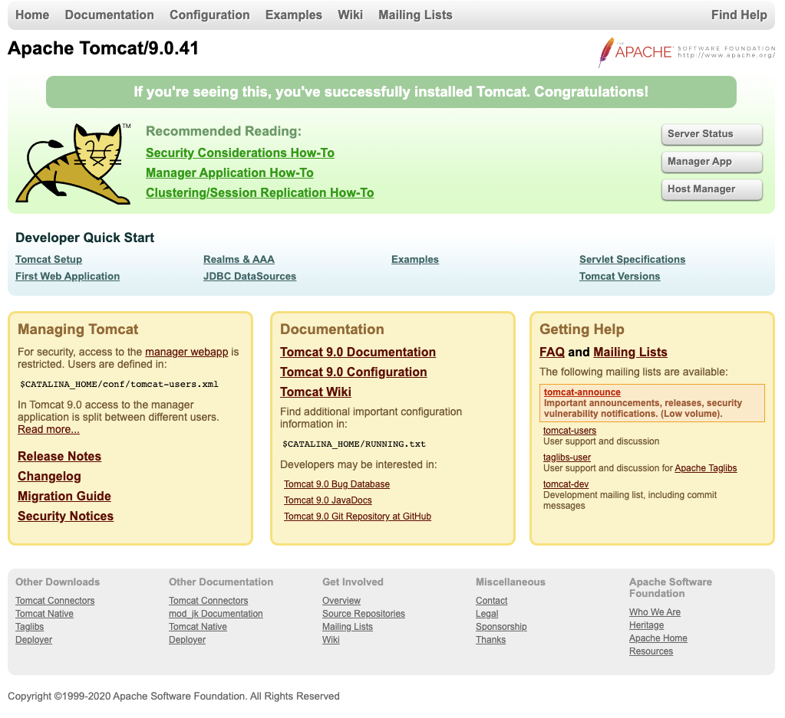

停止Tomcat也比较简单，直接在bin目录下执行脚本”./catalina.sh stop”即可。或者通过brew安装的，也可以直接运行以下命令：

```
brew services start tomcat
brew services stop tomcat
```

### 2.2 本地tomcat运行多实例

如果我们要在自己的电脑上运行多个tomcat实例，需要怎么做。一般有两种方式：

- 将整个Tomcat目录重新复制一份，每个tomcat实例之间完全独立
- 只将CATALINA_HOME目录下的conf目录拷贝一份到新目录（新目录就是CATALINA_BASE），多个实例共用CATALINA_HOME目录下的bin、lib文件夹

这里以本地安装的Tomcat目录为”/usr/local/Cellar/tomcat/9.0.37/libexec”为例，分别通过如上两种方式创建tomcat实例。

#### 2.2.1 完全复制

首先我们在创建一个文件夹，用于存储tomcat实例：

```
cd ~
mkdir tomcat_instance
```

然后创建一个目录，用于存放我们从本地CATALINA_HOME中拷贝过去的Tomcat信息：

```
cd tomcat_instance
mkdir tomcat0
cd tomcat0
cp -a /usr/local/Cellar/tomcat/9.0.41/libexec/* ./
```

也就是说我们将CATALINA_HOME目录下的全部数据都拷贝到了”~/tomcat_instance/tomcat0″目录下，那么直接通过该目录下bin中的脚本启动的话，”~/tomcat_instance/tomcat0″其实就是一个CATALINA_HOME。我们可以通过这种方式，在一台机器中启动很多个tomcat，各个tomcat实例之间完全独立，有各自的CATALINA_HOME和CATALINA_BASE（有一点需要注意，同时启动多个时，需要修改server.xml中Connector的端口配置，不然会出现端口冲突）。

```
cd ~/tomcat_instance/tomcat0/bin
./catalina.sh start
```

可以看到启动日志：

[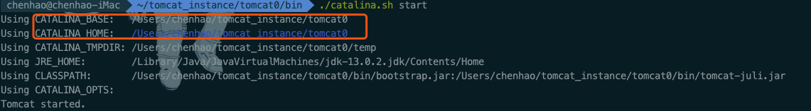](http://cdn.lidol.top/lidol_blog/20201218075654.png)

#### 2.2.2 多实例共用CATALINA_HOME

**多实例共用CATALINA_HOME，其实就是共用CATALINA_HOME目录下的bin和lib文件夹**，通过这种方式启动的多个tomcat实例，CATALINA_HOME是一样的，但是CATALINA_BASE各不相同。

```
cd ~/tomcat_instance
mkdir tomcat1
cd tomcat1
```

将我们Tomcat安装目录中的conf文件夹直接拷贝过来，并创建一些本tomcat实例工作需要的一些新文件夹：

```
cp -a /usr/local/Cellar/tomcat/9.0.41/libexec/conf ./
mkdir logs webapps work temp
```

修改conf目录下的server.xml，主要修改如下内容，如下图所示：

[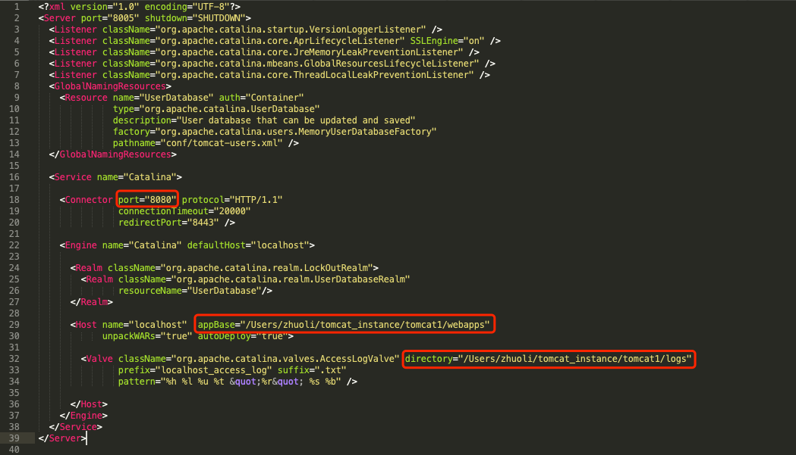](http://cdn.lidol.top/lidol_blog/20201218080205.png)

接着我们在webapps目录创建我们当前tomcat实例的应用：

```
cd ~/tomcat_instance/tomcat1/webapps
mkdir ROOT
cd ROOT
vi index.jsp

# index.jsp保存以下内容
<%@ page contentType="text/html;charset=UTF-8" language="java" %>
<html>
  <head>
    <title>My Tomcat1</title>
  </head>
  <body>
  hello zhuoli 111
  </body>
</html>
cd ~/tomcat_instance/tomcat1/webapps
mkdir myapp
cd myapp
vi index.jsp

# index.jsp保存以下内容
<%@ page contentType="text/html;charset=UTF-8" language="java" %>
<html>
  <head>
    <title>My Tomcat1</title>
  </head>
  <body>
  hello zhuoli 222
  </body>
</html>
```

在”~/tomcat_instance/tomcat1″工作目录下，创建启动暂停脚本：

```
cd ~/tomcat_instance/tomcat1
vi start_tomcat1.sh

# 保存以下内容
#!/bin/bash
export CATALINA_HOME=/usr/local/Cellar/tomcat/9.0.41/libexec
export CATALINA_BASE=/Users/chenhao/tomcat_instance/tomcat1
cd ${CATALINA_HOME}
./bin/catalina.sh start
cd ~/tomcat_instance/tomcat1
vi stop_tomcat1.sh

# 保存以下内容
#!/bin/bash
export CATALINA_HOME=/usr/local/Cellar/tomcat/9.0.41/libexec
export CATALINA_BASE=/Users/chenhao/tomcat_instance/tomcat1
cd ${CATALINA_HOME}
./bin/catalina.sh stop
```

赋予如上两脚本执行权限：

```
chmod 777 start_tomcat1.sh stop_tomcat1.sh
```

其实脚本也很简单，其实就是指定CATALINA_BASE，然后到CATALINA_HOME的bin目录下执行catalina.sh脚本。

执行start_tomcat.sh，日志如下：

[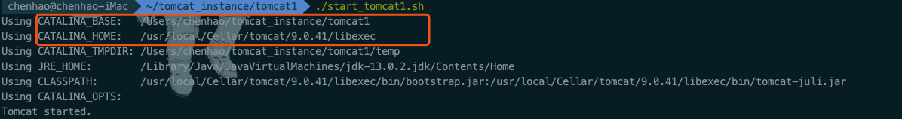](http://cdn.lidol.top/lidol_blog/20201218082216.png)

[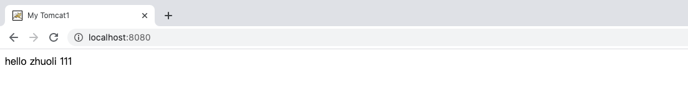](http://cdn.lidol.top/lidol_blog/20201218082338.png)

[](http://cdn.lidol.top/lidol_blog/20201218082411.png)

#### 2.2.3 Tomcat虚拟目录

上面的例子，我们都是将运行的应用直接放在CATALINA_BASE的webapps目录下，那有没有什么办法让我们把应用放在其它地方，但是依然可以通过Tomcat访问我们的应用，答案就是使用Tomcat虚拟目录。

比如我们在桌面上创建一个myapp1文件夹，文件夹下放一个jsp文件index.jsp。

```
<%@ page contentType="text/html;charset=UTF-8" language="java" %>
<html>
  <head>
    <title>My Tomcat1</title>
  </head>
  <body>
  hello zhuoli virtual index
  </body>
</html>
```

然后我们在我们的CATALINA_BASE/conf/Catalina/localhost文件夹下创建一个xml文件ROOT.xml。

```
<?xml version="1.0" encoding="UTF-8"?>
<Context docBase="/Users/chenhao/Desktop/myapp1"/>
```

然后通过start_tomcat.sh脚本启动tomcat，之后访问”http://localhost:8080/”

[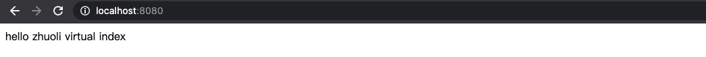](http://cdn.lidol.top/lidol_blog/20201218223100.png)

可以发现这里项目的默认访问的页面不是/CATALINA_BASE/webapps/ROOT/index.jsp了，而是这里ROOT.xml中配置的”/Users/chenhao/Desktop/myapp1/index.jsp”。也就是说我们的虚拟目录配置生效了（所以Tomcat虚拟目录的作用其实是允许tomcat实例访问非webapps目录下的应用）。

如果我们在桌面上再起一个应用myapp2，文件夹下放一个jsp文件index.jsp

```
<%@ page contentType="text/html;charset=UTF-8" language="java" %>
<html>
  <head>
    <title>My Tomcat1</title>
  </head>
  <body>
  hello zhuoli virtual index 111
  </body>
</html>
```

并且我们希望可以通过”http://localhost:8080/myapp2″访问到它，那么虚拟目录该如何配置？我们可以在CATALINA_BASE/conf/Catalina/localhost文件夹下再创建一个xml文件myapp2.xml。

```
<?xml version="1.0" encoding="UTF-8"?>
<Context docBase="/Users/chenhao/Desktop/myapp2"/>
```

[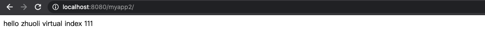](http://cdn.lidol.top/lidol_blog/20201218224047.png)

关于Tomcat虚拟目录，需要注意以下几点：

- /conf/Catalina/localhost目录可以配置多个虚拟目录
- /conf/Catalina/localhost配置了ROOT.xml，将覆盖server.xml Host节点配置的默认目录 /webapps/ROOT
- /conf/Catalina/localhost文件夹下的配置文件 **.xml，中Context配置path = “abc”无效，默认为空
- /conf/Catalina/localhost文件夹下的配置文件 **.xml文件名即为uri路径，如果为多级路径，文件名使用#隔开，比如我们xml文件的名字为myapp1#myapp2.xml，那么我们配置的应用对应的uri为”\myap1\myapp2\**”

## 3. Idea部署Spring MVC应用原理

搞清楚本地的Tomcat如何启动的之后，我们来看一下Idea是如何将Spring MVC应用部署到Tomcat容器的。

### 3.1 Idea Project Structure

我们首先来看一下Idea的Project Structure，这个设置跟我们的最终的应用部署密切相关。

[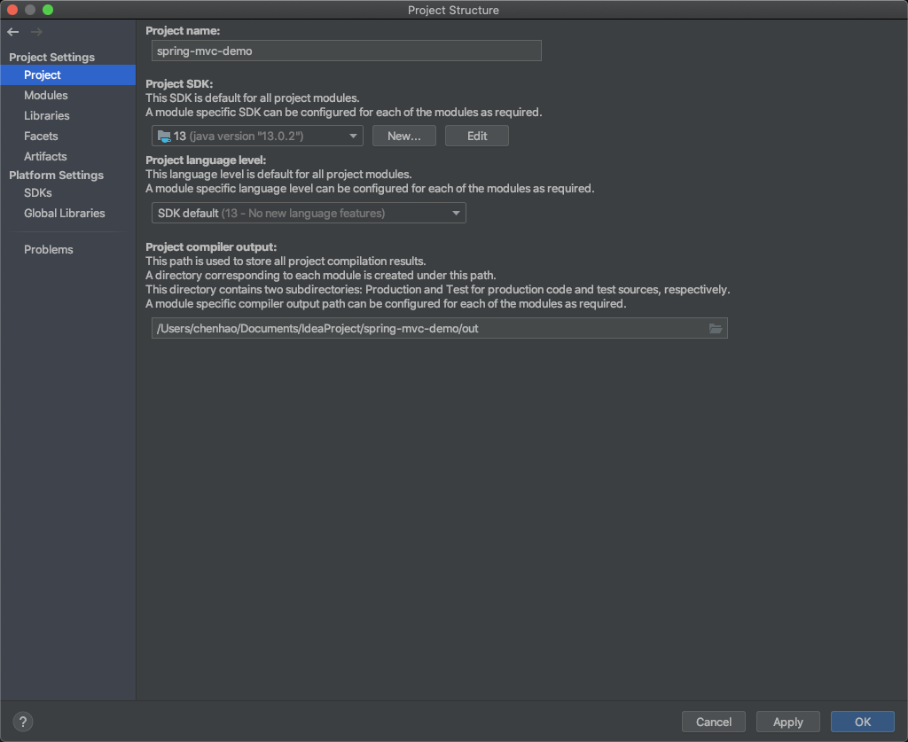](http://cdn.lidol.top/lidol_blog/20201218224951.png)

我们来简单过一下Project Structure的这些配置。

#### 3.1.1 Project

[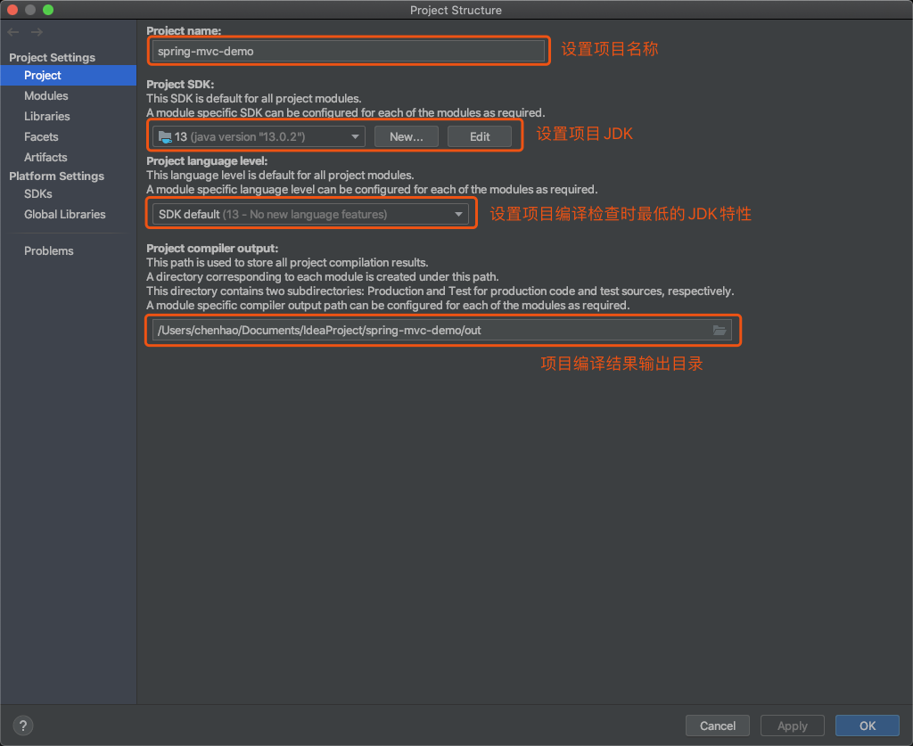](http://cdn.lidol.top/lidol_blog/20201218225711.png)

这里的编译输出目录就是我们的web应用编译后的输出，比如上面的示例，编译后输出的结果如下：

[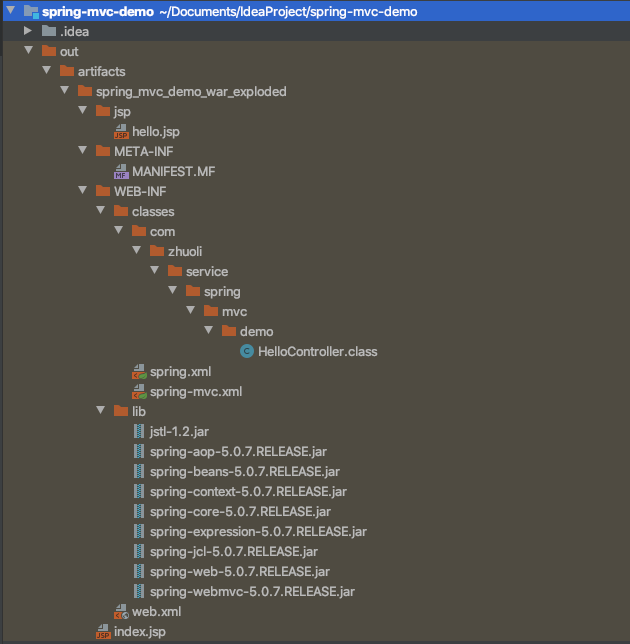](http://cdn.lidol.top/lidol_blog/20201218230151.png)

#### 3.1.1.2 Modules

[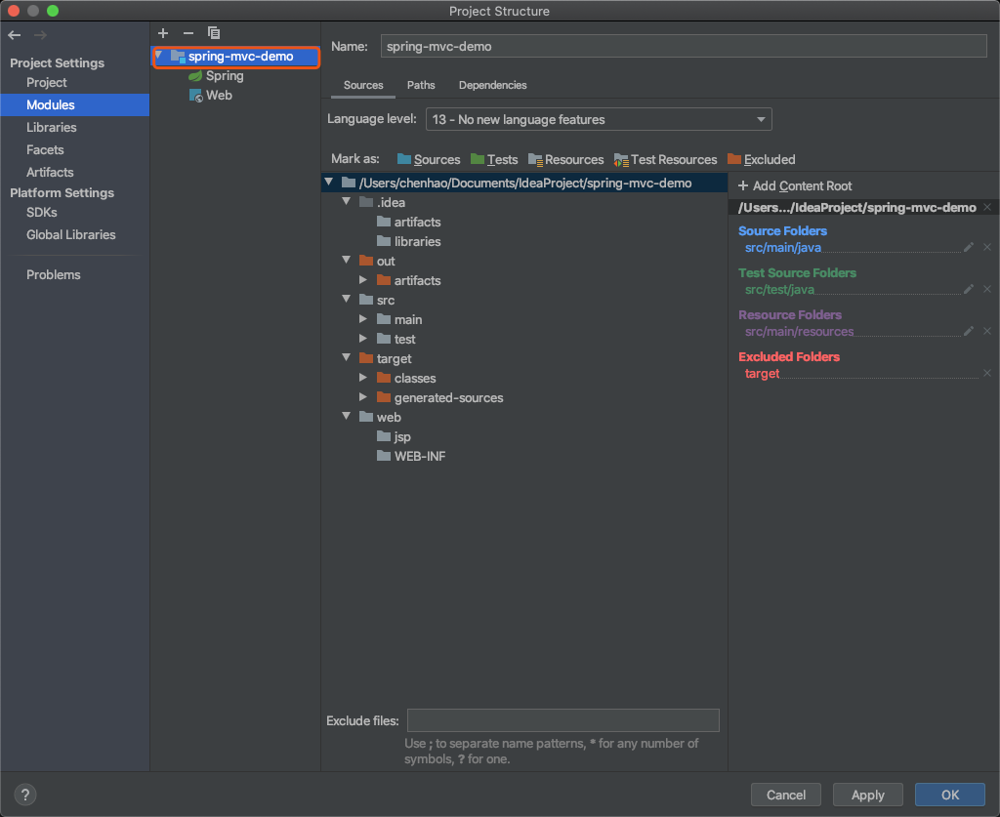](http://cdn.lidol.top/lidol_blog/20201218230413.png)

Modules主要是为了我们方便管理项目的Module，上面的示例只有一个Module，如果我们的项目内部做了分层，比如Dao层一个Module，Service层一个Module，Controller层一个Module，这里就会出现多个目录。

一般Modules这里，保持默认设置即可。另外我们还可以选定某个Module，查看Module的配置信息，主要包括Sources、Paths、Dependencies三项。

[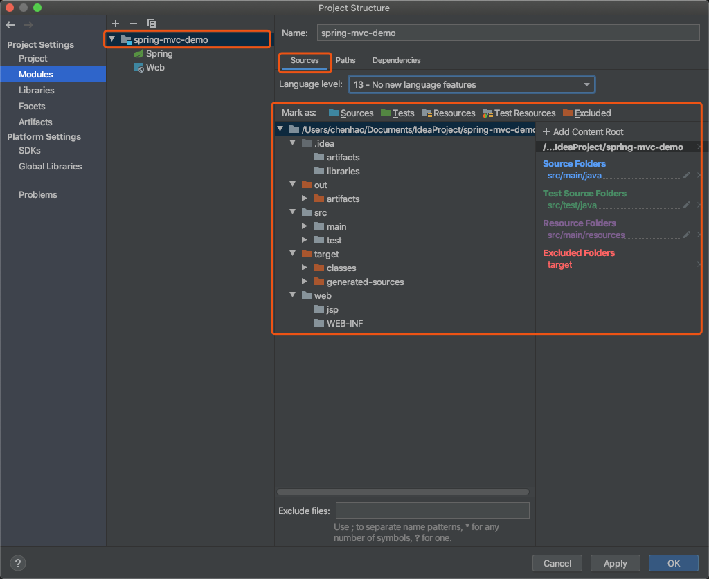](http://cdn.lidol.top/lidol_blog/20201219095933.png)

Sources配置主要用于显示项目的目录资源，不同颜色代表不同的类型。

[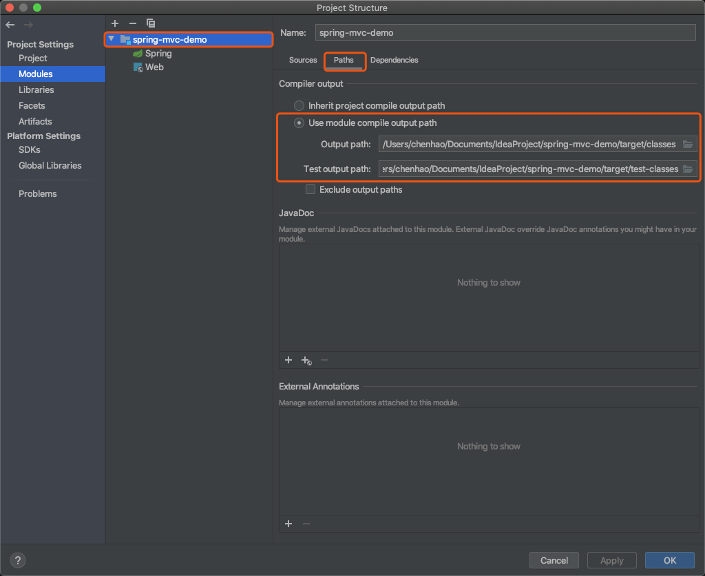](http://cdn.lidol.top/lidol_blog/20201219100104.png)

Paths配置主要用于设置Module的编译输出目录，**这里的编译输出目录仅表示该Module的java文件的编译输出目录，跟上面3.1.1节Project的Project compiler output不同**，Project compiler output设置的是整个应用的编译输出目录，不仅仅是java文件编译后对应的classes，还有一些web资源，项目依赖的lib。

[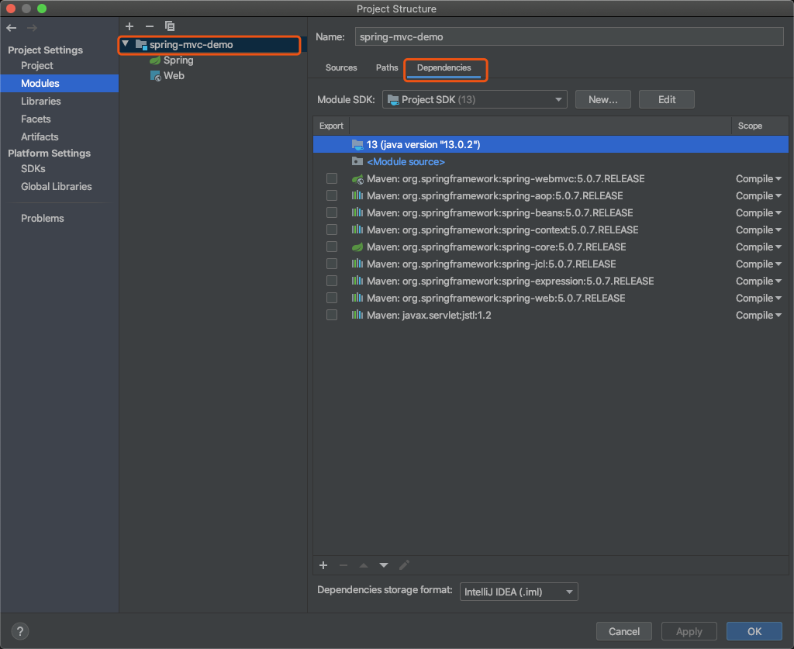](http://cdn.lidol.top/lidol_blog/20201219100521.png)

Dependencies主要用于展示项目的依赖信息。

选中某个Module，在该模块同时会展示该Module中使用的框架信息。当我们选中Module下的Web框架时，可以展示Module下Web框架的一些配置信息。

[](http://cdn.lidol.top/lidol_blog/20201219100912.png)

可以看到这里显示了我们的Web资源的配置目录。

#### 3.1.1.3 Libraries

[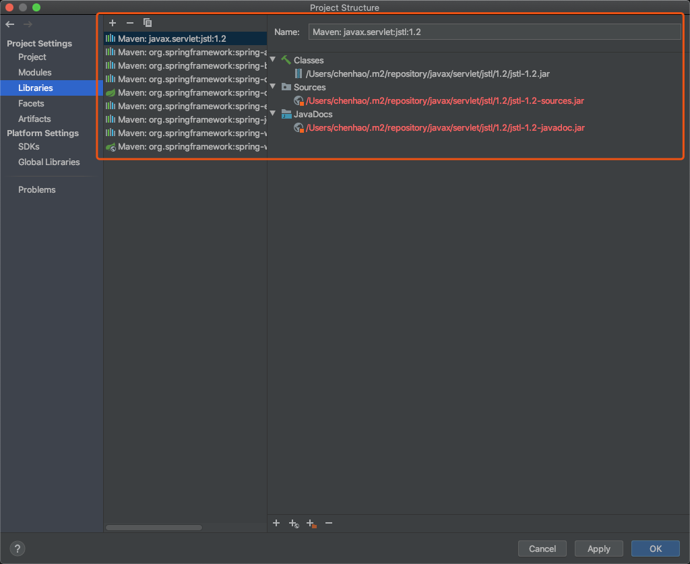](http://cdn.lidol.top/lidol_blog/20201218230854.png)

这里主要用来展示和管理项目所以来的jar包，也可以对jar进行分组。

#### 3.1.1.4 Facets

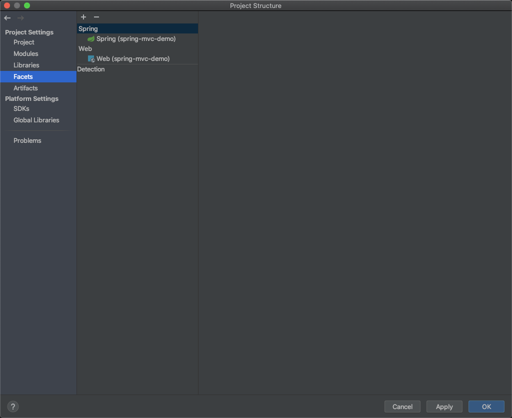

Facets，主要适用于展示一些项目中用到的框架的配置信息，官方的解释是：

> When you select a framework (a facet) in the element selector pane, the settings for the framework are shown in the right-hand part of the dialog. (当你在左边选择面板点击某个技术框架，右边将会显示这个框架的一些设置)

#### 3.1.1.5 Artifacts

[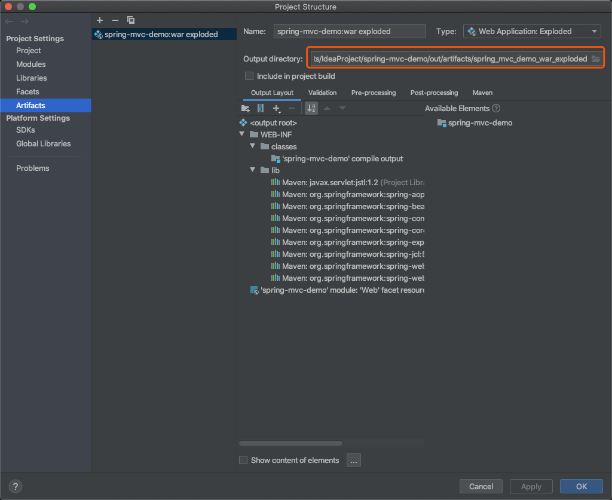](http://cdn.lidol.top/lidol_blog/20201218231353.png)

官方给出的说明是：

> An artifact is an assembly of your project assets that you put together to test, deploy or distribute your software solution or its part. Examples are a collection of compiled Java classes or a Java application packaged in a Java archive, a Web application as a directory structure or a Web application archive, etc.
> (Artifact是编译后的Java类，Web资源等的整合，用以测试、部署等工作。再白话一点，就是说某个Module要如何打包，例如war exploded、war、jar、ear等等打包形式。某个Module有了Artifact就可以部署到应用服务器中了。

这里我们需要关注一下Output directory，我们的测试应用值为：

```
/Users/chenhao/Documents/IdeaProject/spring-mvc-demo/out/artifacts/spring_mvc_demo_war_exploded
```

这个目录就是我们要部署到Tomcat容器的web应用目录。

### 3.2 Idea启动Tomcat容器

我们点击启动配置好的web应用，可以看到如下启动日志：

[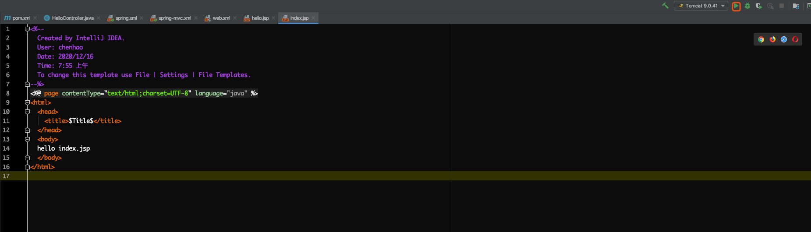](http://cdn.lidol.top/lidol_blog/20201219101321.png)

[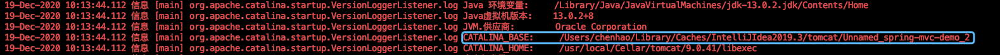](http://cdn.lidol.top/lidol_blog/20201219101439.png)

这里我们看到了熟悉的CATALINA_BASE和CATALINA_HOME，其中CATALINA_HOME就是我们在配置1.3节中指定的（也是我们本机Tomcat的安装目录）。但是CATALINA_BASE是一个陌生的地址，那么会不会跟我们上面介绍的Tomcat本地运行多实例一样，Idea帮我们生成了一个实例，我们到CATALINA_BASE目录下去一探究竟：

[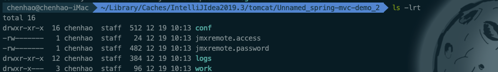](http://cdn.lidol.top/lidol_blog/20201219101831.png)

只有conf、logs和work文件夹，这确实就是一个基于我们指定的CATALINA_BASE创建的一个Tomcat实例。但是可以发现，并没有webapps文件夹，那么我们的web应用时如何运行的，根据我们上面的介绍，毋庸置疑肯定是通过虚拟目录配置的。我们到CATALINA_BASE/conf/Catalina/localhost目录下去看以下配置文件，可以发现该文件夹下有一个ROOT.xml配置文件：

```
<Context path="" docBase="/Users/chenhao/Documents/IdeaProject/spring-mvc-demo/out/artifacts/spring_mvc_demo_war_exploded" />
```

docBase指定的就是我们上面Artifacts指定的Output directory，也就是我们的Web应用输出目录。

到这里我们可以明白，**Idea是如何部署我们的Spring MVC应用的了，就是通过Tomcat多实例和虚拟目录实现的**，当我们点击运行Tomcat容器后：

- 创建Artifacts中指定的Web输出目录
- 将web资源的根目录（3.1.1.2 Modules，选中Web框架时可以设置）下的所有文件（jsp、WEB-INF等）拷贝到Artifacts指定的Web输出目录下
- 将项目编译输出目录下的classes目录（3.1.1.2 Modules，选中Module，Paths配置中可设置）拷贝到Artifacts指定的Web输出目录下的WEB-INF下
- 将项目依赖的Libraries（3.1.1.3 Libraries节）拷贝到Artifacts指定的Web输出目录下的WEB-INF下

这样我们的Web应用的输出目录就配置好了，接下来就是创建Tomcat实例，并通过虚拟目录配置到我们的应用，这样就完成部署了。

其实我们生产上开发，很少有使用上述介绍的部署方法。一般我们会使用开箱即用的Spring Boot开发应用，并通过运维提供的自动化部署工具来部署应用。因为Spring Boot应用嵌入了Tomcat容器，所以部署时也不用像Spring MVC这样，关心应用如何跟外部的Tomcat容器做交互，如何启动应用。但正确理解Spring MVC应用是如何启动的，对于我们接下来介绍Spring MVC源码，也是有帮助的，同时也能更好地帮助我们理解Tomcat。

> 参考链接：
>
> \1. [IntelliJ IDEA解决项目部署到Tomcat运行时提示jar包找不到问题](https://blog.csdn.net/pan_junbiao/article/details/104396959)
>
> \2. [理解 IntelliJ IDEA 的项目配置和Web部署](https://www.cnblogs.com/deng-cc/p/6416332.html)
>
> \3. [Intellij idea 的tomcat原理讲解](https://blog.csdn.net/qq_22627687/article/details/76555886?utm_medium=distribute.pc_relevant.none-task-blog-BlogCommendFromMachineLearnPai2-1.control)