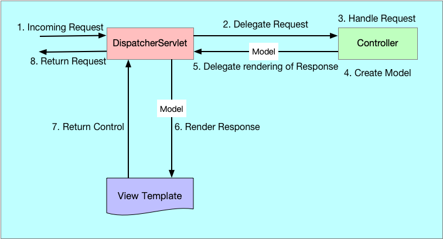
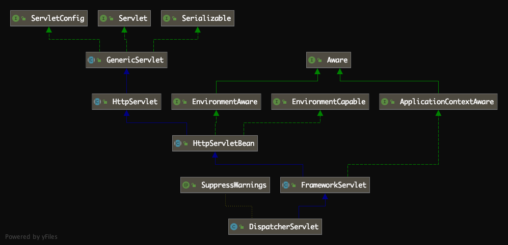
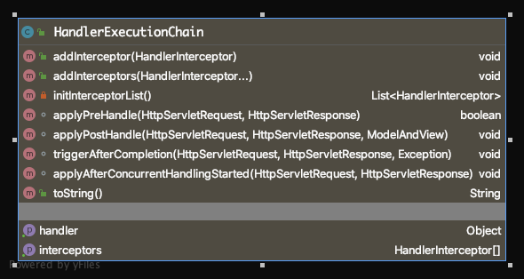
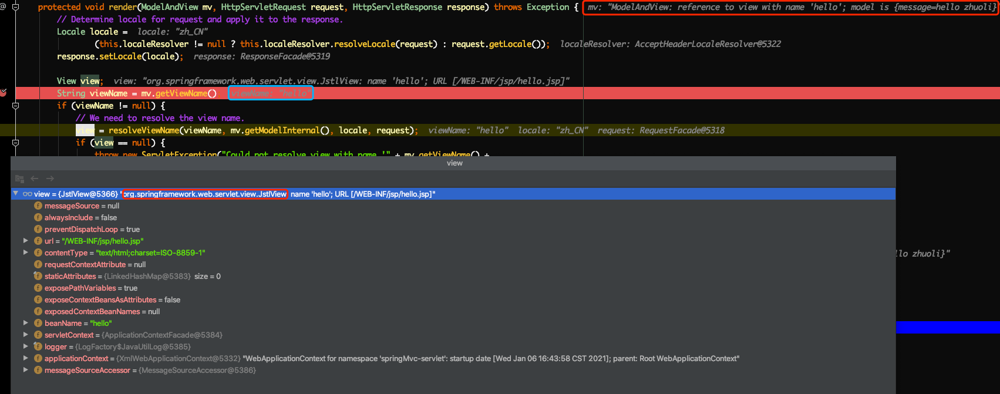
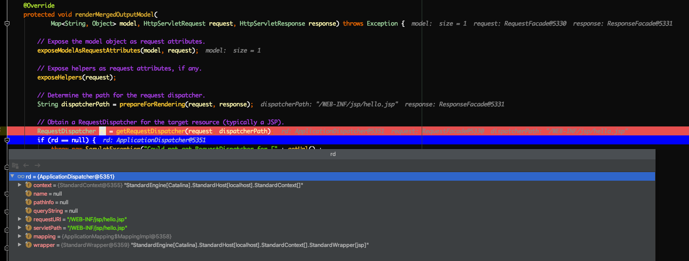

# [Spring MVC源码解读『Spring MVC DispatcherServlet如何处理web请求』](http://lidol.top/frame/3280/)

2020-12-21 分类：[Spring MVC源码](http://lidol.top/category/frame/sprinmvc_sc/) / [框架](http://lidol.top/category/frame/) 阅读(835) 评论(0)

上篇文章，我们介绍了Spring MVC的启动流程，介绍了一些Spring MVC的组件的启动过程。本篇文章我们就来看一下Spring MVC是如何通过这些组件来响应前端的请求的。

使用过Spring MVC开发过Java Web的同学应该都听说过一句话，**Spring MVC的本质其实就是Servlet**。经过之前对Tomcat和前几篇Spring MVC的介绍，相信我们都能理解这句话的意思了。这里说的Servlet其实就是指DispatcherServlet，Tomcat容器将所有请求打到DispatcherServlet，在DispatcherServlet的处理方法中，调用指定的Controller处理Web请求。

[](http://cdn.lidol.top/lidol_blog/spring_mvc_process.png)

1. Tomcat服务器接收到前端请求，经过Tomcat内部各个组件被转发到，被DispatcherServlet
2. DispatcherServlet将请求委派给合适的处理器Controller
3. Controller内部完成请求的数据模型的创建和业务逻辑的处理，然后再将填充了数据后的模型即model交还给DispatcherServlet，委派DispatcherServlet来渲染响应
4. DispatcherServlet将这些数据和适当的数据模版视图结合，向Response输出响应

## 1. DispatcherServlet入口

DispatcherServlet本质上也是一个Servlet，DispatcherServlet继承关系如下图所示：

[](http://cdn.lidol.top/lidol_blog/DispatcherServlet_clazz.png)

DispatcherServlet间接实现了抽象类HttpServlet，按照我们之前文章[透过现象看本质——什么是servlet](http://lidol.top/java/2930/)的介绍，DispatcherServlet的入口应该就在HttpServlet的service方法，子类中只要实现HttpServlet的抽象方法doGet、doPost、do**方法，就可以对外提供服务了。

其实DispatcherServlet为了支持PATCH请求，重写了HttpServlet的service方法，如下：

```
/**
 * Override the parent class implementation in order to intercept PATCH requests.
 */
@Override
protected void service(HttpServletRequest request, HttpServletResponse response)
        throws ServletException, IOException {

    HttpMethod httpMethod = HttpMethod.resolve(request.getMethod());
    if (httpMethod == HttpMethod.PATCH || httpMethod == null) {
        processRequest(request, response);
    }
    else {
        super.service(request, response);
    }
}
```

所以其实除了PATCH请求，其余类型的请求还跟还是通过子类重写的do**方法处理的。下面来看一下FrameworkServlet中重写的do**方法：

```
@Override
protected final void doGet(HttpServletRequest request, HttpServletResponse response)
        throws ServletException, IOException {

    processRequest(request, response);
}

@Override
protected final void doPost(HttpServletRequest request, HttpServletResponse response)
        throws ServletException, IOException {

    processRequest(request, response);
}

@Override
protected final void doPut(HttpServletRequest request, HttpServletResponse response)
        throws ServletException, IOException {

    processRequest(request, response);
}

@Override
protected final void doDelete(HttpServletRequest request, HttpServletResponse response)
        throws ServletException, IOException {

    processRequest(request, response);
}
```

可以看到，最终都是通过processRequest方法处理的。

```
protected final void processRequest(HttpServletRequest request, HttpServletResponse response)
        throws ServletException, IOException {

    long startTime = System.currentTimeMillis();
    Throwable failureCause = null;

    LocaleContext previousLocaleContext = LocaleContextHolder.getLocaleContext();
    LocaleContext localeContext = buildLocaleContext(request);

    RequestAttributes previousAttributes = RequestContextHolder.getRequestAttributes();
    ServletRequestAttributes requestAttributes = buildRequestAttributes(request, response, previousAttributes);

    WebAsyncManager asyncManager = WebAsyncUtils.getAsyncManager(request);
    asyncManager.registerCallableInterceptor(FrameworkServlet.class.getName(), new RequestBindingInterceptor());

    initContextHolders(request, localeContext, requestAttributes);

    try {
        // doService方法，处理请求
        doService(request, response);
    }
    catch (ServletException | IOException ex) {
        failureCause = ex;
        throw ex;
    }
    catch (Throwable ex) {
        failureCause = ex;
        throw new NestedServletException("Request processing failed", ex);
    }

    finally {
        resetContextHolders(request, previousLocaleContext, previousAttributes);
        if (requestAttributes != null) {
            requestAttributes.requestCompleted();
        }

        if (logger.isDebugEnabled()) {
            if (failureCause != null) {
                this.logger.debug("Could not complete request", failureCause);
            }
            else {
                if (asyncManager.isConcurrentHandlingStarted()) {
                    logger.debug("Leaving response open for concurrent processing");
                }
                else {
                    this.logger.debug("Successfully completed request");
                }
            }
        }

        publishRequestHandledEvent(request, response, startTime, failureCause);
    }
}
```

可以看出，processRequest方法的核心就是调用doService方法，处理请求。doService方法定义在FrameworkServlet中，是个抽象方法：

```
protected abstract void doService(HttpServletRequest request, HttpServletResponse response)
        throws Exception;
```

DispatcherServlet中实现了该方法。

```
@Override
protected void doService(HttpServletRequest request, HttpServletResponse response) throws Exception {
    if (logger.isDebugEnabled()) {
        String resumed = WebAsyncUtils.getAsyncManager(request).hasConcurrentResult() ? " resumed" : "";
        logger.debug("DispatcherServlet with name '" + getServletName() + "'" + resumed +
                " processing " + request.getMethod() + " request for [" + getRequestUri(request) + "]");
    }

    // Keep a snapshot of the request attributes in case of an include,
    // to be able to restore the original attributes after the include.
    Map<String, Object> attributesSnapshot = null;
    if (WebUtils.isIncludeRequest(request)) {
        attributesSnapshot = new HashMap<>();
        Enumeration<?> attrNames = request.getAttributeNames();
        while (attrNames.hasMoreElements()) {
            String attrName = (String) attrNames.nextElement();
            if (this.cleanupAfterInclude || attrName.startsWith(DEFAULT_STRATEGIES_PREFIX)) {
                attributesSnapshot.put(attrName, request.getAttribute(attrName));
            }
        }
    }

    // 将子容器和一些DispatcherServlet 成员设置到HttpServletRequest的attribute中，以便后面的流程中使用
    request.setAttribute(WEB_APPLICATION_CONTEXT_ATTRIBUTE, getWebApplicationContext());
    request.setAttribute(LOCALE_RESOLVER_ATTRIBUTE, this.localeResolver);
    request.setAttribute(THEME_RESOLVER_ATTRIBUTE, this.themeResolver);
    request.setAttribute(THEME_SOURCE_ATTRIBUTE, getThemeSource());

    if (this.flashMapManager != null) {
        FlashMap inputFlashMap = this.flashMapManager.retrieveAndUpdate(request, response);
        if (inputFlashMap != null) {
            request.setAttribute(INPUT_FLASH_MAP_ATTRIBUTE, Collections.unmodifiableMap(inputFlashMap));
        }
        request.setAttribute(OUTPUT_FLASH_MAP_ATTRIBUTE, new FlashMap());
        request.setAttribute(FLASH_MAP_MANAGER_ATTRIBUTE, this.flashMapManager);
    }

    try {
        // 请求分发，在该方法中，调用具体的Controller处理请求
        doDispatch(request, response);
    }
    finally {
        if (!WebAsyncUtils.getAsyncManager(request).isConcurrentHandlingStarted()) {
            // Restore the original attribute snapshot, in case of an include.
            if (attributesSnapshot != null) {
                restoreAttributesAfterInclude(request, attributesSnapshot);
            }
        }
    }
}
```

核心逻辑其实就是调用doDispatch方法，处理请求，这个方法也是DispatcherServlet处理外部请求的核心方法。

```
protected void doDispatch(HttpServletRequest request, HttpServletResponse response) throws Exception {
    HttpServletRequest processedRequest = request;
    HandlerExecutionChain mappedHandler = null;
    boolean multipartRequestParsed = false;

    WebAsyncManager asyncManager = WebAsyncUtils.getAsyncManager(request);

    try {
        ModelAndView mv = null;
        Exception dispatchException = null;

        try {
            processedRequest = checkMultipart(request);
            multipartRequestParsed = (processedRequest != request);

            // 1. 获取HandlerExecutionChain
            mappedHandler = getHandler(processedRequest);
            if (mappedHandler == null) {
                noHandlerFound(processedRequest, response);
                return;
            }

            // 2. 获取HandlerAdapter
            HandlerAdapter ha = getHandlerAdapter(mappedHandler.getHandler());

            // Process last-modified header, if supported by the handler.
            String method = request.getMethod();
            boolean isGet = "GET".equals(method);
            if (isGet || "HEAD".equals(method)) {
                long lastModified = ha.getLastModified(request, mappedHandler.getHandler());
                if (logger.isDebugEnabled()) {
                    logger.debug("Last-Modified value for [" + getRequestUri(request) + "] is: " + lastModified);
                }
                if (new ServletWebRequest(request, response).checkNotModified(lastModified) && isGet) {
                    return;
                }
            }

            // 3. 调用HandlerExecutionChain的applyPreHandle，用于执行Spring MVC拦截器的前置处理
            if (!mappedHandler.applyPreHandle(processedRequest, response)) {
                return;
            }

            // 4. 调用HandlerAdapter的handle方法，调用具体的Controller的method
            mv = ha.handle(processedRequest, response, mappedHandler.getHandler());

            if (asyncManager.isConcurrentHandlingStarted()) {
                return;
            }

            // 5. 对Controller方法返回的ModelAndView，设置默认视图名
            applyDefaultViewName(processedRequest, mv);

            // 6. 调用HandlerExecutionChain的applyPostHandle，用于执行Spring MVC拦截器的后置处理
            mappedHandler.applyPostHandle(processedRequest, response, mv);
        }
        catch (Exception ex) {
            dispatchException = ex;
        }
        catch (Throwable err) {
            // As of 4.3, we're processing Errors thrown from handler methods as well,
            // making them available for @ExceptionHandler methods and other scenarios.
            dispatchException = new NestedServletException("Handler dispatch failed", err);
        }

        // 7. 视图渲染
        processDispatchResult(processedRequest, response, mappedHandler, mv, dispatchException);
    }
    catch (Exception ex) {
        triggerAfterCompletion(processedRequest, response, mappedHandler, ex);
    }
    catch (Throwable err) {
        triggerAfterCompletion(processedRequest, response, mappedHandler,
                new NestedServletException("Handler processing failed", err));
    }
    finally {
        if (asyncManager.isConcurrentHandlingStarted()) {
            // Instead of postHandle and afterCompletion
            if (mappedHandler != null) {
                mappedHandler.applyAfterConcurrentHandlingStarted(processedRequest, response);
            }
        }
        else {
            // Clean up any resources used by a multipart request.
            if (multipartRequestParsed) {
                cleanupMultipart(processedRequest);
            }
        }
    }
}
```

核心流程，在上述方法中都已经标注出来，接下来我们来分析一下上述核心流程。

## 2. getHandler

org.springframework.web.servlet.DispatcherServlet#getHandler方法返回值类型为HandlerExecutionChain。

```
protected HandlerExecutionChain getHandler(HttpServletRequest request) throws Exception {
    if (this.handlerMappings != null) {
        for (HandlerMapping hm : this.handlerMappings) {
            if (logger.isTraceEnabled()) {
                logger.trace(
                        "Testing handler map [" + hm + "] in DispatcherServlet with name '" + getServletName() + "'");
            }
            HandlerExecutionChain handler = hm.getHandler(request);
            if (handler != null) {
                return handler;
            }
        }
    }
    return null;
}
```

在该方法中，其实就是遍历所有的DispatcherServlet的成员变量handlerMappings（handlerMappings的初始化上篇文章中已经介绍了），调用HandlerMapping的getHandler方法，如果任意一个HandlerMapping的getHandler方法返回了结果，就不继续往下遍历了。

HandlerMapping的getHandler方法，定义在HandlerMapping接口，实现在AbstractHandlerMapping抽象类中：

```
public final HandlerExecutionChain getHandler(HttpServletRequest request) throws Exception {
    // 1. 根据request获取Handler，如果HandlerMapping类型为RequestMappingHandlerMapping，则该方法返回值类型为HandlerMethod
    Object handler = getHandlerInternal(request);

    // 2. 如果上述方法获取不到handler，则调用getDefaultHandler方法，获取默认Handler
    if (handler == null) {
        handler = getDefaultHandler();
    }

    if (handler == null) {
        return null;
    }

    // 3. 如果返回的handler类型为String，则使用Spring容器实例化handler
    if (handler instanceof String) {
        String handlerName = (String) handler;
        handler = obtainApplicationContext().getBean(handlerName);
    }

    // 4. 查询本次请求匹配的Spring MVC拦截器，和handler一起组装生成HandlerExecutionChain
    HandlerExecutionChain executionChain = getHandlerExecutionChain(handler, request);
    if (CorsUtils.isCorsRequest(request)) {
        CorsConfiguration globalConfig = this.globalCorsConfigSource.getCorsConfiguration(request);
        CorsConfiguration handlerConfig = getCorsConfiguration(handler, request);
        CorsConfiguration config = (globalConfig != null ? globalConfig.combine(handlerConfig) : handlerConfig);
        executionChain = getCorsHandlerExecutionChain(request, executionChain, config);
    }
    return executionChain;
}
```

### 2.1 getHandlerInternal

org.springframework.web.servlet.handler.AbstractHandlerMapping#getHandlerInternal方法，是个抽象方法，由子类实现。我们上篇文章介绍Spring MVC启动过程时介绍过，DispatcherServlet的成员变量handlerMappings，第一个元素的类型为RequestMappingHandlerMapping，所以在该类中查找getHandlerInternal，发现RequestMappingHandlerMapping对该方法的实现定义在父类AbstractHandlerMethodMapping中：

```
protected HandlerMethod getHandlerInternal(HttpServletRequest request) throws Exception {
    // 1. 从request获取url
    String lookupPath = getUrlPathHelper().getLookupPathForRequest(request);
    if (logger.isDebugEnabled()) {
        logger.debug("Looking up handler method for path " + lookupPath);
    }
    this.mappingRegistry.acquireReadLock();
    try {
        // 2. 根据rul，查询匹配的HandlerMethod
        HandlerMethod handlerMethod = lookupHandlerMethod(lookupPath, request);
        if (logger.isDebugEnabled()) {
            if (handlerMethod != null) {
                logger.debug("Returning handler method [" + handlerMethod + "]");
            }
            else {
                logger.debug("Did not find handler method for [" + lookupPath + "]");
            }
        }
        return (handlerMethod != null ? handlerMethod.createWithResolvedBean() : null);
    }
    finally {
        this.mappingRegistry.releaseReadLock();
    }
}
```

可以看到getHandlerInternal方法返回值类型为HandlerMethod，对应于Controller中的某一个方法。上篇文章中也介绍过，在AbstractHandlerMethodMapping中有一个MappingRegistry类型的成员mappingRegistry，统一管理URL和HandlerMethod的映射关系，lookupHandlerMethod就是根据URL从mappingRegistry中匹配HandlerMethod。

```
protected HandlerMethod lookupHandlerMethod(String lookupPath, HttpServletRequest request) throws Exception {
    List<Match> matches = new ArrayList<>();
    // 1. 根据URL，从mappingRegistry获取匹配到的RequestMappingInfo
    List<T> directPathMatches = this.mappingRegistry.getMappingsByUrl(lookupPath);
    if (directPathMatches != null) {
        addMatchingMappings(directPathMatches, matches, request);
    }
    if (matches.isEmpty()) {
        // No choice but to go through all mappings...
        addMatchingMappings(this.mappingRegistry.getMappings().keySet(), matches, request);
    }

    // 2. 对匹配项进行排序，寻找最匹配的HandlerMethod
    if (!matches.isEmpty()) {
        Comparator<Match> comparator = new MatchComparator(getMappingComparator(request));
        matches.sort(comparator);
        if (logger.isTraceEnabled()) {
            logger.trace("Found " + matches.size() + " matching mapping(s) for [" + lookupPath + "] : " + matches);
        }
        Match bestMatch = matches.get(0);
        if (matches.size() > 1) {
            if (CorsUtils.isPreFlightRequest(request)) {
                return PREFLIGHT_AMBIGUOUS_MATCH;
            }
            Match secondBestMatch = matches.get(1);
            if (comparator.compare(bestMatch, secondBestMatch) == 0) {
                Method m1 = bestMatch.handlerMethod.getMethod();
                Method m2 = secondBestMatch.handlerMethod.getMethod();
                throw new IllegalStateException("Ambiguous handler methods mapped for HTTP path '" +
                        request.getRequestURL() + "': {" + m1 + ", " + m2 + "}");
            }
        }
        handleMatch(bestMatch.mapping, lookupPath, request);
        return bestMatch.handlerMethod;
    }
    else {
        return handleNoMatch(this.mappingRegistry.getMappings().keySet(), lookupPath, request);
    }
}
```

### 2.2 HandlerExecutionChain

上述步骤，我们根据URL获取了对应处理的HandlerMethod（某个Controller的方法），getHandler方法的最终返回结果HandlerExecutionChain，通过调用getHandlerExecutionChain方法获取。

```
protected HandlerExecutionChain getHandlerExecutionChain(Object handler, HttpServletRequest request) {
    // 1. 初始化HandlerExecutionChain
    HandlerExecutionChain chain = (handler instanceof HandlerExecutionChain ?
            (HandlerExecutionChain) handler : new HandlerExecutionChain(handler));

    // 2. 为当前请求对应的HandlerExecutionChain，添加HandlerInterceptor
    String lookupPath = this.urlPathHelper.getLookupPathForRequest(request);
    for (HandlerInterceptor interceptor : this.adaptedInterceptors) {
        if (interceptor instanceof MappedInterceptor) {
            MappedInterceptor mappedInterceptor = (MappedInterceptor) interceptor;
            if (mappedInterceptor.matches(lookupPath, this.pathMatcher)) {
                chain.addInterceptor(mappedInterceptor.getInterceptor());
            }
        }
        else {
            chain.addInterceptor(interceptor);
        }
    }
    return chain;
}
```

所以其实不难发现，HandlerExecutionChain其实就是Handler(HandlerMethod)和Interceptor的组合。

[](http://cdn.lidol.top/lidol_blog/HandlerExecutionChain.png)

所以获取到HandlerExecutionChain，也就意味着当前请求已经定位到一个Controller对应的Method，并且该请求需要应用的拦截器也已经确定了。

其中拦截器可以在Controller的Method执行前后，做一些前置和后置操作，类似于AOP的环绕通知。

## 3. HandlerAdapter

接下来，我们继续来看DispatcherServlet类的doDispatch方法中获取HandlerAdapter的逻辑，getHandlerAdapter方法。

上篇文章介绍过，HandlerAdapter其实就是用于维护一些参数解析器以及返回值解析器。

```
protected HandlerAdapter getHandlerAdapter(Object handler) throws ServletException {
    // 遍历handlerAdapters，返回支持当前HandlerMethod的HandlerAdapter
    if (this.handlerAdapters != null) {
        for (HandlerAdapter ha : this.handlerAdapters) {
            if (logger.isTraceEnabled()) {
                logger.trace("Testing handler adapter [" + ha + "]");
            }
            if (ha.supports(handler)) {
                return ha;
            }
        }
    }
    throw new ServletException("No adapter for handler [" + handler +
            "]: The DispatcherServlet configuration needs to include a HandlerAdapter that supports this handler");
}
```

getHandlerAdapter方法逻辑也比较简单，就是遍历DispatcherServlet的成员变量，返回支持当前HandlerMethod的HandlerAdapter。

DispatcherServlet成员变量handlerAdapters的初始化，上篇文章已经介绍过。我们知道，handlerAdapters第一个元素类型为RequestMappingHandlerAdapter，我们来继续跟进看一下RequestMappingHandlerAdapter的supports方法：

```
public final boolean supports(Object handler) {
    return (handler instanceof HandlerMethod && supportsInternal((HandlerMethod) handler));
}

@Override
protected boolean supportsInternal(HandlerMethod handlerMethod) {
    return true;
}
```

所以这里getHandlerAdapter方法，会返回一个RequestMappingHandlerAdapter类型的对象。

## 4. HandlerExecutionChain，拦截器处理

上面说过HandlerExecutionChain是HandlerMethod和HandlerInterceptor的集合。HandlerInterceptor接口定义如下：

```
public interface HandlerInterceptor {

    default boolean preHandle(HttpServletRequest request, HttpServletResponse response, Object handler)
            throws Exception {

        return true;
    }

    default void postHandle(HttpServletRequest request, HttpServletResponse response, Object handler,
            @Nullable ModelAndView modelAndView) throws Exception {
    }

    default void afterCompletion(HttpServletRequest request, HttpServletResponse response, Object handler,
            @Nullable Exception ex) throws Exception {
    }

}
```

- preHandle：在HandlerMethod对应的方法执行前调用，前置拦截
- postHandle：在HandlerMethod对应的方法执行后，视图渲染前拦截调用
- afterCompletion：请求处理完成，视图渲染后调用

所以HandlerExecutionChain一个重要的功能就是执行拦截器的逻辑，HandlerExecutionChain中定义了三个跟拦截器执行相关的方法：

- applyPreHandle：执行当前请求所有拦截器preHandle拦截方法，如果任何一个拦截器返回false，表示当前请求被拦截，后面的拦截器就不用继续执行了（当前请求到此结束）
- applyPostHandle：执行当前请求所有拦截器的postHandle方法
- triggerAfterCompletion：执行当前请求所有拦截器的afterCompletion方法

```
boolean applyPreHandle(HttpServletRequest request, HttpServletResponse response) throws Exception {
    HandlerInterceptor[] interceptors = getInterceptors();
    if (!ObjectUtils.isEmpty(interceptors)) {
        for (int i = 0; i < interceptors.length; i++) {
            // 遍历interceptors，执行每一个HandlerInterceptor的preHandle方法，
            // 如果返回true，执行下一个拦截器的拦截逻辑。如果返回false，当前请求被拦截，返回false，当前请求就不会继续被处理了
            HandlerInterceptor interceptor = interceptors[i];
            if (!interceptor.preHandle(request, response, this.handler)) {
                triggerAfterCompletion(request, response, null);
                return false;
            }
            this.interceptorIndex = i;
        }
    }
    return true;
}
void applyPostHandle(HttpServletRequest request, HttpServletResponse response, @Nullable ModelAndView mv)
        throws Exception {

    HandlerInterceptor[] interceptors = getInterceptors();
    if (!ObjectUtils.isEmpty(interceptors)) {
        // 遍历所有拦截器，执行postHandle方法
        for (int i = interceptors.length - 1; i >= 0; i--) {
            HandlerInterceptor interceptor = interceptors[i];
            interceptor.postHandle(request, response, this.handler, mv);
        }
    }
}
void triggerAfterCompletion(HttpServletRequest request, HttpServletResponse response, @Nullable Exception ex)
        throws Exception {

    HandlerInterceptor[] interceptors = getInterceptors();
    if (!ObjectUtils.isEmpty(interceptors)) {
        // 遍历所有拦截器，执行拦截器afterCompletion方法
        for (int i = this.interceptorIndex; i >= 0; i--) {
            HandlerInterceptor interceptor = interceptors[i];
            try {
                interceptor.afterCompletion(request, response, this.handler, ex);
            }
            catch (Throwable ex2) {
                logger.error("HandlerInterceptor.afterCompletion threw exception", ex2);
            }
        }
    }
}
```

## 5. HandlerAdapter.handle处理请求

接下来，我们来看一下Spring MVC处理请求的核心流程，就是Controller的方法是怎么被调用的，并且结果是怎么处理的。入口其实就在HandlerAdapter的handle方法。

handle方法，定义在RequestMappingHandlerAdapter的父类AbstractHandlerMethodAdapter中。如下：

```
public final ModelAndView handle(HttpServletRequest request, HttpServletResponse response, Object handler)
        throws Exception {

    return handleInternal(request, response, (HandlerMethod) handler);
}

protected abstract ModelAndView handleInternal(HttpServletRequest request,
        HttpServletResponse response, HandlerMethod handlerMethod) throws Exception;
```

handle方法内，直接调用了handleInternal方法，handleInternal方法在AbstractHandlerMethodAdapter中定义为抽象方法，子类RequestMappingHandlerAdapter实现了该方法：

```
protected ModelAndView handleInternal(HttpServletRequest request,
        HttpServletResponse response, HandlerMethod handlerMethod) throws Exception {

    ModelAndView mav;
    checkRequest(request);

    // 执行HandlerMethod
    if (this.synchronizeOnSession) {
        HttpSession session = request.getSession(false);
        if (session != null) {
            Object mutex = WebUtils.getSessionMutex(session);
            synchronized (mutex) {
                mav = invokeHandlerMethod(request, response, handlerMethod);
            }
        }
        else {
            // No HttpSession available -> no mutex necessary
            mav = invokeHandlerMethod(request, response, handlerMethod);
        }
    }
    else {
        // No synchronization on session demanded at all...
        mav = invokeHandlerMethod(request, response, handlerMethod);
    }

    if (!response.containsHeader(HEADER_CACHE_CONTROL)) {
        if (getSessionAttributesHandler(handlerMethod).hasSessionAttributes()) {
            applyCacheSeconds(response, this.cacheSecondsForSessionAttributeHandlers);
        }
        else {
            prepareResponse(response);
        }
    }

    return mav;
}
```

可以确定，handleInternal方法，调用了invokeHandlerMethod方法来执行HandlerMethod。

```
protected ModelAndView invokeHandlerMethod(HttpServletRequest request,
        HttpServletResponse response, HandlerMethod handlerMethod) throws Exception {

    ServletWebRequest webRequest = new ServletWebRequest(request, response);
    try {
        WebDataBinderFactory binderFactory = getDataBinderFactory(handlerMethod);
        ModelFactory modelFactory = getModelFactory(handlerMethod, binderFactory);

        // 1. 基于HandlerMethod，包装ServletInvocableHandlerMethod，
        // 包含了HandlerMethod、ArgumentResolver、ReturnValueHandler、DataBinderFactory等
        ServletInvocableHandlerMethod invocableMethod = createInvocableHandlerMethod(handlerMethod);
        if (this.argumentResolvers != null) {
            invocableMethod.setHandlerMethodArgumentResolvers(this.argumentResolvers);
        }
        if (this.returnValueHandlers != null) {
            invocableMethod.setHandlerMethodReturnValueHandlers(this.returnValueHandlers);
        }
        invocableMethod.setDataBinderFactory(binderFactory);
        invocableMethod.setParameterNameDiscoverer(this.parameterNameDiscoverer);

        // 2. 初始化ModelAndViewContainer
        ModelAndViewContainer mavContainer = new ModelAndViewContainer();
        mavContainer.addAllAttributes(RequestContextUtils.getInputFlashMap(request));
        modelFactory.initModel(webRequest, mavContainer, invocableMethod);
        mavContainer.setIgnoreDefaultModelOnRedirect(this.ignoreDefaultModelOnRedirect);

        // 3. 异步请求处理
        AsyncWebRequest asyncWebRequest = WebAsyncUtils.createAsyncWebRequest(request, response);
        asyncWebRequest.setTimeout(this.asyncRequestTimeout);

        WebAsyncManager asyncManager = WebAsyncUtils.getAsyncManager(request);
        asyncManager.setTaskExecutor(this.taskExecutor);
        asyncManager.setAsyncWebRequest(asyncWebRequest);
        asyncManager.registerCallableInterceptors(this.callableInterceptors);
        asyncManager.registerDeferredResultInterceptors(this.deferredResultInterceptors);

        if (asyncManager.hasConcurrentResult()) {
            Object result = asyncManager.getConcurrentResult();
            mavContainer = (ModelAndViewContainer) asyncManager.getConcurrentResultContext()[0];
            asyncManager.clearConcurrentResult();
            if (logger.isDebugEnabled()) {
                logger.debug("Found concurrent result value [" + result + "]");
            }
            invocableMethod = invocableMethod.wrapConcurrentResult(result);
        }

        // 4. 处理请求
        invocableMethod.invokeAndHandle(webRequest, mavContainer);
        if (asyncManager.isConcurrentHandlingStarted()) {
            return null;
        }

        // 5. 封装数据和视图，返回ModelAndView
        return getModelAndView(mavContainer, modelFactory, webRequest);
    }
    finally {
        webRequest.requestCompleted();
    }
}
```

继续跟一下核心流程invokeAndHandle方法：

```
public void invokeAndHandle(ServletWebRequest webRequest, ModelAndViewContainer mavContainer,
        Object... providedArgs) throws Exception {

    // 1. 执行请求
    Object returnValue = invokeForRequest(webRequest, mavContainer, providedArgs);
    setResponseStatus(webRequest);

    if (returnValue == null) {
        if (isRequestNotModified(webRequest) || getResponseStatus() != null || mavContainer.isRequestHandled()) {
            mavContainer.setRequestHandled(true);
            return;
        }
    }
    else if (StringUtils.hasText(getResponseStatusReason())) {
        mavContainer.setRequestHandled(true);
        return;
    }

    mavContainer.setRequestHandled(false);
    Assert.state(this.returnValueHandlers != null, "No return value handlers");
    try {
        // 返回值处理
        this.returnValueHandlers.handleReturnValue(
                returnValue, getReturnValueType(returnValue), mavContainer, webRequest);
    }
    catch (Exception ex) {
        if (logger.isTraceEnabled()) {
            logger.trace(getReturnValueHandlingErrorMessage("Error handling return value", returnValue), ex);
        }
        throw ex;
    }
}
public Object invokeForRequest(NativeWebRequest request, @Nullable ModelAndViewContainer mavContainer,
        Object... providedArgs) throws Exception {

    // 1. 获取方法实参列表
    Object[] args = getMethodArgumentValues(request, mavContainer, providedArgs);
    if (logger.isTraceEnabled()) {
        logger.trace("Invoking '" + ClassUtils.getQualifiedMethodName(getMethod(), getBeanType()) +
                "' with arguments " + Arrays.toString(args));
    }
    // 2. 反射Controller方法，获取方法返回值
    Object returnValue = doInvoke(args);
    if (logger.isTraceEnabled()) {
        logger.trace("Method [" + ClassUtils.getQualifiedMethodName(getMethod(), getBeanType()) +
                "] returned [" + returnValue + "]");
    }
    return returnValue;
}
```

关于获取方法的实参列表，这里就不继续跟进分析了，就是使用RequestMappingHandlerAdapter的成员变量argumentResolvers去解析。反射方法也比较简单，不详细介绍了。

invokeAndHandle方法第2步，返回值处理：

```
this.returnValueHandlers.handleReturnValue(returnValue, getReturnValueType(returnValue), mavContainer, webRequest);
```

其实也是使用RequestMappingHandlerAdapter的成员变量returnValueHandlers来处理返回值，根据返回值类型，挑选一个合适的HandlerMethodReturnValueHandler来处理返回值。

```
public void handleReturnValue(@Nullable Object returnValue, MethodParameter returnType,
        ModelAndViewContainer mavContainer, NativeWebRequest webRequest) throws Exception {

    HandlerMethodReturnValueHandler handler = selectHandler(returnValue, returnType);
    if (handler == null) {
        throw new IllegalArgumentException("Unknown return value type: " + returnType.getParameterType().getName());
    }
    handler.handleReturnValue(returnValue, returnType, mavContainer, webRequest);
}
```

invokeHandlerMethod方法最后，调用了getModelAndView，封装数据和和视图，返回ModelAndView。

```
private ModelAndView getModelAndView(ModelAndViewContainer mavContainer,
        ModelFactory modelFactory, NativeWebRequest webRequest) throws Exception {

    modelFactory.updateModel(webRequest, mavContainer);
    if (mavContainer.isRequestHandled()) {
        return null;
    }
    ModelMap model = mavContainer.getModel();
    ModelAndView mav = new ModelAndView(mavContainer.getViewName(), model, mavContainer.getStatus());
    if (!mavContainer.isViewReference()) {
        mav.setView((View) mavContainer.getView());
    }
    if (model instanceof RedirectAttributes) {
        Map<String, ?> flashAttributes = ((RedirectAttributes) model).getFlashAttributes();
        HttpServletRequest request = webRequest.getNativeRequest(HttpServletRequest.class);
        if (request != null) {
            RequestContextUtils.getOutputFlashMap(request).putAll(flashAttributes);
        }
    }
    return mav;
}
```

其中ModelMap，其实就是Controller方法的返回值，只不过通过ReturnValueHandler处理后，转化成了ModelMap，其实ModelMap就是一个Map。

## 6. processDispatchResult视图渲染

接下来看一下doDispatch方法的最后一个关键步骤，调用processDispatchResult进行视图渲染。

```
private void processDispatchResult(HttpServletRequest request, HttpServletResponse response,
        @Nullable HandlerExecutionChain mappedHandler, @Nullable ModelAndView mv,
        @Nullable Exception exception) throws Exception {

    boolean errorView = false;

    // 异常处理
    if (exception != null) {
        if (exception instanceof ModelAndViewDefiningException) {
            logger.debug("ModelAndViewDefiningException encountered", exception);
            mv = ((ModelAndViewDefiningException) exception).getModelAndView();
        }
        else {
            Object handler = (mappedHandler != null ? mappedHandler.getHandler() : null);
            mv = processHandlerException(request, response, handler, exception);
            errorView = (mv != null);
        }
    }

    if (mv != null && !mv.wasCleared()) {
        // 视图渲染
        render(mv, request, response);
        if (errorView) {
            WebUtils.clearErrorRequestAttributes(request);
        }
    }
    else {
        if (logger.isDebugEnabled()) {
            logger.debug("Null ModelAndView returned to DispatcherServlet with name '" + getServletName() +
                    "': assuming HandlerAdapter completed request handling");
        }
    }

    if (WebAsyncUtils.getAsyncManager(request).isConcurrentHandlingStarted()) {
        // Concurrent handling started during a forward
        return;
    }

    // 视图渲染后，执行拦截器的afterCompletion方法
    if (mappedHandler != null) {
        mappedHandler.triggerAfterCompletion(request, response, null);
    }
}
protected void render(ModelAndView mv, HttpServletRequest request, HttpServletResponse response) throws Exception {
    // Determine locale for request and apply it to the response.
    Locale locale =
            (this.localeResolver != null ? this.localeResolver.resolveLocale(request) : request.getLocale());
    response.setLocale(locale);

    // 1. 构建View
    View view;
    String viewName = mv.getViewName();
    if (viewName != null) {
        // We need to resolve the view name.
        view = resolveViewName(viewName, mv.getModelInternal(), locale, request);
        if (view == null) {
            throw new ServletException("Could not resolve view with name '" + mv.getViewName() +
                    "' in servlet with name '" + getServletName() + "'");
        }
    }
    else {
        // No need to lookup: the ModelAndView object contains the actual View object.
        view = mv.getView();
        if (view == null) {
            throw new ServletException("ModelAndView [" + mv + "] neither contains a view name nor a " +
                    "View object in servlet with name '" + getServletName() + "'");
        }
    }

    // Delegate to the View object for rendering.
    if (logger.isDebugEnabled()) {
        logger.debug("Rendering view [" + view + "] in DispatcherServlet with name '" + getServletName() + "'");
    }
    try {
        if (mv.getStatus() != null) {
            response.setStatus(mv.getStatus().value());
        }
        // 2. 调用View的render方法渲染视图
        view.render(mv.getModelInternal(), request, response);
    }
    catch (Exception ex) {
        if (logger.isDebugEnabled()) {
            logger.debug("Error rendering view [" + view + "] in DispatcherServlet with name '" +
                    getServletName() + "'", ex);
        }
        throw ex;
    }
}
```

[](http://cdn.lidol.top/lidol_blog/20210106164635.png)

可以看出，这里根据ModelAndView构建出一个View对象，类型为JstlView。所以接下来继续看一下JstlView的render方法。该方法定义在父类AbstractView中：

```
public void render(@Nullable Map<String, ?> model, HttpServletRequest request,
        HttpServletResponse response) throws Exception {

    if (logger.isTraceEnabled()) {
        logger.trace("Rendering view with name '" + this.beanName + "' with model " + model +
            " and static attributes " + this.staticAttributes);
    }

    // 组装数据
    Map<String, Object> mergedModel = createMergedOutputModel(model, request, response);
    prepareResponse(request, response);
    // 渲染输出
    renderMergedOutputModel(mergedModel, getRequestToExpose(request), response);
}
```

renderMergedOutputModel方法也定义在JstlView的父类，InternalResourceView。

```
protected void renderMergedOutputModel(
        Map<String, Object> model, HttpServletRequest request, HttpServletResponse response) throws Exception {

    // 将返回值，设置为Request的attribute
    exposeModelAsRequestAttributes(model, request);

    // Expose helpers as request attributes, if any.
    exposeHelpers(request);

    // 获取跳转的路径
    String dispatcherPath = prepareForRendering(request, response);

    // Obtain a RequestDispatcher for the target resource (typically a JSP).
    RequestDispatcher rd = getRequestDispatcher(request, dispatcherPath);
    if (rd == null) {
        throw new ServletException("Could not get RequestDispatcher for [" + getUrl() +
                "]: Check that the corresponding file exists within your web application archive!");
    }

    // If already included or response already committed, perform include, else forward.
    if (useInclude(request, response)) {
        response.setContentType(getContentType());
        if (logger.isDebugEnabled()) {
            logger.debug("Including resource [" + getUrl() + "] in InternalResourceView '" + getBeanName() + "'");
        }
        rd.include(request, response);
    }

    else {
        // Note: The forwarded resource is supposed to determine the content type itself.
        if (logger.isDebugEnabled()) {
            logger.debug("Forwarding to resource [" + getUrl() + "] in InternalResourceView '" + getBeanName() + "'");
        }
        // 跳转，比如到Jsp
        rd.forward(request, response);
    }
}
```

[](http://cdn.lidol.top/lidol_blog/20210106170646.png)

假如我们的目标地址是个jsp页面，其实就是跳转到另一个Servlet，Jsp对应的Servlet处理完后，就能输出Http内容了，再之后就是Tomcat容器要做的工作了。

> 参考链接：
>
> \1. SpringMVC 源码
>
> \2. [Spring MVC官方文档](https://docs.spring.io/spring-framework/docs/current/reference/html/web.html#mvc-servlet)