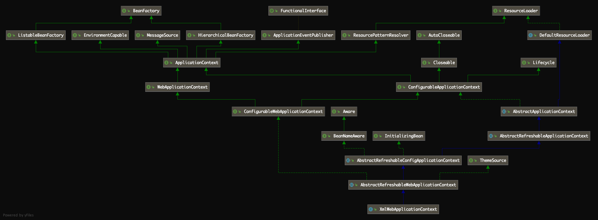
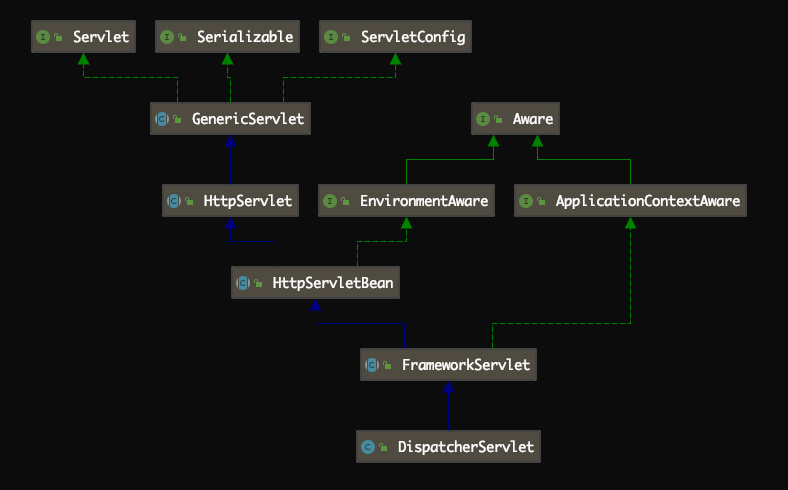

# [Spring MVC源码解读『Spring MVC启动过程』](http://lidol.top/frame/3234/)

2020-12-14 分类：[Spring MVC源码](http://lidol.top/category/frame/sprinmvc_sc/) / [框架](http://lidol.top/category/frame/) 阅读(729) 评论(0)

之前的两篇文章我们分别介绍了什么是MVC，通过Spring MVC实现了一个简单的demo，以及如何通过Idea构建并部署Spring MVC应用，相信我们都可以重新回顾起Spring MVC的相关细节。本篇文章我们就正式开始分析Spring MVC的源码。

之前的文章已经介绍过Spring的相关实现细节，其实Spring MVC也具备Spring的所有特性，比如通过Bean管理、IOC和AOP的思想跟Spring是一致的，需要熟悉的可以到[Spring源码分析](http://lidol.top/tag/spring/)系列文章提前熟悉一下。本篇文章我们就来介绍一下Spring MVC如何的启动过程。

上篇文章中，我们的web.xml配置文件中配置如下：

```
<?xml version="1.0" encoding="UTF-8"?>
<web-app xmlns="http://xmlns.jcp.org/xml/ns/javaee"
         xmlns:xsi="http://www.w3.org/2001/XMLSchema-instance"
         xsi:schemaLocation="http://xmlns.jcp.org/xml/ns/javaee http://xmlns.jcp.org/xml/ns/javaee/web-app_4_0.xsd"
         version="4.0">

    <display-name>Archetype Created Web Application</display-name>
    
    <!--指定Spring的配置文件地址-->
    <context-param>
        <param-name>contextConfigLocation</param-name>
        <param-value>classpath:spring.xml</param-value>
    </context-param>

    <!--Tomcat Context生命周期监听器-->
    <listener>
        <listener-class>org.springframework.web.context.ContextLoaderListener</listener-class>
    </listener>

    <!--配置Spring MVC 的DispatcherServlet,指定配置文件的路径,拦截所有的请求-->
    <servlet>
        <!--这个名称如果不特别指定的话，跟配置文件名称有关联。如果特别指定配置文件了，则此名称就无所谓了-->
        <servlet-name>springMvc</servlet-name>
        <servlet-class>org.springframework.web.servlet.DispatcherServlet</servlet-class>
        <init-param>
            <!--contextConfigLocation这个参数可以不配置，如果不配置的话，那么默认的value就是/WEB-INF/[servlet名字]-servlet.xml-->
            <param-name>contextConfigLocation</param-name>
            <param-value>classpath:spring-mvc.xml</param-value>
        </init-param>
        <!--表示启动容器时初始化该Servlet-->
        <load-on-startup>1</load-on-startup>
    </servlet>

    <servlet-mapping>
        <servlet-name>springMvc</servlet-name>
        <!--DispatcherServlet拦截所有的请求-->
        <url-pattern>/</url-pattern>
    </servlet-mapping>

</web-app>
```

配置文件主要实现了如下配置：

- 设置context-param的contextConfigLocation属性
- 设置Tomcat Context生命周期监听器ContextLoaderListener
- Servlet DispatcherServlet配置
- 为DispatcherServlet设置servlet-mapping

那么按照我们之前Tomcat的文章介绍，Spring MVC的启动过程肯定跟这个ContextLoaderListener有关，这是Spring MVC跟Tomcat的连接点。ContextLoaderListener实现了ServletContextListener接口，可以在Tomcat Context初始化后执行监听器内部的初始化逻辑。

```
public interface ServletContextListener extends EventListener {

    /**
     ** Notification that the web application initialization process is starting.
     * All ServletContextListeners are notified of context initialization before
     * any filter or servlet in the web application is initialized.
     * The default implementation is a NO-OP.
     * @param sce Information about the ServletContext that was initialized
     */
    public default void contextInitialized(ServletContextEvent sce) {
    }

    /**
     ** Notification that the servlet context is about to be shut down. All
     * servlets and filters have been destroyed before any
     * ServletContextListeners are notified of context destruction.
     * The default implementation is a NO-OP.
     * @param sce Information about the ServletContext that was destroyed
     */
    public default void contextDestroyed(ServletContextEvent sce) {
    }
}
```

除此之外，关于上述配置文件还有两项配置比较重要，那就是分别通过<context-param>和<servlet>的<init-param>配置的两个其它配置文件，spring.xml和spring-mvc.xml。这两个配置文件其实就是跟Spring MVC的父子容器的实现有关。关于Spring MVC的父子容器，主要过程为：

Tomcat启动时，**监听器ContextLoaderListener**创建一个XMLWebApplicationContext上下文容器，并加载<context-param>中的配置文件，完成容器的刷新后将上下文设置到ServletContext。当**DispatcherServlet创建时**，先进行初始化操作，从ServletContext中查询出ContextLoaderListener中创建的上下文对象，作为父类上下文来，并查找<servlet>的<init-param>配置的配置文件创建子上下文容器，然后完成容器的刷新。**子容器可以访问父容器中的bean，反之则不行。**

通常是将业务操作及数据库相关的bean维护在父容器中，而在子容器中只加载Controller相关的Bean。如果采用JavaEE三层架构开发代码，分为Controller、Service和DAO层，那么父容器中主要维护Service和DAO层的Bean，子容器中维护Controller相关的Bean。

## 1. ContextLoaderListener

Spring MVC的启动入口肯定在ContextLoaderListener覆盖的contextInitialized方法中。

```
@Override
public void contextInitialized(ServletContextEvent event) {
    initWebApplicationContext(event.getServletContext());
}
```

### 1.1 initWebApplicationContext

```
public WebApplicationContext initWebApplicationContext(ServletContext servletContext) {
    // 1. 获取ServletContext的ROOT_WEB_APPLICATION_CONTEXT_ATTRIBUTE属性，如果不为空，说明Spring MVC父容器已经初始化，直接抛异常
    // ROOT_WEB_APPLICATION_CONTEXT_ATTRIBUTE = "WebApplicationContext.ROOT"
    if (servletContext.getAttribute(WebApplicationContext.ROOT_WEB_APPLICATION_CONTEXT_ATTRIBUTE) != null) {
        throw new IllegalStateException(
                "Cannot initialize context because there is already a root application context present - " +
                "check whether you have multiple ContextLoader* definitions in your web.xml!");
    }

    Log logger = LogFactory.getLog(ContextLoader.class);
    servletContext.log("Initializing Spring root WebApplicationContext");
    if (logger.isInfoEnabled()) {
        logger.info("Root WebApplicationContext: initialization started");
    }
    long startTime = System.currentTimeMillis();

    try {
        // 2. 如果context（类型为WebApplicationContext）为空，创建Spring MVC父容器
        if (this.context == null) {
            this.context = createWebApplicationContext(servletContext);
        }

        // 3. 加载并刷新Spring MVC父容器，核心逻辑在configureAndRefreshWebApplicationContext
        if (this.context instanceof ConfigurableWebApplicationContext) {
            ConfigurableWebApplicationContext cwac = (ConfigurableWebApplicationContext) this.context;
            if (!cwac.isActive()) {
                // The context has not yet been refreshed -> provide services such as
                // setting the parent context, setting the application context id, etc
                if (cwac.getParent() == null) {
                    // The context instance was injected without an explicit parent ->
                    // determine parent for root web application context, if any.
                    ApplicationContext parent = loadParentContext(servletContext);
                    cwac.setParent(parent);
                }
                configureAndRefreshWebApplicationContext(cwac, servletContext);
            }
        }

        // 4. 将刷新后的Spring MVC父容器设置到servletContext
        servletContext.setAttribute(WebApplicationContext.ROOT_WEB_APPLICATION_CONTEXT_ATTRIBUTE, this.context);

        ClassLoader ccl = Thread.currentThread().getContextClassLoader();
        if (ccl == ContextLoader.class.getClassLoader()) {
            currentContext = this.context;
        }
        else if (ccl != null) {
            currentContextPerThread.put(ccl, this.context);
        }

        if (logger.isDebugEnabled()) {
            logger.debug("Published root WebApplicationContext as ServletContext attribute with name [" +
                    WebApplicationContext.ROOT_WEB_APPLICATION_CONTEXT_ATTRIBUTE + "]");
        }
        if (logger.isInfoEnabled()) {
            long elapsedTime = System.currentTimeMillis() - startTime;
            logger.info("Root WebApplicationContext: initialization completed in " + elapsedTime + " ms");
        }

        return this.context;
    }
    catch (RuntimeException ex) {
        logger.error("Context initialization failed", ex);
        servletContext.setAttribute(WebApplicationContext.ROOT_WEB_APPLICATION_CONTEXT_ATTRIBUTE, ex);
        throw ex;
    }
    catch (Error err) {
        logger.error("Context initialization failed", err);
        servletContext.setAttribute(WebApplicationContext.ROOT_WEB_APPLICATION_CONTEXT_ATTRIBUTE, err);
        throw err;
    }
}
```

initWebApplicationContext方法中主要完成四件事：

1. 查看ServletContext中是否已存在”WebApplicationContext.ROOT”属性，如果存在，抛IllegalStateException
2. 调用createWebApplicationContext，创建WebApplicationContext
3. 调用configureAndRefreshWebApplicationContext，刷新步骤2创建的WebApplicationContext
4. 将完成刷新的WebApplicationContext设置回ServletContext的”WebApplicationContext.ROOT”属性

关于上述步骤1、4，比较简单，下面不多介绍了。我们重点来看步骤2、3 WebApplicationContext的创建和刷新流程。

### 1.2 createWebApplicationContext

```
protected WebApplicationContext createWebApplicationContext(ServletContext sc) {
    // 1. 确定要创建的WebApplicationContext的Class类型
    Class<?> contextClass = determineContextClass(sc);
    // 如果确定的Class的父类不是ConfigurableWebApplicationContext，抛ApplicationContextException
    if (!ConfigurableWebApplicationContext.class.isAssignableFrom(contextClass)) {
        throw new ApplicationContextException("Custom context class [" + contextClass.getName() +
                "] is not of type [" + ConfigurableWebApplicationContext.class.getName() + "]");
    }
    // 2. 反射contextClass，创建WebApplicationContext实例
    return (ConfigurableWebApplicationContext) BeanUtils.instantiateClass(contextClass);
}
protected Class<?> determineContextClass(ServletContext servletContext) {
    // 1. 从ServletContext(web.xml) init-param中尝试获取"contextClass"参数对应的value
    String contextClassName = servletContext.getInitParameter(CONTEXT_CLASS_PARAM);
    // 2. 如果web.xml init-param中配置了"contextClass"参数，直接返回配置的类型
    if (contextClassName != null) {
        try {
            return ClassUtils.forName(contextClassName, ClassUtils.getDefaultClassLoader());
        }
        catch (ClassNotFoundException ex) {
            throw new ApplicationContextException(
                    "Failed to load custom context class [" + contextClassName + "]", ex);
        }
    }
    // 3. 如果web.xml init-param中未配置"contextClass"参数，返回默认类型
    // 默认类型配置在ContextLoader.properties文件中，类型为XmlWebApplicationContext
    else {
        contextClassName = defaultStrategies.getProperty(WebApplicationContext.class.getName());
        try {
            return ClassUtils.forName(contextClassName, ContextLoader.class.getClassLoader());
        }
        catch (ClassNotFoundException ex) {
            throw new ApplicationContextException(
                    "Failed to load default context class [" + contextClassName + "]", ex);
        }
    }
}
# ContextLoader.properties
org.springframework.web.context.WebApplicationContext=org.springframework.web.context.support.XmlWebApplicationContext
```

XmlWebApplicationContext继承关系如下：

[](http://cdn.lidol.top/lidol_blog/XmlWebApplicationContext0.png)

确定了contextClass类型后，最后在createWebApplicationContext方法中，调用”BeanUtils.instantiateClass(contextClass)”方法，通过反射，完成WebApplicationContext实例创建。

### 1.3 configureAndRefreshWebApplicationContext

```
protected void configureAndRefreshWebApplicationContext(ConfigurableWebApplicationContext wac, ServletContext sc) {
    if (ObjectUtils.identityToString(wac).equals(wac.getId())) {
        // The application context id is still set to its original default value
        // -> assign a more useful id based on available information
        String idParam = sc.getInitParameter(CONTEXT_ID_PARAM);
        if (idParam != null) {
            wac.setId(idParam);
        }
        else {
            // Generate default id...
            wac.setId(ConfigurableWebApplicationContext.APPLICATION_CONTEXT_ID_PREFIX +
                    ObjectUtils.getDisplayString(sc.getContextPath()));
        }
    }

    // 1. 将ServletContext设置到ConfigurableWebApplicationContext
    wac.setServletContext(sc);

    // 2. 从ServletContext中init-param中获取"contextConfigLocation"属性，就是我们上面配置的"spring.xml"
    String configLocationParam = sc.getInitParameter(CONFIG_LOCATION_PARAM);
    if (configLocationParam != null) {
        // 将"spring.xml"配置文件的路径设置到容器的configLocation属性中
        wac.setConfigLocation(configLocationParam);
    }

    // The wac environment's #initPropertySources will be called in any case when the context
    // is refreshed; do it eagerly here to ensure servlet property sources are in place for
    // use in any post-processing or initialization that occurs below prior to #refresh
    ConfigurableEnvironment env = wac.getEnvironment();
    if (env instanceof ConfigurableWebEnvironment) {
        ((ConfigurableWebEnvironment) env).initPropertySources(sc, null);
    }

    customizeContext(sc, wac);

    // 3. 刷新父容器
    wac.refresh();
}
```

上述步骤2、3，是刷新容器的核心步骤。

首先将我们再web.xml中设置的”classpath:spring.xml”调用wac.setConfigLocation设置到web容器的configLocation属性。

其次调用web容器的refresh方法，完成容器刷新（跟我们之前介绍的Spring源码时类似，refresh方法中完成了BeanDefinition加载，以及Bean的实例化，依赖的注入等流程）。

### 1.4 wac.refresh()

调用wac.refresh()方法，我们知道wac的真实类型为XmlWebApplicationContext，而XmlWebApplicationContext方法的refresh方法继承自AbstractApplicationContext。而我们之前的文章[Spring源码解读『IOC容器2-Bean加载过程』](http://lidol.top/frame/2524/)，介绍SpringBean加载过程的核心流程就是在介绍该refresh方法。

```
@Override
public void refresh() throws BeansException, IllegalStateException {
	synchronized (this.startupShutdownMonitor) {
		// 1. 准备刷新Spring上下文，主要用来记录Spring上下文加载开始时间，设置一些基础成员变量value
		prepareRefresh();

		// 2. 刷新BeanFactory，此方法内完成配置文件中配置的Bean到BeanDefinition的转化及注册
		ConfigurableListableBeanFactory beanFactory = obtainFreshBeanFactory();

		// 3. 准备Bean工厂，主要用来配置BeanFactory的基础信息，例如上下文的ClassLoader和后处理器
		prepareBeanFactory(beanFactory);

		try {
			// 4. 允许子context添加一些BeanFactoryPostProcessor，
			// 比如Web应用中AbstractRefreshableWebApplicationContext添加ServletContextAwareProcessor，
			// 可以暂时略过这个方法
			postProcessBeanFactory(beanFactory);

			// 5. 执行BeanFactoryPostProcessor中定义的方法
			invokeBeanFactoryPostProcessors(beanFactory);

			// 6. 注册所有的BeanPostProcessor，这部分BeanPostProcessor会在下面finishBeanFactoryInitialization方法
			// 过程中使用
			registerBeanPostProcessors(beanFactory);

			// 7. 初始化MessageSource，MessageSource是Spring定义的用于实现访问国际化的接口
			initMessageSource();

			// 8. 初始化上下文事件广播器
			initApplicationEventMulticaster();

			// 9. 模板方法，可以通过重写它添加特殊上下文刷新的工作
			onRefresh();

			// 10. 注册监听器
			registerListeners();

			// 11. 实例化所有定义的单例Bean
			finishBeanFactoryInitialization(beanFactory);

			// 结束Spring上下文刷新
			finishRefresh();
		}

		catch (BeansException ex) {
			if (logger.isWarnEnabled()) {
				logger.warn("Exception encountered during context initialization - " +
						"cancelling refresh attempt: " + ex);
			}

			// Destroy already created singletons to avoid dangling resources.
			destroyBeans();

			// Reset 'active' flag.
			cancelRefresh(ex);

			// Propagate exception to caller.
			throw ex;
		}

		finally {
			// Reset common introspection caches in Spring's core, since we
			// might not ever need metadata for singleton beans anymore...
			resetCommonCaches();
		}
	}
}
```

这里不详细再介绍了，相关细节可以到之前的文章中了解。

通过如上几个步骤，就完成了Spring MVC的父子容器中父容器的刷新（父容器中相关的Bean已经初始化完成）。

## 2. 子容器刷新

通过上述步骤，完成了Spring MVC的父容器的刷新，此时我们在spring.xml中配置的相关bean已经被容器成功初始化了。下面我们来看一下Spring MVC的子容器是如何刷新的。

我们在web.xml配置文件中配置了一个Servlet：

```
<servlet>
    <servlet-name>springMvc</servlet-name>
    <servlet-class>org.springframework.web.servlet.DispatcherServlet</servlet-class>
    <init-param>
        <!--contextConfigLocation这个参数可以不配置，如果不配置的话，那么默认的value就是/WEB-INF/[servlet名字]-servlet.xml-->
        <param-name>contextConfigLocation</param-name>
        <param-value>classpath:spring-mvc.xml</param-value>
    </init-param>
    <!--表示启动容器时初始化该Servlet-->
    <load-on-startup>1</load-on-startup>
</servlet>
```

根据我们之前对Tomcat的介绍，这里配置了load-on-startup属性为1（若值大于等于0，表示Servlet在Tomcat启动过程中按从小到大的顺序依次被加载；若值小于0，表示启动过程中不加载。默认load-on-startup的值为-1。），所以会在Tomcat启动过程中（准确的说是StandardContext启动过程中）初始化该Servlet。**初始化的方法在DispatcherServlet的init方法中**。

[](http://cdn.lidol.top/lidol_blog/20201223075642.png)

DispatcherServlet的init方法继承自其父类HttpServletBean，如下：

```
public final void init() throws ServletException {
    if (logger.isDebugEnabled()) {
        logger.debug("Initializing servlet '" + getServletName() + "'");
    }

    //1. 从初始化参数中获取设置bean属性。例如init-param的contextConfigLocation=classpath*:spring-mvc.xml
    PropertyValues pvs = new ServletConfigPropertyValues(getServletConfig(), this.requiredProperties);
    if (!pvs.isEmpty()) {
        try {
            // 将DispatcherServlet转化成Spring里面的Bean
            BeanWrapper bw = PropertyAccessorFactory.forBeanPropertyAccess(this);
            // 加载配置信息
            ResourceLoader resourceLoader = new ServletContextResourceLoader(getServletContext());
            bw.registerCustomEditor(Resource.class, new ResourceEditor(resourceLoader, getEnvironment()));
            initBeanWrapper(bw);
            // 通过Spring的Bean赋值方式给DispatcherServlet初始化属性值
            bw.setPropertyValues(pvs, true);
        }
        catch (BeansException ex) {
            if (logger.isErrorEnabled()) {
                logger.error("Failed to set bean properties on servlet '" + getServletName() + "'", ex);
            }
            throw ex;
        }
    }

    //2. 模板方法，子类去自定义实现
    initServletBean();

    if (logger.isDebugEnabled()) {
        logger.debug("Servlet '" + getServletName() + "' configured successfully");
    }
}
```

initServletBean()方法的实现在子类FrameworkServlet中：

```
protected final void initServletBean() throws ServletException {
    getServletContext().log("Initializing Spring FrameworkServlet '" + getServletName() + "'");
    if (this.logger.isInfoEnabled()) {
        this.logger.info("FrameworkServlet '" + getServletName() + "': initialization started");
    }
    long startTime = System.currentTimeMillis();

    try {
        // 1. 创建Spring MVC子容器
        this.webApplicationContext = initWebApplicationContext();
        // 2. 模板方法，Spring MVC子容器完成刷新后，可以做一些其它的初始化操作，
        // 子类可以根据需要覆盖该方法，实现特殊的初始化逻辑
        initFrameworkServlet();
    }
    catch (ServletException | RuntimeException ex) {
        this.logger.error("Context initialization failed", ex);
        throw ex;
    }

    if (this.logger.isInfoEnabled()) {
        long elapsedTime = System.currentTimeMillis() - startTime;
        this.logger.info("FrameworkServlet '" + getServletName() + "': initialization completed in " +
                elapsedTime + " ms");
    }
}
```

这里我们就找到了Spring MVC子容器刷新的核心逻辑，initWebApplicationContext方法。

### 2.1 initWebApplicationContext

initWebApplicationContext定义在DispatcherServlet父类FrameworkServlet中。

```
protected WebApplicationContext initWebApplicationContext() {
    // 1. 从ServletContext获取Spring MVC父容器，之前在父容器刷新时，我们将父容器设置到了ServletContext中
    WebApplicationContext rootContext =
            WebApplicationContextUtils.getWebApplicationContext(getServletContext());
    WebApplicationContext wac = null;

    // 2. 如果Spring MVC的子容器不为空，则设置rootContext为其父容器，然后刷新
    if (this.webApplicationContext != null) {
        // A context instance was injected at construction time -> use it
        wac = this.webApplicationContext;
        if (wac instanceof ConfigurableWebApplicationContext) {
            ConfigurableWebApplicationContext cwac = (ConfigurableWebApplicationContext) wac;
            if (!cwac.isActive()) {
                // The context has not yet been refreshed -> provide services such as
                // setting the parent context, setting the application context id, etc
                if (cwac.getParent() == null) {
                    // The context instance was injected without an explicit parent -> set
                    // the root application context (if any; may be null) as the parent
                    cwac.setParent(rootContext);
                }
                configureAndRefreshWebApplicationContext(cwac);
            }
        }
    }

    // 3. 根据init-param配置的属性名称从ServletContext查找SpringMVC的子容器
    if (wac == null) {
        // No context instance was injected at construction time -> see if one
        // has been registered in the servlet context. If one exists, it is assumed
        // that the parent context (if any) has already been set and that the
        // user has performed any initialization such as setting the context id
        wac = findWebApplicationContext();
    }
    
    // 4. 若还为空，则创建一个新的上下文对象并刷新
    if (wac == null) {
        // No context instance is defined for this servlet -> create a local one
        wac = createWebApplicationContext(rootContext);
    }

    // 5. 模板方法，子类可以覆盖该方法，对Spring MVC子容器进行后续的操作
    // DispatcherServlet中覆盖了该方法，用于注册Spring MVC中的一些组件
    if (!this.refreshEventReceived) {
        // Either the context is not a ConfigurableApplicationContext with refresh
        // support or the context injected at construction time had already been
        // refreshed -> trigger initial onRefresh manually here.
        onRefresh(wac);
    }

    // 6. 将子容器设置到ServletContext
    if (this.publishContext) {
        // Publish the context as a servlet context attribute.
        String attrName = getServletContextAttributeName();
        getServletContext().setAttribute(attrName, wac);
        if (this.logger.isDebugEnabled()) {
            this.logger.debug("Published WebApplicationContext of servlet '" + getServletName() +
                    "' as ServletContext attribute with name [" + attrName + "]");
        }
    }

    return wac;
}
```

initWebApplicationContext方法中核心包括如下几个步骤：

1. 从ServletContext中获取Spring MVC父容器，用于和子容器绑定
2. 查找是否已经Spring MVC子容器，如果已存在则为其设置父容器并刷新
3. 根据init-param配置的属性名称从ServletContext查找Spring MVC的子容器
4. 如果步骤3未找到Spring MVC子容器，则以XmlWebApplicationContext作为Class类型创建Spring MVC子容器，设置父类上下文，并完成刷新
5. 执行子类扩展方法onRefresh，初始化DispatcherServlet内所有Spring MVC相关组件
6. 将Spring MVC子容器设置到ServletContext

这里我们重点来看一下步骤4、5，Spring MVC子容器的创建和刷新，以及Web组件的初始化过程。

### 2.2 createWebApplicationContext

org.springframework.web.servlet.FrameworkServlet#createWebApplicationContext。

```
protected WebApplicationContext createWebApplicationContext(WebApplicationContext parent) {
    return createWebApplicationContext((ApplicationContext) parent);
}
protected WebApplicationContext createWebApplicationContext(ApplicationContext parent) {
    // 1. 获取Spring MVC子容器Class类型，默认为XmlWebApplicationContext
    Class<?> contextClass = getContextClass();
    if (this.logger.isDebugEnabled()) {
        this.logger.debug("Servlet with name '" + getServletName() +
                "' will try to create custom WebApplicationContext context of class '" +
                contextClass.getName() + "'" + ", using parent context [" + parent + "]");
    }
    if (!ConfigurableWebApplicationContext.class.isAssignableFrom(contextClass)) {
        throw new ApplicationContextException(
                "Fatal initialization error in servlet with name '" + getServletName() +
                "': custom WebApplicationContext class [" + contextClass.getName() +
                "] is not of type ConfigurableWebApplicationContext");
    }
    // 2. 反射创建Spring MVC子容器实例
    ConfigurableWebApplicationContext wac =
            (ConfigurableWebApplicationContext) BeanUtils.instantiateClass(contextClass);

    wac.setEnvironment(getEnvironment());
    // 设置Spring MVC子容器的父容器
    wac.setParent(parent);
    // 设置Spring MVC子容器配置文件地址，即"classpath:spring-mvc.xml"
    wac.setConfigLocation(getContextConfigLocation());

    // 3. 刷新Spring MVC子容器
    configureAndRefreshWebApplicationContext(wac);

    return wac;
}
```

### 2.3 configureAndRefreshWebApplicationContext

这里的configureAndRefreshWebApplicationContext方法和上面Spring MVC父容器刷新中的configureAndRefreshWebApplicationContext不是一个方法。该方法定义在FrameworkServlet。

```
protected void configureAndRefreshWebApplicationContext(ConfigurableWebApplicationContext wac) {
    if (ObjectUtils.identityToString(wac).equals(wac.getId())) {
        // The application context id is still set to its original default value
        // -> assign a more useful id based on available information
        if (this.contextId != null) {
            wac.setId(this.contextId);
        }
        else {
            // Generate default id...
            wac.setId(ConfigurableWebApplicationContext.APPLICATION_CONTEXT_ID_PREFIX +
                    ObjectUtils.getDisplayString(getServletContext().getContextPath()) + "/" + getServletName());
        }
    }

    // 1. 将ServletContext设置到Spring MVC子容器
    wac.setServletContext(getServletContext());
    wac.setServletConfig(getServletConfig());
    wac.setNamespace(getNamespace());
    wac.addApplicationListener(new SourceFilteringListener(wac, new ContextRefreshListener()));

    // The wac environment's #initPropertySources will be called in any case when the context
    // is refreshed; do it eagerly here to ensure servlet property sources are in place for
    // use in any post-processing or initialization that occurs below prior to #refresh
    ConfigurableEnvironment env = wac.getEnvironment();
    if (env instanceof ConfigurableWebEnvironment) {
        ((ConfigurableWebEnvironment) env).initPropertySources(getServletContext(), getServletConfig());
    }

    postProcessWebApplicationContext(wac);
    applyInitializers(wac);

    // 2. Spring MVC子容器刷新
    wac.refresh();
}
```

这里wac.refresh()最终调用的也是org.springframework.context.support.AbstractApplicationContext#refresh方法，跟上面Spring MVC父容器刷新时的方法是一样的。

完成Spring MVC子容器刷新后，我们回到2.1节的步骤6，**将Spring MVC子容器设置到ServletContext**。

```
String attrName = getServletContextAttributeName();
getServletContext().setAttribute(attrName, wac);

public String getServletContextAttributeName() {
    return SERVLET_CONTEXT_PREFIX + getServletName();
}

public static final String SERVLET_CONTEXT_PREFIX = FrameworkServlet.class.getName() + ".CONTEXT.";
```

所以Spring MVC子容器设置到ServletContext，是设置到ServletContext的attribute实现的，key为”org.springframework.web.servlet.FrameworkServlet.CONTEXT.” + servletName。

所以Spring MVC在DispatcherServlet的初始化过程中，同样会初始化一个WebApplicationContext的实现类（子容器），作为自己独有的上下文，这个独有的上下文，会将Tomcat StandardContext启动时创建的WebApplicationContext作为自己的父容器。所以是允许创建多个DispatcherServlet的，多个DispatcherServlet对应多个子上下文。

### 2.4 onRefresh

在上述2.1节步骤5，initWebApplicationContext方法中，调用了onRefresh方法，初始化DispatcherServlet中所有Spring MVC相关组件。onRefresh方法定义在FrameworkServlet中，子类DispatcherServlet中覆盖了该方法。

```
@Override
protected void onRefresh(ApplicationContext context) {
    initStrategies(context);
}
```

方法中调用了initStrategies方法，用于初始化DispatcherServlet中所有需要用到的策略成员变量。

```
/**
 * Initialize the strategy objects that this servlet uses.
 * <p>May be overridden in subclasses in order to initialize further strategy objects.
 */
protected void initStrategies(ApplicationContext context) {
    // 初始化文件上传解析器
    initMultipartResolver(context);
    // 初始化本地化解析器
    initLocaleResolver(context);
    // 初始化主题解析器
    initThemeResolver(context);
    // 初始化处理器映射器
    initHandlerMappings(context);
    // 初始化处理器适配器
    initHandlerAdapters(context);
    // 初始化处理器异常解析器
    initHandlerExceptionResolvers(context);
    // 初始化RequestToViewName解析器
    initRequestToViewNameTranslator(context);
    // 初始化视图解析器
    initViewResolvers(context);
    // 初始化FlashMap管理者
    initFlashMapManager(context);
}
```

以上就是DispatcherServlet中全部的Spring MVC相关组件，其中对我们理解Spring MVC如何工作的，最重要的就是如下三个组件：

- HandlerMapping：用于存储url和Controller方法的映射
- HandlerAdapter：用于执行请求对应的Controller方法
- ViewResolver：用于视图的匹配和渲染

我们来看一下DispatcherServlet这三个组件是如何初始化的。

```
private void initHandlerMappings(ApplicationContext context) {
    this.handlerMappings = null;

    // 1. 是否需要检查所有的(当前容器及当前容器的父容器)HandlerMapping Bean，默认为true
    if (this.detectAllHandlerMappings) {
        // 从当前容器，以及当前容器的父容器中查找HandlerMapping Bean，第三个参数用于指定是否需要包括父容器
        Map<String, HandlerMapping> matchingBeans =
                BeanFactoryUtils.beansOfTypeIncludingAncestors(context, HandlerMapping.class, true, false);
        if (!matchingBeans.isEmpty()) {
            this.handlerMappings = new ArrayList<>(matchingBeans.values());
            // We keep HandlerMappings in sorted order.
            AnnotationAwareOrderComparator.sort(this.handlerMappings);
        }
    }
    // 2. 如果不需要检查所有的HandlerMapping，那么仅从当前容器中获取HandlerMapping
    else {
        try {
            HandlerMapping hm = context.getBean(HANDLER_MAPPING_BEAN_NAME, HandlerMapping.class);
            this.handlerMappings = Collections.singletonList(hm);
        }
        catch (NoSuchBeanDefinitionException ex) {
            // Ignore, we'll add a default HandlerMapping later.
        }
    }

    // 3. 保证至少存在一个HandlerMapping，如果上述两个步骤都没有获取到HandlerMapping，注册一个默认的HandlerMapping
    if (this.handlerMappings == null) {
        this.handlerMappings = getDefaultStrategies(context, HandlerMapping.class);
        if (logger.isDebugEnabled()) {
            logger.debug("No HandlerMappings found in servlet '" + getServletName() + "': using default");
        }
    }
}
```

初始化的逻辑也非常清晰：

- 如果需要从所有容器中检查HandlerMapping，则从当前容器及当前容器的父容器查找，如果查找到了，就排序，并赋值给DispatcherServlet的handlerMappings成员
- 如果不需要从所有容器中检查HandlerMapping，则从当前容器中查找
- 如果都没有找到，则给handlerMappings赋一个默认值，这个默认值是在DispatcherServlet同级目录的DispatcherServlet.properties中指定的

这里可以看到，正常情况下到该方法调用，HandlerMapping对应的Bean已经注册到容器了。这里留下一个疑问，HandlerMapping Bean是何时注册到容器的？

[](http://cdn.lidol.top/lidol_blog/20201227083627.png)

```
private void initHandlerAdapters(ApplicationContext context) {
    this.handlerAdapters = null;

    if (this.detectAllHandlerAdapters) {
        // Find all HandlerAdapters in the ApplicationContext, including ancestor contexts.
        Map<String, HandlerAdapter> matchingBeans =
                BeanFactoryUtils.beansOfTypeIncludingAncestors(context, HandlerAdapter.class, true, false);
        if (!matchingBeans.isEmpty()) {
            this.handlerAdapters = new ArrayList<>(matchingBeans.values());
            // We keep HandlerAdapters in sorted order.
            AnnotationAwareOrderComparator.sort(this.handlerAdapters);
        }
    }
    else {
        try {
            HandlerAdapter ha = context.getBean(HANDLER_ADAPTER_BEAN_NAME, HandlerAdapter.class);
            this.handlerAdapters = Collections.singletonList(ha);
        }
        catch (NoSuchBeanDefinitionException ex) {
            // Ignore, we'll add a default HandlerAdapter later.
        }
    }

    // Ensure we have at least some HandlerAdapters, by registering
    // default HandlerAdapters if no other adapters are found.
    if (this.handlerAdapters == null) {
        this.handlerAdapters = getDefaultStrategies(context, HandlerAdapter.class);
        if (logger.isDebugEnabled()) {
            logger.debug("No HandlerAdapters found in servlet '" + getServletName() + "': using default");
        }
    }
}
private void initViewResolvers(ApplicationContext context) {
    this.viewResolvers = null;

    if (this.detectAllViewResolvers) {
        // Find all ViewResolvers in the ApplicationContext, including ancestor contexts.
        Map<String, ViewResolver> matchingBeans =
                BeanFactoryUtils.beansOfTypeIncludingAncestors(context, ViewResolver.class, true, false);
        if (!matchingBeans.isEmpty()) {
            this.viewResolvers = new ArrayList<>(matchingBeans.values());
            // We keep ViewResolvers in sorted order.
            AnnotationAwareOrderComparator.sort(this.viewResolvers);
        }
    }
    else {
        try {
            ViewResolver vr = context.getBean(VIEW_RESOLVER_BEAN_NAME, ViewResolver.class);
            this.viewResolvers = Collections.singletonList(vr);
        }
        catch (NoSuchBeanDefinitionException ex) {
            // Ignore, we'll add a default ViewResolver later.
        }
    }

    // Ensure we have at least one ViewResolver, by registering
    // a default ViewResolver if no other resolvers are found.
    if (this.viewResolvers == null) {
        this.viewResolvers = getDefaultStrategies(context, ViewResolver.class);
        if (logger.isDebugEnabled()) {
            logger.debug("No ViewResolvers found in servlet '" + getServletName() + "': using default");
        }
    }
}
```

可以看到DispatcherServlet的HandlerAdapter、ViewResolver初始化跟HandlerMapping初始化方法逻辑完全一致。那么接下来我们来看另一个问题，容器中的这些Bean（HandlerMapping、HandlerAdapter、ViewResolver等）是何时初注册到容器的。

## 3. HandlerMapping Bean注册

在使用SpringMVC时，如果我们使用xml配置，会在xml文件中添加如下注解：

```
<mvc:annotation-driven>
    <!--解决以@ResponseBody直接返回字符串时中文乱码问题-->
    <mvc:message-converters register-defaults="true">
        <bean class="org.springframework.http.converter.StringHttpMessageConverter">
            <constructor-arg value="UTF-8"/>
        </bean>
    </mvc:message-converters>
</mvc:annotation-driven>
```

并且xml文件会声明命名空间：

```
http://www.springframework.org/schema/mvc
```

解析<mvc:annotation-driven>注解的nameSpaceUri = “http://www.springframework.org/schema/mvc”。在spring-webmvc jar的META-INF目录下有一个spring.handlers的文件，内容如下：

```
http\://www.springframework.org/schema/mvc=org.springframework.web.servlet.config.MvcNamespaceHandler
```

也就是说，当遇到”http://www.springframework.org/schema/mvc”uri的注解解析时，使用MvcNamespaceHandler配置解析。

```
public class MvcNamespaceHandler extends NamespaceHandlerSupport {

	@Override
	public void init() {
		registerBeanDefinitionParser("annotation-driven", new AnnotationDrivenBeanDefinitionParser());
		registerBeanDefinitionParser("default-servlet-handler", new DefaultServletHandlerBeanDefinitionParser());
		registerBeanDefinitionParser("interceptors", new InterceptorsBeanDefinitionParser());
		registerBeanDefinitionParser("resources", new ResourcesBeanDefinitionParser());
		registerBeanDefinitionParser("view-controller", new ViewControllerBeanDefinitionParser());
		registerBeanDefinitionParser("redirect-view-controller", new ViewControllerBeanDefinitionParser());
		registerBeanDefinitionParser("status-controller", new ViewControllerBeanDefinitionParser());
		registerBeanDefinitionParser("view-resolvers", new ViewResolversBeanDefinitionParser());
		registerBeanDefinitionParser("tiles-configurer", new TilesConfigurerBeanDefinitionParser());
		registerBeanDefinitionParser("freemarker-configurer", new FreeMarkerConfigurerBeanDefinitionParser());
		registerBeanDefinitionParser("groovy-configurer", new GroovyMarkupConfigurerBeanDefinitionParser());
		registerBeanDefinitionParser("script-template-configurer", new ScriptTemplateConfigurerBeanDefinitionParser());
		registerBeanDefinitionParser("cors", new CorsBeanDefinitionParser());
	}

}
```

所以会使用AnnotationDrivenBeanDefinitionParser解析<mvc:annotation-driven>注解。AnnotationDrivenBeanDefinitionParser的解析过程都在其parse方法中，主要用来注册Spring MVC各种组件、解析器和转换器（比如HandlerMapping、HandlerAdapter、HandlerExceptionResolver等）。下面来看一下HandlerMapping的注册逻辑：

```
RootBeanDefinition handlerMappingDef = new RootBeanDefinition(RequestMappingHandlerMapping.class);
handlerMappingDef.setSource(source);
handlerMappingDef.setRole(BeanDefinition.ROLE_INFRASTRUCTURE);
handlerMappingDef.getPropertyValues().add("order", 0);
handlerMappingDef.getPropertyValues().add("contentNegotiationManager", contentNegotiationManager);

if (element.hasAttribute("enable-matrix-variables")) {
    Boolean enableMatrixVariables = Boolean.valueOf(element.getAttribute("enable-matrix-variables"));
    handlerMappingDef.getPropertyValues().add("removeSemicolonContent", !enableMatrixVariables);
}

configurePathMatchingProperties(handlerMappingDef, element, parserContext);
readerContext.getRegistry().registerBeanDefinition(HANDLER_MAPPING_BEAN_NAME , handlerMappingDef);

RuntimeBeanReference corsRef = MvcNamespaceUtils.registerCorsConfigurations(null, parserContext, source);
handlerMappingDef.getPropertyValues().add("corsConfigurations", corsRef);

parserContext.registerComponent(new BeanComponentDefinition(handlerMappingDef, HANDLER_MAPPING_BEAN_NAME));
```

可以看到HandlerMapping的实际注册类型为RequestMappingHandlerMapping，其抽象基类AbstractHandlerMethodMapping实现了InitializingBean接口。RequestMappingHandlerMapping重写了afterPropertiesSet方法，当RequestMappingHandlerMapping对象初始化时，afterPropertiesSet方法会被调用。也就是在此方法中完成了RequestMappingHandlerMapping的一些初始化工作（比如请求url和Controller方法的映射）。

```
public void afterPropertiesSet() {
    this.config = new RequestMappingInfo.BuilderConfiguration();
    this.config.setUrlPathHelper(getUrlPathHelper());
    this.config.setPathMatcher(getPathMatcher());
    this.config.setSuffixPatternMatch(this.useSuffixPatternMatch);
    this.config.setTrailingSlashMatch(this.useTrailingSlashMatch);
    this.config.setRegisteredSuffixPatternMatch(this.useRegisteredSuffixPatternMatch);
    this.config.setContentNegotiationManager(getContentNegotiationManager());

    super.afterPropertiesSet();
}
public void afterPropertiesSet() {
    initHandlerMethods();
}

protected void initHandlerMethods() {
    if (logger.isDebugEnabled()) {
        logger.debug("Looking for request mappings in application context: " + getApplicationContext());
    }

    // 1. 从容器上下文中获取所有Bean，如果detectHandlerMethodsInAncestorContexts为true(默认为false)则父容器中的beanNames也会返回
    String[] beanNames = (this.detectHandlerMethodsInAncestorContexts ?
            BeanFactoryUtils.beanNamesForTypeIncludingAncestors(obtainApplicationContext(), Object.class) :
            obtainApplicationContext().getBeanNamesForType(Object.class));

    // 2. 遍历处理每一个beanName
    for (String beanName : beanNames) {
        // 如果beanName不是以"scopedTarget."开始
        if (!beanName.startsWith(SCOPED_TARGET_NAME_PREFIX)) {
            Class<?> beanType = null;
            try {
                beanType = obtainApplicationContext().getType(beanName);
            }
            catch (Throwable ex) {
                // An unresolvable bean type, probably from a lazy bean - let's ignore it.
                if (logger.isDebugEnabled()) {
                    logger.debug("Could not resolve target class for bean with name '" + beanName + "'", ex);
                }
            }
            // 如果类上有@Controller或@RequestMapping注解，则进行解析
            if (beanType != null && isHandler(beanType)) {
                detectHandlerMethods(beanName);
            }
        }
    }
    handlerMethodsInitialized(getHandlerMethods());
}
```

可以看到，上述方法对于@Controller或@RequestMapping注解的类，调用detectHandlerMethods进行处理。

```
@Override
protected boolean isHandler(Class<?> beanType) {
    return (AnnotatedElementUtils.hasAnnotation(beanType, Controller.class) ||
            AnnotatedElementUtils.hasAnnotation(beanType, RequestMapping.class));
}
protected void detectHandlerMethods(final Object handler) {
    Class<?> handlerType = (handler instanceof String ?
            obtainApplicationContext().getType((String) handler) : handler.getClass());

    if (handlerType != null) {
        final Class<?> userType = ClassUtils.getUserClass(handlerType);

        // 1. 获取类中@RequestMapping注解的方法，key -> Method | value -> RequestMappingInfo
        Map<Method, T> methods = MethodIntrospector.selectMethods(userType,
                (MethodIntrospector.MetadataLookup<T>) method -> {
                    try {
                        return getMappingForMethod(method, userType);
                    }
                    catch (Throwable ex) {
                        throw new IllegalStateException("Invalid mapping on handler class [" +
                                userType.getName() + "]: " + method, ex);
                    }
                });
        if (logger.isDebugEnabled()) {
            logger.debug(methods.size() + " request handler methods found on " + userType + ": " + methods);
        }

        // 2. 遍历所有@RequestMapping注解的方法，注册到RequestMappingHandlerMapping的mappingRegistry成员中，用于确定URL-ControllerMethod映射
        methods.forEach((method, mapping) -> {
            Method invocableMethod = AopUtils.selectInvocableMethod(method, userType);
            registerHandlerMethod(handler, invocableMethod, mapping);
        });
    }
}
```

首先看一下上述detectHandlerMethods方法步骤1中，RequestMappingInfo如何生成的。

```
public static <T> Map<Method, T> selectMethods(Class<?> targetType, final MetadataLookup<T> metadataLookup) {
    final Map<Method, T> methodMap = new LinkedHashMap<>();
    Set<Class<?>> handlerTypes = new LinkedHashSet<>();
    Class<?> specificHandlerType = null;

    if (!Proxy.isProxyClass(targetType)) {
        specificHandlerType = ClassUtils.getUserClass(targetType);
        handlerTypes.add(specificHandlerType);
    }
    // 1. 获取当前类所有实现的父类或接口，添加到handlerTypes
    handlerTypes.addAll(ClassUtils.getAllInterfacesForClassAsSet(targetType));

    // 2. 遍历handlerTypes，获取所有的@RequestMapping注解的方法，并生成 Method -> RequestMappingInfo映射对，添加到methodMap中
    for (Class<?> currentHandlerType : handlerTypes) {
        final Class<?> targetClass = (specificHandlerType != null ? specificHandlerType : currentHandlerType);

        // 2.1 doWithMethods方法，第二个参数是个表达式参数，类型为MethodCallback，用于处理一个Method，返回值为null
        // 第三个参数也是个表达式参数，类型为MethodFilter，用于判断一个Method是否需要处理，返回boolean，false表示不处理
        ReflectionUtils.doWithMethods(currentHandlerType, method -> {
            Method specificMethod = ClassUtils.getMostSpecificMethod(method, targetClass);
            T result = metadataLookup.inspect(specificMethod);
            if (result != null) {
                Method bridgedMethod = BridgeMethodResolver.findBridgedMethod(specificMethod);
                if (bridgedMethod == specificMethod || metadataLookup.inspect(bridgedMethod) == null) {
                    methodMap.put(specificMethod, result);
                }
            }
        }, ReflectionUtils.USER_DECLARED_METHODS);
    }

    return methodMap;
}
public static void doWithMethods(Class<?> clazz, MethodCallback mc, @Nullable MethodFilter mf) {
    // 1. 获取类内所有的DeclaredMethods，注意这里是所有的方法，包括private，但不包括父类的方法
    Method[] methods = getDeclaredMethods(clazz);

    // 2. 遍历methods，处理Method
    for (Method method : methods) {
        // 2.1 使用MethodFilter过滤方法，如果返回结果为false，表示不处理
        if (mf != null && !mf.matches(method)) {
            continue;
        }
        // 2.2 调用MethodCallback处理当前Method
        try {
            mc.doWith(method);
        }
        catch (IllegalAccessException ex) {
            throw new IllegalStateException("Not allowed to access method '" + method.getName() + "': " + ex);
        }
    }
    // 3. 如果当前clazz的父类不为null，处理父类的所有方法
    if (clazz.getSuperclass() != null) {
        doWithMethods(clazz.getSuperclass(), mc, mf);
    }
    // 4. 如果当前clazz是接口，则遍历当前接口的父接口，处理父接口的所有方法
    else if (clazz.isInterface()) {
        for (Class<?> superIfc : clazz.getInterfaces()) {
            doWithMethods(superIfc, mc, mf);
        }
    }
}
```

所以步骤2.2，使用了selectMethods方法中传入的MethodCallback函数式参数，如下：

```
method -> {
    Method specificMethod = ClassUtils.getMostSpecificMethod(method, targetClass);
    T result = metadataLookup.inspect(specificMethod);
    if (result != null) {
        Method bridgedMethod = BridgeMethodResolver.findBridgedMethod(specificMethod);
        if (bridgedMethod == specificMethod || metadataLookup.inspect(bridgedMethod) == null) {
            methodMap.put(specificMethod, result);
        }
    }
}
```

逻辑也非常简单，就是通过调用metadataLookup.inspect方法，通过Method获取RequestMappingInfo。然后将Method\RequestMappingInfo对添加到methodMap中。而metadataLookup参数是在上述detectHandlerMethods方法中定义的，如下：

```
(MethodIntrospector.MetadataLookup<T>) method -> {
    try {
        return getMappingForMethod(method, userType);
    }
    catch (Throwable ex) {
        throw new IllegalStateException("Invalid mapping on handler class [" +
                userType.getName() + "]: " + method, ex);
    }
});
```

getMappingForMethod方法定义在RequestMappingHandlerMapping类中：

```
protected RequestMappingInfo getMappingForMethod(Method method, Class<?> handlerType) {
    RequestMappingInfo info = createRequestMappingInfo(method);
    if (info != null) {
        RequestMappingInfo typeInfo = createRequestMappingInfo(handlerType);
        if (typeInfo != null) {
            info = typeInfo.combine(info);
        }
    }
    return info;
}
```

所以，这里总结一下RequestMappingInfo如何生成的，**简单地讲就是，反射clazz，获取clazz内部所有的方法，对于每个Method，调用getMappingForMethod方法生成RequestMappingInfo**。

```
private RequestMappingInfo createRequestMappingInfo(AnnotatedElement element) {
    // 1. 获取方法注解
    RequestMapping requestMapping = AnnotatedElementUtils.findMergedAnnotation(element, RequestMapping.class);
    // 2. 后去RequestCondition，这里element传入的是Method对象，调用getCustomMethodCondition方法，返回null
    RequestCondition<?> condition = (element instanceof Class ?
            getCustomTypeCondition((Class<?>) element) : getCustomMethodCondition((Method) element));
    // 3. 如果方法无RequestMapping注解，返回null，否则调用createRequestMappingInfo获取RequestMappingInfo
    return (requestMapping != null ? createRequestMappingInfo(requestMapping, condition) : null);
}

protected RequestMappingInfo createRequestMappingInfo(
        RequestMapping requestMapping, @Nullable RequestCondition<?> customCondition) {

    // 将RequestMapping注解信息，通过Builder转为RequestMappingInfo
    RequestMappingInfo.Builder builder = RequestMappingInfo
            .paths(resolveEmbeddedValuesInPatterns(requestMapping.path()))
            .methods(requestMapping.method())
            .params(requestMapping.params())
            .headers(requestMapping.headers())
            .consumes(requestMapping.consumes())
            .produces(requestMapping.produces())
            .mappingName(requestMapping.name());
    if (customCondition != null) {
        builder.customCondition(customCondition);
    }
    return builder.options(this.config).build();
}
```

接下来来看一下来上述detectHandlerMethods方法步骤2中的registerHandlerMethod方法，看一下URL和Controller方法是如何绑定的。

```
protected void registerHandlerMethod(Object handler, Method method, T mapping) {
    this.mappingRegistry.register(mapping, handler, method);
}
```

可以看到，这里其实调用了成员变量mappingRegistry的register方法。其中mappingRegistry的类型为org.springframework.web.servlet.handler.AbstractHandlerMethodMapping.MappingRegistry，是AbstractHandlerMethodMapping的内部类。

```
class MappingRegistry {

    private final Map<T, MappingRegistration<T>> registry = new HashMap<>();

    private final Map<T, HandlerMethod> mappingLookup = new LinkedHashMap<>();

    private final MultiValueMap<String, T> urlLookup = new LinkedMultiValueMap<>();

    private final Map<String, List<HandlerMethod>> nameLookup = new ConcurrentHashMap<>();

    private final Map<HandlerMethod, CorsConfiguration> corsLookup = new ConcurrentHashMap<>();

    private final ReentrantReadWriteLock readWriteLock = new ReentrantReadWriteLock();

    // methods
}
```

- registry：RequestMappingInfo -> MappingRegistration映射
- mappingLookup：RequestMappingInfo -> HandlerMethod映射
- urlLookup：URL -> RequestMappingInfo映射
- nameLookup：URL -> List<HandlerMethod>映射
- corsLookup：HandlerMethod -> CorsConfiguration映射
- readWriteLock：读写锁，保证上述映射的一致性

通过urlLookup和mappingLookup就能将请求的定位到Controller的某个方法上。registry存储了RequestMappingInfo到MappingRegistration的映射，MappingRegistration中保存了所有Mapping注册信息，用于unregister。

```
public void register(T mapping, Object handler, Method method) {
    // 加锁，保证一致性
    this.readWriteLock.writeLock().lock();
    try {
        // 1. 创建HandlerMethod，HandlerMethod持有clazz和method信息集合
        HandlerMethod handlerMethod = createHandlerMethod(handler, method);
        assertUniqueMethodMapping(handlerMethod, mapping);

        if (logger.isInfoEnabled()) {
            logger.info("Mapped \"" + mapping + "\" onto " + handlerMethod);
        }
        // 2. 添加到mappingLookup，RequestMappingInfo -> HandlerMethod
        this.mappingLookup.put(mapping, handlerMethod);

        List<String> directUrls = getDirectUrls(mapping);
        for (String url : directUrls) {
            // 3. 添加到urlLookup，URL -> List<RequestMappingInfo>
            this.urlLookup.add(url, mapping);
        }

        String name = null;
        if (getNamingStrategy() != null) {
            name = getNamingStrategy().getName(handlerMethod, mapping);
            // 4. 添加nameLookup，HandlerMethod & RequestMappingInfo获取name，name -> List<HandlerMethod>
            addMappingName(name, handlerMethod);
        }

        CorsConfiguration corsConfig = initCorsConfiguration(handler, method, mapping);
        if (corsConfig != null) {
            // 5. 如果有跨域设置，添加到corsLookup，HandlerMethod -> CorsConfiguration
            this.corsLookup.put(handlerMethod, corsConfig);
        }

        // 6. 添加到registry，RequestMappingInfo -> MappingRegistration
        this.registry.put(mapping, new MappingRegistration<>(mapping, handlerMethod, directUrls, name));
    }
    finally {
        // 解锁
        this.readWriteLock.writeLock().unlock();
    }
```

这样RequestMappingHandlerMapping就完成了初始化，同时也完成了它的核心功能——URL和Controller方法的映射关系的绑定。这样，在上述initStrategies方法中，调用initHandlerMappings方法初始化DispatcherServlet的成员handlerMappings变量时，就可以根据beanName HANDLER_MAPPING_BEAN_NAME从容器中获取到HandlerMapping对象了。

## 4. HandlerAdapter Bean注册

在使用SpringMVC时，对Controller中方法的参数和返回值的处理都非常的方便。常用类型的参数不需要任何额外配置，SpringMVC即可完美转换。而返回值也可以是ModelAndView、String、HashMap、ResponseEntity等多种类型，多种方式简单配置，完美兼容。其实上述转换，就是通过一系列的转换器来完成的。而这些转换器也是需要初始化到运行环境中的，而HandlerAdapter就是用来绑定各种转换器的。

跟HandlerMapping一样，在initStrategies内部调用initHandlerAdapters方法完成DispatcherServlet成员变量handlerAdapters初始化。前提是容器中已经存在了HandlerAdapter Bean。下面我们就来分析一下容器中的HandlerAdapter是何时注册并初始化的。

其中BeanDefinition的注册也在<mvc:annotation-driven>解析时，通过AnnotationDrivenBeanDefinitionParser的parse方法注册的。如下：

```
RootBeanDefinition handlerAdapterDef = new RootBeanDefinition(RequestMappingHandlerAdapter.class);
handlerAdapterDef.setSource(source);
handlerAdapterDef.setRole(BeanDefinition.ROLE_INFRASTRUCTURE);
handlerAdapterDef.getPropertyValues().add("contentNegotiationManager", contentNegotiationManager);
handlerAdapterDef.getPropertyValues().add("webBindingInitializer", bindingDef);
handlerAdapterDef.getPropertyValues().add("messageConverters", messageConverters);
addRequestBodyAdvice(handlerAdapterDef);
addResponseBodyAdvice(handlerAdapterDef);

if (element.hasAttribute("ignore-default-model-on-redirect")) {
    Boolean ignoreDefaultModel = Boolean.valueOf(element.getAttribute("ignore-default-model-on-redirect"));
    handlerAdapterDef.getPropertyValues().add("ignoreDefaultModelOnRedirect", ignoreDefaultModel);
}
if (argumentResolvers != null) {
    handlerAdapterDef.getPropertyValues().add("customArgumentResolvers", argumentResolvers);
}
if (returnValueHandlers != null) {
    handlerAdapterDef.getPropertyValues().add("customReturnValueHandlers", returnValueHandlers);
}
if (asyncTimeout != null) {
    handlerAdapterDef.getPropertyValues().add("asyncRequestTimeout", asyncTimeout);
}
if (asyncExecutor != null) {
    handlerAdapterDef.getPropertyValues().add("taskExecutor", asyncExecutor);
}

handlerAdapterDef.getPropertyValues().add("callableInterceptors", callableInterceptors);
handlerAdapterDef.getPropertyValues().add("deferredResultInterceptors", deferredResultInterceptors);
readerContext.getRegistry().registerBeanDefinition(HANDLER_ADAPTER_BEAN_NAME , handlerAdapterDef);
```

所以HandlerAdapter的类型为RequestMappingHandlerAdapter，跟RequestMappingHandlerMapping类一样，RequestMappingHandlerAdapter也实现了InitializingBean接口，在初始化时会调用afterPropertiesSet方法。

```
public void afterPropertiesSet() {
    // Do this first, it may add ResponseBody advice beans
    initControllerAdviceCache();

    // 1. 初始化参数解析器
    if (this.argumentResolvers == null) {
        List<HandlerMethodArgumentResolver> resolvers = getDefaultArgumentResolvers();
        this.argumentResolvers = new HandlerMethodArgumentResolverComposite().addResolvers(resolvers);
    }

    // 2. 初始化InitBinder解析器
    if (this.initBinderArgumentResolvers == null) {
        List<HandlerMethodArgumentResolver> resolvers = getDefaultInitBinderArgumentResolvers();
        this.initBinderArgumentResolvers = new HandlerMethodArgumentResolverComposite().addResolvers(resolvers);
    }

    // 3. 初始化返回值处理器
    if (this.returnValueHandlers == null) {
        List<HandlerMethodReturnValueHandler> handlers = getDefaultReturnValueHandlers();
        this.returnValueHandlers = new HandlerMethodReturnValueHandlerComposite().addHandlers(handlers);
    }
}
```

初始化参数解析器getDefaultArgumentResolvers方法：

```
/**
 * Return the list of argument resolvers to use including built-in resolvers
 * and custom resolvers provided via {@link #setCustomArgumentResolvers}.
 */
private List<HandlerMethodArgumentResolver> getDefaultArgumentResolvers() {
    List<HandlerMethodArgumentResolver> resolvers = new ArrayList<>();

    // Annotation-based argument resolution
    resolvers.add(new RequestParamMethodArgumentResolver(getBeanFactory(), false));
    resolvers.add(new RequestParamMapMethodArgumentResolver());
    resolvers.add(new PathVariableMethodArgumentResolver());
    resolvers.add(new PathVariableMapMethodArgumentResolver());
    resolvers.add(new MatrixVariableMethodArgumentResolver());
    resolvers.add(new MatrixVariableMapMethodArgumentResolver());
    resolvers.add(new ServletModelAttributeMethodProcessor(false));
    resolvers.add(new RequestResponseBodyMethodProcessor(getMessageConverters(), this.requestResponseBodyAdvice));
    resolvers.add(new RequestPartMethodArgumentResolver(getMessageConverters(), this.requestResponseBodyAdvice));
    resolvers.add(new RequestHeaderMethodArgumentResolver(getBeanFactory()));
    resolvers.add(new RequestHeaderMapMethodArgumentResolver());
    resolvers.add(new ServletCookieValueMethodArgumentResolver(getBeanFactory()));
    resolvers.add(new ExpressionValueMethodArgumentResolver(getBeanFactory()));
    resolvers.add(new SessionAttributeMethodArgumentResolver());
    resolvers.add(new RequestAttributeMethodArgumentResolver());

    // Type-based argument resolution
    resolvers.add(new ServletRequestMethodArgumentResolver());
    resolvers.add(new ServletResponseMethodArgumentResolver());
    resolvers.add(new HttpEntityMethodProcessor(getMessageConverters(), this.requestResponseBodyAdvice));
    resolvers.add(new RedirectAttributesMethodArgumentResolver());
    resolvers.add(new ModelMethodProcessor());
    resolvers.add(new MapMethodProcessor());
    resolvers.add(new ErrorsMethodArgumentResolver());
    resolvers.add(new SessionStatusMethodArgumentResolver());
    resolvers.add(new UriComponentsBuilderMethodArgumentResolver());

    // Custom arguments
    if (getCustomArgumentResolvers() != null) {
        resolvers.addAll(getCustomArgumentResolvers());
    }

    // Catch-all
    resolvers.add(new RequestParamMethodArgumentResolver(getBeanFactory(), true));
    resolvers.add(new ServletModelAttributeMethodProcessor(true));

    return resolvers;
}
```

根据解析器名称大概可以推测出其作用，比如@RequestParam解析器，@PathVariable解析器，及@RequestBody和@ResponseBody解析器等。可以看到Spring MVC默认提供了丰富的内置解析器参数解析器来应对各种参数解析场景。

初始化InitBinder解析器getDefaultInitBinderArgumentResolvers方法：

```
/**
 * Return the list of argument resolvers to use for {@code @InitBinder}
 * methods including built-in and custom resolvers.
 */
private List<HandlerMethodArgumentResolver> getDefaultInitBinderArgumentResolvers() {
    List<HandlerMethodArgumentResolver> resolvers = new ArrayList<>();

    // Annotation-based argument resolution
    resolvers.add(new RequestParamMethodArgumentResolver(getBeanFactory(), false));
    resolvers.add(new RequestParamMapMethodArgumentResolver());
    resolvers.add(new PathVariableMethodArgumentResolver());
    resolvers.add(new PathVariableMapMethodArgumentResolver());
    resolvers.add(new MatrixVariableMethodArgumentResolver());
    resolvers.add(new MatrixVariableMapMethodArgumentResolver());
    resolvers.add(new ExpressionValueMethodArgumentResolver(getBeanFactory()));
    resolvers.add(new SessionAttributeMethodArgumentResolver());
    resolvers.add(new RequestAttributeMethodArgumentResolver());

    // Type-based argument resolution
    resolvers.add(new ServletRequestMethodArgumentResolver());
    resolvers.add(new ServletResponseMethodArgumentResolver());

    // Custom arguments
    if (getCustomArgumentResolvers() != null) {
        resolvers.addAll(getCustomArgumentResolvers());
    }

    // Catch-all
    resolvers.add(new RequestParamMethodArgumentResolver(getBeanFactory(), true));

    return resolvers;
}
```

初始化返回值处理器getDefaultReturnValueHandlers方法：

```
/**
 * Return the list of return value handlers to use including built-in and
 * custom handlers provided via {@link #setReturnValueHandlers}.
 */
private List<HandlerMethodReturnValueHandler> getDefaultReturnValueHandlers() {
    List<HandlerMethodReturnValueHandler> handlers = new ArrayList<>();

    // Single-purpose return value types
    handlers.add(new ModelAndViewMethodReturnValueHandler());
    handlers.add(new ModelMethodProcessor());
    handlers.add(new ViewMethodReturnValueHandler());
    handlers.add(new ResponseBodyEmitterReturnValueHandler(getMessageConverters(),
            this.reactiveAdapterRegistry, this.taskExecutor, this.contentNegotiationManager));
    handlers.add(new StreamingResponseBodyReturnValueHandler());
    handlers.add(new HttpEntityMethodProcessor(getMessageConverters(),
            this.contentNegotiationManager, this.requestResponseBodyAdvice));
    handlers.add(new HttpHeadersReturnValueHandler());
    handlers.add(new CallableMethodReturnValueHandler());
    handlers.add(new DeferredResultMethodReturnValueHandler());
    handlers.add(new AsyncTaskMethodReturnValueHandler(this.beanFactory));

    // Annotation-based return value types
    handlers.add(new ModelAttributeMethodProcessor(false));
    handlers.add(new RequestResponseBodyMethodProcessor(getMessageConverters(),
            this.contentNegotiationManager, this.requestResponseBodyAdvice));

    // Multi-purpose return value types
    handlers.add(new ViewNameMethodReturnValueHandler());
    handlers.add(new MapMethodProcessor());

    // Custom return value types
    if (getCustomReturnValueHandlers() != null) {
        handlers.addAll(getCustomReturnValueHandlers());
    }

    // Catch-all
    if (!CollectionUtils.isEmpty(getModelAndViewResolvers())) {
        handlers.add(new ModelAndViewResolverMethodReturnValueHandler(getModelAndViewResolvers()));
    }
    else {
        handlers.add(new ModelAttributeMethodProcessor(true));
    }

    return handlers;
}
```

Spring MVC内置了对多种返回类型，返回方式的返回值处理器， 如处理@ResponseBody的处理器 **RequestResponseBodyMethodProcessor**。

这样HandlerAdapter Bean就在容器中完成了初始化，后面DispatcherServlet初始化时，在initStrategies方法中，调用initHandlerAdapters方法初始化DispatcherServlet的handlerAdapters成员变量时，就可以根据beanName HANDLER_MAPPING_BEAN_NAME从容器中获取到HandlerMapping对象了。

```
private void initHandlerAdapters(ApplicationContext context) {
    this.handlerAdapters = null;

    if (this.detectAllHandlerAdapters) {
        // Find all HandlerAdapters in the ApplicationContext, including ancestor contexts.
        Map<String, HandlerAdapter> matchingBeans =
                BeanFactoryUtils.beansOfTypeIncludingAncestors(context, HandlerAdapter.class, true, false);
        if (!matchingBeans.isEmpty()) {
            this.handlerAdapters = new ArrayList<>(matchingBeans.values());
            // We keep HandlerAdapters in sorted order.
            AnnotationAwareOrderComparator.sort(this.handlerAdapters);
        }
    }
    else {
        try {
            HandlerAdapter ha = context.getBean(HANDLER_ADAPTER_BEAN_NAME, HandlerAdapter.class);
            this.handlerAdapters = Collections.singletonList(ha);
        }
        catch (NoSuchBeanDefinitionException ex) {
            // Ignore, we'll add a default HandlerAdapter later.
        }
    }

    // Ensure we have at least some HandlerAdapters, by registering
    // default HandlerAdapters if no other adapters are found.
    if (this.handlerAdapters == null) {
        this.handlerAdapters = getDefaultStrategies(context, HandlerAdapter.class);
        if (logger.isDebugEnabled()) {
            logger.debug("No HandlerAdapters found in servlet '" + getServletName() + "': using default");
        }
    }
}
```

至此，关于Spring MVC的启动过程，就介绍完了，我们明白了Spring MVC的父子容器的初始化机制。最后我们来看一下，为什么Spring MVC会使用父子容器？

## 5. 为什么会使用Spring MVC父子容器

我们知道，在Spring的父子容器中，父容器和子容器是相互隔离的，他们内部可以存在名称相同的bean。子容器可以访问父容器中的bean，而父容器不能访问子容器中的bean。

之所以可以实现上述隔离逻辑，是因为在bean初始化的方法doGetBean方法中，有一段如下逻辑：

```
// Check if bean definition exists in this factory.
BeanFactory parentBeanFactory = getParentBeanFactory();
if (parentBeanFactory != null && !containsBeanDefinition(beanName)) {
    // Not found -> check parent.
    String nameToLookup = originalBeanName(name);
    if (parentBeanFactory instanceof AbstractBeanFactory) {
        return ((AbstractBeanFactory) parentBeanFactory).doGetBean(
                nameToLookup, requiredType, args, typeCheckOnly);
    }
    else if (args != null) {
        // Delegation to parent with explicit args.
        return (T) parentBeanFactory.getBean(nameToLookup, args);
    }
    else {
        // No args -> delegate to standard getBean method.
        return parentBeanFactory.getBean(nameToLookup, requiredType);
    }
}
```

如果存在父容器，并且当前容器中不存在该bean，那么就从父容器中获取该Bean。

为什么Spring MVC要采用这种父子容器结构？

本质上，Spring MVC采用这种父子容器的结构，还是为了Bean的有序管理。我们知道，通常我们使用springmvc的时候，采用JAEE三层层结构模式开发（controller层、service层、dao层）。父容器中会包含dao层和service层，而子容器中包含的只有controller层，这2个容器组成了父子容器的关系，controller层通常会注入service层的bean。**采用父子容器可以避免在service层去注入controller层的bean，导致整个依赖层次是比较混乱的**。

> 参考链接：
>
> \1. Spring MVC源码
>
> \2. [Spring和SpringMVC的子容器关系](https://www.cnblogs.com/zyzcj/p/5286190.html)