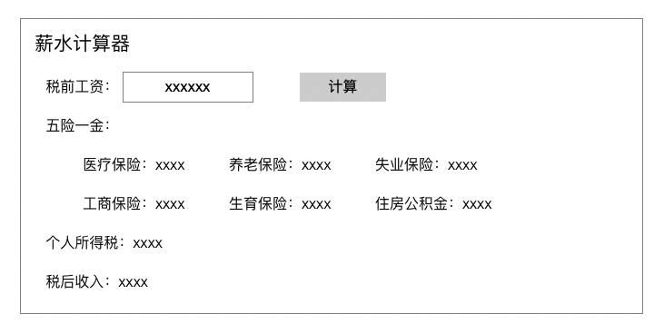
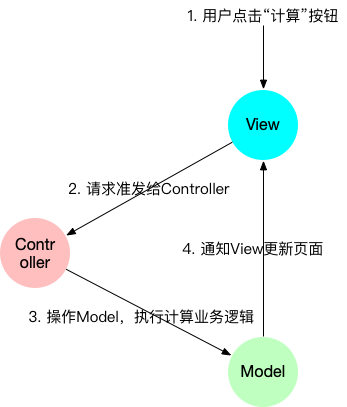
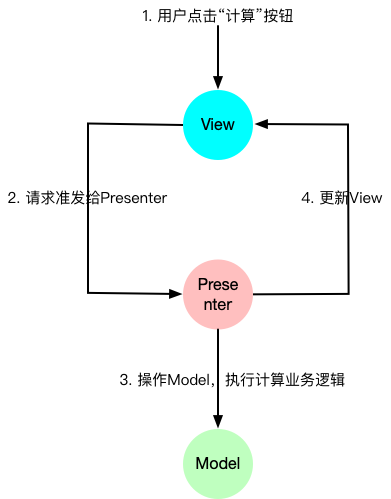
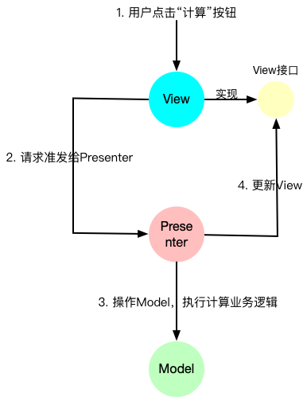
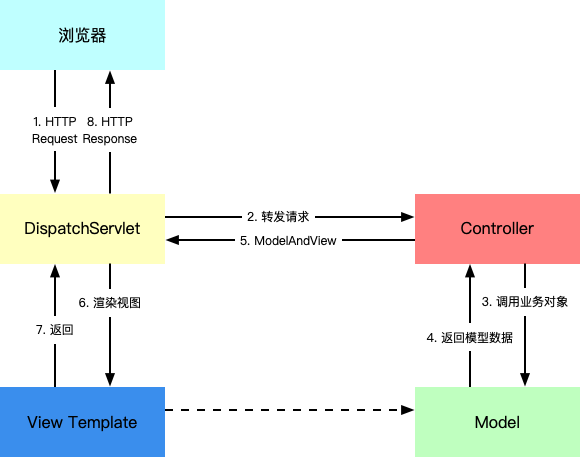
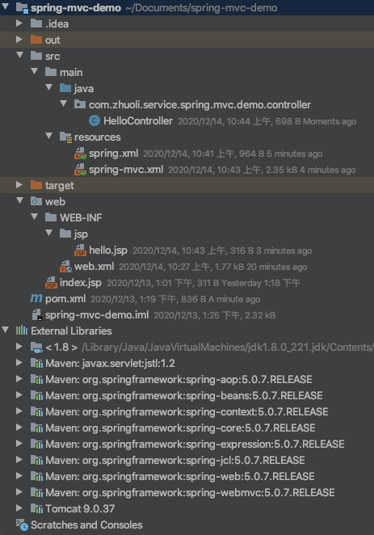
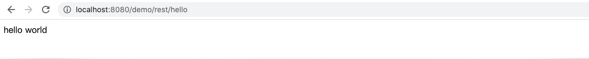
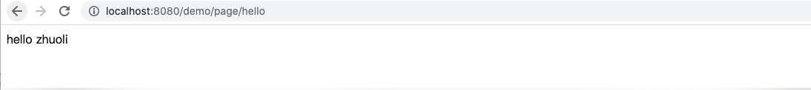

# [Spring MVC源码解读『Spring MVC示例』](http://lidol.top/frame/3197/)

2020-12-07 分类：[Spring MVC源码](http://lidol.top/category/frame/sprinmvc_sc/) / [框架](http://lidol.top/category/frame/) 阅读(480) 评论(0)

前面几篇文章，我们介绍了Servlet和Tomcat的工作原理。我们之前也说到Spring MVC底层其实也是Servlet，也需要TomcatWeb容器配合才能工作，本篇文章开始，我们就来介绍探索一下Spring MVC的相关细节。本篇文章个先来回顾一下Spring MVC的用法。

## 1. 什么是MVC

相信所有的开发人员都避免不了接触一个概念——MVC，这个概念是个比较抽象的概念，也没有没有官方权威定义，全凭我们开发人员自己理解。我一度感觉自己对MVC已经了解地很清楚了，但是在写本篇文章，打算来介绍MVC时，仍然感觉很不知从何介绍起。前后收集了很多资料，做一下对MVC的总结，希望对大家更好理解MVC有所帮助。

MVC（Model View Controller），**是模型(model)－视图(view)－控制器(controller)的缩写，是一种软件设计典范**。用一种业务数据、逻辑、界面显示分离的方法组织代码，将业务逻辑聚集到一个部件里面，在改进和个性化定制界面及用户交互的同时，不需要重新编写业务逻辑。以方便我们开发代码，快速迭代。

MVC最开始用于解决桌面系统开发代码组织问题，在MVC的基础上，产生了MVP、MVVM等设计思想。在B/S盛行的今天，MVC又演化了一些变化。

### 1.1 为什么要用MVC

设想我们有一个桌面应用程序——薪水计算器，用于计算五险一金以及个税的详细明细，如下：

[](http://cdn.lidol.top/lidol_blog/20201210112732.png)

一个合格的桌面GUI程序， 至少要满足以下几个条件：

- 界面（以及界面中元素的）布局要美观
- 界面上有些“逻辑”需要正确处理：比如上图中“计算” 按钮默认是灰色的， 不能点击，用户输入了税前收入以后， “计算”按钮就会被激活，表示计算了
- 可以支持正确的业务逻辑：比如点击了“计算”按钮以后，计算五险一金，个人所得税和税后收入

这三者搅在一起，让程序代码凌乱不堪，稍微复杂点儿的程序就长达几千行， 不断地挑战着程序员的底线，修改别人的代码，添加新的功能要比从头写难好多倍！

有没有一种简单的开放方式，可以减轻上这种GUI桌面应用程序的迭代成本？解决方案就是将**关注点分离**，将一个大的系统拆解成多个部分，这样我们开发时就不用瞻前顾后了。比如开发桌面应用程序时，拆解如下三个部分：

- **M：**表示Model，专门用来处理业务逻辑，不干别的事情。比如上述薪水计算器中，计算一个人的薪水，五险一金，个人所得税等等
- **V：**表示View，专注页面布局和数据显示。例如把Button放置到某个位置，把总收入显示到一个文本框，把税金显示到另外一个地方，加个背景图，调整显式样式等
- **C：**表示Controller ，翻译用户的输入，操作模型和视图。比如，用户在界面点击了一个“计算”的按钮，View把计算的请求传递给Controlle（很明显View需要知道Controller，换句话说，需要持有Controller的实例），Controller找到或者创建Model，执行业务逻辑，计算薪水。最后将Model的计算结果返回给View显式

关于Model通知View，可以通过Model持有View实例的方式（也可以通过观察者模式），调用View的方法。比如：View中可能有一个onResult的方法，让Model去调用，在调用的时候把一个参数对象Salary传递过来，如下：

```
// View的方法，被Model调用： 
public void onResult(Salary salary){   
      //把个人所得税(salary.getTax()) 展示到一个文本框
      //把净收入(salary.getNetPay()) 展示到另外一个文本框
      ......
}
```

大致流程如下：

[](http://cdn.lidol.top/lidol_blog/gui_mvc.png)

这个关注点分离的拆解办法就是MVC，使用了MVC之后，我们在开发GUI应用时，就简单很多了。但是MVC中存在一个现在的问题：M、V、C之间的依赖太重了，各组件之间互相依赖。有没有一种方式可以优化这种依赖关系，答案就是MVP。

### 1.2 什么是MVP

因为MVC存在依赖过重的问题，所以出现了一种对于MVC的改进方案（就是把Model和View的依赖分离开），如下：

[](http://cdn.lidol.top/lidol_blog/gui_mvp0.png)

把Controller改了个名称，叫做Presenter，整体命名为MVP。在MVP当中，View只感知Presenter，不感知Model的存在。

计算流程和MVC差不多，用户点击了“计算”按钮，View去调用Presenter，Presenter操作Model，Model中进行业务计算。 关键点是，**Presenter去更新View**。

```
//Presenter的方法，被View调用
public void calculateSalary(){
    //调用Model计算薪水
    view.showTax(xxx);    // 调用View显示所得税
    view.showNetPay(xxxx);//  调用View净收入
    ......
}
```

但是Presenter.calculateSalary方法内部还是需要调用View的方法，也就是说Presenter对View有依赖，这样Presenter就没办法单独做单元测试，必须等到界面做好以后才行。所以又对MVP做了一点改进，**让View层提取出接口，Presenter只依赖这个接口**

[](http://cdn.lidol.top/lidol_blog/gui_mvp1.png)

这样Presenter不用依赖真正的界面就可以测试了，并且也增加了复用性，只要View实现了那个接口即可。

### 1.3 MVVM

使用MVP一定程度上解决了MVC依赖太强的问题，但是Presenter调用View的方法去设置界面，仍然需要大量的、烦人的代码，实在是一件不舒服的事情。有人就提出了一种对MVP的优化思想：**能不能告诉View一个数据结构，然后View就能根据这个数据结构的变化而自动随之变化呢？**

于是，发明了一个叫ViewModel的东西，它可以和View层绑定。 ViewModel的变化，View立刻就会变化。拿上述薪水计算为例， ViewModel 差不多这样：

```
public class SalaryViewModel{
    String grossSalary;  //税前收入，和View中的相关字段对应
    String netSalary;    //净收入，和View中的相关字段对应
    String tax;          //个人所得税，和View中的相关字段对应
    ...... 
    boolean  isCalculating;  // 一个标志位，表示正在计算 
    String errMsg;           // 如果出错的话，记录出错消息。
}
```

当用户在界面上点击“计算”按钮的时候， 需要设置一个SalaryViewModel中的标志位：

```
salaryViewModel.isCalculating = true;
```

这样View 中就可以自动给用户展示一个消息：“正在计算….”。当薪水计算完成的时候，如果没有错误，SalaryViewModel 中grossSalary、netSalary、tax等属性就有了值，与此同时View中对应的内容也会更新。如果计算过程出错，SalaryViewModel的errMsg会保存出错消息，同样看，View中会自动把这个错误消息给显示出来。全程不用程序员手工去设置了，这样好像方便了很多。

但是这个方案存在一个明显的问题，**ViewModel和View没有直接的关系，需要一个机制，保证ViewModel和View绑定**。按照我们的理解，如果一个东西解放了程序员的双手，那么肯定背后有一些特殊的支持（总要有人做麻烦的事情，只不过不是程序员亲手做），其实就是框架。实际上微软的WPF和Silverlight、Android等框架和系统都可以实现View和ViewModel之间的映射和绑定。

无论是MVC还是MVP，或是MVVM，说到底都是MVC的不同实现。根本目的是为了让我们能模块化地开发应用，提高效率。

## 2. web系统中的MVC

### 2.1 servlet\jsp中的mvc

进入web时代后，在B/S架构下，用户通过浏览器发出GET、POST请求，服务器端进行处理，处理完以后生成HTML给浏览器。无论什么操作，都是对服务器端URL的访问。整个编程模型发生了巨变， 不能简单地套用原来的MVC和MVP了。**如果把HTML页面比作原来桌面应用程序的View， 服务器无论是Controller还是Model都无法远程遥控这个View进行处理的**。

如果简单实用Servlet，在Servlet中输出html。假如我们把Servlet当做Controller，Servlet调用Model产出业务数据，然后将业务数据拼接html输出。这种模式好像是不符合MVC的，因为Controller中直接写了view的逻辑。

如果使用Jsp，那么是不是满足MVC了呢？假如我们把Jsp当做View，在Jsp中直接连接数据库取数据做一些业务逻辑，那么就只有View，没有Controller和Model了。所以也是不符合MVC的。

那么有没有一种方式可以在servlet\jsp下实现MVC？

我们知道Servlet能够很好地组织业务逻辑代码，但是不适合在Servlet中输出html。Jsp适合生成html，但是在Jsp中插入大量业务逻辑代码也是不合理的。那么把这两者结合到一起，是不是就可以实现MVC了。**所有的HTTP请求都应该由Servlet进行处理，业务逻辑完成后，再调用相应的JSP文件生成HTML内容并返回到浏览器**。如下图所示：

图片

该模式下，Servlet内部的逻辑大致如下：

```
//0. 调用Model，获取业务数据

//1. 业务数据设置到HttpServletRequest中，用于向jsp传参

//3. 获取需要分发的jsp
RequestDispatcher dispatcher = request.getRequestDispatcher("view.jsp");

//4. 请求分发
dispatcher.forward(request, response);
```

Servlet中需要调用业务代码来完成特定的功能并获取结果，同时Jsp中动态输出的HTML内容是与这些结果有关的，这就需要将Servlet中的数据传递到Jsp中：

```
request.setAttribute(name, value);
```

在Jsp中可以通过`<%= request.getAttribute(name) %>`或直接使用EL表达式`${name}`得到相关的数据。下面来分享一个示例。

- **Model**

假如有一个博客系统，用户博客列表页面的业务逻辑就是需要查询某一用户创造的文章列表以及该用户的个人详细信息，我们建立相关的业务对象以及查询方法：

```
public class Post {

    private long id;
    private String title;
    private String content;
    private User creator;
    private Date createdTime;

    public Post(String title, String content, User creator) {
        this.title = title;
        this.content = content;
        this.creator = creator;
        this.createdTime = new Date();
    }
  //Getter与Setter方法省略
}
public class User {

    private long id;
    private String username;
    private String password;
    private String avatar;
    private String title;
    private String email;

    public User(long id, String username, String password, String avatar, String title, String email) {
        this.id = id;
        this.username = username;
        this.password = password;
        this.avatar = avatar;
        this.title = title;
        this.email = email;
    }
  //Getter与Setter方法省略
}
```

我们用`Data`类来模拟用户以及博客列表的Dao操作：

```
public class Data {

    public static List<User> users = new ArrayList<>();

    public static List<Post> posts = new ArrayList<>();

    static {
        users.add(new User(1L, "user1", "password", "images/default-avatar.jpeg", "title1", "description1"));
        users.add(new User(2L, "user2", "password", "images/default-avatar.jpeg", "title2", "description2"));
        users.add(new User(3L, "user3", "password", "images/default-avatar.jpeg", "title3", "description3"));
    }

    public static User getByUsername(String username) {
        return users.stream()
                .filter(e -> e.getUsername().equals(username))
                .findFirst()
                .orElse(null);
    }

    public static List<Post> getPostByUser(User user) {
        return posts.stream()
                .filter(p -> p.getCreator().getUsername().equals(user.getUsername()))
                .collect(Collectors.toList());
    }

}
```

- **Controller**

Controller由Servlet实现，它负责获取用户的输入（也就是用户名），并调用业务逻辑方法获取相关数据，然后将请求分发至指定JSP进行处理：

```
@WebServlet("/userPosts")
public class UserPostController extends HttpServlet {

    @Override
    protected void doGet(HttpServletRequest req, HttpServletResponse resp) throws ServletException, IOException {
        String username = req.getParameter("username");
        User user = Data.getByUsername(username);
        List<Post> posts = Data.getPostByUser(user);

        req.setAttribute("posts", posts);
        req.setAttribute("user", user);
        RequestDispatcher dispatcher = req.getRequestDispatcher("/templates/userPost.jsp");
        dispatcher.forward(req, resp);
    }

}
```

- **View**

在Jsp中，就可以通过`request.getAttribute("posts")`和`request.getAttribute("user")`来访问Servlet中传递来的数据了（这里只包含核心渲染逻辑代码）

```
<% for (Post post : request.getAttribute("posts")) { %>
  <div class="blog-post">
    <h3 class="blog-post-title">
      <a href="#"><%= post.getTitle() %></a>
    </h3>
    <p class="blog-post-content"><%= post.getContent() %></p>
  </div>
  <hr/>
<% } %>
```

这样就通过Servlet和Jsp配合实现了一个Web中的MVC结构。

### 2.2 Spring中的MVC

上面我们分享了通过原生Servlet和Jsp实现MVC的示例，但是不难发现，该方式还是存在一些问题的，比如Controller入参是HttpServletRequest、HttpServletResponse，如果要获取请求内容需要额外处理。View层最终目标是输出Html，但还是要使用Jsp，理解Jsp的规则等。简单点讲就是，实现成本较高，使用不方便。有没有一种方式，可以简化开发流程，很容易就能实现MVC结构。按照我们之前的介绍，肯定需要框架来支持了，其中的代表就是Spring MVC，如下图所示：

[](http://cdn.lidol.top/lidol_blog/spring_MVC.png)

**不像桌面应用的MVC， 这里的Model没法给View 发通知。也不像MVP, 这里的Controller 也不会调用View的方法来设置界面。**实际上Controller会选择一个View，然后把模型数据“丢过去”渲染。原来的View变成了**View Template**（例如JSP、Velocity、TheamLeaf等），经过渲染后变成HTML发给浏览器展示。

### 2.3 前后端分离系统的MVC

早期的B/S Web应用程序中，每次访问服务器端，HTML就会整体发给浏览器，即所谓的整体刷新。后来出现了AJAX等技术， 可以做到局部刷新，于是浏览器端的应用变得越来越复杂。再后来出现了SPA（单页应用程序），浏览器端用起来的体验和最初的桌面应用程序越来越像。MVC、MVVM之类的模式完全可以用到浏览器端。在浏览器端使用MVVM , 在服务器端可以使用MVC， 两者结合起来：

[](http://cdn.lidol.top/lidol_blog/mvvm_mvc.png)

这样对于浏览器端应用来讲，后端应用就是Model。在该模式下，后端应用只需要提供业务数据即可，所以view也变成了Json。

### 2.4 为什么要使用Spring MVC

虽然现在前后端分离系统是主流的开发模式，但是并不意味着Spring MVC就过时了，我们利用Spring MVC，依然可以简单地构建Restful API，为前后端分离的系统提供业务数据。可以肯定Spring MVC还是有用武之地的。那么为什么要使用Spring MVC呢？

Spring MVC是使用了MVC设计思想的轻量级web框架，相比于原生Servlet、Jsp，可以帮助我们更便捷的构建MVC Web应用。同时提供灵活的参数映射、数据校验、模板渲染等功能。拥有良好的生态，可以与Spring框架无缝对接。具备以下优点：

- **SpringMVC框架提供了一整套完善的组件**

不同于以前框架只提供接口，然后让使用者自己根据接口写实现类来实现功能，Spring MVC提供了一整套完善的组件，可以直接使用。一般SpringMVC框架提供这些工具也巨简单，通过一些简单的注解就搞定了，不需要编写繁琐冗长的代码。

- **SpringMVC是以强大的Spring容器为基础的框架**

与Spring可以无缝对接，简单快捷的管理Bean

- **框架的配置简单又不失灵活性**

Spring MVC框架的常用配置项基本可以涵盖项目中80%的配置需求，简单的项目甚至可以做到零配置，拿过来就用

- **可扩展性好**

Spring MVC框架提供的工具不能100%满足你的需求，你需要定制开发，Spring MVC框架同样也提供了相应的接口，可以进行工具的升级。

## 3. Spring MVC HelloWorld

下面我们来构建Spring MVC的简单demo，HelloWorld示例应用。

### 3.1 pom.xml

```
<project xmlns = "http://maven.apache.org/POM/4.0.0"
         xmlns:xsi = "http://www.w3.org/2001/XMLSchema-instance"
         xsi:schemaLocation = "http://maven.apache.org/POM/4.0.0
    http://maven.apache.org/xsd/maven-4.0.0.xsd">

    <modelVersion>4.0.0</modelVersion>
    <groupId>com.zhuoli.service</groupId>
    <artifactId>spring-mvc-demo</artifactId>
    <version>1.0</version>

    <dependencies>
        <!--添加Spring MVC的依赖-->
        <dependency>
            <groupId>org.springframework</groupId>
            <artifactId>spring-webmvc</artifactId>
            <version>5.0.7.RELEASE</version>
        </dependency>

        <dependency>
            <groupId>javax.servlet</groupId>
            <artifactId>jstl</artifactId>
            <version>1.2</version>
        </dependency>

    </dependencies>

</project>
```

### 3.2 web.xml

```
<?xml version="1.0" encoding="UTF-8"?>
<web-app xmlns="http://xmlns.jcp.org/xml/ns/javaee"
         xmlns:xsi="http://www.w3.org/2001/XMLSchema-instance"
         xsi:schemaLocation="http://xmlns.jcp.org/xml/ns/javaee http://xmlns.jcp.org/xml/ns/javaee/web-app_4_0.xsd"
         version="4.0">

    <display-name>Archetype Created Web Application</display-name>
    
    <!--指定Spring的配置文件地址-->
    <context-param>
        <param-name>contextConfigLocation</param-name>
        <param-value>classpath:spring.xml</param-value>
    </context-param>

    <!--Tomcat Context生命周期监听器-->
    <listener>
        <listener-class>org.springframework.web.context.ContextLoaderListener</listener-class>
    </listener>

    <!--配置Spring MVC 的DispatcherServlet,指定配置文件的路径,拦截所有的请求-->
    <servlet>
        <!--这个名称如果不特别指定的话，跟配置文件名称有关联。如果特别指定配置文件了，则此名称就无所谓了-->
        <servlet-name>springMvc</servlet-name>
        <servlet-class>org.springframework.web.servlet.DispatcherServlet</servlet-class>
        <init-param>
            <!--contextConfigLocation这个参数可以不配置，如果不配置的话，那么默认的value就是/WEB-INF/[servlet名字]-servlet.xml-->
            <param-name>contextConfigLocation</param-name>
            <param-value>classpath:spring-mvc.xml</param-value>
        </init-param>
        <!--表示启动容器时初始化该Servlet-->
        <load-on-startup>1</load-on-startup>
    </servlet>

    <servlet-mapping>
        <servlet-name>springMvc</servlet-name>
        <!--DispatcherServlet拦截所有的请求-->
        <url-pattern>/</url-pattern>
    </servlet-mapping>

</web-app>
```

web.xml文件中，我们主要做了如下几项工作：

- <context-param>属性contextConfigLocation指定
- 声明一个Tomcat Context生命周期监听器ContextLoaderListener
- 声明一个Servlet DispatcherServlet，所有的Tomcat请求都会打到这个Servlet中

这三项在Spring MVC中有重要作用，我们后面的文章再仔细分析

### 3.3 spring.xml

上面的web.xml配置文件中可以看到使用了其它两个配置文件，spring.xml和spring-mvc.xml，这其实和Spring MVC父子容器有关（关于Spring MVC父子容器，我们后面再介绍）。spring.xml中主要用于声明一些Service层和DAO层的Bean，spring-mvc.xml中主要用于声明一些Controller层的Bean（原因在后面介绍）。classpath下创建spring.xml配置文件：

```
<?xml version="1.0" encoding="UTF-8"?>
<beans xmlns="http://www.springframework.org/schema/beans"
       xmlns:xsi="http://www.w3.org/2001/XMLSchema-instance"
       xmlns:context="http://www.springframework.org/schema/context"
       xsi:schemaLocation="http://www.springframework.org/schema/beans
        http://www.springframework.org/schema/beans/spring-beans.xsd
        http://www.springframework.org/schema/context
        http://www.springframework.org/schema/context/spring-context.xsd">

    <!--启动DI管理-->
    <context:annotation-config/>

    <!-- 在父容器中不扫描@Controller注解，在子容器中只扫描@Controller注解 -->
    <!--把控制器从包扫描中排除出去-->
    <context:component-scan base-package="com.zhuoli.service.spring.mvc.demo">
        <context:exclude-filter type="annotation"
                                expression="org.springframework.stereotype.Controller"/>
    </context:component-scan>
</beans>
```

### 3.4 spring-mvc.xml

```
<?xml version="1.0" encoding="UTF-8"?>
<beans xmlns="http://www.springframework.org/schema/beans"
       xmlns:xsi="http://www.w3.org/2001/XMLSchema-instance"
       xmlns:context="http://www.springframework.org/schema/context"
       xmlns:mvc="http://www.springframework.org/schema/mvc"
       xsi:schemaLocation="
        http://www.springframework.org/schema/beans
        http://www.springframework.org/schema/beans/spring-beans.xsd
        http://www.springframework.org/schema/context
        http://www.springframework.org/schema/context/spring-context.xsd
        http://www.springframework.org/schema/mvc
        http://www.springframework.org/schema/mvc/spring-mvc.xsd">


    <!-- 启用Spring基于annotation的DI, 使用户可以在Spring MVC中使用Spring的强大功能。
        激活 @Required, @Autowired,JSR 250's @PostConstruct, @PreDestroy and @Resource 等标注 -->
    <context:annotation-config/>

    <!--包扫描-->
    <!--DispatcherServlet上下文,只管理@Controller的bean,忽略其他类型的bean, 例如@Service-->
    <context:component-scan base-package="com.zhuoli.service.spring.mvc.demo">
        <context:include-filter type="annotation" expression="org.springframework.stereotype.Controller"/>
    </context:component-scan>

    <mvc:annotation-driven />

    <!--前缀加上后缀生成一个完整的jsp路径-->
    <bean class="org.springframework.web.servlet.view.InternalResourceViewResolver">
        <property name="viewClass" value="org.springframework.web.servlet.view.JstlView"/>
        <property name="prefix" value="/WEB-INF/jsp/"/>
        <property name="suffix" value=".jsp"/>
    </bean>

    <bean class="org.springframework.web.servlet.view.ContentNegotiatingViewResolver">
        <property name="order" value="1"/>
        <property name="defaultViews">
            <list>
                <!-- JSON View -->
                <bean
                        class="org.springframework.web.servlet.view.json.MappingJackson2JsonView">
                </bean>
            </list>
        </property>
    </bean>

</beans>
```

### 3.5 Jsp文件

```
<%@ page contentType="text/html;charset=UTF-8" language="java" %>
<html>
  <head>
    <title>$Title$</title>
  </head>
  <body>
  ${message}
  </body>
</html>
```

### 3.6 HelloController

```
@Controller
@RequestMapping("/demo")
public class HelloController {
    @RequestMapping("/rest/hello")
    @ResponseBody
    public String hello() {
        return "hello world";
    }

    @RequestMapping("/page/hello")
    public String getIndex(ModelMap modelMap) {
        modelMap.addAttribute("message", "hello zhuoli");
        return "hello";
    }
}
```

整体项目结构如下图所示：

[](http://cdn.lidol.top/lidol_blog/20201215073330.png)

项目启动，浏览器请求如下：

[](http://cdn.lidol.top/lidol_blog/20201215073456.png)

[](http://cdn.lidol.top/lidol_blog/20201215073528.png)

所以我们通过Spring Mvc分别实现了纯数据的后端接口，以及MVC的结构。

> 参考链接：
>
> \1. 《码农翻身——什么是MVC》
>
> \2. [JSP/Servlet——MVC设计模式](https://www.tianmaying.com/tutorial/jsp-servlet-mvc-architecture)
>
> \3. [Spring与后端模板引擎的故事](https://cloud.tencent.com/developer/article/1488092)