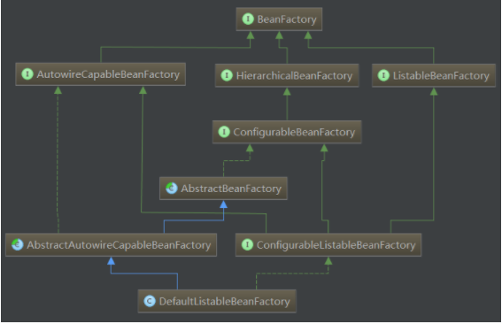
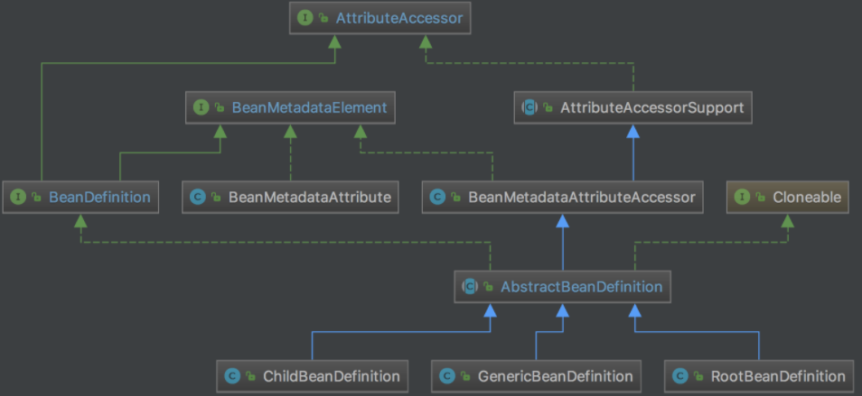

### 1、简介

1. **Spring是一个开源免费的框架，容器；**

2. **Spring是一个轻量式的框架，非侵入式的；**

3. **控制反转IOC，面向切面；**

   （1）IOC(控制反转)或DI（依赖注入）:明确定义组件的接口，独立开发各个组件，然后根据组件的依赖关系组装运行；即将创建及管理对象的权利交给Spring容器。Spring是一个轻型容器(light-weight Container)，其核心是Bean工厂(Bean Factory)，用以构造我们所需要的M(Model）。能够让相互协作的软件组件保持松散耦合。降低了业务对象替换的复杂性，提高了组件之间的解耦。
   

（2）AOP(面向切面编程)：通过预编译方式和运行期动态代理实现在不修改源代码的情况下给程序动态统一添加功能的一种技术。即系统级的服务从代码中解耦出来。例如：将日志记录，性能统计，安全控制，事务处理，异常处理等代码从业务逻辑代码中划分出来。允许你把遍布应用各处的功能分离出来形成可重用组件。


**Spring框架**

Spring 框架是一个分层架构，由 7 个定义好的模块组成。Spring 模块构建在核心容器之上，核心容器定义了创建、配置和管理 bean 的方式 。

组成 Spring 框架的每个模块（或组件）都可以单独存在，或者与其他一个或多个模块联合实现。每个模块的功能如下：

* **核心容器：**核心容器提供 Spring 框架的基本功能。核心容器的主要组件是 BeanFactory，它是工厂模式的实现。BeanFactory 使用控制反转（IOC） 模式将应用程序的配置和依赖性规范与实际的应用程序代码分开。
* **Spring 上下文：**Spring 上下文是一个配置文件，向 Spring 框架提供上下文信息。Spring 上下文包括企业服务，例如 JNDI、EJB、电子邮件、国际化、校验和调度功能。
* **Spring AOP：**通过配置管理特性，Spring AOP 模块直接将面向切面的编程功能 , 集成到了 Spring 框架中。所以，可以很容易地使 Spring 框架管理任何支持 AOP的对象。Spring AOP 模块为基于 Spring 的应用程序中的对象提供了事务管理服务。通过使用 Spring AOP，不用依赖组件，就可以将声明性事务管理集
  成到应用程序中。
* **Spring DAO：**JDBC DAO 抽象层提供了有意义的异常层次结构，可用该结构来管理异常处理和不同数据库供应商抛出的错误消息。异常层次结构简化了错误处理，并且极大地降低了需要编写的异常代码数量（例如打开和关闭连接）。Spring DAO 的面向 JDBC 的异常遵从通用的 DAO 异常层次结构。
* **Spring ORM：**Spring 框架插入了若干个 ORM 框架，从而提供了 ORM 的对象关系工具，其中包括 JDO、Hibernate 和 iBatis SQL Map。所有这些都遵从 Spring 的通用事务和 DAO 异常层次结构。
* **Spring Web 模块：**Web 上下文模块建立在应用程序上下文模块之上，为基于 Web 的应用程序提供了上下文。所以，Spring 框架支持与 Jakarta Struts 的集成。Web 模块还简化了处理多部分请求以及将请求参数绑定到域对象的工作。
* S**pring MVC 框架：**MVC 框架是一个全功能的构建 Web 应用程序的 MVC 实现。通过策略接口，MVC框架变成为高度可配置的，MVC 容纳了大量视图技术，其中包括 JSP等


**Spring核心组件**

Spring核心组件只有Core、Context、Beans三个。core包侧重于帮助类，操作工具，beans包更侧重于bean实例的描述。context更侧重全局控制，功能衍生。

Bean组件主要解决：**Bean 的定义、Bean 的创建(BeanFactory)以及对 Bean 的解析。**
开发者关心Bean创建，其他由Spring内部帮你完成。

**（1）Bean 的创建是典型的工厂模式，他的顶级接口是 BeanFactory**
BeanFactory 有三个子类：ListableBeanFactory、HierarchicalBeanFactory 和AutowireCapableBeanFactory。但默认实现类是 DefaultListableBeanFactory。实现多接口是为了区分在 Spring 内部操作对象传递和转化时，对对象的数据访问所做的限制。例如 ListableBeanFactory 接口表示这些 Bean 是可列表的，HierarchicalBeanFactory 表示的是这些 Bean 是有继承关系的，也就是每个 Bean 有可能有父 Bean。AutowireCapableBeanFactory 接口定义 Bean 的自动装配规则。这四个接口共同定义了 Bean 的
集合、Bean 之间的关系、以及 Bean 行为。

Bean 的创建是典型的工厂模式，下图是这个工厂的继承层次关系：



**（2）Bean 的定义**主要有 BeanDefinition 描述Bean 的定义就是完整的描述了在 Spring 的配置文件中你定义的 < bean/ > 节点中所有的信息，包括各种子节点。当 Spring 成功解析你定义的一个 < bean/ > 节点后，在 Spring 的内部他就被转化成 BeanDefinition 对象。以后所有的操作都是对这个对象完成的。Bean 定义的类层次关系图如下：



**（3）bean 的解析**过程非常复杂，功能被分的很细，因为这里需要被扩展的地方很多，必须保证有足够的灵活性，以应对可能的变化。Bean 的解析主要就是对 Spring 配置文件的解析。这个解析过程主要通过下图中的类完成：


**2. Context组件**

ApplicationContext 的子类主要包含两个方面：
1.ConfigurableApplicationContext 表示该 Context 是可修改的，也就是在构建 Context 中用户可以动态添加或修改已有的配置信息，它下面又有多个子类，其中最经常使用的是可更新的 Context，即AbstractRefreshableApplicationContext 类。
2.WebApplicationContext 顾名思义，就是为 web 准备的 Context 他可以直接访问到 ServletContext，通常情况下，这个接口使用的少。再往下分就是按照构建 Context 的文件类型，接着就是访问 Context 的方式。这样一级一级构成了完整的 Context 等级层次。


Context总结：
总体来说 ApplicationContext 必须要完成以下几件事：
（1）标识一个应用环境。
（2）利用 BeanFactory 创建 Bean 对象。
（3）保存对象关系表。
（4）能够捕获各种事件。
Context 作为 Spring 的 Ioc 容器，基本上整合了 Spring 的大部分功能，或者说是大部分功能的基础。


**3. Core组件**

Core 组件作为 Spring 的核心组件，他其中包含了很多的关键类，其中一个重要组成部分就是定义了资源的访问方式。

其中，Resource 接口封装了各种可能的资源类型，也就是对使用者来说屏蔽了文件类型的不同。Resource 接口继承InputStreamSource 接口，这个接口中有个 getInputStream 方法，返回的是InputStream 类。这样所有的资源都被可以通过 InputStream 这个类来获取，所以也屏蔽了资源的提供者。

资源加载：ResourceLoader 接口完成加载，他屏蔽了所有的资源加载者的差异，只需要实现这个接口就可以加载所有的资源，默认实现是 DefaultResourceLoader。


**BeanFactory和ApplicationContext的区别和关系？**

ApplicationContext建立在BeanFactory的基础之上，提供了更多面向应用的功能， 它提供了国际化支持和框架
事件体系，但有下面几点不同：

1. **获取beanFactory和ApplicationContext方式不同**

   > ```java
   > BeanFactory beanFactory=new XmlBeanFactory(new ClassPathResource(“applicationContext.xml”));
   > beanFactory.getBean(“mybean”); //得到bean
   > ApplicationContext ac=new ClassPathXmlApplicationContext("com/bean/factory/spring.xml");
   > Students student1=ac.getBean("student");
   > ```

2. **都可以获取bean,获取bean存在的区别:**

   BeanFactory在初始化容器时，并没有实例化Bean，直到第一次访问某个Bean时才实例化目标Bean。
   ApplicationContext会在初始化应用上下文时就实例化所有单实例的Bean。

3. **对BeanPostProcessor中的方法调用方式不同。**

   若使用BeanFactory，则必须要显示的调用其addBeanPostProcessor()方法进行注册，参数为BeanPostProcessor实现类的实例,并进行手动调用。
   如果是使用ApplicationContext，那么容器会在配置文件在中自动寻找实现了BeanPostProcessor接口的Bean，然后自动注册，我们要做的只是配置一个BeanPostProcessor实现类的Bean就可以了。

**Spring中FactoryBean和BeanFactory区别？**

1. beanFactory一个是factory,是管理bean的工厂,可以获取很多bean。

2. FactoryBean是一个bean,不过因其实现了FactoryBean接口,所以不同于普通的bean,可以根据该Bean的id从BeanFactory中获取实际上是FactoryBean的getObject()返回的对象,而不是FactoryBean本身。备注: Spring 中有两种类型的Bean,一种是普通Bean,另一种是工厂Bean,即FactoryBean。
   工厂 Bean 跟普通Bean不同,其返回的对象不是指定类的一个实例,其返回的是该工厂Bean的getObject方法所返回的对象 。
   FactoryBean出现的原因:在某些情况下，实例化Bean过程比较复杂，如果按照传统配置bean的方式，则需要在< bean >中提供大量的配置信息。Spring为此提供了一个FactoryBean的工厂类接口，用户可以通过实现该接口定制实例化Bean的逻辑。


### 2、Ioc容器

**IOC(Inversion of Control)：**其思想是反转资源获取的方向. 传统的资源查找方式要求组件向容器发起请求查找资源. 作为回应, 容器适时的返回资源. 而应用了 IOC 之后, 则是容器主动地将资源推送给它所管理的组件, 组件所要做的仅是选择一种合适的方式来接受资源. 这种行为也被称为查找的被动形式。

**DI(Dependency Injection) — IOC 的另一种表述方式：**即组件以一些预先定义好的方式(例如: setter 方法)接受来自如容器的资源注入. 相对于 IOC 而言，这种表述更直接


**IOC 容器里配置 Bean**

* 在 xml 文件中通过 bean 节点来配置 bean

  ```xml
  <bean id= "hello" class= "com.demo.po.Hello" >
  <property name= "name" value= "Spring" />
  </bean>
  ```

* id：Bean 的名称。
  在 IOC 容器中必须是唯一的
  若 id 没有指定，Spring 自动将权限定性类名作为 Bean 的名字
  id 可以指定多个名字，名字之间可用逗号、分号、或空格分隔

* 在 Spring IOC 容器读取 Bean 配置创建 Bean 实例之前, 必须对它进行实例化. 只有在容器实例化后, 才可以从 IOC 容器里获取 Bean 实例并使用

* Spring 提供了两种类型的 IOC 容器实现.

  * **BeanFactory**: IOC 容器的基本实现.
  * **ApplicationContext**: 提供了更多的高级特性. 是 BeanFactory 的子接口.
  * BeanFactory 是 Spring 框架的基础设施，面向 Spring 本身；ApplicationContext 面向使用 Spring 框架的开发者，几乎所有的应用场合都直接使用 ApplicationContext而非底层的 BeanFactory
  * 无论使用何种方式, 配置文件是相同的。

* ApplicationContext 的主要实现类：

  *  ClassPathXmlApplicationContext：从类路径下加载配置文件
  *  FileSystemXmlApplicationContext: 从文件系统中加载配置文件

* ConfigurableApplicationContext 扩展于 ApplicationContext，新增加两个主要方法：refresh() 和 close()， 让 ApplicationContext 具有启动、刷新和关闭上下文的能力

* ApplicationContext 在初始化上下文时就实例化所有单例的 Bean。

* WebApplicationContext 是专门为 WEB 应用而准备的，它允许从相对于 WEB 根目录的路径中完成初始化工作。


#### 1、Ioc对象创建方式

> **通过无参构构造方法创建**

> ```xml
> <bean id="user" class="com.demo.po.User">
>    	<property name="name" value="通过无参构造方法来创建"/>
> </bean>
> ```

> **通过有参构造方法创建**

> ```xml
> <!-- 第一种根据index参数下标设置 -->
> <bean id="userT" class="com.demo.po.UserT">
> 	<!-- index指构造方法 , 下标从0开始 -->
> 	<constructor-arg index="0" value="index指构造方法"/>
> </bean>
>         
> <!-- 第二种根据参数名字设置-->
> <bean id="userT" class="com.demo.po.UserT">
> 	<constructor-arg name="name" value="根据参数名字设置"/>
> </bean>
>         
> <!-- 第三种根据参数类型设置-->
> <bean id="userT" class="com.demo.po.UserT">
> 	<constructor-arg type="java.lang.String" value="根据参数类型设置"/>
> </bean>
> ```

**alias别名**

> ```xml
> <bean id="userT" class="com.demo.po.UserT">
> 	<constructor-arg index="0" value="index指构造方法通过别名来获取"/>
> </bean>
> <alias name="userT" alias="userNew"/>
> ```

#### 2、依赖注入

**DI 概念：依赖注入（Dependency Injection）。**

* 依赖 : 指Bean对象的创建依赖于容器 . Bean对象的依赖资源 。
* 注入 : 指Bean对象所依赖的资源 , 由容器来设置和装配 。

**Spring 支持 3 种依赖注入的方式**

* 构造器注入
* 属性Set注入
* 工厂方法注入（很少使用，不推荐）

> **构造器注入**

> ```xml
> <!--构造器注入是在对象创建过程完成的，详细参考Ioc容器对象创建部分-->
> <bean id="userT" class="com.demo.po.UserT">
> 	<constructor-arg name="name" value="根据参数名字设置"/>
> </bean>
> ```

> **set方法注入**

> ```xml
> <bean id="hello" class="com.demo.po.Hello">
> 	<property name="name" value="set方法注入"/>
> </bean>
> ```


**扩展注入**

**1、常量注入**

> ```xml
> <bean id="student" class="com.demo.po.Student">
> 	<property name="name" value="小明"/>
> </bean>
> ```

**2、Bean注入**

> ```xml
> <bean id="addr" class="com.demo.po.Address">
> 	<property name="address" value="广东"/>
> </bean>
> <bean id="student" class="com.demo.po.Student">
> 	<property name="name" value="小明"/>
>     <!--注意点：这里的值是一个引用，ref-->
> 	<property name="address" ref="addr"/>
> </bean>
> ```

**3、数组注入**

> ```xml
> <bean id="addr" class="com.demo.po.Address">
> 	<property name="address" value="广东"/>
> </bean>
> <bean id="student" class="com.demo.po.Student">
> 	<property name="name" value="小明"/>
> 	<property name="address" ref="addr"/>
> 	<property name="books">
>         <!--array标签-->
> 		<array>
> 			<value>西游记</value>
> 			<value>红楼梦</value>
> 			<value>水浒传</value>
> 		</array>
> 	</property>
> </bean>
> ```

**4、List注入**

> ```xml
> <bean id="addr" class="com.demo.po.Address">
> 	<property name="address" value="广东"/>
> </bean>
> <bean id="student" class="com.demo.po.Student">
> 	<property name="name" value="小明"/>
> 	<property name="address" ref="addr"/>
> 	<property name="hobbys">
>         <!--list标签-->
> 		<list>
> 			<value>听歌</value>
> 			<value>看电影</value>
> 			<value>爬山</value>
> 		</list>
> 	</property>
> </bean>
> ```

**5、Map注入**

> ```xml
> <bean id="addr" class="com.demo.po.Address">
> 	<property name="address" value="广东"/>
> </bean>
> <bean id="student" class="com.demo.po.Student">
> 	<property name="name" value="小明"/>
> 	<property name="address" ref="addr"/>
> 	<property name="card">
>         <!--map标签和entry标签-->
> 		<map>
>             <!--entyr节点 key value属性-->
> 			<entry key="中国邮政" value="456456456465456"/>
> 			<entry key="建设" value="1456682255511"/>
> 		</map>
> 	</property>
> </bean>
> ```

**6、set注入**

> ```xml
> <bean id="addr" class="com.demo.po.Address">
> 	<property name="address" value="广东"/>
> </bean>
> <bean id="student" class="com.demo.po.Student">
> 	<property name="name" value="小明"/>
> 	<property name="address" ref="addr"/>
> 	<property name="games">
>         <!--set标签-->
> 		<set>
> 			<value>LOL</value>
> 			<value>BOB</value>
> 			<value>COC</value>
> 		</set>
> 	</property>
> </bean>
> ```

**7、Null注入**

> ```xml
> <property name="wife"><null/></property>
> ```

**8、Properties注入**

> ```xml
> <property name="info">
> 	<props>
> 		<prop key="学号">20190604</prop>
> 		<prop key="性别">男</prop>
> 		<prop key="姓名">小明</prop>
> 	</props>
> </property>
> ```

> **集合属性 - 数组、List、Set注入**
> 在 Spring中可以通过一组内置的 xml 标签(例如: < list >, < set > 或 < map >) 来配置集合属性.
>
> * 配置 java.util.List 类型的属性, 需要指定 < list > 标签, 在标签里包含一些元素. 这些标签可以通过
>   < value > 指定简单的常量值, 通过 < ref > 指定对其他 Bean 的引用. 通过< bean > 指定内置 Bean
>   定义. 通过 < null/ > 指定空元素. 甚至可以内嵌其他集合.
> * 数组的定义和 List 一样, 都使用 < list >
> * 配置 java.util.Set 需要使用 < set > 标签, 定义元素的方法与 List 一样.

> **集合属性 - Map注入**
>
> * java.util.Map 通过 < map > 标签定义, < map > 标签里可以使用多个 < entry > 作为子标签. 每个
>   条目包含一个键和一个值.
> * 必须在 < key > 标签里定义键
> * 因为键和值的类型没有限制, 所以可以自由地为它们指定 < value >, < ref >, < bean > 或 < null> 元
>   素.
> * 可以将 Map 的键和值作为 < entry > 的属性定义: 简单常量使用 key 和 value 来定义; Bean 引用
>   通过 key-ref 和 value-ref 属性定义

> * **Properties注入**
>   使用 < props > 定义 java.util.Properties, 该标签使用多个 < prop > 作为子标签. 每个 < prop > 标签
>   必须定义 key 属性.


**p注入**

> ```xml
> <!--P(属性: properties)命名空间 , 直接注入属性-->
> <bean id="user" class="com.demo.po.UserP" p:name="PP" p:age="18"/>
> ```

**c注入**

> ```xml
> <!--P(属性: properties)命名空间 , 直接注入属性-->
> <!--C(构造: Constructor)命名空间 , 使用构造器注入-->
> <bean id="user" class="com.demo.po.UserC" c:name="CC" c:age="18"/>
> ```


#### 3、自动装配

* Spring IOC 容器可以自动装配 Bean. 需要做的仅仅是在 < bean > 的 autowire 属性里指定自动装配的模式
* byType(根据类型自动装配): 若 IOC 容器中有多个与目标 Bean 类型一致的 Bean. 在这种情况下, Spring 将无法判定哪个 Bean 最合适该属性, 所以不能执行自动装配.
* byName(根据名称自动装配): 必须将目标 Bean 的名称和属性名设置的完全相同.
* constructor(通过构造器自动装配): 当 Bean 中存在多个构造器时, 此种自动装配方式将会很复杂. 不推荐使用

**按名称装配**

> ```xml
> <bean id="address" class="com.demo.autowire.Address" p:city="ShenZhen" p:street="NanHai"></bean>
>     
> <bean id="car" class="com.demo.autowire.Car" p:brand="Audi" p:price="300000"/>
>     
> <!-- 可以使用autowire属性指定自动装配的方式，byname根据bean的名字和当前bean的setter风格属性名进行自动装配 -->
> <bean id="person" class="com.demo.autowire.Person" p:name="John" autowire="byName"/>
> ```

**按类型装配**

> ```xml
> <!-- 可以使用autowire属性指定自动装配的方式，
> byType根据bean的类型和当前bean的属性的类型进行自动装配。-->
> <bean id="person2"
> 	class="com.demo.autowire.Person"
>     p:name="Tom" autowire="byType">
> </bean>
> ```

> 需要注意，使用按类型装配bean方式配置的时候配置文件中该类型的bean只能有一个，否则就会出现问题


> XML 配置里的 Bean 自动装配的缺点
>
> * 在 Bean 配置文件里设置 autowire 属性进行自动装配将会装配 Bean 的所有属性. 然而, 若只希望装配个别属性时, autowire 属性就不够灵活了。
> * autowire 属性要么根据类型自动装配, 要么根据名称自动装配, 不能两者兼而有之。
> * 一般情况下，在实际的项目中很少使用自动装配功能，因为和自动装配功能所带来的好处比起来，明确清晰的配置文档更有说服力一些。


#### 4、继承 Bean

* Spring 允许继承 bean 的配置, 被继承的 bean 称为父 bean. 继承这个父 Bean 的 Bean 称为子Bean

* 继承仅仅是指配置上的继承，并不意味着这两个bean之间存在继承关系。继承bean配置仅仅是为了复用其配置信息。

* 子 Bean 从父 Bean 中继承配置, 包括 Bean 的属性配置

* 子 Bean 也可以覆盖从父 Bean 继承过来的配置

* 父 Bean 可以作为配置模板, 也可以作为 Bean 实例. 若只想把父 Bean 作为模板, 可以设置 < bean >的abstract 属性为 true, 这样 Spring 将不会实例化这个 Bean

* 并不是 < bean > 元素里的所有属性都会被继承. 比如: autowire, abstract 等.

* 也可以忽略父 Bean 的 class 属性, 让子 Bean 指定自己的类, 而共享相同的属性配置. 但此时abstract 必须设为 true

  

> **范例一**

> ```xml
> <bean id="address"
> 	class="com.demo.spring.beans.relation.Address"
> 	p:city="ShenZhen" p:street="NanHai"/>
> <bean id="address2" p:street="LongShen" parent="address"/>
> ```


> **范例二**

> ```xml
> <!-- 抽象bean：bean的abstract属性为true的bean。这样的bean不能被ioc容器实例
> 只能被用来继承配置。若某一个bean的class属性没有指定，则该bean必须是一个抽象bean -->
> <bean id="address3" p:city="Beijing" p:street="WuDaokou" abstract="true"></bean>
> ```


> **范例三**

> ```xml
> <!-- bean配置的继承：使用bean的parent属性指定继承那个bean -->
> <bean id="address4"
> 	class="com.demo.po.autowire.Address"
> 	p:street="DaZhongsi" parent="address3"/>
> ```


#### 5、依赖 Bean

* Spring 允许用户通过 depends-on 属性设定 Bean 前置依赖的Bean，前置依赖的 Bean 会在本Bean 实例化之前创建好
* 如果前置依赖于多个 Bean，则可以通过逗号，空格或的方式配置 Bean 的名称

> ```xml
> <bean id="car" class="com.demo.po.autowire.Car"
> 	p:brand="Audi" p:price="300000"/>
> <bean id="person" class="com.demo.po.autowire.Person"
> 	p:name="Tom" p:address-ref="address" depends-on="car"/>
> ```


#### 6、Bean作用域

Bean的概念：在Spring中，那些组成应用程序的主体及由Spring IoC容器所管理的对象，被称之为
bean。简单地讲，bean就是由IoC容器初始化、装配及管理的对象。

* singleton：单例模式，在整个Spring IoC容器中，使用singleton定义的Bean将只有一个实例
* prototype：原型模式，每次通过容器的getBean方法获取prototype定义的Bean时，都将产生
  一个新的Bean实例
* request：对于每次HTTP请求，使用request定义的Bean都将产生一个新实例，即每次HTTP请
  求将会产生不同的Bean实例。只有在Web应用中使用Spring时，该作用域才有效
* session：对于每次HTTP Session，使用session定义的Bean都将产生一个新实例。同样只有在
  Web应用中使用Spring时，该作用域才有效
* globalsession：每个全局的HTTP Session，使用session定义的Bean都将产生一个新实例。典
  型情况下，仅在使用portlet context的时候有效。同样只有在Web应用中使用Spring时，该作
  用域才有效。
* 在 Spring 中, 可以在 < bean > 元素的 scope 属性里设置 Bean 的作用域.
* 默认情况下, Spring 只为每个在 IOC 容器里声明的 Bean 创建唯一一个实例, 整个 IOC 容器范围内
  都能共享该实例：所有后续的 getBean() 调用和 Bean 引用都将返回这个唯一的 Bean 实例.该作用
  域被称为 singleton, 它是所有 Bean 的默认作用域


#### 7、单例模式(Singleton)

当一个bean的作用域为Singleton，那么Spring IoC容器中只会存在一个共享的bean实例，并且所有对
bean的请求，只要id与该bean定义相匹配，则只会返回bean的同一实例。Singleton是单例类型，就是
在创建起容器时就同时自动创建了一个bean的对象，不管你是否使用，已都存在了，每次获取到的对象
都是同一个对象。

> 注意：Singleton作用域是Spring中的缺省(默认)作用域。


#### 8、原型模式(Prototype)

Prototype原型Bean
当一个bean的作用域为Prototype，表示一个bean定义对应多个对象实例。Prototype作用域的bean会导致在每次对该bean请求（将其注入到另一个bean中，或者以程序的方式调用容器的getBean()方法）时都会创建一个新的bean实例。Prototype是原型类型，它在我们创建容器的时候并没有实例化，而是当我们获取bean的时候才会去创建一个对象，而且我们每次获取到的对象都不是同一个对象。根据经验，对有状态的bean应该使用prototype作用域，而对无状态的bean则应该使用singleton作用域。

> ```xml
> <!-- 使用bean的scope属性来配置bean的作用域
> 	singleton:默认值。容器初始化时创建bean实例，整个容器的生命周期内只创建这一个bean。单例的
> 	prototype:原型的。容器初始化时不创建bean实例，而在每次请求时都创建一个新的bean实例，并返回。
> -->
> <bean id="car2" class="com.demo.po.scope.Car" scope="prototype">
> 	<property name="brand" value="Audi"/>
> 	<property name="price" value="300000"/>
> </bean>
> ```


#### 9、基于注解配置

* 组件扫描(component scanning): Spring 能够从 classpath 下自动扫描, 侦测和实例化具有特定注解的组件.
* 特定组件包括:
  **@Component:** 基本注解, 标识了一个受 Spring 管理的组件
  **@Respository:** 标识持久层组件
  **@Service:** 标识服务层(业务层)组件
  **@Controller:** 标识表现层组件
* 对于扫描到的组件, Spring 有默认的命名策略: 使用非限定类名, 第一个字母小写. 也可以在注解中通过 value 属性值标识组件的名称, 如UserService是一个接口，可以将接口的实现类UserServiceImpl通过value标识为userService。

> ```java
> @Component
> 	public class TestObject {
> }
> ```

> ```java
> public interface UserRepository {
> 	void save();
> }
> ```
>
> ```java
> @Repository("userRepository")
> public class UserRepositoryImpl implements UserRepository {
> 	@Override
> 	public void save() {
> 		System.out.println("UserRepositoryImpl save...");
> 	}
> }
> ```

> ```java
> @Service
> public class UserService {
>     public void add() {
> 		System.out.println("UserService add...");
> 	}
> }
> ```

> ```java
> @Controller
> public class UserController {
> 	public void execute() {
> 		System.out.println("UserController execute...");
> 	}
> }
> ```

> ```xml
> <!--指定Srping IOC容器扫描的包-->
> <context:component-scan base-package="com.demo.po.annotation"></context:component-scan>
> ```

#### 10、@Autowire注解

@Autowired 注解自动装配具有兼容类型的单个 Bean属性

* 构造器, 普通字段(即使是非public), 一切具有参数的方法都可以应用@Autowired 注解
* 默认情况下, 所有使用 @Autowired 注解的属性都需要被设置. 当 Spring 找不到匹配的 Bean 装配属性时, 会抛出异常, 若某一属性允许不被设置, 可以设置 @Autowired 注解的 required 属性为false
* 默认情况下, **当 IOC 容器里存在多个类型兼容的 Bean 时, 通过类型的自动装配将无法工作. 此时可以在 @Qualifier 注解里提供 Bean 的名称. Spring 允许对方法的入参标注 @Qualifier 已指定注入 Bean 的名称**
* @Autowired 注解也可以应用在数组类型的属性上, 此时 Spring 将会把所有匹配的 Bean 进行自动装配.
* @Autowired 注解也可以应用在集合属性上, 此时 Spring 读取该集合的类型信息, 然后自动装配所有与之兼容的 Bean.
* @Autowired 注解用在 java.util.Map 上时, 若该 Map 的键值为 String, 那么 Spring 将自动装配与之 Map 值类型兼容的 Bean, 此时 Bean 的名称作为键值

> ```java
> public class Cat {
>     public void shout(){
>         System.out.println("cat...");
>     }
> }
> ```
>
> ```java
> public class Dog {
>     public void shout(){
>         System.out.println("dog...");
>     }
> ```

> ```java
> public class People {
> 
>     @Autowired
>     private Cat cat;
>     @Autowired
>     private Dog dog;
>     private String name;
> 
>     public Cat getCat() {
>         return cat;
>     }
> 
>     public void setCat(Cat cat) {
>         this.cat = cat;
>     }
> 
>     public Dog getDog() {
>         return dog;
>     }
> 
>     public void setDog(Dog dog) {
>         this.dog = dog;
>     }
> 
>     public String getName() {
>         return name;
>     }
> 
>     public void setName(String name) {
>         this.name = name;
>     }
> 
>     @Override
>     public String toString() {
>         return "People{" +
>                 "cat=" + cat +
>                 ", dog=" + dog +
>                 ", name='" + name + '\'' +
>                 '}';
>     }
> }
> ```

> ```xml
>  <!--开启注解支持-->
> <context:annotation-config/>
> 
> <bean id="cat" class="com.demo.Cat"/>
> <bean id="dog" class="com.demo.Dog"/>
> <bean id="people" class="com.demo.People"/>
> ```


> @Autowired先根据类型匹配，如果匹配到相同类型就根据名字匹配
>
> @Autowired和@Qualifier搭配使用
>
> @Resource先根据名字匹配


> ```java
> public interface UserRepository2 {
> 	void save();
> }
> ```
>
> ```java
> @Repository("userRepository2")
> public class UserRepositoryImpl2 implements UserRepository2 {
> 	@Override
> 	public void save() {
> 		System.out.println("UserRepositoryImpl2 save...");
> 	}
> }
> ```

> ```java
> @Service
> public class UserService2 {
> 	@Autowired
> 	private UserRepository2 userRepository;
> 	public void add() {
> 		System.out.println("UserService2 add...");
> 		userRepository.save();
> 	}
> }
> ```

> ```java
> @Controller
> public class UserController2 {
> 	@Autowired
> 	private UserService2 userService;
> 	public void execute() {
> 		System.out.println("UserController2 execute...");
> 		userService.add();
> 	}
> }
> ```


> * **Spring 还支持 @Resource 和 @Inject 注解，这两个注解和 @Autowired 注解的功用类似**
> * **@Resource 注解要求提供一个 Bean 名称的属性，若该属性为空，则自动采用标注处的变量或方法名作为 Bean 的名称**
> * **@Inject 和 @Autowired 注解一样也是按类型匹配注入的 Bean， 但没有 reqired 属性**
> * **建议使用 @Autowired 注解**


**@Resource 或 @Inject 自动装配 Bean**

> * Spring 还支持 @Resource 和 @Inject 注解，这两个注解和 @Autowired 注解的功用类似
> * @Resource 注解要求提供一个 Bean 名称的属性，若该属性为空，则自动采用标注处的变量或方法名作为 Bean 的名称
> * @Inject 和 @Autowired 注解一样也是按类型匹配注入的 Bean， 但没有 reqired 属性 建议使用 @Autowired 注解


#### 11、全注解开发方式

**关键注解@Configuration 、@Bean**

>  **@Configuration**

在spring开发当中我们经常使用配置文件的形式来实例化bean、注入bean等操作。而@Configuration注解就相当于我们的applicationContext.xml文件，它可以这样使用。

> ```java
> /** 配置类等价于applicationContext.xml文件 */
> @Configuration
> public class AppConfig {
> }
> ```

> **@Bean**

注解于方法之上，告诉方法让其产生一个Bean对象，然后把这个Bean对象交给Spring管理。产生这个Bean对象的方法Spring只会调用一次，随后Spring将会将这个Bean对象放在自己的IOC容器中。

> ```java
> /** 配置类等价于applicationContext.xml文件 **/
> @Configuration
> public class AppConfig {
> /** 给容器中注册一个bean,类型是方法返回值，id就是方法名称**/
> 	@Bean
> 	public NewPerson newPerson() {
> 		return new NewPerson("John", 18);
> 	}
> }
> ```


### 3、AOP

* AOP(Aspect-Oriented Programming, 面向切面编程): 是一种新的方法论, 是对传统OOP(Object-Oriented Programming, 面向对象编程) 的补充.
* AOP 的主要编程对象是切面(aspect), 而切面模块化横切关注点.
* 在应用 AOP 编程时, 仍然需要定义公共功能, 但可以明确的定义这个功能在哪里, 以什么方式应用, 并且不必修改受影响的类. 这样一来横切关注点就被模块化到特殊的对象(切面)里.
* AOP的好处:
  * 每个事物逻辑位于一个位置, 代码不分散, 便于维护和升级
  * 业务模块更简洁, 只包含核心业务代码.


* 切面(Aspect): 横切关注点(跨越应用程序多个模块的功能)被模块化的特殊对象

* 通知(Advice): 切面必须要完成的工作

* 目标(Target): 被通知的对象

* 代理(Proxy): 向目标对象应用通知之后创建的对象

* 连接点（Joinpoint）：程序执行的某个特定位置：如类某个方法调用前、调用后、方法抛出异常后等。

  连接点由两个信息确定：方法表示的程序执行点；相对点表示的方位。例如ArithmethicCalculator#add() 方法执行前的连接点，执行点为 ArithmethicCalculator#add()； 方位为该方法执行前的位置

* 切点（pointcut）：每个类都拥有多个连接点：例如 ArithmethicCalculator 的所有方法实际上都是连接点，即连接点是程序类中客观存在的事务。AOP 通过切点定位到特定的连接点。类比：连接点相当于数据库中的记录，切点相当于查询条件。切点和连接点不是一对一的关系，一个切点匹配多个连接点，切点通过 org.springframework.aop.Pointcut 接口进行描述，它使用类和方法作为连接点的查询条件。


#### 1、动态代理

- 动态代理和静态代理角色一样
- 动态代理的代理类是动态生成的，不是直接写好的！
- 动态代理分为两大类：
  - 基于接口的动态代理---JDK动态代理
  - 基于类的动态代理---CGLIB
  - Java字节码实现

两个类：Proxy--代理，InvocationHandler--调用处理程序

JDK提供了java.lang.reflect.InvocationHandler接口和 java.lang.reflect.Proxy类，这两个类相互配合，入口是Proxy，所以我们先聊它。Proxy有个静态方法：getProxyClass(ClassLoader, interfaces)，只要你给它传入类加载器和一组接口，它就给你返回代理Class对象。用通俗的话说，getProxyClass()这个方法，会从你传入的接口Class中，“拷贝”类结构信息到一个新的**Class对象**(**注意:拷贝的是Class对象而不是对象实例，真正的对象实例在拿到了Class对象通过反射创建**)中，但新的Class对象带有构造器，是可以创建对象的。

> ```java
> @CallerSensitive
> public static Class<?> getProxyClass(ClassLoader loader,Class<?>... interfaces)
>      throws IllegalArgumentException{
>     	/** 根据传进来的接口拷贝一份Class对象*/
>         final Class<?>[] intfs = interfaces.clone();
>         /** 安全检查*/
>         final SecurityManager sm = System.getSecurityManager();
>         if (sm != null) {
>         	/**权限检查*/
>             checkProxyAccess(Reflection.getCallerClass(), loader, intfs);
>         }
> 		/**生成代理类。在调用此方法之前必须调用 checkProxyAccess 方法来执行权限检查。**/
>         return getProxyClass0(loader, intfs);
> }
> ```

> ```java
> private static Class<?> getProxyClass0(ClassLoader loader,Class<?>... interfaces) {
>     if (interfaces.length > 65535) {
>         throw new IllegalArgumentException("interface limit exceeded");
>      }
> 
>     // If the proxy class defined by the given loader implementing
>     // the given interfaces exists, this will simply return the cached copy;
>     // otherwise, it will create the proxy class via the ProxyClassFactory
>     // 如果给定加载器定义的代理类实现
>     // 给定的接口存在，这将简单地返回缓存的副本；
>     // 否则，它将通过 ProxyClassFactory 创建代理类
>     return proxyClassCache.get(loader, interfaces);
> }
> ```

**根据代理Class的构造器创建对象时，需要传入InvocationHandler。每次调用代理对象的方法，最终都会调用InvocationHandler的invoke()方法。**

> ```java
> Class<?> proxyClass = Proxy.getProxyClass(UserService.class.getClassLoader(), UserService.class);
> 
> Constructor<?> constructor = proxyClass.getConstructor(InvocationHandler.class);
> 
> Object o = constructor.newInstance(new InvocationHandler() {
>       @Override
>       public Object invoke(Object proxy, Method method, Object[] args) throws Throwable {
>             return null;
>       }
> });
> ```

**通过构造器传入一个引用，那么必然有个成员变量去接收。**没错，代理对象的内部确实有个成员变量invocationHandler，而且代理对象的**每个方法内部都会调用handler.invoke()！**InvocationHandler对象成了代理对象和目标对象的桥梁，不像静态代理这么直接。


不过实际编程中，一般不用getProxyClass()，而是使用Proxy类的另一个静态方法：**Proxy.newProxyInstance()**，直接返回代理实例，连中间得到代理Class对象的过程都帮你隐藏：

> ```java
> public class ProxyTest {
> 	public static void main(String[] args) throws Throwable {
> 		CalculatorImpl target = new CalculatorImpl();
> 		Calculator calculatorProxy = (Calculator) getProxy(target);
> 		calculatorProxy.add(1, 2);
> 		calculatorProxy.subtract(2, 1);
> 	}
> 
> 	private static Object getProxy(final Object target) throws Exception {
> 		Object proxy = Proxy.newProxyInstance(
> 				target.getClass().getClassLoader(),/*类加载器*/
> 				target.getClass().getInterfaces(),/*让代理对象和目标对象实现相同接口*/
> 				new InvocationHandler(){/*代理对象的方法最终都会被JVM导向它的invoke方法*/
> 					public Object invoke(Object proxy, Method method, Object[] args) 
>                         throws Throwable {
> 							System.out.println(method.getName() + "方法开始执行...");
> 							Object result = method.invoke(target, args);
> 							System.out.println(result);
> 							System.out.println(method.getName() + "方法执行结束...");
> 							return result;
> 					}
> 				}
> 		);
> 		return proxy;
> 	}
> }
> ```

> 代理对象的本质就是：和目标对象实现相同接口的实例。代理Class可以叫任何名字，whatever，只要它实现某个接口，就能成为该接口类型。


> **示例**

> ```java
> public class ProxyInvocationHandler implements InvocationHandler {
> 
>     /*要代理的对象，真正的对象*/
>     private Object target;
> 
>     /*set方法注入*/
>     public void setTarget(Object target) {
>         this.target = target;
>     }
> 
>     /*生成代理对象*/
>     public Object getProxy(){
>         return Proxy.newProxyInstance(this.getClass().getClassLoader(),
>                 target.getClass().getInterfaces(),
>                 this);
>     }
> 
>     /**
>      * 代理实际对象的所有方法
>      * 可以在此进行方法的增强
>     */
>     @Override
>     public Object invoke(Object proxy, Method method, Object[] args) throws Throwable {
>         log(method.getName());
>         Object result = method.invoke(target, args);
>         return result;
>     }
> 
>     /*方法增强*/
>     public void log(String msg){
>         System.out.println("Executive: "+msg+" method");
>     }
> 
> }
> ```

> ```java
> public class Client {
>     public static void main(String[] args) {
> 
>         //真实角色
>         UserService userService = new UserServiceImpl();
>         //代理角色
>         ProxyInvocationHandler proxyInvocationHandler = new ProxyInvocationHandler();
>         //设置要代理的对象
>         proxyInvocationHandler.setTarget(userService);
>         //动态生成代理类
>         UserService proxy = (UserService) proxyInvocationHandler.getProxy();
> 
>         proxy.add();
>         proxy.query();
>         proxy.delete();
>         proxy.update();
> 
>         /** 控制台输出
>         *Executive: add method
> 		*add...
> 		*Executive: query method
> 		*query...
> 		*Executive: delete method
> 		*delete...
> 		*Executive: update method
> 		*update...
>         */
>     }
> }
> ```

#### 2、AOP实现原理

> ```java
> //抽象主题
> public interface Subject {
>     public void doSomething(String str);
> }
> ```
>
> ```java
> //真实主题
> public class RealSubject implements Subject{
>     @Override
>     public void doSomething(String str) {
>         System.out.println("do something!--->"+str);
>     }
> }
> ```

> ```java
> //动态代理的Handler类
> public class MyInvocationHandler implements InvocationHandler {
> 
>     private Object target = null;
> 
>     public MyInvocationHandler(Object _target) {
>         this.target = _target;
>     }
> 
>     @Override
>     public Object invoke(Object proxy, Method method, Object[] args) throws Throwable {
>         return method.invoke(this.target,args);
>     }
> }
> ```

> ```java
> //动态代理类
> public class DynamicProxy <T>{
>     public static <T> T newProxyInstance(ClassLoader classLoader, 
>                                          Class<?>[] interfaces, InvocationHandler handler) {
> 
>         //寻找JoinPoint连接点，AOP框架使用元数据定义
>         if(true){
>             //寻找一个前置通知
>             (new BeforeAdvice()).exec();
>         }
>         return (T) Proxy.newProxyInstance(classLoader, interfaces, handler);
>     }
> }
> ```

> ```java
> //通知接口
> public interface IAdvice {
>     public void exec();
> }
> ```
>
> ```java
> //通知接口实现
> public class BeforeAdvice implements IAdvice{
>     @Override
>     public void exec() {
>         System.out.println("this is beforeAdvice...");
>     }
> }
> ```

> ```java
> public class Client {
>     public static void main(String[] args) {
> 
>         for (String arg : args) {
>             System.out.println(arg);
>         }
> 
>         //真实角色
>         Subject subject = new RealSubject();
> 
>         //代理增强handler
>         MyInvocationHandler myInvocationHandler = new MyInvocationHandler(subject);
> 
>         //创建代理实例
>         Subject proxyInstance = DynamicProxy.newProxyInstance(subject.getClass().getClassLoader(), 
>                                              subject.getClass().getInterfaces(),myInvocationHandler);
> 
>         proxyInstance.doSomething("Finish");
> 
>     }
> }
> 
> //控制台输出结果
> //this is beforeAdvice...
> //do something!--->Finish
> ```

> 以上就是所有的实现，但是可以在DynamicProxy类上进行扩展。
>
> DynamicProxy只是一个通用类，不具备业务意义

**具体业务代理**

> ```java
> public class SubjectDynamicProxy extends DynamicProxy{
>     public static <T> T newProxyInstance(Subject subject){
>         ClassLoader classLoader = subject.getClass().getClassLoader();
>         Class<?>[] interfaces = subject.getClass().getInterfaces();
>         InvocationHandler invocationHandler = new MyInvocationHandler(subject);
>         return newProxyInstance(classLoader,interfaces,invocationHandler);
>     }
> }
> ```

> ```java
> public class Client02 {
>     public static void main(String[] args){
>         
>         Subject subject = new RealSubject();
>         Subject proxy= SubjectDynamicProxy.newProxyInstance(subject);
>         proxy.doSomething("Finish");
>     }
> }
> //控制台输出结果
> //this is beforeAdvice...
> //do something!--->Finish
> ```


#### 3、SpringAOP

> ```java
> public interface UserService {
>     public void add();
>     public void delete();
>     public void update();
>     public void query();
> }
> ```

> ```java
> public class UserServiceImpl implements UserService{
>     @Override
>     public void add() {
>         System.out.println("add...");
>     }
> 
>     @Override
>     public void delete() {
>         System.out.println("delete...");
>     }
> 
>     @Override
>     public void update() {
>         System.out.println("update...");
>     }
> 
>     @Override
>     public void query() {
>         System.out.println("query...");
>     }
> }
> ```

> ```java
> public class BeforeLog implements MethodBeforeAdvice {
>     @Override
>     public void before(Method method, Object[] objects, Object target) throws Throwable {
>         System.out.println(target.getClass().getName()+"的"+method.getName()+"被执行了");
>     }
> }
> ```

> ```java
> public class AfterLog implements AfterReturningAdvice {
>     @Override
>     public void afterReturning(Object returnValue, Method method, Object[] objects, Object target) throws Throwable {
>         System.out.println("执行了"+method.getName()+"返回结果为"+returnValue);
>     }
> }
> ```

> ```xml
> <!--对象注入-->
> <bean id="userService" class="com.demo01.service.UserServiceImpl"/>
> <bean id="beforeLog" class="com.demo01.log.BeforeLog"/>
> <bean id="afterLog" class="com.demo01.log.AfterLog"/>
> 
> <aop:config>
> <!--切入点-->
> 	<!--execution(修饰符  返回值  包名.类名/接口名.方法名(参数列表))-->
> 	<!--(..)可以代表所有参数,(*)代表一个参数,(*,String)代表第一个参数为任何值,第二个参数为String类型.-->
>     <!--execution(<修饰符><返回类型><包.类.方法(参数)><异常>) 修饰符和异常可以省略。-->
>     <aop:pointcut id="pointcut" expression="execution(* com.demo01.service.UserServiceImpl.*(..))"/>
>     <!-- 执行环绕增加-->
>     <aop:advisor advice-ref="beforeLog" pointcut-ref="pointcut"/>
>     <aop:advisor advice-ref="afterLog" pointcut-ref="pointcut"/>
> </aop:config>
> ```

> **AspectJ切点表达式**

- @AspectJ 支持三种通配符

  `*` 匹配任意字符，只匹配一个元素

  `..` 匹配任意字符，可以匹配多个元素 ，在表示类时，必须和 `*` 联合使用

  `+` 表示按照类型匹配指定类的所有类，必须跟在类名后面，如 `com.cad.Car+` ,表示继承该类的所有子类包括本身

  #### 逻辑运算符

  切点表达式由切点函数组成，切点函数之间还可以进行逻辑运算，组成复合切点。

  - `&&`：与操作符。相当于切点的交集运算。xml配置文件中使用切点表达式，&是特殊字符，所以需要转义字符&amp；来表示。
  - `||`：或操作符。相当于切点的并集运算。
  - `!`：非操作符，相当于切点的反集运算。

  Spring 支持 9 个 @AspectJ 切点表达式函数，它们用不同的方式描述目标类的连接点。我们来了解几个常用的

  #### execution()

  > `execution()` 是最常用的切点函数，用来匹配方法

  ##### 语法:

  ```jsx
  execution(<修饰符><返回类型><包.类.方法(参数)><异常>) 
  修饰符和异常可以省略。
  ```

  ##### 使用例子

  - `execution(public * *(..))` :匹配目标类的所有public方法，第一个`*`代表返回类型，第二个`*`代表方法名，`..`代表方法的参数。
  - `execution(**User(..))` :匹配目标类所有以User为后缀的方法。第一个`*`代表返回类型，`*User`代表以User为后缀的方法
  - `execution(* com.cad.demo.User.*(..))` :匹配 User 类里的所有方法
  - `execution(* com.cad.demo.User+.*(..))` :匹配该类的子类包括该类的所有方法
  - `execution(* com.cad.*.*(..))` :匹配 com.cad 包下的所有类的所有方法
  - `execution(* com.cad..*.*(..))` :匹配 com.cad 包下、子孙包下所有类的所有方法
  - `execution(* addUser(Spring, int))` :匹配 addUser 方法，且第一个参数类型是 String，第二个参数类型是 int

  #### args()

  > `args()`函数接受一个类名，表示目标类方法参数是指定类时（包含子类），则匹配切点。

  `args(com.cad.User)` :匹配 addUser(User user) 方法等

  #### within()

  > 匹配类

  ##### 语法:

  ```jsx
  within(<类>)
  ```

  `within(com.cad.User)` :匹配 User 类下的所有方法

  #### target()

  `target()`函数通过判断目标类是否按类型匹配指定类决定连接点是否匹配。

  `target(com.cad.User)` :如果目标类类型是 User 类那么目标类所有方法都匹配切点。

  #### this()

  `this()`函数判断代理对象的类是否按类型匹配指定类。

  

#### 4、自定义实现AOP

> ```java
> public class DiyPointCut {
>     public void before(){
>         System.out.println("###before executed method...");
>     }
>     public void after(){
>         System.out.println("###after executed method...");
>     }
> }
> ```

> ```xml
> <!--对象注入-->
> <bean id="diy" class="com.demo01.diy.DiyPointCut"/>
> 
> <aop:config>
> 	<aop:aspect ref="diy">
>      	<!--切入点-->
>      	<aop:pointcut id="point" expression="execution(* com.demo01.service.UserServiceImpl.*(..))"/>
>      	<!--通知-->
>      	<aop:before method="before" pointcut-ref="point"/>
>      	<aop:after method="after" pointcut-ref="point"/>
>      </aop:aspect>
> </aop:config>
> ```


#### 5、注解实现AOP

> ```java
> //标注这个类是一个切面
> @Aspect
> public class AnnotationPointCut {
> 
>     @Before("execution(* com.demo01.service.UserServiceImpl.*(..))")
>     public void before(){
>         System.out.println("before execute method...");
>     }
> 
>     @After("execution(* com.demo01.service.UserServiceImpl.*(..))")
>     public void after(){
>         System.out.println("after execute method...");
>     }
> 
>     //在环绕增强中, 我们可以给定一个参数，代表我们要获取处理切入的点
>     @Around("execution(* com.demo01.service.UserServiceImpl.*(..))")
>     public void around(ProceedingJoinPoint joinPoint) throws Throwable {
>         System.out.println("before around");
> 
>         //获得签名
>         Signature signature = joinPoint.getSignature();
>         System.out.println("signature: "+ signature);
> 
>         //执行方法
>         Object proceed = joinPoint.proceed();
> 
>         System.out.println("after around");
> 
>         System.out.println(proceed);
>     }
> }
> ```

> ```xml
> <bean id="userService" class="com.demo01.service.UserServiceImpl"/>
> <bean id="beforeLog" class="com.demo01.log.BeforeLog"/>
> <bean id="afterLog" class="com.demo01.log.AfterLog"/>
> 
> <bean id="annotationPointCut" class="com.demo01.diy.AnnotationPointCut"/>
> <!--开启注解支持-->
> <aop:aspectj-autoproxy/>
> ```


**纯注解实现**

> ```java
> //标注这个类是一个切面
> @Order(2) //切面的优先级，n越小，级别越高
> @Conponent
> @Aspect
> public class AnnotationPointCut {
> 
>  @Before("execution(* com.demo01.service.UserServiceImpl.*(..))")
>  public void before(){
>      System.out.println("before execute method...");
>  }
> 
>  @After("execution(* com.demo01.service.UserServiceImpl.*(..))")
>  public void after(){
>      System.out.println("after execute method...");
>  }
> 
>  //在环绕增强中, 我们可以给定一个参数，代表我们要获取处理切入的点
>  @Around("execution(* com.demo01.service.UserServiceImpl.*(..))")
>  public void around(ProceedingJoinPoint joinPoint) throws Throwable {
>      System.out.println("before around");
> 
>      //获得签名
>      Signature signature = joinPoint.getSignature();
>      System.out.println("signature: "+ signature);
> 
>      //执行方法
>      Object proceed = joinPoint.proceed();
> 
>      System.out.println("after around");
> 
>      System.out.println(proceed);
>  }
> }
> ```


- 要在 Spring 中声明 AspectJ 切面, 只需要在 IOC 容器中将切面声明为 Bean 实例. 当在Spring IOC 容器中初始化 AspectJ 切面之后, Spring IOC 容器就会为那些与 AspectJ 切面相匹配的 Bean 创建代理.

- 在 AspectJ 注解中, 切面只是一个带有 @Aspect 注解的 Java 类.

- 通知是标注有某种注解的简单的 Java 方法.

- AspectJ 支持 5 种类型的通知注解:

  - @Before: 前置通知, 在方法执行之前执行

  - @After: 后置通知, 在方法执行之后执行

  - @AfterRunning: 返回通知, 在方法返回结果之后执行

  - @AfterThrowing: 异常通知, 在方法抛出异常之后

  - @Around: 环绕通知, 围绕着方法执行

> **还有为了简化开发的重用切入点@Pointcut，以及抽象表达"*"**


**@Before:前置通知**
可以在通知方法中声明一个类型为 JoinPoint 的参数. 然后就能访问链接细节. 如方法名称和参数值.

**@After:后置通知**
后置通知是在连接点完成之后执行的, 即连接点返回结果或者抛出异常的时候, 下面的后置通知记录了方法的终止.
一个切面可以包括一个或者多个通知.

**@AfterReturning:返回通知**

无论连接点是正常返回还是抛出异常, 后置通知都会执行. 如果只想在连接点返回的时候记录日志, 应
使用返回通知代替后置通知.

**@AfterThrowing:异常通知**

- 只在连接点抛出异常时才执行异常通知
- 将 throwing 属性添加到 @AfterThrowing 注解中, 也可以访问连接点抛出的异常. Throwable 是所有错误和异常类的超类. 所以在异常通知方法可以捕获到任何错误和异常.
- 如果只对某种特殊的异常类型感兴趣, 可以将参数声明为其他异常的参数类型. 然后通知就只在抛出
  这个类型及其子类的异常时才被执行.

**@Pointcut:重用切入点定义**

- 编写 AspectJ 切面时, 可以直接在通知注解中书写切入点表达式. 但同一个切点表达式可能会在多个通知中重复出现.
- 在 AspectJ 切面中, 可以通过 @Pointcut 注解将一个切入点声明成简单的方法. 切入点的方法体通常是空的, 因为将切入点定义与应用程序逻辑混在一起是不合理的.
- 切入点方法的访问控制符同时也控制着这个切入点的可见性. 如果切入点要在多个切面中共用,最好将它们集中在一个公共的类中. 在这种情况下, 它们必须被声明为 public. 在引入这个切入点时, 必须将类名也包括在内. 如果类没有与这个切面放在同一个包中, 还必须包含包名.
- 其他通知可以通过方法名称引入该切入点.

> ```java
> /**
> * 重用切入点定义：声明切入点表达式。该方法里面不建议添加其他代码
> */
> @Pointcut("execution(* com.aop.CalculatorImp.*(..))")
> public void declareExecutionExpression(){
>     
> }
> ```


#### 6、基于xml配置

基于XML配置的AOP编程

- 除了使用 AspectJ 注解声明切面, Spring 也支持在 Bean 配置文件中声明切面. 这种声明是通过 aopschema 中的 XML 元素完成的.
- 正常情况下, 基于注解的声明要优先于基于 XML 的声明. 通过 AspectJ 注解, 切面可以与 AspectJ 兼容, 而基于 XML 的配置则是 Spring 专有的. 由于 AspectJ 得到越来越多的 AOP 框架支持, 所以以注解风格编写的切面将会有更多重用的机会.
- 当使用 XML 声明切面时, 需要在 \<beans> 根元素中导入 aop Schema
- 在 Bean 配置文件中, 所有的 Spring AOP 配置都必须定义在 \<aop:config> 元素内部. 对于每个切面而言, 都要创建一个 \<aop:aspect> 元素来为具体的切面实现引用后端 Bean 实例.
- 切面 Bean 必须有一个标示符, 供 \<aop:aspect> 元素引用
- 五种通知的配置：aop:before，aop:after，aop:after-returning，aop:after-throwing，aop:around。method的值就是对应的方法，poincut-ref的值要引用 aop:pointcut 的id。其中有两个比较特殊：aop:after-returning 要多配置一个returning，其中returning的值要和对应方法的形参保持一致。同理aop:after-throwing 也要多配置一个throwing，其中throwing的值也要和对应方法的形参保持一致。不然执行程序会报错。

> ```java
> public class LoggerAspect2 {
> 	public void beforeAdvice(JoinPoint joinPoint) {
> 		String methodName = joinPoint.getSignature().getName();
> 		List<Object> args = Arrays.asList( joinPoint.getArgs());
> 		System.out.println("@Before 前置通知 : 方法名 【 " + methodName + " 】and args are " + args);
> 	}
>     
> 	public void afterAdvice(JoinPoint joinPoint) {
> 		String methodName = joinPoint.getSignature().getName();
> 		List<Object> args = Arrays.asList( joinPoint.getArgs());
> 		System.out.println("@After 后置通知 : 方法名 【 " + methodName + " 】and args are " + args);
> 	}
>     
> 	public void declareExecutionExpression(){}
> 	
>     public void afterRunningAdvice(JoinPoint joinPoint, Object result) {
> 		String methodName = joinPoint.getSignature().getName();
> 		List<Object> args = Arrays.asList( joinPoint.getArgs());
> 		System.out.println("@AfterReturning 返回通知 : 方法名 【 " + methodName + " 】and args are " + args + " , result is " +result);
> 	}
> }
> ```

> ```java
> public class AroundAspect2 {
> 	public Object aroundAdvice(ProceedingJoinPoint joinPoint) {
> 		Object result = null;
> 		String methodName = joinPoint.getSignature().getName();
> 		List<Object> args = Arrays.asList( joinPoint.getArgs());
> 		
>         try {
> 			System.out.println("@Around 前置通知 : 方法名 【 " + methodName + " 】
>                                and args are " + 	args);
> 			result = joinPoint.proceed();
> 			System.out.println("@Around 返回通知 : 方法名 【 " + methodName + " 】
>                                and args are " + args + " , result is " +result);
> 		} catch (Throwable e) {
> 			e.printStackTrace();
> 			System.out.println("@Around 异常通知 : 方法名 【 " + methodName + " 】
>                                and exception is " + e);
> 		}
> 		System.out.println("@Around 后置通知 : 方法名 【 " + methodName + " 】and args are " + args);
> 	}
> 	return result;
> }
> ```

> ```xml
> <bean id= "calculator" class= "com.demo.po.aopxml.CalculatorImp2" ></bean>
> <bean id= "loggerAspect" class= "com.demo.po.aopxml.LoggerAspect2" ></bean>
> <bean id= "aroundAspect" class= "com.demo.po.aopxml.AroundAspect2" ></bean>
> <!-- AOP配置 -->
> 	<aop:config>
>         
> 	<!-- 配置切点表达式 类似注解的重用表达式-->
> 	<aop:pointcut expression= 
>                   "execution(* com.demo.po.aopxml.CalculatorImp2.*(..))" id= "pointcut" />
>         
> 	<!-- 配置切面及通知 method的值就是 loggerAspect类中的值-->
> 	<aop:aspect ref= "loggerAspect" order= "2" >
> 		<aop:before method= "beforeAdvice" pointcut-ref= "pointcut" />
> 		<aop:after method= "afterAdvice" pointcut-ref= "pointcut" />
> 		<aop:after-returning method= "afterRunningAdvice" 
>                          pointcut-ref= "pointcut" returning= "result" /> 
> 		<aop:after-throwing method= "afterThrowingAdvice" 
>                         pointcut-ref= "pointcut" throwing= "exception" />
> 	</aop:aspect>
> 	<aop:aspect ref= "aroundAspect" order= "1" > 
> 	<aop:around method= "aroundAdvice" pointcut-ref= "pointcut" /></aop:aspect>
>         
> </aop:config>
> ```