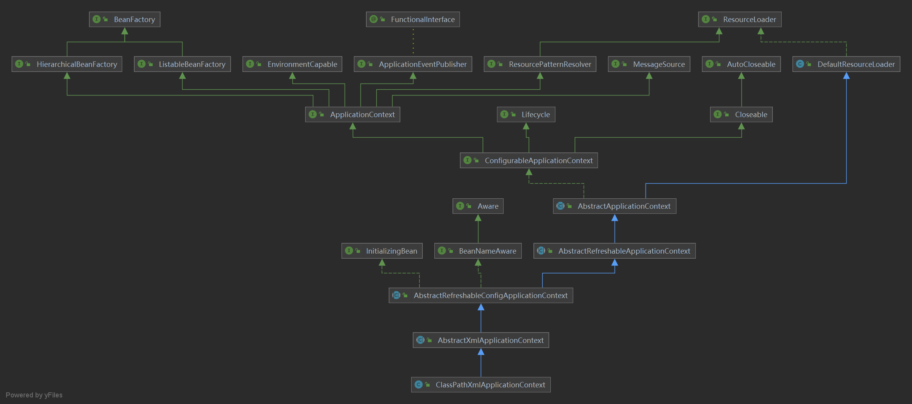

```java
public ClassPathXmlApplicationContext(String configLocation) throws BeansException {
		this(new String[] {configLocation}, true, null);
}
```

```java
public ClassPathXmlApplicationContext(
		String[] configLocations, boolean refresh, @Nullable ApplicationContext parent)
		throws BeansException {

	super(parent);
	setConfigLocations(configLocations);
	if (refresh) {
		refresh();
	}
}
```


AbstractApplicationContext

```java
@Override
	public void refresh() throws BeansException, IllegalStateException {
		synchronized (this.startupShutdownMonitor) {
		// 1. 准备刷新Spring上下文，主要用来记录Spring上下文加载开始时间，设置一些基础成员变量value
		prepareRefresh();

		// 2. 刷新BeanFactory，此方法内完成配置文件中配置的Bean到BeanDefinition的转化及注册
		ConfigurableListableBeanFactory beanFactory = obtainFreshBeanFactory();

		// 3. 准备Bean工厂，主要用来配置BeanFactory的基础信息，例如上下文的ClassLoader和后处理器
		prepareBeanFactory(beanFactory);

		try {
			// 4. 允许子context添加一些BeanFactoryPostProcessor，
			// 比如Web应用中AbstractRefreshableWebApplicationContext添加ServletContextAwareProcessor，
			// 可以暂时略过这个方法
			postProcessBeanFactory(beanFactory);

			// 5. 执行BeanFactoryPostProcessor中定义的方法
			invokeBeanFactoryPostProcessors(beanFactory);

			// 6. 注册所有的BeanPostProcessor，这部分BeanPostProcessor会在下面					   finishBeanFactoryInitialization方法
			// 过程中使用
			registerBeanPostProcessors(beanFactory);

			// 7. 初始化MessageSource，MessageSource是Spring定义的用于实现访问国际化的接口
			initMessageSource();

			// 8. 初始化上下文事件广播器
			initApplicationEventMulticaster();

			// 9. 模板方法，可以通过重写它添加特殊上下文刷新的工作
			onRefresh();

			// 10. 注册监听器
			registerListeners();

			// 11. 实例化所有定义的单例Bean
			finishBeanFactoryInitialization(beanFactory);

			// 结束Spring上下文刷新
			finishRefresh();
		}catch (BeansException ex) {
			if (logger.isWarnEnabled()) {
				logger.warn("Exception encountered during context initialization - " +
						"cancelling refresh attempt: " + ex);
			}

			// Destroy already created singletons to avoid dangling resources.
			destroyBeans();

			// Reset 'active' flag.
			cancelRefresh(ex);

			// Propagate exception to caller.
			throw ex;
		}

		finally {
			// Reset common introspection caches in Spring's core, since we
			// might not ever need metadata for singleton beans anymore...
			resetCommonCaches();
		}
	}
}
```





对于ClassPathXmlApplicationContext特别需要需要注意的是，其继承的抽象类**AbstractRefreshableApplicationContext有一个DefaultListableBeanFactory实例，**ClassPathXmlApplicationContext类能够实现Bean工厂的功能都是通过继承的该成员变量实现的。**该成员变量会在上述refresh方法的子方法obtainFreshBeanFactory中初始化**。

对于DefaultListableBeanFactory，我们需要重点关注的是，**该类同时实现了BeanFactory接口和BeanDefinitionRegistry接口，是Bean工厂也是Bean注册中心**。


下面我们来看一下Bean加载流程，其实也就是refresh方法的大致执行流程。

###  prepareRefresh

该方法是AbstractApplicationContext的方法，如下：

```java

	/**
	 * Prepare this context for refreshing, setting its startup date and
	 * active flag as well as performing any initialization of property sources.
	 * 准备此上下文以进行刷新、设置其启动日期和活动标志以及执行任何属性源的初始化。
	 */
	protected void prepareRefresh() {
		// Switch to active.
		this.startupDate = System.currentTimeMillis();
		this.closed.set(false);
		this.active.set(true);

		if (logger.isDebugEnabled()) {
			if (logger.isTraceEnabled()) {
				logger.trace("Refreshing " + this);
			}
			else {
				logger.debug("Refreshing " + getDisplayName());
			}
		}

		// Initialize any placeholder property sources in the context environment.
		initPropertySources();

		// Validate that all properties marked as required are resolvable:
		// see ConfigurablePropertyResolver#setRequiredProperties
		getEnvironment().validateRequiredProperties();

		// Store pre-refresh ApplicationListeners...
		if (this.earlyApplicationListeners == null) {
			this.earlyApplicationListeners = new LinkedHashSet<>(this.applicationListeners);
		}
		else {
			// Reset local application listeners to pre-refresh state.
			this.applicationListeners.clear();
			this.applicationListeners.addAll(this.earlyApplicationListeners);
		}

		// Allow for the collection of early ApplicationEvents,
		// to be published once the multicaster is available...
		this.earlyApplicationEvents = new LinkedHashSet<>();
	}
```

从方法注释就可以看到，该方法的功能是为刷新上下文做准备，设置Spring上下文加载开始时间。其余就是设置一些成员变量value，比如closed标志、active标志。很简单，也没有什么特别要讲的。


### obtainFreshBeanFactory

该方法对我们理解Spring Bean加载过程比较重要，需要重点关注。该方法是AbstractApplicationContext的方法，作用是获取刷新Spring上下文的Bean工厂，**该方法的返回值就是上面讲的AbstractRefreshableApplicationContext类的DefaultListableBeanFactory类型成员变量**。并且在该方法中，使用XMLBeanDefinitionReader完成了xml配置文件到BeanDefinition的转换，如下：

```java
protected ConfigurableListableBeanFactory obtainFreshBeanFactory() {
	refreshBeanFactory();
	return getBeanFactory();
}
```

该方法最终返回的对象是通过getBeanFactory方法获取的，而getBeanFactory方法在AbstractApplicationContext类中是个抽象方法：

```java
protected abstract void refreshBeanFactory() throws BeansException, IllegalStateException;
```

具体实现在子类AbstractRefreshableApplicationContext中，如下：

```java
	@Override
	protected final void refreshBeanFactory() throws BeansException {
		if (hasBeanFactory()) {
			destroyBeans();
			closeBeanFactory();
		}
		try {
			DefaultListableBeanFactory beanFactory = createBeanFactory();
			beanFactory.setSerializationId(getId());
			customizeBeanFactory(beanFactory);
			loadBeanDefinitions(beanFactory);
			synchronized (this.beanFactoryMonitor) {
				this.beanFactory = beanFactory;
			}
		}
		catch (IOException ex) {
			throw new ApplicationContextException("I/O error parsing bean definition source for " + getDisplayName(), ex);
		}
	}
```

方法实现其实其实就是返回**AbstractRefreshableApplicationContext**的成员变量实例。所以在上述调用**getBeanFactory**()方法之前，肯定完成了**AbstractRefreshableApplicationContext**成员变量**beanFactory**的初始化。来看一下调用**getBeanFactory**方法之前调用的**refreshBeanFactory**方法：

```java
protected abstract void refreshBeanFactory() throws BeansException, IllegalStateException;
```

也是**AbstractApplicationContext**类的抽象方法，具体实现在子类**AbstractRefreshableApplicationContext**：

```java
	
/**
*此实现执行此上下文的底层 bean 工厂的实际刷新，
*关闭先前的 bean 工厂（如果有）并为上下文生命周期的下一阶段初始*化一个新的 bean 工厂。
*/
@Override
	protected final void refreshBeanFactory() throws BeansException {
		if (hasBeanFactory()) {
			destroyBeans();
			closeBeanFactory();
		}
		try {
			DefaultListableBeanFactory beanFactory = createBeanFactory();
			beanFactory.setSerializationId(getId());
			customizeBeanFactory(beanFactory);
			loadBeanDefinitions(beanFactory);
			synchronized (this.beanFactoryMonitor) {
				this.beanFactory = beanFactory;
			}
		}
		catch (IOException ex) {
			throw new ApplicationContextException("I/O error parsing bean definition source for " + getDisplayName(), ex);
		}
}

```


### prepareBeanFactory

**prepareBeanFactory**方法是**AbstractApplicationContext**类的方法，用于配置**BeanFactory**的基本特性：

```java

/**
* 配置BeanFactory的基本特性，比如ClassLoader、post-processor后置处理器
*/
protected void prepareBeanFactory(ConfigurableListableBeanFactory beanFactory) {
	// 1. 为beanFactory配置classLoader
	beanFactory.setBeanClassLoader(getClassLoader());
	// 2. 为beanFactory设置spEl表达是语言处理器，用来解析#{bean.xxx}方式设置的属性值
	beanFactory.setBeanExpressionResolver(new StandardBeanExpressionResolver(beanFactory.getBeanClassLoader()));
	// 3. 为beanFactory设置属性编辑器
	beanFactory.addPropertyEditorRegistrar(new ResourceEditorRegistrar(this, getEnvironment()));

	// 4. 为beanFactory添加ApplicationContextAwareProcessor用于上下文回调
	beanFactory.addBeanPostProcessor(new ApplicationContextAwareProcessor(this));

	// 5. 设置下面这些接口的实现类Bean不会被自动装配
	beanFactory.ignoreDependencyInterface(EnvironmentAware.class);
	beanFactory.ignoreDependencyInterface(EmbeddedValueResolverAware.class);
	beanFactory.ignoreDependencyInterface(ResourceLoaderAware.class);
	beanFactory.ignoreDependencyInterface(ApplicationEventPublisherAware.class);
	beanFactory.ignoreDependencyInterface(MessageSourceAware.class);
	beanFactory.ignoreDependencyInterface(ApplicationContextAware.class);

	// 6. 修正依赖，设置自动装配的特殊规则，比如是BeanFactory接口的实现类，则修正为当前BeanFactory
	beanFactory.registerResolvableDependency(BeanFactory.class, beanFactory);
	beanFactory.registerResolvableDependency(ResourceLoader.class, this);
	beanFactory.registerResolvableDependency(ApplicationEventPublisher.class, this);
	beanFactory.registerResolvableDependency(ApplicationContext.class, this);

	// 7. 为beanFactory添加ApplicationListenerDetector后置处理器，用于将实现了ApplicationListener接口的bean注册为监听器
	beanFactory.addBeanPostProcessor(new ApplicationListenerDetector(this));

	// 8. 如果自定义的Bean中有定义过名为"loadTimeWeaver"的Bean，则会添加一个LoadTimeWeaverAwareProcessor
	if (beanFactory.containsBean(LOAD_TIME_WEAVER_BEAN_NAME)) {
		beanFactory.addBeanPostProcessor(new LoadTimeWeaverAwareProcessor(beanFactory));
		// Set a temporary ClassLoader for type matching.
		beanFactory.setTempClassLoader(new ContextTypeMatchClassLoader(beanFactory.getBeanClassLoader()));
	}

	// 9. 为beanFactory注册系统环境信息bean，比如"environment"、"systemProperties"、"systemEnvironment"
	if (!beanFactory.containsLocalBean(ENVIRONMENT_BEAN_NAME)) {
		beanFactory.registerSingleton(ENVIRONMENT_BEAN_NAME, getEnvironment());
	}
	if (!beanFactory.containsLocalBean(SYSTEM_PROPERTIES_BEAN_NAME)) {
		beanFactory.registerSingleton(SYSTEM_PROPERTIES_BEAN_NAME, getEnvironment().getSystemProperties());
	}
	if (!beanFactory.containsLocalBean(SYSTEM_ENVIRONMENT_BEAN_NAME)) {
		beanFactory.registerSingleton(SYSTEM_ENVIRONMENT_BEAN_NAME, getEnvironment().getSystemEnvironment());
	}
}
```


