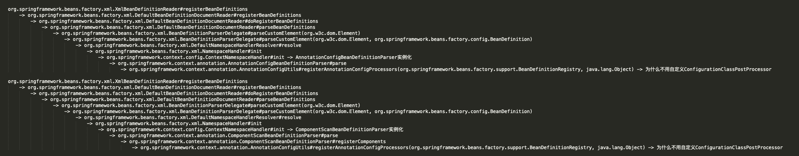
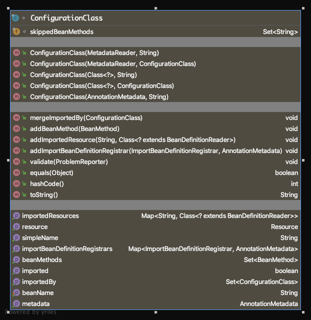
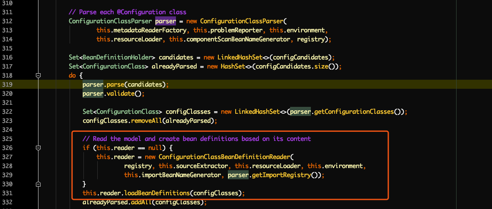

# [Spring源码解读『@Configuration配置类』](http://lidol.top/frame/2606/)

2020-04-27 分类：[Spring](http://lidol.top/category/frame/spring/) / [框架](http://lidol.top/category/frame/) 阅读(608) 评论(0)

上篇文章我们介绍了通过xml配置文件来解析Bean配置的过程，本篇文章我们来看另一种解析Bean配置的方式，@Configuration配置类。在Spring应用中，为了使用@Configuration配置类，如果使用xml启动ApplicationContext，我们一般会在xml配置文件中加上如下一行配置：

``` xml
<context:component-scan base-package="com.zhuoli.service.spring.explore.config"/>
```

以告诉Spring容器Config配置类的位置，Spring在启动时会自动解析base-package包中该包下的@Configuration配置类。在解析的过程中，如果配置类中存在@Bean声明的方法，该方法会被解析成BeanDefinition并注册到BeanFactory。这样就算跟xml配置文件Bean解析的过程拉平了，BeanDefinition解析之后的流程就是统一的了。

## 1. @Configuration使用示例

``` java
package com.zhuoli.service.spring.explore.config;

public class TestBeanA {
    private String testName;

    public void setTestName(String testName) {
        this.testName = testName;
    }

    public String getTestName() {
        return testName;
    }
}
package com.zhuoli.service.spring.explore.config;

public class TestBeanB {
    private String testName;

    public void setTestName(String testName) {
        this.testName = testName;
    }

    public String getTestName() {
        return testName;
    }
}
package com.zhuoli.service.spring.explore.config;

import org.springframework.context.annotation.Bean;
import org.springframework.context.annotation.Configuration;

@Configuration
public class MyConfiguration {

    @Bean
    public TestBeanA configTestBeanA(){
        TestBeanA testBeanA = new TestBeanA();
        testBeanA.setTestName("configTestBeanA");
        return testBeanA;
    }

    @Bean
    public TestBeanB configTestBeanB() {
        TestBeanB testBeanB = new TestBeanB();
        testBeanB.setTestName("configTestBeanB");
        return testBeanB;
    }
}
<?xml version="1.0" encoding="UTF-8"?>
<beans xmlns="http://www.springframework.org/schema/beans"
       xmlns:xsi="http://www.w3.org/2001/XMLSchema-instance"
       xmlns:context="http://www.springframework.org/schema/context"
       xsi:schemaLocation="http://www.springframework.org/schema/beans
http://www.springframework.org/schema/beans/spring-beans-4.1.xsd http://www.springframework.org/schema/context https://www.springframework.org/schema/context/spring-context.xsd">
    <context:component-scan base-package="com.zhuoli.service.spring.explore.config"/>

    <bean id="testBeanA" class="com.zhuoli.service.spring.explore.config.TestBeanA">
        <property name="testName" value="xmlTestBeanA"/>
    </bean>

    <bean id="testBeanB" class="com.zhuoli.service.spring.explore.config.TestBeanB">
        <property name="testName" value="xmlTestBeanB"/>
    </bean>
</beans>
```

这里分别通过配置类和xml配置文件配置了TestBeanA、TestBeanB的bean，下面通过xml启动Spring：

``` java
public class SpringConfigTest {
    public static void main(String[] args) {
        AbstractApplicationContext applicationContext = new ClassPathXmlApplicationContext("classpath:spring-config.xml");
        TestBeanA xmlTestBeanA = (TestBeanA) applicationContext.getBean("testBeanA");
        TestBeanA configTestBeanA = (TestBeanA) applicationContext.getBean("configTestBeanA");
        TestBeanB xmlTestBeanB = (TestBeanB) applicationContext.getBean("testBeanB");
        TestBeanB configTestBeanB = (TestBeanB) applicationContext.getBean("configTestBeanB");
        System.out.println(xmlTestBeanA.getTestName());
        System.out.println(configTestBeanA.getTestName());
        System.out.println(xmlTestBeanB.getTestName());
        System.out.println(configTestBeanB.getTestName());
        applicationContext.close();
    }
}
```

运行结果：

```
xmlTestBeanA
configTestBeanA
xmlTestBeanB
configTestBeanB
```

可以得出结论，@Configuration配置类和xml配置文件同时生效了。这里我们也可以做个试验，把xml配置文件的<component-scan>去除，看一下@Configuration配置类中配置的configTestBeanA和configTestBeanB是否还能拿到，结论是否定的，至于原因，我们再后面的源码解读部分再揭晓。

## 2. @Configuration源码解读

跟@Configuration配置类解析相关的类有三个ConfigurationClassPostProcessor、ConfigurationClassParser和ConfigurationClassBeanDefinitionReader。

- ConfigurationClassPostProcessor：该类是BeanDefinitionRegistryPostProcessor/BeanFactoryPostProcessor，按照之前文章的介绍，该类的postProcessBeanDefinitionRegistry方法会在Bean实例化之前调用invokeBeanFactoryPostProcessors方法中调用
- ConfigurationClassParser：该类用于解析@Configuration注解的配置类，生成一组ConfigurationClass对象
- ConfigurationClassBeanDefinitionReader：该类用于解析ConfigurationClassParser生成的ConfigurationClass对象，加载并注册BeanDefinition

### 2.1 ConfigurationClassPostProcessor

该类是BeanDefinitionRegistryPostProcessor/BeanFactoryPostProcessor，我们之前介绍过，在Spring Context加载一个核心方法

``` java
org.springframework.context.support.AbstractApplicationContext#refresh
```

中调用了一个方法invokeBeanFactoryPostProcessors用于执行BeanDefinitionRegistryPostProcessor的postProcessBeanDefinitionRegistry方法，和BeanFactoryPostProcessor的postProcessBeanFactory方法。而@Configuration配置类中声明的Bean就是在postProcessBeanDefinitionRegistry方法中完成解析和注册的。

#### 2.1.1 postProcessBeanDefinitionRegistry

``` java
public void postProcessBeanDefinitionRegistry(BeanDefinitionRegistry registry) {
	int registryId = System.identityHashCode(registry);
	if (this.registriesPostProcessed.contains(registryId)) {
		throw new IllegalStateException(
				"postProcessBeanDefinitionRegistry already called on this post-processor against " + registry);
	}
	if (this.factoriesPostProcessed.contains(registryId)) {
		throw new IllegalStateException(
				"postProcessBeanFactory already called on this post-processor against " + registry);
	}
	this.registriesPostProcessed.add(registryId);

	processConfigBeanDefinitions(registry);
}
```

核心代码是最后的调用的processConfigBeanDefinitions方法，继续跟进。

``` java
/**
 * Build and validate a configuration model based on the registry of
 * {@link Configuration} classes.
 */
public void processConfigBeanDefinitions(BeanDefinitionRegistry registry) {
	List<BeanDefinitionHolder> configCandidates = new ArrayList<>();
	String[] candidateNames = registry.getBeanDefinitionNames();

	for (String beanName : candidateNames) {
		BeanDefinition beanDef = registry.getBeanDefinition(beanName);
		if (ConfigurationClassUtils.isFullConfigurationClass(beanDef) ||
				ConfigurationClassUtils.isLiteConfigurationClass(beanDef)) {
			if (logger.isDebugEnabled()) {
				logger.debug("Bean definition has already been processed as a configuration class: " + beanDef);
			}
		}
		else if (ConfigurationClassUtils.checkConfigurationClassCandidate(beanDef, this.metadataReaderFactory)) {
			// 1. 将所有的@Configuration配置类添加到List configCandidates中
			configCandidates.add(new BeanDefinitionHolder(beanDef, beanName));
		}
	}

	// Return immediately if no @Configuration classes were found
	if (configCandidates.isEmpty()) {
		return;
	}

	// Sort by previously determined @Order value, if applicable
	configCandidates.sort((bd1, bd2) -> {
		int i1 = ConfigurationClassUtils.getOrder(bd1.getBeanDefinition());
		int i2 = ConfigurationClassUtils.getOrder(bd2.getBeanDefinition());
		return Integer.compare(i1, i2);
	});

	// Detect any custom bean name generation strategy supplied through the enclosing application context
	SingletonBeanRegistry sbr = null;
	if (registry instanceof SingletonBeanRegistry) {
		sbr = (SingletonBeanRegistry) registry;
		if (!this.localBeanNameGeneratorSet) {
			BeanNameGenerator generator = (BeanNameGenerator) sbr.getSingleton(CONFIGURATION_BEAN_NAME_GENERATOR);
			if (generator != null) {
				this.componentScanBeanNameGenerator = generator;
				this.importBeanNameGenerator = generator;
			}
		}
	}

	if (this.environment == null) {
		this.environment = new StandardEnvironment();
	}

	// Parse each @Configuration class
	// 2. 解析每一个@Configuration配置类，生成ConfigurationClass对象
	ConfigurationClassParser parser = new ConfigurationClassParser(
			this.metadataReaderFactory, this.problemReporter, this.environment,
			this.resourceLoader, this.componentScanBeanNameGenerator, registry);

	Set<BeanDefinitionHolder> candidates = new LinkedHashSet<>(configCandidates);
	Set<ConfigurationClass> alreadyParsed = new HashSet<>(configCandidates.size());
	do {
		parser.parse(candidates);
		parser.validate();

		// parser.getConfigurationClasses()获取所有通过@Configuration配置类解析得到的ConfigurationClass对象
		Set<ConfigurationClass> configClasses = new LinkedHashSet<>(parser.getConfigurationClasses());
		configClasses.removeAll(alreadyParsed);

		// Read the model and create bean definitions based on its content
		// 3. 初始化ConfigurationClassBeanDefinitionReader，用于从ConfigurationClass对象中解析并注册Bean
		if (this.reader == null) {
			this.reader = new ConfigurationClassBeanDefinitionReader(
					registry, this.sourceExtractor, this.resourceLoader, this.environment,
					this.importBeanNameGenerator, parser.getImportRegistry());
		}
		// 4. loadBeanDefinitions解析并注册BeanDefinition
		this.reader.loadBeanDefinitions(configClasses);
		alreadyParsed.addAll(configClasses);

		// 5. 清空已解析的@Configuration BeanDefinitionHolder
		candidates.clear();

		// 6. 经过一轮do循环,现在容器中Bean定义数量超过了该次循环开始时的容器内Bean定义数量，
		// 说明在该次循环中发现并注册了更多的Bean定义到容器中去，这些新注册的Bean定义
		// 也有可能是候选配置类，它们也要被处理用来发现和注册Bean定义
		if (registry.getBeanDefinitionCount() > candidateNames.length) {
			String[] newCandidateNames = registry.getBeanDefinitionNames();
			Set<String> oldCandidateNames = new HashSet<>(Arrays.asList(candidateNames));
			Set<String> alreadyParsedClasses = new HashSet<>();
			for (ConfigurationClass configurationClass : alreadyParsed) {
				alreadyParsedClasses.add(configurationClass.getMetadata().getClassName());
			}
			for (String candidateName : newCandidateNames) {
				if (!oldCandidateNames.contains(candidateName)) {
					BeanDefinition bd = registry.getBeanDefinition(candidateName);
					if (ConfigurationClassUtils.checkConfigurationClassCandidate(bd, this.metadataReaderFactory) &&
							!alreadyParsedClasses.contains(bd.getBeanClassName())) {
						candidates.add(new BeanDefinitionHolder(bd, candidateName));
					}
				}
			}
			candidateNames = newCandidateNames;
		}
	}
	while (!candidates.isEmpty());

	// Register the ImportRegistry as a bean in order to support ImportAware @Configuration classes
	if (sbr != null && !sbr.containsSingleton(IMPORT_REGISTRY_BEAN_NAME)) {
		sbr.registerSingleton(IMPORT_REGISTRY_BEAN_NAME, parser.getImportRegistry());
	}

	if (this.metadataReaderFactory instanceof CachingMetadataReaderFactory) {
			// Clear cache in externally provided MetadataReaderFactory; this is a no-op
			// for a shared cache since it'll be cleared by the ApplicationContext.
			((CachingMetadataReaderFactory) this.metadataReaderFactory).clearCache();
	}
}
```

上述代码的核心就是2、3、4，后面在介绍ConfigurationClassParser和ConfigurationClassBeanDefinitionReader时再分别介绍。总的来说，通过该方法，完成了将@Configuration配置类中声明的Bean解析并注册到注册中心，这一步跟xml文件的解析和注册是一致的。

#### 2.1.2 postProcessBeanFactory

``` java
/**
 * Prepare the Configuration classes for servicing bean requests at runtime
 * by replacing them with CGLIB-enhanced subclasses.
 */
@Override
public void postProcessBeanFactory(ConfigurableListableBeanFactory beanFactory) {
	int factoryId = System.identityHashCode(beanFactory);
	if (this.factoriesPostProcessed.contains(factoryId)) {
		throw new IllegalStateException(
				"postProcessBeanFactory already called on this post-processor against " + beanFactory);
	}
	this.factoriesPostProcessed.add(factoryId);
	if (!this.registriesPostProcessed.contains(factoryId)) {
		// BeanDefinitionRegistryPostProcessor hook apparently not supported...
		// Simply call processConfigurationClasses lazily at this point then.
		processConfigBeanDefinitions((BeanDefinitionRegistry) beanFactory);
	}

	// 1. 对容器中的配置类做增强
	enhanceConfigurationClasses(beanFactory);
	// 2. 向容器中增加一个ImportAwareBeanPostProcessor(如果所增加组件已经存在会先将其删除然后重新添加)
	beanFactory.addBeanPostProcessor(new ImportAwareBeanPostProcessor(beanFactory));
}
```

#### 2.1.3 ConfigurationClassPostProcessor何时引入的

最开始的示例中，我们并没有在xml配置文件中显式声明一个ConfigurationClassPostProcessor的Bean，但是在该BeanFactoryPostProcessor却生效了，也就是说肯定有地方替我们声明了该Bean，这也是阅读代码过程中困扰了我很久的地方。这里在仅介绍通过xml配置文件的方式启动Spring，该BeanFactoryPostProcessor是如何引入的。通过配置类启动Spring的方式该BeanFactoryPostProcessor的引入区别比较大，我们在后面介绍通过配置类启动Spring时再介绍。

通过观察发现，我们在xml配置文件中添加了这么一行配置：

``` xml
<context:component-scan base-package="com.zhuoli.service.spring.explore.config"/>
```

来告诉Spring容器，需要扫描的配置类的位置，就是在解析<context:component-scan/> xml配置时，完成了ConfigurationClassPostProcessor的注册。除了<context:component-scan/>，<context:annotation-config/>解析的过程也可以完成ConfigurationClassPostProcessor的注册。执行链路如下：

[](http://cdn.lidol.top/lidol_blog/20200520075908.png)

### 2.2 ConfigurationClassParser

在上述postProcessBeanDefinitionRegistry方法中，声明了ConfigurationClassParser对象，并调用了该类的parse方法。**ConfigurationClassParser用于解析@Configuration配置类，并解析配置类的注解，比如@PropertySource、 @ComponentScan、@Import、@ImportResource，以及配置类中使用@Bean注解的方法。**

**这里需要注意的是，对@ComponentScan的解析跟其他内容解析有所不同，ConfigurationClassParser中会通过ComponentScanAnnotationParser扫描指定包下的Bean定义，并将其注册到BeanFactory。对于配置类而言，ConfigurationClassParser仅仅是将其解析为ConfigurationClass对象，交给调用方ConfigurationClassPostProcessor使用（后续会通过ConfigurationClassBeanDefinitionReader从ConfigurationClass中加载BeanDefinition）。**

它的解析过程会通过一组种子配置类(base-package指定的)，从这些种子配置类开始分析所有关联的配置类，分析过程主要是递归分析配置类的注解@Import，配置类内部嵌套类，找出其中所有的配置类，然后返回这组配置类对应的ConfigurationClass对象。

#### 2.2.1 org.springframework.context.annotation.ConfigurationClassParser#parse(java.util.Set)

``` java
/**
 * configCandidates : 外部指定需要被分析的一组候选配置类BeanDefinitionHolder
 * 这些配置类BeanDefinitionHolder是在ComponentScanBeanDefinitionParser中得到的
 **/
public void parse(Set<BeanDefinitionHolder> configCandidates) {
	for (BeanDefinitionHolder holder : configCandidates) {
		BeanDefinition bd = holder.getBeanDefinition();
		try {
			// 根据BeanDefinition类型走不同的分支
			// 最终都会调用processConfigurationClass方法，解析注解类
			if (bd instanceof AnnotatedBeanDefinition) {
				parse(((AnnotatedBeanDefinition) bd).getMetadata(), holder.getBeanName());
			}
			else if (bd instanceof AbstractBeanDefinition && ((AbstractBeanDefinition) bd).hasBeanClass()) {
				parse(((AbstractBeanDefinition) bd).getBeanClass(), holder.getBeanName());
			}
			else {
				parse(bd.getBeanClassName(), holder.getBeanName());
			}
		}
		catch (BeanDefinitionStoreException ex) {
			throw ex;
		}
		catch (Throwable ex) {
			throw new BeanDefinitionStoreException(
					"Failed to parse configuration class [" + bd.getBeanClassName() + "]", ex);
		}
	}

	this.deferredImportSelectorHandler.process();
}
```

#### 2.2.2 org.springframework.context.annotation.ConfigurationClassParser#processConfigurationClass

``` java
protected void processConfigurationClass(ConfigurationClass configClass, Predicate<String> filter) throws IOException {
	if (this.conditionEvaluator.shouldSkip(configClass.getMetadata(), ConfigurationPhase.PARSE_CONFIGURATION)) {
		return;
	}

	ConfigurationClass existingClass = this.configurationClasses.get(configClass);
	// 1. 如果配置类已经解析过
	if (existingClass != null) {
		if (configClass.isImported()) {
			if (existingClass.isImported()) {
				existingClass.mergeImportedBy(configClass);
			}
			// Otherwise ignore new imported config class; existing non-imported class overrides it.
			return;
		}
		else {
			// Explicit bean definition found, probably replacing an import.
			// Let's remove the old one and go with the new one.
			this.configurationClasses.remove(configClass);
			this.knownSuperclasses.values().removeIf(configClass::equals);
		}
	}

	// 2. 解析配置类
	SourceClass sourceClass = asSourceClass(configClass, filter);
	do {
		// 从当前配置类configClass开始向上沿着类继承结构逐层执行doProcessConfigurationClass,
		// 直到遇到的父类是由Java提供的类结束循环
		sourceClass = doProcessConfigurationClass(configClass, sourceClass, filter);
	}
	while (sourceClass != null);

	// 3. 将解析结果configClass放到Map configurationClasses
	this.configurationClasses.put(configClass, configClass);
}
```

#### 2.2.3 doProcessConfigurationClass

``` java
/**
 * @return annotation metadata of superclass, {@code null} if none found or previously processed
 */
protected AnnotationMetadata doProcessConfigurationClass(ConfigurationClass configClass, AnnotationMetadata metadata) throws IOException {
	// recursively process any member (nested) classes first
	// 1. 首先递归处理嵌套类
	processMemberClasses(metadata);

	// process any @PropertySource annotations
	// 2. 处理配置类@PropertySource注解
	AnnotationAttributes propertySource = MetadataUtils.attributesFor(metadata,
			org.springframework.context.annotation.PropertySource.class);
	if (propertySource != null) {
		processPropertySource(propertySource);
	}

	// process any @ComponentScan annotations
	// 3. 处理配置类@ComponentScan注解
	AnnotationAttributes componentScan = MetadataUtils.attributesFor(metadata, ComponentScan.class);
	if (componentScan != null) {
		// the config class is annotated with @ComponentScan -> perform the scan immediately
		// 通过ComponentScanAnnotationParser将@ComponentScan注解指定包下的Bean解析为BeanDefinition并注册到BeanFactory
		Set<BeanDefinitionHolder> scannedBeanDefinitions =
				this.componentScanParser.parse(componentScan, metadata.getClassName());

		// check the set of scanned definitions for any further config classes and parse recursively if necessary
		for (BeanDefinitionHolder holder : scannedBeanDefinitions) {
			// 检查ComponentScanAnnotationParser扫描得到的BeanDefinition是有有配置类，如果有配置类，调用parse方法对配置类进行解析
			if (ConfigurationClassUtils.checkConfigurationClassCandidate(holder.getBeanDefinition(), this.metadataReaderFactory)) {
				this.parse(holder.getBeanDefinition().getBeanClassName(), holder.getBeanName());
			}
		}
	}

	// process any @Import annotations
	// 4. 处理配置类@Import注解
	// collectImports()方法，它会搜集metadata所有的@Import注解的value值，并递归访问@Import
	Set<Object> imports = new LinkedHashSet<Object>();
	Set<Object> visited = new LinkedHashSet<Object>();
	collectImports(metadata, imports, visited);
	if (!imports.isEmpty()) {
		processImport(configClass, metadata, imports, true);
	}

	// process any @ImportResource annotations
	// 5. 处理配置类@ImportResource注解
	if (metadata.isAnnotated(ImportResource.class.getName())) {
		AnnotationAttributes importResource = MetadataUtils.attributesFor(metadata, ImportResource.class);
		String[] resources = importResource.getStringArray("value");
		Class<? extends BeanDefinitionReader> readerClass = importResource.getClass("reader");
		for (String resource : resources) {
			String resolvedResource = this.environment.resolveRequiredPlaceholders(resource);
			configClass.addImportedResource(resolvedResource, readerClass);
		}
	}

	// process individual @Bean methods
	// 6. 处理配置类中带有@Bean注解的方法
	Set<MethodMetadata> beanMethods = metadata.getAnnotatedMethods(Bean.class.getName());
	for (MethodMetadata methodMetadata : beanMethods) {
		configClass.addBeanMethod(new BeanMethod(methodMetadata, configClass));
	}

	// process superclass, if any
	// 7. 如果父类superclass存在，并且不是`java`包中的类，并且尚未处理处理，则才返回它以便外层循环继续
	if (metadata.hasSuperClass()) {
		String superclass = metadata.getSuperClassName();
		if (!superclass.startsWith("java") && !this.knownSuperclasses.containsKey(superclass)) {
			this.knownSuperclasses.put(superclass, configClass);
			// superclass found, return its annotation metadata and recurse
			if (metadata instanceof StandardAnnotationMetadata) {
				Class<?> clazz = ((StandardAnnotationMetadata) metadata).getIntrospectedClass();
				return new StandardAnnotationMetadata(clazz.getSuperclass(), true);
			}
			else {
				MetadataReader reader = this.metadataReaderFactory.getMetadataReader(superclass);
				return reader.getAnnotationMetadata();
			}
		}
	}

	// no superclass, processing is complete
	// 8. 没找到需要处理的父类，返回null告诉外层循环结束
	return null;
}
```

通过调用ConfigurationClassParser类的parse方法，完成了配置类到ConfigurationClass对象的转换，并存储在ConfigurationClassParser类的成员变量configurationClasses中。ConfigurationClass类定义如下所示，调用方ConfigurationClassPostProcessor会实例化一个ConfigurationClassBeanDefinitionReader对象，解析并注册configurationClasses中每一个ConfigurationClass中定义的Bean（在ConfigurationClass中指beanMethods）。通过ConfigurationClassPostProcessor完成了@Configuration配置类的解析。

[](http://cdn.lidol.top/lidol_blog/ConfigurationClass.png)

### 2.3 ConfigurationClassBeanDefinitionReader

上面讲到，通过ConfigurationClassPostProcessor#processConfigBeanDefinitions方法中调用ConfigurationClassParser#parse(java.util.Set)方法，我们得到了一个ConfigurationClass的List。然后在processConfigBeanDefinitions方法中，会通过ConfigurationClassBeanDefinitionReader对ConfigurationClass进行解析。如下：

[](http://cdn.lidol.top/lidol_blog/20200611080059.png)

#### 2.3.1 loadBeanDefinitions

``` java
public void loadBeanDefinitions(Set<ConfigurationClass> configurationModel) {
	TrackedConditionEvaluator trackedConditionEvaluator = new TrackedConditionEvaluator();
	// 遍历配置类，解析并注册bean
	for (ConfigurationClass configClass : configurationModel) {
		loadBeanDefinitionsForConfigurationClass(configClass, trackedConditionEvaluator);
	}
}
```

#### 2.3.2 loadBeanDefinitionsForConfigurationClass
 
``` java
/**
* 从指定的一个配置类ConfigurationClass中提取bean定义信息并注册bean定义到bean容器 :
* 1. 配置类本身要注册为bean定义
* 2. 配置类中的@Bean注解方法要注册为配置类
*/
private void loadBeanDefinitionsForConfigurationClass(
		ConfigurationClass configClass, TrackedConditionEvaluator trackedConditionEvaluator) {

	if (trackedConditionEvaluator.shouldSkip(configClass)) {
		String beanName = configClass.getBeanName();
		if (StringUtils.hasLength(beanName) && this.registry.containsBeanDefinition(beanName)) {
			this.registry.removeBeanDefinition(beanName);
		}
		this.importRegistry.removeImportingClass(configClass.getMetadata().getClassName());
		return;
	}

	// 如果这是一个通过import机制被导入进来的配置类，将它本身作为一个bean定义注册到容器
	if (configClass.isImported()) {
		registerBeanDefinitionForImportedConfigurationClass(configClass);
	}

	// 配置类里面@Bean注解的方法作为bean定义注册到容器
	for (BeanMethod beanMethod : configClass.getBeanMethods()) {
		loadBeanDefinitionsForBeanMethod(beanMethod);
	}

	// 从配置类导入的文件中获取bean定义信息并注册到容器
	// 从xml或者groovy bean定义文件解析并注册bean
	loadBeanDefinitionsFromImportedResources(configClass.getImportedResources());
	// 从导入的ImportBeanDefinitionRegistrar中获取bean定义信息并注册到容器
	loadBeanDefinitionsFromRegistrars(configClass.getImportBeanDefinitionRegistrars());
}
```

#### 2.3.3 loadBeanDefinitionsForBeanMethod

``` java
/**
* 解析配置类中@Bean注解的配置类方法作为bean定义，并注册到bean容器
*/
private void loadBeanDefinitionsForBeanMethod(BeanMethod beanMethod) {
	ConfigurationClass configClass = beanMethod.getConfigurationClass();
	MethodMetadata metadata = beanMethod.getMetadata();
	String methodName = metadata.getMethodName();

	// Do we need to mark the bean as skipped by its condition?
	if (this.conditionEvaluator.shouldSkip(metadata, ConfigurationPhase.REGISTER_BEAN)) {
		configClass.skippedBeanMethods.add(methodName);
		return;
	}
	if (configClass.skippedBeanMethods.contains(methodName)) {
		return;
	}

	AnnotationAttributes bean = AnnotationConfigUtils.attributesFor(metadata, Bean.class);
	Assert.state(bean != null, "No @Bean annotation attributes");

	// Consider name and any aliases
	List<String> names = new ArrayList<>(Arrays.asList(bean.getStringArray("name")));
	String beanName = (!names.isEmpty() ? names.remove(0) : methodName);

	// Register aliases even when overridden
	for (String alias : names) {
		this.registry.registerAlias(beanName, alias);
	}

	// Has this effectively been overridden before (e.g. via XML)?
	if (isOverriddenByExistingDefinition(beanMethod, beanName)) {
		if (beanName.equals(beanMethod.getConfigurationClass().getBeanName())) {
			throw new BeanDefinitionStoreException(beanMethod.getConfigurationClass().getResource().getDescription(),
					beanName, "Bean name derived from @Bean method '" + beanMethod.getMetadata().getMethodName() +
					"' clashes with bean name for containing configuration class; please make those names unique!");
		}
		return;
	}

	ConfigurationClassBeanDefinition beanDef = new ConfigurationClassBeanDefinition(configClass, metadata);
	beanDef.setResource(configClass.getResource());
	beanDef.setSource(this.sourceExtractor.extractSource(metadata, configClass.getResource()));

	if (metadata.isStatic()) {
		// static @Bean method
		beanDef.setBeanClassName(configClass.getMetadata().getClassName());
		beanDef.setFactoryMethodName(methodName);
	}
	else {
		// instance @Bean method
		beanDef.setFactoryBeanName(configClass.getBeanName());
		beanDef.setUniqueFactoryMethodName(methodName);
	}
	beanDef.setAutowireMode(AbstractBeanDefinition.AUTOWIRE_CONSTRUCTOR);
	beanDef.setAttribute(RequiredAnnotationBeanPostProcessor.SKIP_REQUIRED_CHECK_ATTRIBUTE, Boolean.TRUE);

	AnnotationConfigUtils.processCommonDefinitionAnnotations(beanDef, metadata);

	Autowire autowire = bean.getEnum("autowire");
	if (autowire.isAutowire()) {
		beanDef.setAutowireMode(autowire.value());
	}

	String initMethodName = bean.getString("initMethod");
	if (StringUtils.hasText(initMethodName)) {
		beanDef.setInitMethodName(initMethodName);
	}

	String destroyMethodName = bean.getString("destroyMethod");
	beanDef.setDestroyMethodName(destroyMethodName);

	// Consider scoping
	ScopedProxyMode proxyMode = ScopedProxyMode.NO;
	AnnotationAttributes attributes = AnnotationConfigUtils.attributesFor(metadata, Scope.class);
	if (attributes != null) {
		beanDef.setScope(attributes.getString("value"));
		proxyMode = attributes.getEnum("proxyMode");
		if (proxyMode == ScopedProxyMode.DEFAULT) {
			proxyMode = ScopedProxyMode.NO;
		}
	}

	// Replace the original bean definition with the target one, if necessary
	BeanDefinition beanDefToRegister = beanDef;
	if (proxyMode != ScopedProxyMode.NO) {
		BeanDefinitionHolder proxyDef = ScopedProxyCreator.createScopedProxy(
				new BeanDefinitionHolder(beanDef, beanName), this.registry,
				proxyMode == ScopedProxyMode.TARGET_CLASS);
		beanDefToRegister = new ConfigurationClassBeanDefinition(
				(RootBeanDefinition) proxyDef.getBeanDefinition(), configClass, metadata);
	}

	if (logger.isDebugEnabled()) {
		logger.debug(String.format("Registering bean definition for @Bean method %s.%s()",
				configClass.getMetadata().getClassName(), beanName));
	}
	this.registry.registerBeanDefinition(beanName, beanDefToRegister);
}
```

#### 2.3.4 loadBeanDefinitionsFromImportedResources

``` java
/**
* 从xml或者groovy bean定义文件解析并注册bean
*/
private void loadBeanDefinitionsFromImportedResources(
		Map<String, Class<? extends BeanDefinitionReader>> importedResources) {

	Map<Class<?>, BeanDefinitionReader> readerInstanceCache = new HashMap<>();

	importedResources.forEach((resource, readerClass) -> {
		// Default reader selection necessary?
		if (BeanDefinitionReader.class == readerClass) {
			if (StringUtils.endsWithIgnoreCase(resource, ".groovy")) {
				// 如果是groovy bean定义文件采用GroovyBeanDefinitionReader读取类解析
				readerClass = GroovyBeanDefinitionReader.class;
			}
			else {
				// 如果是xml bean定义文件采用XmlBeanDefinitionReader读取类解析
				readerClass = XmlBeanDefinitionReader.class;
			}
		}

		BeanDefinitionReader reader = readerInstanceCache.get(readerClass);
		if (reader == null) {
			try {
				// Instantiate the specified BeanDefinitionReader
				reader = readerClass.getConstructor(BeanDefinitionRegistry.class).newInstance(this.registry);
				// Delegate the current ResourceLoader to it if possible
				if (reader instanceof AbstractBeanDefinitionReader) {
					AbstractBeanDefinitionReader abdr = ((AbstractBeanDefinitionReader) reader);
					abdr.setResourceLoader(this.resourceLoader);
					abdr.setEnvironment(this.environment);
				}
				readerInstanceCache.put(readerClass, reader);
			}
			catch (Throwable ex) {
				throw new IllegalStateException(
						"Could not instantiate BeanDefinitionReader class [" + readerClass.getName() + "]");
			}
		}

		// TODO SPR-6310: qualify relative path locations as done in AbstractContextLoader.modifyLocations
		// 从导入的xml或者groovy文件中读取bean定义并注册到bean容器
		reader.loadBeanDefinitions(resource);
	});
}
```

#### 2.3.5 loadBeanDefinitionsFromRegistrars

``` java
/**
* 对配置类中所有通过@Import导入的ImportBeanDefinitionRegistrar类，遍历调用registerBeanDefinitions方法注册bean
*/
private void loadBeanDefinitionsFromRegistrars(Map<ImportBeanDefinitionRegistrar, AnnotationMetadata> registrars) {
	registrars.forEach((registrar, metadata) ->
			registrar.registerBeanDefinitions(metadata, this.registry));
}
```

以上就是通过xml启动的Spring容器，如何完成对@Configuration注解的配置类中定义的Bean的解析和注册过程。接下来的文章，我们会来介绍一下，通过配置类启动的spring容器，如何完成Bean的解析和注册的。

> 参考链接：
>
> 1. [Spring BeanDefinitionRegistryPostProcessor : ConfigurationClassPostProcessor](https://blog.csdn.net/andy_zhang2007/article/details/78579464)
>
> 2. [Spring 工具类 ConfigurationClassParser 分析得到配置类](https://blog.csdn.net/andy_zhang2007/article/details/78549773)
>
> 3. [Spring 工具 ConfigurationClassBeanDefinitionReader 注册配置类中的bean定义](https://blog.csdn.net/andy_zhang2007/article/details/78652929)