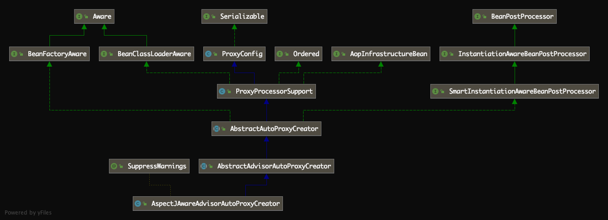

# [Spring源码解读『AOP』](http://lidol.top/frame/2891/)

2020-06-30 分类：[Spring](http://lidol.top/category/frame/spring/) / [框架](http://lidol.top/category/frame/) 阅读(808) 评论(0)

之前的文章我们介绍了Spring IOC的相关概念及相应的底层源码实现，本篇文章我们来看一下Spring的另一重要特性AOP的相关细节。

## 1. AOP示例

### 1.1 Bean interface

``` java
package com.zhuoli.service.spring.explore.aop.bean;

public interface AopBean {
     void method1();

     void method2();
}
```

### 1.2 Bean interface实现

``` java
package com.zhuoli.service.spring.explore.aop.impl;

import com.zhuoli.service.spring.explore.aop.bean.AopBean;

public class AopBeanImpl implements AopBean {
    public void method1() {
        System.out.println("call method1()");
    }

    public void method2() {
        System.out.println("call method2()");
    }
}
```

### 1.3 AOP横切关注点

定义一个TimeHandler，用于方法调用前后打印时间。

``` java
package com.zhuoli.service.spring.explore.aop.handler;

public class TimeHandler {
    public void printTime() {
        System.out.println("CurrentTime:" + System.currentTimeMillis());
    }
}
```

### 1.4 spring xml配置文件

``` xml
<?xml version="1.0" encoding="UTF-8"?>
<beans xmlns="http://www.springframework.org/schema/beans"
       xmlns:xsi="http://www.w3.org/2001/XMLSchema-instance"
       xmlns:aop="http://www.springframework.org/schema/aop"
       xsi:schemaLocation="http://www.springframework.org/schema/beans
        http://www.springframework.org/schema/beans/spring-beans-3.0.xsd
        http://www.springframework.org/schema/aop
        http://www.springframework.org/schema/aop/spring-aop-3.0.xsd">

    <bean id="aopBean" class="com.zhuoli.service.spring.explore.aop.impl.AopBeanImpl"/>
    <bean id="timeHandler" class="com.zhuoli.service.spring.explore.aop.handler.TimeHandler"/>

    <aop:config proxy-target-class="true">
        <aop:aspect id="time" ref="timeHandler">
            <aop:pointcut id="addAllMethod" expression="execution(* com.zhuoli.service.spring.explore.aop.impl..*.*(..))"/>
            <aop:before method="printTime" pointcut-ref="addAllMethod"/>
            <aop:after method="printTime" pointcut-ref="addAllMethod"/>
        </aop:aspect>
    </aop:config>

</beans>
```


### 1.5 执行示例

``` java
public class AopTest {
    public static void main(String[] args) {
        AbstractApplicationContext abstractApplicationContext = new ClassPathXmlApplicationContext("classpath:spring-aop.xml");
        AopBean aopBeanBean = (AopBean) abstractApplicationContext.getBean("aopBean");
        aopBeanBean.method1();
        aopBeanBean.method2();
    }
}
```

运行结果：

``` shell
CurrentTime:1593994886953
call method1()
CurrentTime:1593994886965
CurrentTime:1593994886965
call method2()
CurrentTime:1593994886965
```

说明AOP横切逻辑成功生效。

## 2. 源码分析

回顾一下上述测试代码，可以发现，AOP也是通过getBean方法获取的Bean实例，然后通过Bean实例的方法调用生效的。所以我们可以推测到，AOP对象Bean实例肯定被容器特殊处理过，而且容器的特殊处理肯定会存在于以下两个过程：

- BeanDefinition解析过程，解析切面的定义为BeanDefinition
- getBean过程中，根据Bean对象是否需要被AOP切面作用，采取特殊处理，使横切逻辑生效。这里我们知道，其实就是生成代理对象

首先，我们来看一下上述Spring启动配置xml文件的解析。之前关于普通Bean的解析我们在介绍，这里我们重点来看一下AOP相关配置的BeanDefinition解析。

``` xml
<aop:config proxy-target-class="true">
    <aop:aspect id="time" ref="timeHandler">
        <aop:pointcut id="addAllMethod" expression="execution(* com.zhuoli.service.spring.explore.aop.impl..*.*(..))"/>
        <aop:before method="printTime" pointcut-ref="addAllMethod"/>
        <aop:after method="printTime" pointcut-ref="addAllMethod"/>
    </aop:aspect>
</aop:config>
```

### 2.1 AOP相关术语

#### 2.1.1 通知（Advice）

在AOP属于中，切面的工作被称为通知，通知定义了切面是什么以及何时使用。除了描述切面要完成的工作，通知还解决了何时执行切面的工作的问题，比如它应该应用在某个方法被调用之前、之后、之前和之后都调用、还是只在方法抛出异常时调用。Spring切面可以应用5中类型的通知：

- 前置通知（Before）：在目标方法被调用之前调用通知功能
- 后置通知（After）：在目标方法完成之后调用通知，此时不会关心方法的输出是什么
- 返回通知（After-returning）：在目标方法成功执行之后调用通知
- 异常通知（After-throwing）：在目标方法抛出异常后调用通知
- 环绕通知（Around）：通知包裹了被通知的方法，在被通知的方法调用之前和调用之后执行自定义行为

#### 2.1.2 连接点（Join Point）

简单来讲，连接点就是应用中能够插入切面逻辑的一个点

#### 2.1.3 切点（PointCut）

切点其实就是连接点的集合，如果说通知定义了切面的“什么”和“何时”的话，那么切点就定义了“何处”。切点的定义一般可以通过正则表达式来定义，比如我们上面定义的：

``` xml
<aop:pointcut id="addAllMethod" expression="execution(* com.zhuoli.service.spring.explore.aop.impl..*.*(..))"/>
```

| **符号**                                   | **含义**                                             |
| ------------------------------------------ | ---------------------------------------------------- |
| execution（）** **                         | 表达式的主体** **                                    |
| 第一个”*”符号** **                         | 表示返回值的类型任意** **                            |
| com.zhuoli.service.spring.explore.aop.impl | AOP所切的服务的包名                                  |
| 包名后面的”..”                             | 表示当前包及子包                                     |
| 第二个”*”                                  | 表示类名，*即所有类                                  |
| .*(..)                                     | 表示任何方法名，括号表示参数，两个点表示任何参数类型 |

#### 2.1.4 切面（Aspect）

简单来讲，切面 = 通知 + 切点，通知和切点共同定义了切面的全部内容——是什么，何时及何处完成其功能。

#### 2.1.5 织入（Weaving）

织入是把切面应用到目标对象并创建新的代理对象的过程。切面在指定的连接点被织入到目标对象中。在目标对象生命周期里有多个点可以进行织入：

- 编译期：切面在目标类编译时被织入，这种方式需要特殊的编译器。AspectJ的织入，编译器就是通过这种方式织入切面的。
- 类加载器：切面在目标类加载到JVM时被织入。这种方式需要特殊的类加载器。AspectJ5的加载时织入（load-time weaving，LTW）就支持这种方式织入切面。
- 运行期：切面在应用运行的某个时刻被织入。一般情况下，在织入切面时，AOP容器为目标对象动态的创建一个代理对象。Spring AOP就是以这种方式织入切面的。

### 2.2 AOP源码——标签解析

上面我们大致讲到，为了使通过getBean获取的Bean切面逻辑生效，那么在切面的定义转化为BeanDefinition、getBean这两个过程中，容器肯定有特殊处理。这里我们首先来看一下xml中定义的AOP相关标签的解析。

#### 2.2.1 切面定义标签转化为BeanDefinition

之前介绍xml解析的文章，我们知道，上述切面定义的标签<aop:config/>、<aop:aspect />等标签肯定肯定也会通过DefaultBeanDefinitionDocumentReader解析，解析的方法是parseBeanDefinitions。

``` java
protected void parseBeanDefinitions(Element root, BeanDefinitionParserDelegate delegate) {
    if (delegate.isDefaultNamespace(root)) {
        NodeList nl = root.getChildNodes();
        for (int i = 0; i < nl.getLength(); i++) {
            Node node = nl.item(i);
            if (node instanceof Element) {
                Element ele = (Element) node;
                if (delegate.isDefaultNamespace(ele)) {
                    parseDefaultElement(ele, delegate);
                }
                else {
                    delegate.parseCustomElement(ele);
                }
            }
        }
    }
    else {
        delegate.parseCustomElement(root);
    }
}
```

<bean id=”aopBean”…>、<bean id=”timeHandler”…>这两个标签的时候，都会执行parseDefaultElement，因为<bean>标签是默认的Namespace。但是在遇到后面的<aop:config>标签的时候就不一样了，<aop:config>并不是默认的Namespace，因此会执行parseCustomElement：

``` java
public BeanDefinition parseCustomElement(Element ele) {
    return parseCustomElement(ele, null);
}

public BeanDefinition parseCustomElement(Element ele, BeanDefinition containingBd) {
    String namespaceUri = getNamespaceURI(ele);
    NamespaceHandler handler = this.readerContext.getNamespaceHandlerResolver().resolve(namespaceUri);
    if (handler == null) {
        error("Unable to locate Spring NamespaceHandler for XML schema namespace [" + namespaceUri + "]", ele);
        return null;
    }
    return handler.parse(ele, new ParserContext(this.readerContext, this, containingBd));
}
```

之前把整个XML解析为了org.w3c.dom.Document，org.w3c.dom.Document以树的形式表示整个XML，具体到每一个节点就是一个Node。

首先从<aop:config>这个Node（参数Element是Node接口的子接口）中拿到namespaceUri=”**http://www.springframework.org/schema/aop**“，接着根据这个namespaceUri获取对应的NamespaceHandler即Namespace处理器，具体到aop这个Namespace的NamespaceHandler是**org.springframework.aop.config.AopNamespaceHandler**类。具体到AopNamespaceHandler里面，初始化时有几个Parser，是用于具体标签转换的，分别为：

- config–>ConfigBeanDefinitionParser
- aspectj-autoproxy–>AspectJAutoProxyBeanDefinitionParser
- scoped-proxy–>ScopedProxyBeanDefinitionDecorator
- spring-configured–>SpringConfiguredBeanDefinitionParser

最后，就是利用ConfigBeanDefinitionParser的parse方法，解析<aop:config>节点的内容了。

#### 2.2.2 ConfigBeanDefinitionParser

这里我们来看一下ConfigBeanDefinitionParser的parse方法如何将<aop:config>节点解析为BeanDefinition的。

``` java
public BeanDefinition parse(Element element, ParserContext parserContext) {
    CompositeComponentDefinition compositeDef =
            new CompositeComponentDefinition(element.getTagName(), parserContext.extractSource(element));
    parserContext.pushContainingComponent(compositeDef);

    // 1. 向Spring容器注册了一个BeanName为org.springframework.aop.config.internalAutoProxyCreator的Bean定义
    // Spring默认提供的是org.springframework.aop.aspectj.autoproxy.AspectJAwareAdvisorAutoProxyCreator
    // 用于后面getBean过程中生成代理对象
    configureAutoProxyCreator(parserContext, element);

    // 2. 解析<aop:config>标签下的子标签
    List<Element> childElts = DomUtils.getChildElements(element);
    for (Element elt: childElts) {
        String localName = parserContext.getDelegate().getLocalName(elt);
        // 2.1 解析<aop:pointcut>标签
        if (POINTCUT.equals(localName)) {
            parsePointcut(elt, parserContext);
        }
        // 2.2 解析<aop:advisor>标签
        else if (ADVISOR.equals(localName)) {
            parseAdvisor(elt, parserContext);
        }
        // 2.3 解析<aop:aspect>标签
        else if (ASPECT.equals(localName)) {
            parseAspect(elt, parserContext);
        }
    }

    parserContext.popAndRegisterContainingComponent();
    return null;
}
```

这里需要特别注意的是第1步，通过configureAutoProxyCreator方法注册了AspectJAwareAdvisorAutoProxyCreator BeanDefition，该类是一个BeanPostProcessor（InstantiationAwareBeanPostProcessor），会在getBean过程中起作用，生成代理类对象。

然后就是2.3步，<aop:aspect>标签的解析，其实就是将<aop:aspect>下定义的通知和切点解析为BeanDefinition，并注册到容器。

#### 2.2.3 <aop:aspect>标签解析

``` java
private void parseAspect(Element aspectElement, ParserContext parserContext) {
    String aspectId = aspectElement.getAttribute(ID);
    String aspectName = aspectElement.getAttribute(REF);

    try {
        this.parseState.push(new AspectEntry(aspectId, aspectName));
        List<BeanDefinition> beanDefinitions = new ArrayList<BeanDefinition>();
        List<BeanReference> beanReferences = new ArrayList<BeanReference>();

        List<Element> declareParents = DomUtils.getChildElementsByTagName(aspectElement, DECLARE_PARENTS);
        for (int i = METHOD_INDEX; i < declareParents.size(); i++) {
            Element declareParentsElement = declareParents.get(i);
            beanDefinitions.add(parseDeclareParents(declareParentsElement, parserContext));
        }

        // We have to parse "advice" and all the advice kinds in one loop, to get the
        // ordering semantics right.
        // 1. 解析<aop:aspect>节点下定义的通知
        NodeList nodeList = aspectElement.getChildNodes();
        boolean adviceFoundAlready = false;
        for (int i = 0; i < nodeList.getLength(); i++) {
            Node node = nodeList.item(i);
            if (isAdviceNode(node, parserContext)) {
                if (!adviceFoundAlready) {
                    adviceFoundAlready = true;
                    if (!StringUtils.hasText(aspectName)) {
                        parserContext.getReaderContext().error(
                                "<aspect> tag needs aspect bean reference via 'ref' attribute when declaring advices.",
                                aspectElement, this.parseState.snapshot());
                        return;
                    }
                    beanReferences.add(new RuntimeBeanReference(aspectName));
                }
                AbstractBeanDefinition advisorDefinition = parseAdvice(
                        aspectName, i, aspectElement, (Element) node, parserContext, beanDefinitions, beanReferences);
                beanDefinitions.add(advisorDefinition);
            }
        }

        AspectComponentDefinition aspectComponentDefinition = createAspectComponentDefinition(
                aspectElement, aspectId, beanDefinitions, beanReferences, parserContext);
        parserContext.pushContainingComponent(aspectComponentDefinition);

        // 2. 解析<aop:aspect>节点下定义的切点
        List<Element> pointcuts = DomUtils.getChildElementsByTagName(aspectElement, POINTCUT);
        for (Element pointcutElement : pointcuts) {
            parsePointcut(pointcutElement, parserContext);
        }

        parserContext.popAndRegisterContainingComponent();
    }
    finally {
        this.parseState.pop();
    }
}
```

跟着第1步，来看一下节<aop:aspect>节点下定义的通知的解析过程。首先来看一下<aop:aspect>节点下定义的哪些子节点是通知节点，也就是isAdviceNode方法：

``` java
/**
 * Return {@code true} if the supplied node describes an advice type. May be one of:
 * '{@code before}', '{@code after}', '{@code after-returning}',
 * '{@code after-throwing}' or '{@code around}'.
 */
private boolean isAdviceNode(Node aNode, ParserContext parserContext) {
    if (!(aNode instanceof Element)) {
        return false;
    }
    else {
        String name = parserContext.getDelegate().getLocalName(aNode);
        return (BEFORE.equals(name) || AFTER.equals(name) || AFTER_RETURNING_ELEMENT.equals(name) ||
                AFTER_THROWING_ELEMENT.equals(name) || AROUND.equals(name));
    }
}
```

也就是说**<aop:aspect>标签下的<aop:before>、<aop:after>、<aop:after-returning>、<aop:after-throwing method=””>、<aop:around method=””>**这五个标签是通知节点，会在第1步被处理。然后进入parseAdvice解析。

``` java
/**
 * Parses one of '{@code before}', '{@code after}', '{@code after-returning}',
 * '{@code after-throwing}' or '{@code around}' and registers the resulting
 * BeanDefinition with the supplied BeanDefinitionRegistry.
 * @return the generated advice RootBeanDefinition
 */
private AbstractBeanDefinition parseAdvice(
        String aspectName, int order, Element aspectElement, Element adviceElement, ParserContext parserContext,
        List<BeanDefinition> beanDefinitions, List<BeanReference> beanReferences) {

    try {
        this.parseState.push(new AdviceEntry(parserContext.getDelegate().getLocalName(adviceElement)));

        // create the method factory bean
        RootBeanDefinition methodDefinition = new RootBeanDefinition(MethodLocatingFactoryBean.class);
        methodDefinition.getPropertyValues().add("targetBeanName", aspectName);
        methodDefinition.getPropertyValues().add("methodName", adviceElement.getAttribute("method"));
        methodDefinition.setSynthetic(true);

        // create instance factory definition
        RootBeanDefinition aspectFactoryDef =
                new RootBeanDefinition(SimpleBeanFactoryAwareAspectInstanceFactory.class);
        aspectFactoryDef.getPropertyValues().add("aspectBeanName", aspectName);
        aspectFactoryDef.setSynthetic(true);

        // register the pointcut
        // 1. 根据织入方式（before、after）创建RootBeanDefinition，即advice定义
        AbstractBeanDefinition adviceDef = createAdviceDefinition(
                adviceElement, parserContext, aspectName, order, methodDefinition, aspectFactoryDef,
                beanDefinitions, beanReferences);

        // configure the advisor
        // 2. 将第1步生成的RootBeanDefinition写入一个新的RootBeanDefinition，即advisor定义
        RootBeanDefinition advisorDefinition = new RootBeanDefinition(AspectJPointcutAdvisor.class);
        advisorDefinition.setSource(parserContext.extractSource(adviceElement));
        advisorDefinition.getConstructorArgumentValues().addGenericArgumentValue(adviceDef);
        if (aspectElement.hasAttribute(ORDER_PROPERTY)) {
            advisorDefinition.getPropertyValues().add(
                    ORDER_PROPERTY, aspectElement.getAttribute(ORDER_PROPERTY));
        }

        // register the final advisor
        // 3. 将advisorDefinition注册到DefaultListableBeanFactory中
        parserContext.getReaderContext().registerWithGeneratedName(advisorDefinition);

        return advisorDefinition;
    }
    finally {
        this.parseState.pop();
    }
}
```

接着我们来看第1步，advice对应的RootBeanDefinition是如何创建的，也就是createAdviceDefinition方法：

``` java
private AbstractBeanDefinition createAdviceDefinition(
        Element adviceElement, ParserContext parserContext, String aspectName, int order,
        RootBeanDefinition methodDef, RootBeanDefinition aspectFactoryDef,
        List<BeanDefinition> beanDefinitions, List<BeanReference> beanReferences) {

    // 1. 根据advice属性（before、after）获取beanClass，创建RootBeanDefinition
    RootBeanDefinition adviceDefinition = new RootBeanDefinition(getAdviceClass(adviceElement, parserContext));
    adviceDefinition.setSource(parserContext.extractSource(adviceElement));

    // 2. 配置advice对应的BeanDefition的属性
    adviceDefinition.getPropertyValues().add(ASPECT_NAME_PROPERTY, aspectName);
    adviceDefinition.getPropertyValues().add(DECLARATION_ORDER_PROPERTY, order);

    if (adviceElement.hasAttribute(RETURNING)) {
        adviceDefinition.getPropertyValues().add(
                RETURNING_PROPERTY, adviceElement.getAttribute(RETURNING));
    }
    if (adviceElement.hasAttribute(THROWING)) {
        adviceDefinition.getPropertyValues().add(
                THROWING_PROPERTY, adviceElement.getAttribute(THROWING));
    }
    if (adviceElement.hasAttribute(ARG_NAMES)) {
        adviceDefinition.getPropertyValues().add(
                ARG_NAMES_PROPERTY, adviceElement.getAttribute(ARG_NAMES));
    }

    ConstructorArgumentValues cav = adviceDefinition.getConstructorArgumentValues();
    cav.addIndexedArgumentValue(METHOD_INDEX, methodDef);

    Object pointcut = parsePointcutProperty(adviceElement, parserContext);
    if (pointcut instanceof BeanDefinition) {
        cav.addIndexedArgumentValue(POINTCUT_INDEX, pointcut);
        beanDefinitions.add((BeanDefinition) pointcut);
    }
    else if (pointcut instanceof String) {
        RuntimeBeanReference pointcutRef = new RuntimeBeanReference((String) pointcut);
        cav.addIndexedArgumentValue(POINTCUT_INDEX, pointcutRef);
        beanReferences.add(pointcutRef);
    }

    cav.addIndexedArgumentValue(ASPECT_INSTANCE_FACTORY_INDEX, aspectFactoryDef);

    return adviceDefinition;
}
```

对于不同的advice，生成的BeanDefition的beanClass是不同的，是通过getAdviceClass方法实现的：
  
``` java
private Class<?> getAdviceClass(Element adviceElement, ParserContext parserContext) {
    String elementName = parserContext.getDelegate().getLocalName(adviceElement);
    if (BEFORE.equals(elementName)) {
        return AspectJMethodBeforeAdvice.class;
    }
    else if (AFTER.equals(elementName)) {
        return AspectJAfterAdvice.class;
    }
    else if (AFTER_RETURNING_ELEMENT.equals(elementName)) {
        return AspectJAfterReturningAdvice.class;
    }
    else if (AFTER_THROWING_ELEMENT.equals(elementName)) {
        return AspectJAfterThrowingAdvice.class;
    }
    else if (AROUND.equals(elementName)) {
        return AspectJAroundAdvice.class;
    }
    else {
        throw new IllegalArgumentException("Unknown advice kind [" + elementName + "].");
    }
}
```

对于不同的通知，创建的RootBeanDefition对应的beanClass是不同的：

- before对应AspectJMethodBeforeAdvice
- After对应AspectJAfterAdvice
- after-returning对应AspectJAfterReturningAdvice
- after-throwing对应AspectJAfterThrowingAdvice
- around对应AspectJAroundAdvice

到这里，通过createAdviceDefinition方法，就实现了将**<**aop:aspect**>**节点下定义的通知节点（<aop:before>、<aop:after>）对应的RootBeanDefinition就创建出来了。

接着我们回到parseAdvice方法来看第2步，将第1步生成的RootBeanDefinition写入一个新的RootBeanDefinition，即advisor定义。

``` java
RootBeanDefinition advisorDefinition = new RootBeanDefinition(AspectJPointcutAdvisor.class);
advisorDefinition.setSource(parserContext.extractSource(adviceElement));
advisorDefinition.getConstructorArgumentValues().addGenericArgumentValue(adviceDef);
if (aspectElement.hasAttribute(ORDER_PROPERTY)) {
    advisorDefinition.getPropertyValues().add(
            ORDER_PROPERTY, aspectElement.getAttribute(ORDER_PROPERTY));
}
```

这里其实就是将上一步生成的RootBeanDefinition包装了一下，生成一个新的RootBeanDefinition出来，beanClass类型是org.springframework.aop.aspectj.AspectJPointcutAdvisor。然后判断<aop:aspect>标签中有没有”order”属性的，有就设置一下，”order”属性是用来控制切入方法优先级的。

最后我们回到parseAdvice方法来看第3步，将生成的BeanDefinition注册到DefaultListableBeanFactory。

``` java
parserContext.getReaderContext().registerWithGeneratedName(advisorDefinition);

public String registerWithGeneratedName(BeanDefinition beanDefinition) {
    String generatedName = generateBeanName(beanDefinition);
    getRegistry().registerBeanDefinition(generatedName, beanDefinition);
    return generatedName;
}
```

获取注册的名字BeanName，和<bean>的注册差不多，使用的是**Class全路径+”#”+全局计数器**的方式，其中的beanClass全路径为org.springframework.aop.aspectj.AspectJPointcutAdvisor，依次类推，每一个BeanName应当为org.springframework.aop.aspectj.AspectJPointcutAdvisor#0、org.springframework.aop.aspectj.AspectJPointcutAdvisor#1、org.springframework.aop.aspectj.AspectJPointcutAdvisor#2以此类推。

到这里通过parseAdvice方法就完成了<aop:aspect>节点下定义的通知节点的解析和注册。

#### 2.2.4 **<aop:pointcut>**标签解析

回到ConfigBeanDefinitionParser的parseAspect方法的第2步，在完成<aop:aspect>节点下通知节点的解析后，会继续进行节点下定义的切点<aop:pointcut>的解析：

``` java
List<Element> pointcuts = DomUtils.getChildElementsByTagName(aspectElement, POINTCUT);
for (Element pointcutElement : pointcuts) {
    parsePointcut(pointcutElement, parserContext);
}

parserContext.popAndRegisterContainingComponent();
```

遍历<aop:aspect>节点下定义的<aop:pointcut>节点，调用parsePointcut方法解析。

``` java
private AbstractBeanDefinition parsePointcut(Element pointcutElement, ParserContext parserContext) {
    // 1, 获取<aop:pointcut>标签下的"id"属性与"expression"属性
    String id = pointcutElement.getAttribute(ID);
    String expression = pointcutElement.getAttribute(EXPRESSION);

    AbstractBeanDefinition pointcutDefinition = null;

    try {
        this.parseState.push(new PointcutEntry(id));
        // 2. 根据表达式，创建Pointcut的BeanDefinition
        pointcutDefinition = createPointcutDefinition(expression);
        pointcutDefinition.setSource(parserContext.extractSource(pointcutElement));

        // 3. 获取pointcutBeanName，默认为<aop:pointcut>标签中定义的id属性，使用名称注册BeanDefinition
        String pointcutBeanName = id;
        if (StringUtils.hasText(pointcutBeanName)) {
            // 3.1 如果<aop:pointcut>标签中定义了id属性，注册BeanDefinition的beanName就使用该id
            parserContext.getRegistry().registerBeanDefinition(pointcutBeanName, pointcutDefinition);
        }
        else {
            // 3.2 如果<aop:pointcut>标签中没有定义了id属性，
            // pointcutBeanName=org.springframework.aop.aspectj.AspectJExpressionPointcut#序号（从0开始累加）
            pointcutBeanName = parserContext.getReaderContext().registerWithGeneratedName(pointcutDefinition);
        }

        // 4. 注册一个Pointcut组件定义
        parserContext.registerComponent(
                new PointcutComponentDefinition(pointcutBeanName, pointcutDefinition, expression));
    }
    finally {
        this.parseState.pop();
    }

    return pointcutDefinition;
}
```

最后我们看一下根据表达式创建BeanDefinition的方法createPointcutDefinition：

``` java
protected AbstractBeanDefinition createPointcutDefinition(String expression) {
    RootBeanDefinition beanDefinition = new RootBeanDefinition(AspectJExpressionPointcut.class);
    beanDefinition.setScope(BeanDefinition.SCOPE_PROTOTYPE);
    beanDefinition.setSynthetic(true);
    beanDefinition.getPropertyValues().add(EXPRESSION, expression);
    return beanDefinition;
}
```

可以看到：

- <aop:pointcut>标签对应解析出来的BeanDefinition是RootBeanDefinition，且RootBenaDefinitoin中的Class是**org.springframework.aop.aspectj.AspectJExpressionPointcut**
- <aop:pointcut>标签对应的Bean是prototype即原型的

到这里，就完成了<aop:pointcut>标签的解析。

## 2.3 AOP源码——生成代理

接下来我们来分析Spring AOP另一个比较重要的流程——代理生成。完成代理生成的核心类是org.springframework.aop.aspectj.autoproxy.AspectJAwareAdvisorAutoProxyCreator，也就是我们上面介绍的，在ConfigBeanDefinitionParser#parse方法的第1步注册的。首先我们看一下AspectJAwareAdvisorAutoProxyCreator的继承体系：

[](http://cdn.lidol.top/lidol_blog/AspectJAwareAdvisorAutoProxyCreator.png)

可以看到：

- AspectJAwareAdvisorAutoProxyCreator是BeanPostProcessor接口的实现类
- 在Bean初始化前后，可以调用AspectJAwareAdvisorAutoProxyCreator的postProcessBeforeInitialization和postProcessAfterInitialization方法，影响Bean的生成（代理生成是在postProcessAfterInitialization方法完成的，postProcessBeforeInitialization是个空方法）
- postProcessBeforeInitialization方法与postProcessAfterInitialization方法实现在父类AbstractAutoProxyCreator中

#### 2.3.1 postProcessAfterInitialization调用入口

Bean的初始化在AbstractAutowireCapableBeanFactory的initializeBean方法：

``` java
protected Object initializeBean(final String beanName, final Object bean, RootBeanDefinition mbd) {
    if (System.getSecurityManager() != null) {
        AccessController.doPrivileged(new PrivilegedAction<Object>() {
            @Override
            public Object run() {
                invokeAwareMethods(beanName, bean);
                return null;
            }
        }, getAccessControlContext());
    }
    else {
        invokeAwareMethods(beanName, bean);
    }

    Object wrappedBean = bean;
    if (mbd == null || !mbd.isSynthetic()) {
        wrappedBean = applyBeanPostProcessorsBeforeInitialization(wrappedBean, beanName);
    }

    try {
        invokeInitMethods(beanName, wrappedBean, mbd);
    }
    catch (Throwable ex) {
        throw new BeanCreationException(
                (mbd != null ? mbd.getResourceDescription() : null),
                beanName, "Invocation of init method failed", ex);
    }
    if (mbd == null || !mbd.isSynthetic()) {
        wrappedBean = applyBeanPostProcessorsAfterInitialization(wrappedBean, beanName);
    }
    return wrappedBean;
}
public Object applyBeanPostProcessorsBeforeInitialization(Object existingBean, String beanName)
        throws BeansException {

    Object result = existingBean;
    for (BeanPostProcessor beanProcessor : getBeanPostProcessors()) {
        result = beanProcessor.postProcessBeforeInitialization(result, beanName);
        if (result == null) {
            return result;
        }
    }
    return result;
}

public Object applyBeanPostProcessorsAfterInitialization(Object existingBean, String beanName)
        throws BeansException {

    Object result = existingBean;
    for (BeanPostProcessor beanProcessor : getBeanPostProcessors()) {
        result = beanProcessor.postProcessAfterInitialization(result, beanName);
        if (result == null) {
            return result;
        }
    }
    return result;
}
```

BeanPostProcessor生效，就在上述applyBeanPostProcessorsBeforeInitialization和applyBeanPostProcessorsAfterInitialization方法中，分别用于调用BeanPostProcessor的postProcessBeforeInitialization方法和postProcessAfterInitialization方法。由于AspectJAwareAdvisorAutoProxyCreator的postProcessBeforeInitialization为空，所以AspectJAwareAdvisorAutoProxyCreator生成代理类的入口就是通过调用applyBeanPostProcessorsAfterInitialization方法，调用AspectJAwareAdvisorAutoProxyCreator的postProcessAfterInitialization完成的。

#### 2.3.2 AspectJAwareAdvisorAutoProxyCreator

下面我们来看AspectJAwareAdvisorAutoProxyCreator如何通过postProcessAfterInitialization方法生成代理对象的。

``` java
public Object postProcessAfterInitialization(Object bean, String beanName) throws BeansException {
    if (bean != null) {
        Object cacheKey = getCacheKey(bean.getClass(), beanName);
        if (!this.earlyProxyReferences.contains(cacheKey)) {
            return wrapIfNecessary(bean, beanName, cacheKey);
        }
    }
    return bean;
}  
```

所以肯定在wrapIfNecessary方法中，生成了代理对象。

``` java
protected Object wrapIfNecessary(Object bean, String beanName, Object cacheKey) {
    // 1. 不需要生成代理对象的，直接返回bean
    if (beanName != null && this.targetSourcedBeans.contains(beanName)) {
        return bean;
    }
    if (Boolean.FALSE.equals(this.advisedBeans.get(cacheKey))) {
        return bean;
    }
    if (isInfrastructureClass(bean.getClass()) || shouldSkip(bean.getClass(), beanName)) {
        this.advisedBeans.put(cacheKey, Boolean.FALSE);
        return bean;
    }

    // Create proxy if we have advice.
    // 2. 为beanClass寻找对应的Advisor
    Object[] specificInterceptors = getAdvicesAndAdvisorsForBean(bean.getClass(), beanName, null);
    // 如果beanClass对应的Advisor存在（specificInterceptors不为null），则为beanClass生成代理对象
    if (specificInterceptors != DO_NOT_PROXY) {
        this.advisedBeans.put(cacheKey, Boolean.TRUE);
        Object proxy = createProxy(
                bean.getClass(), beanName, specificInterceptors, new SingletonTargetSource(bean));
        this.proxyTypes.put(cacheKey, proxy.getClass());
        return proxy;
    }

    this.advisedBeans.put(cacheKey, Boolean.FALSE);
    return bean;
}
```

所以，配置文件里面配置了很多Bean，肯定不能对每个Bean都生成代理，因此哪些Bean需要生成代理对象，需要一套规则判断规则，这个规则就在getAdvicesAndAdvisorsForBean方法中，如果能找到Bean对应的Advisor，就需要生成代理，否则不需要生成代理。

``` java
protected Object[] getAdvicesAndAdvisorsForBean(Class beanClass, String beanName, TargetSource targetSource) {
    List advisors = findEligibleAdvisors(beanClass, beanName);
    if (advisors.isEmpty()) {
        return DO_NOT_PROXY;
    }
    return advisors.toArray();
}
protected List<Advisor> findEligibleAdvisors(Class beanClass, String beanName) {
    // 1. 获取所有Advisor列表，我们示例中有两个候选Advisor，分别是<aop:aspect>节点下的<aop:before>和<aop:after>
    // 在之前解析的时候，已经注册为AspectJPointcutAdvisor BeanDefition
    List<Advisor> candidateAdvisors = findCandidateAdvisors();
    // 2. 寻找beanClass可以使用的Advisor
    List<Advisor> eligibleAdvisors = findAdvisorsThatCanApply(candidateAdvisors, beanClass, beanName);
    // 3. 如果eligibleAdvisors非空，向候选Advisor链的开头添加一个org.springframework.aop.support.DefaultPointcutAdvisor
    extendAdvisors(eligibleAdvisors);
    if (!eligibleAdvisors.isEmpty()) {
        eligibleAdvisors = sortAdvisors(eligibleAdvisors);
    }
    return eligibleAdvisors;
}
```

可以看到，重点其实就在第2步，findAdvisorsThatCanApply寻找可用的Advisor。

``` java
protected List<Advisor> findAdvisorsThatCanApply(
        List<Advisor> candidateAdvisors, Class beanClass, String beanName) {

    ProxyCreationContext.setCurrentProxiedBeanName(beanName);
    try {
        return AopUtils.findAdvisorsThatCanApply(candidateAdvisors, beanClass);
    }
    finally {
        ProxyCreationContext.setCurrentProxiedBeanName(null);
    }
}

public static List<Advisor> findAdvisorsThatCanApply(List<Advisor> candidateAdvisors, Class<?> clazz) {
    if (candidateAdvisors.isEmpty()) {
        return candidateAdvisors;
    }
    List<Advisor> eligibleAdvisors = new LinkedList<Advisor>();
    for (Advisor candidate : candidateAdvisors) {
        if (candidate instanceof IntroductionAdvisor && canApply(candidate, clazz)) {
            eligibleAdvisors.add(candidate);
        }
    }
    boolean hasIntroductions = !eligibleAdvisors.isEmpty();
    for (Advisor candidate : candidateAdvisors) {
        if (candidate instanceof IntroductionAdvisor) {
            // already processed
            continue;
        }
        if (canApply(candidate, clazz, hasIntroductions)) {
            eligibleAdvisors.add(candidate);
        }
    }
    return eligibleAdvisors;
}
```

候选Advisor是否为BeanClass可用的Advisor的判断在方法canApply。

``` java
public static boolean canApply(Advisor advisor, Class<?> targetClass) {
    return canApply(advisor, targetClass, false);
}

public static boolean canApply(Advisor advisor, Class<?> targetClass, boolean hasIntroductions) {
    if (advisor instanceof IntroductionAdvisor) {
        return ((IntroductionAdvisor) advisor).getClassFilter().matches(targetClass);
    }
    else if (advisor instanceof PointcutAdvisor) {
        PointcutAdvisor pca = (PointcutAdvisor) advisor;
        return canApply(pca.getPointcut(), targetClass, hasIntroductions);
    }
    else {
        // It doesn't have a pointcut so we assume it applies.
        return true;
    }
}
```

第一个参数advisor的实际类型是AspectJPointcutAdvisor，它是PointcutAdvisor的子类，所以会进else if分支。

``` java
public static boolean canApply(Pointcut pc, Class<?> targetClass, boolean hasIntroductions) {
    Assert.notNull(pc, "Pointcut must not be null");
    if (!pc.getClassFilter().matches(targetClass)) {
        return false;
    }

    MethodMatcher methodMatcher = pc.getMethodMatcher();
    IntroductionAwareMethodMatcher introductionAwareMethodMatcher = null;
    if (methodMatcher instanceof IntroductionAwareMethodMatcher) {
        introductionAwareMethodMatcher = (IntroductionAwareMethodMatcher) methodMatcher;
    }

    Set<Class> classes = new HashSet<Class>(ClassUtils.getAllInterfacesForClassAsSet(targetClass));
    classes.add(targetClass);
    for (Class<?> clazz : classes) {
        Method[] methods = clazz.getMethods();
        for (Method method : methods) {
            if ((introductionAwareMethodMatcher != null &&
                    introductionAwareMethodMatcher.matches(method, targetClass, hasIntroductions)) ||
                    methodMatcher.matches(method, targetClass)) {
                return true;
            }
        }
    }

    return false;
}
```

这个方法其实就是拿当前Advisor对应的expression做了两层判断：

1. 目标类必须满足expression的匹配规则
2. 目标类中的方法必须满足expression的匹配规则，当然这里方法不是全部需要满足expression的匹配规则，有一个方法满足即可

如果以上两条都满足，那么容器则会判断该<bean>满足条件，需要被生成代理对象，具体方式为返回一个数组对象，该数组中存储的是<bean>可用的Advisor。

回到wrapIfNecessary方法，当一个Bean需要生成代理对象，继续来看一下是如何生成代理对象的。

``` java
if (specificInterceptors != DO_NOT_PROXY) {
    this.advisedBeans.put(cacheKey, Boolean.TRUE);
    Object proxy = createProxy(
            bean.getClass(), beanName, specificInterceptors, new SingletonTargetSource(bean));
    this.proxyTypes.put(cacheKey, proxy.getClass());
    return proxy;
}
protected Object createProxy(Class<?> beanClass, @Nullable String beanName,
        @Nullable Object[] specificInterceptors, TargetSource targetSource) {

    if (this.beanFactory instanceof ConfigurableListableBeanFactory) {
        AutoProxyUtils.exposeTargetClass((ConfigurableListableBeanFactory) this.beanFactory, beanName, beanClass);
    }

    // 1. 创建proxyFactory
    ProxyFactory proxyFactory = new ProxyFactory();
    proxyFactory.copyFrom(this);

    // 2. 如果<aop:config>节点中proxy-target-class="false"或者proxy-target-class不配置
    // 说明可以不使用CGLIB生成代理
    if (!proxyFactory.isProxyTargetClass()) {
        // 2.1 如果bean指定了“preserveTargetClass”属性，则使用CGLIB代理
        if (shouldProxyTargetClass(beanClass, beanName)) {
            proxyFactory.setProxyTargetClass(true);
        }
        // 2.2 否则获取当前Bean实现的所有接口，将这些接口Class对象都添加到ProxyFactory中
        else {
            evaluateProxyInterfaces(beanClass, proxyFactory);
        }
    }

    // 3. 设置proxyFactory属性
    Advisor[] advisors = buildAdvisors(beanName, specificInterceptors);
    proxyFactory.addAdvisors(advisors);
    proxyFactory.setTargetSource(targetSource);
    customizeProxyFactory(proxyFactory);

    proxyFactory.setFrozen(this.freezeProxy);
    if (advisorsPreFiltered()) {
        proxyFactory.setPreFiltered(true);
    }

    // 4. 生成代理
    return proxyFactory.getProxy(getProxyClassLoader());
}
```

接下来继续跟进第4步代理生成逻辑，getProxy。

``` java
public Object getProxy(@Nullable ClassLoader classLoader) {
    return createAopProxy().getProxy(classLoader);
}
```

核心逻辑就一行，这一行主要完成两个工作：

1. 创建AopProxy接口实现类
2. 通过AopProxy接口的实现类的getProxy方法获取<bean>对应的代理

createAopProxy方法最终会调用到DefaultAopProxyFactory类的createAopProxy方法。

``` java
public AopProxy createAopProxy(AdvisedSupport config) throws AopConfigException {
    if (config.isOptimize() || config.isProxyTargetClass() || hasNoUserSuppliedProxyInterfaces(config)) {
        Class<?> targetClass = config.getTargetClass();
        if (targetClass == null) {
            throw new AopConfigException("TargetSource cannot determine target class: " +
                    "Either an interface or a target is required for proxy creation.");
        }
        if (targetClass.isInterface() || Proxy.isProxyClass(targetClass)) {
            return new JdkDynamicAopProxy(config);
        }
        return new ObjenesisCglibAopProxy(config);
    }
    else {
        return new JdkDynamicAopProxy(config);
    }
}
```

平时我们介绍Spring AOP时，会有以下概括：

1. 对类生成代理使用CGLIB
2. 对接口生成代理使用JDK原生的Proxy
3. 可以通过配置文件指定对接口使用CGLIB生成代理

这三句话的出处就是上面的createAopProxy方法。我们来看一下if分支的判断条件：

1. ProxyConfig的isOptimize方法为true，这表示使用者让Spring自己去优化而不是使用者指定
2. ProxyConfig的isProxyTargetClass方法为true，这表示配置了proxy-target-class=”true”
3. ProxyConfig满足hasNoUserSuppliedProxyInterfaces方法执行结果为true，这表示<bean>对象**没有实现任何接口或者实现的接口是Spring Proxy接口**

获取JdkDynamicAopProxy或ObjenesisCglibAopProxy后，就是调用getProxy方法来生成代理对象。关于JDK动态代理和CGLIB动态代理的实现原理，在之前的文章[彻底搞懂动态代理](http://lidol.top/java/1270/)已经介绍过了，有兴趣的同学可以去了解一下。

> 参考链接：
>
> 1. Spring源码
>
> 2. [【Spring源码分析】AOP源码解析](https://www.cnblogs.com/xrq730/p/6753160.html)
>
> 3. [【Spring源码分析】AOP源码解析](https://www.cnblogs.com/xrq730/p/6757608.html)