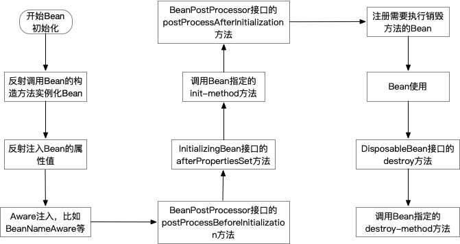
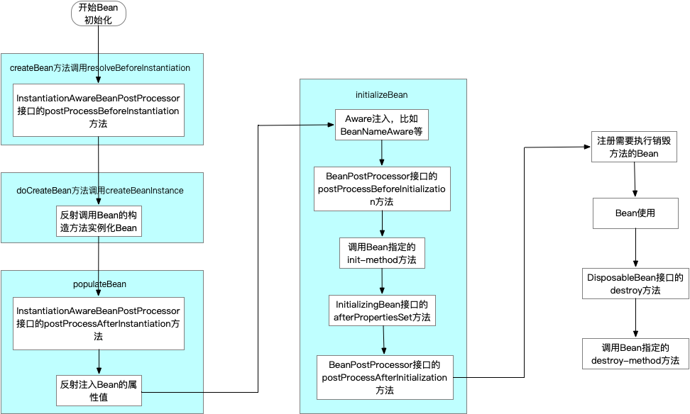

# [Spring源码解读『Bean扩展接口』](http://lidol.top/frame/2572/)

2020-04-14 分类：[Spring](http://lidol.top/category/frame/spring/) / [框架](http://lidol.top/category/frame/) 阅读(574) 评论(0)

上篇文章我们介绍了Spring Bean的初始化流程，在最后我们提到在通过populateBean方法调用后，调用了initializeBean方法，实现了一些列例如**BeanNameAware**、**BeanPostProcessor**等扩展接口的调用，本篇文章我们就来看一下Spring提供给开发者的一些扩展接口。

Spring框架运用了非常多的设计模式，从整体上看，它的设计严格遵循了OCP——开闭原则：

- 对修改关闭，外部无法修改Spring整个运作的流程
- 对扩展开放，可以通过继承、实现Spring提供的众多抽象类与接口来改变类加载的行为

本篇文章介绍的扩展接口就体现了对扩展开放的原则。

## 1. InitializingBean**&DisposableBean**

InitializingBean接口中提供了方法afterPropertiesSet()，DisposableBean接口中提供了方法destroy()。这两个接口功能类似，InitializingBean接口的afterPropertiesSet()方法用于Bean属性设置完毕（在invokeInitMethods方法中调用），做一些初始化操作。DisposableBean接口的destroy()方法用于Bean生命周期结束前（DefaultSingletonBeanRegistry的destroyBean方法调中调用）做一些收尾工作。

```java
public interface InitializingBean {
	void afterPropertiesSet() throws Exception;
}
public interface DisposableBean {
	void destroy() throws Exception;
}
```

下面我们来看一个示例：

```java
public class TestBean implements InitializingBean, DisposableBean {

    private String testName;

    public void setTestName(String testName) {
        System.out.println("Call TestBean.setName()");
        this.testName = testName;
    }


    public void destroy() throws Exception {
        System.out.println("Call TestBean.destroy(), DisposableBean");
    }


    public void afterPropertiesSet() throws Exception {
        System.out.println("Call TestBean.afterPropertiesSet(), InitializingBean");
    }

    public void initMethod() {
        System.out.println("Call TestBean.initMethod(), init-method");
    }

    public void destroyMethod() {
        System.out.println("Call TestBean.destroyMethod(), destroy-method");
    }
}
```

```xml
<?xml version="1.0" encoding="UTF-8"?>
<beans xmlns="http://www.springframework.org/schema/beans"
       xmlns:xsi="http://www.w3.org/2001/XMLSchema-instance"
       xsi:schemaLocation="http://www.springframework.org/schema/beans
http://www.springframework.org/schema/beans/spring-beans-4.1.xsd">
    <bean id="testBean" class="com.zhuoli.service.spring.explore.extend.TestBean" init-method="initMethod" destroy-method="destroyMethod">
        <property name="testName" value="testName"/>
    </bean>
</beans>
```

```java
public class SpringExtendsTest {
    public static void main(String[] args) {
        AbstractApplicationContext applicationContext = new ClassPathXmlApplicationContext("classpath:spring-extends.xml");
        TestBean testBean = (TestBean) applicationContext.getBean("testBean");

        applicationContext.close();
    }
}
```

执行结果：

```
Call TestBean.setName()
Call TestBean.afterPropertiesSet(), InitializingBean
Call TestBean.initMethod(), init-method
Call TestBean.destroy(), DisposableBean
Call TestBean.destroyMethod(), destroy-method
```

可以看到**执行顺序为set方法、InitializingBean的afterPropertiesSet方法、bean init-method指定的初始化方法、DisposableBean的destroy方法、bean的destroy-method指定的销毁方法**。

其实也好解释，通过上一篇文章我们知道setName方法是在populateBean方法中调用的，所以最先调用。InitializingBean的afterPropertiesSet方法是通过populateBean后面的方法initializeBean中调用的invokeInitMethods中调用的，并且调用在init-method之前，所以之后InitializingBean的afterPropertiesSet方法会被调用，接着才是init-method。

关于这几个接口，这里总结几点：

- InitializingBean接口、Disposable接口可以和Bean的属性init-method、destory-method配合使用，接口的优先级大于Bean的属性
- InitializingBean接口、Disposable接口方法的调用底层使用**类型强转.方法名()**进行直接方法调用，init-method、destory-method底层**使用反射**，前者和Spring耦合程度更高但效率高，后者解除了和Spring之间的耦合但是效率低（关于效率高低，这点不好讲，只是“理论之谈，反射也并不一定就比直接方法调用效率低很多。至于使用哪种方式，纯凭个人喜好）
- afterPropertiesSet()方法是在Bean的属性设置之后才会进行调用，某个Bean的afterPropertiesSet()方法执行完毕才会执行下一个Bean的afterPropertiesSet()方法，因此不建议在afterPropertiesSet()方法中写处理时间太长的方法

## 2. Aware接口

这里我们介绍BeanNameAware、ApplicationContextAware和BeanFactoryAware这三个Aware相关的接口。Aware的意思是”感知的”，顾名思义，这三个接口的意思也与“感知”相关。

- 实现BeanNameAware接口的Bean，可以在Bean加载的过程中获取该Bean的id
- 实现ApplicationContextAware接口的Bean，可以在Bean加载的过程中获取Spring的上下文ApplicationContext，从ApplicationContext中可以获取包括任意的Bean以及大量Spring容器内容和信息
- 实现BeanFactoryAware接口的Bean，可以在Bean加载的过程中获取加载该Bean的BeanFactory

下面来看个例子：

```java
public class AwareBean implements InitializingBean, BeanNameAware, BeanFactoryAware, ApplicationContextAware {

    private String beanName;
    private ApplicationContext applicationContext;
    private BeanFactory beanFactory;

    @Override
    public void afterPropertiesSet() throws Exception {
        System.out.println("Call AwareBean.afterPropertiesSet(), InitializingBean");
    }

    public void setBeanName(String beanName) {
        System.out.println("Call AwareBean.setBeanName(), beanName = " + beanName);
        this.beanName = beanName;
    }


    public void setApplicationContext(ApplicationContext applicationContext) throws BeansException {
        System.out.println("Call AwareBean.setApplicationContext(), applicationContext = " + applicationContext);
        this.applicationContext = applicationContext;
    }


    public void setBeanFactory(BeanFactory beanFactory) throws BeansException {
        System.out.println("Call AwareBean.setBeanFactory(), beanFactory = " + beanFactory);
        this.beanFactory = beanFactory;
    }
}
```

```xml
<?xml version="1.0" encoding="UTF-8"?>
<beans xmlns="http://www.springframework.org/schema/beans"
       xmlns:xsi="http://www.w3.org/2001/XMLSchema-instance"
       xsi:schemaLocation="http://www.springframework.org/schema/beans
http://www.springframework.org/schema/beans/spring-beans-4.1.xsd">
    <bean id="awareBean" class="com.zhuoli.service.spring.explore.aware.AwareBean" />
</beans>
```

```java
public class AwareBeanTest {
    public static void main(String[] args) {
        AbstractApplicationContext applicationContext = new ClassPathXmlApplicationContext("classpath:spring-aware.xml");
        AwareBean awareBean = (AwareBean) applicationContext.getBean("awareBean");

        applicationContext.close();
    }
}
```

执行结果：

```
Call AwareBean.setBeanName(), beanName = awareBean
Call AwareBean.setBeanFactory(), beanFactory = org.springframework.beans.factory.support.DefaultListableBeanFactory@7a187f14: defining beans [awareBean]; root of factory hierarchy
Call AwareBean.setApplicationContext(), applicationContext = org.springframework.context.support.ClassPathXmlApplicationContext@7e32c033, started on Thu Apr 16 09:01:20 CST 2020
Call AwareBean.afterPropertiesSet(), InitializingBean
```

关于这三个接口，总结几点：

- 如果你的BeanName、ApplicationContext、BeanFactory有用，那么就自己定义一个变量将它们保存下来（如上面的成员变量beanName、applicationContext、beanFactory）。如果没用，那么只需要实现setXXX()方法，用一下Spring注入进来的参数即可
- 如果Bean同时还实现了InitializingBean，**容器会保证BeanName、ApplicationContext和BeanFactory在调用afterPropertiesSet()方法前被注入，**也就是说Aware接口的优先级大于InitializingBean接口

## 3. **FactoryBean**

传统的Spring容器加载一个Bean的整个过程，都是由Spring控制的，开发者除了设置Bean相关属性之外，是没有太多的自主权的。FactoryBean改变了这一点，开发者可以个性化地定制自己想要实例化出来的Bean，方法就是实现FactoryBean接口。下面来看个例子：

```java
public interface Car {
    public void driving();
}
```

```java
public class Bmw implements Car {
    @Override
    public void driving() {
        System.out.println("Bmw driving");
    }
}
```

```java
public class Benz implements Car {
    @Override
    public void driving() {
        System.out.println("Benz driving");
    }
}
```

```java
public class CarFactoryBean implements FactoryBean<Car> {

    private String carName;

    @Override
    public boolean isSingleton() {
        return true;
    }

    @Override
    public Class<?> getObjectType() {
        return Car.class;
    }

    @Override
    public Car getObject() throws Exception {
        if (carName.equals("Bmw")) {
            return new Bmw();
        } else if (carName.equals("Benz")) {
            return new Benz();
        } else {
            return null;
        }
    }

    public void setCarName(String carName) {
        this.carName = carName;
    }
}
```

```xml
<?xml version="1.0" encoding="UTF-8"?>
<beans xmlns="http://www.springframework.org/schema/beans"
       xmlns:xsi="http://www.w3.org/2001/XMLSchema-instance"
       xsi:schemaLocation="http://www.springframework.org/schema/beans
http://www.springframework.org/schema/beans/spring-beans-4.1.xsd">
    <bean id="car" class="com.zhuoli.service.spring.explore.factorybean.CarFactoryBean">
        <property name="carName" value="Bmw"/>
    </bean>
</beans>
```

```java
public class FactoryBeanTest {
    public static void main(String[] args) {
        AbstractApplicationContext applicationContext = new ClassPathXmlApplicationContext("classpath:spring-factory-bean.xml");
        Car car = (Car) applicationContext.getBean("car");
        car.driving();
    }
}
```

执行结果：

```
Bmw driving
```

当我们把spring-factory-bean.xml配置文件中的value改为“Benz”时，同样执行上述代码，会得到执行结果：

```
Benz driving
```

所以**通过FactoryBean，最后得到的并不是FactoryBean本身，而是FactoryBean的泛型对象**，这就是FactoryBean的作用。FactoryBean的几个方法：

- getObject()：具体Bean的实例化过程
- getObjectType()：接口返回的实例的Class对象
- isSingleton()：返回该Bean是否为一个单例的Bean

我们回头看一下在面试中经常会问到的一个概念，BeanFactory和FactoryBean的关系？答案就非常明确了，这两者之间其实没有什么可比较的关系，只是命名比较接近。BeanFactory是Bean工厂，控制所有Bean的生成，实现了Spring IOC的基本功能。而FactoryBean是一种特殊的Bean，为IOC容器中的Bean提供了更加灵活的实现方式。

## **4. BeanPostProcessor**

上面介绍的InitializingBean、DisposableBean、FactoryBean包括init-method和destory-method，都是针对某个Bean控制其初始化的操作，而似乎没有一种办法可以针对每个Bean的生成前后做一些逻辑操作，BeanPostProcessor可以帮我们做到这一点。BeanPostProcessor接口中定义了两个方法：

- postProcessBeforeInitialization：在Bean初始化前调用
- postProcessAfterInitialization：在Bean初始化后调用

下面看个简单的示例：

```java
public class TestBean implements InitializingBean, DisposableBean {
    private String testName;

    public void setTestName(String testName) {
        System.out.println("Call TestBean.setName()");
        this.testName = testName;
    }

    public void destroy() throws Exception {
        System.out.println("Call TestBean.destroy(), DisposableBean");
    }


    public void afterPropertiesSet() throws Exception {
        System.out.println("Call TestBean.afterPropertiesSet(), InitializingBean");
    }

    public void initMethod() {
        System.out.println("Call TestBean.initMethod(), init-method");
    }

    public void destroyMethod() {
        System.out.println("Call TestBean.destroyMethod(), destroy-method");
    }
}
```

```java
public class MyBeanPostProcessor implements BeanPostProcessor {
    @Override
    public Object postProcessBeforeInitialization(Object bean, String beanName) throws BeansException {
        System.out.println("Call MyBeanPostProcessor.postProcessBeforeInitialization(), beanName = " + beanName);
        return bean;
    }

    @Override
    public Object postProcessAfterInitialization(Object bean, String beanName) throws BeansException {
        System.out.println("Call MyBeanPostProcessor.postProcessAfterInitialization(), beanName = " + beanName);
        return bean;
    }
}
```

```xml
<?xml version="1.0" encoding="UTF-8"?>
<beans xmlns="http://www.springframework.org/schema/beans"
       xmlns:xsi="http://www.w3.org/2001/XMLSchema-instance"
       xsi:schemaLocation="http://www.springframework.org/schema/beans
http://www.springframework.org/schema/beans/spring-beans-4.1.xsd">
    <bean id="testBean0" class="com.zhuoli.service.spring.explore.beanpostprocessor.TestBean" init-method="initMethod" destroy-method="destroyMethod">
        <property name="testName" value="testName0"/>
    </bean>
    <bean id="testBean1" class="com.zhuoli.service.spring.explore.beanpostprocessor.TestBean" init-method="initMethod" destroy-method="destroyMethod">
        <property name="testName" value="testName1"/>
    </bean>
    <bean id="myBeanPostProcessor" class="com.zhuoli.service.spring.explore.beanpostprocessor.MyBeanPostProcessor" />
</beans>
```

```java
public class BeanPostProcessorTest {
    public static void main(String[] args) {
        AbstractApplicationContext applicationContext = new ClassPathXmlApplicationContext("classpath:spring-bean-post-processor.xml");
        applicationContext.close();
    }
}
```

运行结果：

```
Call TestBean.setName()
Call TestBean.setBeanName(), BeanNameAware, beanName = testBean0
Call MyBeanPostProcessor.postProcessBeforeInitialization(), beanName = testBean0
Call TestBean.afterPropertiesSet(), InitializingBean
Call TestBean.initMethod(), init-method
Call MyBeanPostProcessor.postProcessAfterInitialization(), beanName = testBean0
Call TestBean.setName()
Call TestBean.setBeanName(), BeanNameAware, beanName = testBean1
Call MyBeanPostProcessor.postProcessBeforeInitialization(), beanName = testBean1
Call TestBean.afterPropertiesSet(), InitializingBean
Call TestBean.initMethod(), init-method
Call MyBeanPostProcessor.postProcessAfterInitialization(), beanName = testBean1
Call TestBean.destroy(), DisposableBean
Call TestBean.destroyMethod(), destroy-method
Call TestBean.destroy(), DisposableBean
Call TestBean.destroyMethod(), destroy-method
```

可以看到**在每个Bean填充属性（populateBean）之后，调用init-method之前，会执行Aware接口，BeanPostProcessor的postProcessBeforeInitialization方法和InitializingBean的afterPropertiesSet方法，并且优先级顺序依次是Aware接口、BeanPostProcessor和InitializingBean**。**BeanPostProcessor的postProcessAfterInitialization方法会在每个Bean调用init-method之后执行。**所以我们大致可以得到下面这个Bean生命周期图：



另外需要注意的是，**postProcessBeforeInitialization和postProcessAfterInitialization这两个方法是有返回值的，不要返回null，否则getBean的时候拿不到对象**。

## 5. **BeanFactoryPostProcessor**

Spring允许在Bean创建之前，读取Bean的元属性，并根据自己的需求对元属性进行改变，比如将Bean的scope从singleton改变为prototype，最典型的应用应当是PropertySourcesPlaceholderConfigurer，替换xml文件中的占位符，替换为properties文件中相应的key对应的value等。这些工作都可以在BeanFactoryPostProcessor中完成。下面来看示例：

新增一个类MyBeanFactoryPostProcessor，实现BeanFactoryPostProcessor接口。

```java
public class MyBeanFactoryPostProcessor implements BeanFactoryPostProcessor {
    @Override
    public void postProcessBeanFactory(ConfigurableListableBeanFactory configurableListableBeanFactory) throws BeansException {
        System.out.println("Call TestBean.postProcessBeanFactory(), BeanFactoryPostProcessor");
    }
}
```

新增一个类MyBeanPostProcessor，实现BeanPostProcessor接口。

```java
public class MyBeanPostProcessor implements BeanPostProcessor {
    @Override
    public Object postProcessBeforeInitialization(Object bean, String beanName) throws BeansException {
        System.out.println("Call MyBeanPostProcessor.postProcessBeforeInitialization(), beanName = " + beanName);
        return bean;
    }

    @Override
    public Object postProcessAfterInitialization(Object bean, String beanName) throws BeansException {
        System.out.println("Call MyBeanPostProcessor.postProcessAfterInitialization(), beanName = " + beanName);
        return bean;
    }
}
```

新增一个测试Bean TestBean

```java
public class TestBean implements BeanNameAware, InitializingBean, DisposableBean {
    private String testName;

    public void setTestName(String testName) {
        System.out.println("Call TestBean.setName()");
        this.testName = testName;
    }

    @Override
    public void setBeanName(String s) {
        System.out.println("Call TestBean.setBeanName(), BeanNameAware, beanName = " + s);
    }

    public void destroy() throws Exception {
        System.out.println("Call TestBean.destroy(), DisposableBean");
    }


    public void afterPropertiesSet() throws Exception {
        System.out.println("Call TestBean.afterPropertiesSet(), InitializingBean");
    }

    public void initMethod() {
        System.out.println("Call TestBean.initMethod(), init-method");
    }

    public void destroyMethod() {
        System.out.println("Call TestBean.destroyMethod(), destroy-method");
    }
}
```

新增xml配置

```xml
<?xml version="1.0" encoding="UTF-8"?>
<beans xmlns="http://www.springframework.org/schema/beans"
       xmlns:xsi="http://www.w3.org/2001/XMLSchema-instance"
       xsi:schemaLocation="http://www.springframework.org/schema/beans
http://www.springframework.org/schema/beans/spring-beans-4.1.xsd">
    <bean id="testBean0" class="com.zhuoli.service.spring.explore.beanfartorypostprocessor.TestBean" init-method="initMethod" destroy-method="destroyMethod">
        <property name="testName" value="testName0"/>
    </bean>
    <bean id="testBean1" class="com.zhuoli.service.spring.explore.beanfartorypostprocessor.TestBean" init-method="initMethod" destroy-method="destroyMethod">
        <property name="testName" value="testName1"/>
    </bean>
    <bean id="myBeanPostProcessor" class="com.zhuoli.service.spring.explore.beanfartorypostprocessor.MyBeanPostProcessor" />
    <bean id="myBeanFactoryPostProcessor" class="com.zhuoli.service.spring.explore.beanfartorypostprocessor.MyBeanFactoryPostProcessor" />
</beans>
```

```java
public class BeanFactoryPostProcessorTest {
    public static void main(String[] args) {
        AbstractApplicationContext applicationContext = new ClassPathXmlApplicationContext("classpath:spring-bean-factory-post-processor.xml");
        applicationContext.close();
    }
}
```

运行结果：

```
Call TestBean.postProcessBeanFactory(), BeanFactoryPostProcessor
Call TestBean.setName()
Call TestBean.setBeanName(), BeanNameAware, beanName = testBean0
Call MyBeanPostProcessor.postProcessBeforeInitialization(), beanName = testBean0
Call TestBean.afterPropertiesSet(), InitializingBean
Call TestBean.initMethod(), init-method
Call MyBeanPostProcessor.postProcessAfterInitialization(), beanName = testBean0
Call TestBean.setName()
Call TestBean.setBeanName(), BeanNameAware, beanName = testBean1
Call MyBeanPostProcessor.postProcessBeforeInitialization(), beanName = testBean1
Call TestBean.afterPropertiesSet(), InitializingBean
Call TestBean.initMethod(), init-method
Call MyBeanPostProcessor.postProcessAfterInitialization(), beanName = testBean1
Call TestBean.destroy(), DisposableBean
Call TestBean.destroyMethod(), destroy-method
Call TestBean.destroy(), DisposableBean
Call TestBean.destroyMethod(), destroy-method
```

跟上述4介绍BeanPostProcessor唯一不同的地方在于，**在调用set方法设置Bean属性之前，调用了BeanFactoryPostProcessor的postProcessBeanFactory()方法，并且只调用了一次**。所以可以看出：

- BeanFactoryPostProcessor的执行先于BeanPostProcessor
- BeanFactoryPostProcessor的postProcessBeanFactory()方法只会执行一次

结论也可以解释，BeanFactoryPostProcessor中定义的方法是在AbstractApplicationContext类中的refresh()方法中调用invokeBeanFactoryPostProcessors()方法实现的，而Bean的初始化是在之后调用finishBeanFactoryInitialization()方法实现的。所以BeanFactoryPostProcessor的执行先于BeanPostProcessor。

同时我们注意到postProcessBeanFactory方法的参数类型是ConfigurableListableBeanFactory，这就是为什么可以使用BeanFactoryPostProcessor来改变Bean的属性相对应起来了。ConfigurableListableBeanFactory功能非常丰富，它携带了每个Bean的基本信息。比如我们可以获取如下信息：

```java
public class MyBeanFactoryPostProcessor implements BeanFactoryPostProcessor {
    @Override
    public void postProcessBeanFactory(ConfigurableListableBeanFactory configurableListableBeanFactory) throws BeansException {
        System.out.println("Call TestBean.postProcessBeanFactory(), BeanFactoryPostProcessor");
        BeanDefinition beanDefinition = configurableListableBeanFactory.getBeanDefinition("common0");
        MutablePropertyValues beanProperty = beanDefinition.getPropertyValues();
        System.out.println("scope before change：" + beanDefinition.getScope());
        beanDefinition.setScope("singleton");
        System.out.println("scope after change：" + beanDefinition.getScope());
        System.out.println("beanProperty：" + beanProperty);
    }
}
```

## 6. **InstantiationAwareBeanPostProcessor**

上述介绍的几个Bean扩展接口都作用于Bean的初始化过程，其实Bean构建还包括一个过程——实例化。而这里要介绍的扩展接口InstantiationAwareBeanPostProcessor就是作用于这两个阶段，我们首先来看一下实例化和初始化的关系：

- 实例化：创建Bean的过程，即调用Bean的构造函数构造Bean实例
- 初始化：在Spring中的初始化可以理解为在调用Bean的setter方法设置属性后，**调用init-method设置Bean的属性这一阶段**

下面看个简单的示例，来认识一下InstantiationAwareBeanPostProcessor。

```java
public class TestBean implements BeanNameAware, InitializingBean, DisposableBean {
    private String testName;

    public TestBean() {
        System.out.println("Call TestBean's constructor");
    }

    public void setTestName(String testName) {
        System.out.println("Call TestBean.setName()");
        this.testName = testName;
    }

    @Override
    public void setBeanName(String s) {
        System.out.println("Call TestBean.setBeanName(), BeanNameAware, beanName = " + s);
    }

    public void destroy() throws Exception {
        System.out.println("Call TestBean.destroy(), DisposableBean");
    }


    public void afterPropertiesSet() throws Exception {
        System.out.println("Call TestBean.afterPropertiesSet(), InitializingBean");
    }

    public void initMethod() {
        System.out.println("Call TestBean.initMethod(), init-method");
    }

    public void destroyMethod() {
        System.out.println("Call TestBean.destroyMethod(), destroy-method");
    }
}
```

```java
public class MyBeanPostProcessor implements BeanPostProcessor {
    @Override
    public Object postProcessBeforeInitialization(Object bean, String beanName) throws BeansException {
        System.out.println("Call MyBeanPostProcessor.postProcessBeforeInitialization(), beanName = " + beanName);
        return bean;
    }

    @Override
    public Object postProcessAfterInitialization(Object bean, String beanName) throws BeansException {
        System.out.println("Call MyBeanPostProcessor.postProcessAfterInitialization(), beanName = " + beanName);
        return bean;
    }
}
```

```java
public class MyInstantiationAwareBeanPostProcessor implements InstantiationAwareBeanPostProcessor {
    public Object postProcessBeforeInstantiation(Class<?> bean, String beanName) throws BeansException {
        System.out.println("Call MyInstantiationAwareBeanPostProcessor.postProcessBeforeInstantiation(), InstantiationAwareBeanPostProcessor");
        return null;
    }

    public boolean postProcessAfterInstantiation(Object bean, String beanName) throws BeansException {
        System.out.println("Call MyInstantiationAwareBeanPostProcessor.postProcessAfterInstantiation(), InstantiationAwareBeanPostProcessor");
        return true;
    }

    public Object postProcessBeforeInitialization(Object bean, String beanName) throws BeansException {
        System.out.println("Call MyInstantiationAwareBeanPostProcessor.postProcessBeforeInitialization(), InstantiationAwareBeanPostProcessor");
        return bean;
    }

    public Object postProcessAfterInitialization(Object bean, String beanName) throws BeansException {
        System.out.println("Call MyInstantiationAwareBeanPostProcessor.postProcessAfterInitialization(), InstantiationAwareBeanPostProcessor");
        return bean;
    }
}
```

```xml
<?xml version="1.0" encoding="UTF-8"?>
<beans xmlns="http://www.springframework.org/schema/beans"
       xmlns:xsi="http://www.w3.org/2001/XMLSchema-instance"
       xsi:schemaLocation="http://www.springframework.org/schema/beans
http://www.springframework.org/schema/beans/spring-beans-4.1.xsd">
    <bean id="testBean0" class="com.zhuoli.service.spring.explore.instantiationawarebeanpostprocessor.TestBean" init-method="initMethod" destroy-method="destroyMethod">
        <property name="testName" value="testName"/>
    </bean>
    <bean id="myBeanPostProcessor" class="com.zhuoli.service.spring.explore.beanpostprocessor.MyBeanPostProcessor" />
    <bean id="myInstantiationAwareBeanPostProcessor" class="com.zhuoli.service.spring.explore.instantiationawarebeanpostprocessor.MyInstantiationAwareBeanPostProcessor" />
</beans>
```

```java
public class InstantiationAwareBeanPostProcessorTest {
    public static void main(String[] args) {
        AbstractApplicationContext applicationContext = new ClassPathXmlApplicationContext("classpath:spring-instantiation-aware-bean-post-processor.xml");
        applicationContext.close();
    }
}
```

运行结果：

```
Call MyInstantiationAwareBeanPostProcessor.postProcessBeforeInstantiation(), InstantiationAwareBeanPostProcessor
Call TestBean's constructor
Call MyInstantiationAwareBeanPostProcessor.postProcessAfterInstantiation(), InstantiationAwareBeanPostProcessor
Call TestBean.setName()
Call TestBean.setBeanName(), BeanNameAware, beanName = testBean0
Call MyBeanPostProcessor.postProcessBeforeInitialization(), beanName = testBean0
Call MyInstantiationAwareBeanPostProcessor.postProcessBeforeInitialization(), InstantiationAwareBeanPostProcessor
Call TestBean.afterPropertiesSet(), InitializingBean
Call TestBean.initMethod(), init-method
Call MyBeanPostProcessor.postProcessAfterInitialization(), beanName = testBean0
Call MyInstantiationAwareBeanPostProcessor.postProcessAfterInitialization(), InstantiationAwareBeanPostProcessor
Call TestBean.destroy(), DisposableBean
Call TestBean.destroyMethod(), destroy-method
```

可以看出以下几点：

- postProcessBeforeInstantiation()方法会在调用构造方法实例化前调用
- postProcessAfterInstantiation()方法会在构造函数方法结束后调用
- InstantiationAwareBeanPostProcessor从BeanPostProcessor中继承的方法跟普通的BeanPostProcessor一样，会在init-method方法前后调用

通常来讲，我们不会直接实现InstantiationAwareBeanPostProcessor接口，而是会采用继承InstantiationAwareBeanPostProcessorAdapter这个抽象类的方式来使用。

加上InstantiationAwareBeanPostProcessor，我们再来看一下Bean的初始化流程：

[](http://cdn.lidol.top/lidol_blog/bean-init1.png)

> 参考链接：
>
> \1. Spring源码
>
> \2. [一些常用的Spring Bean扩展接口](https://www.cnblogs.com/xrq730/p/5721366.html)