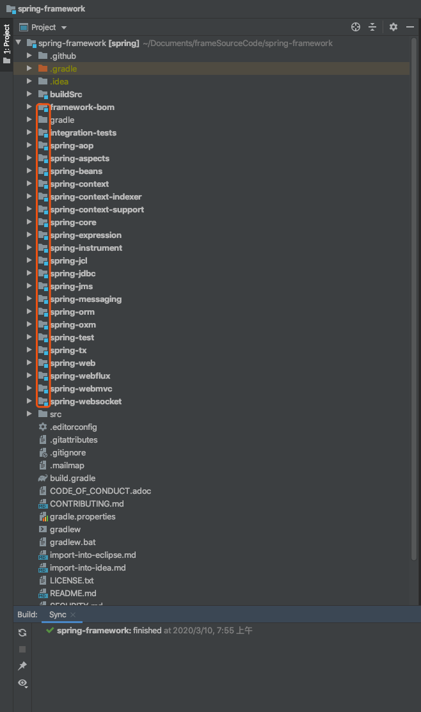
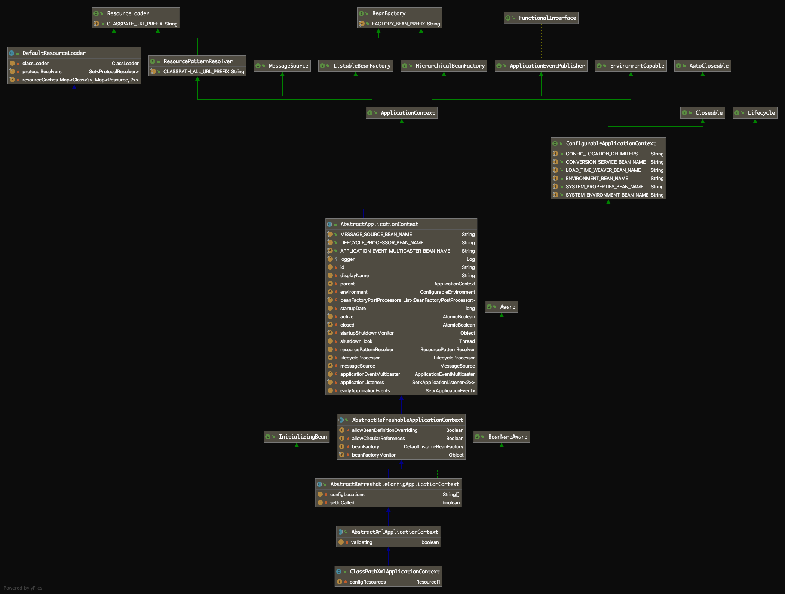
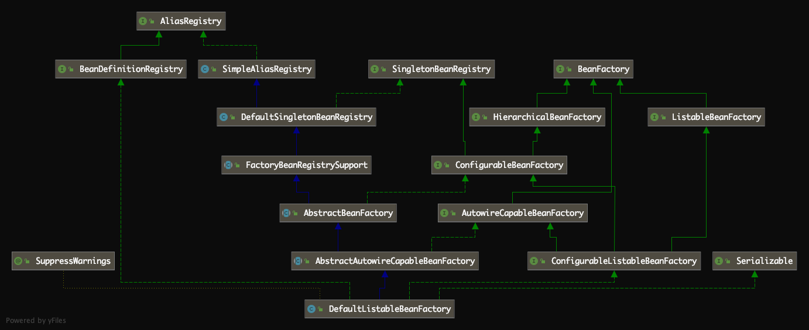

# [Spring源码解读『IOC容器2-Bean加载过程』](http://lidol.top/frame/2524/)

2020-03-09 分类：[Spring](http://lidol.top/category/frame/spring/) / [框架](http://lidol.top/category/frame/) 阅读(895) 评论(0)

上篇文章，我们自定义实现了一个简单地IOC容器。本篇文章我们来介绍一下Spring IOC容器的实现。

## 1. 准备工作

为了学习Spring的源码实现，我们需要准备Spring的源码环境，这时我们一般可以有以下两种选择：

### 1.1 下载spring-framework git项目

将[spring-framework git项目](https://github.com/spring-projects/spring-framework)下载到本地

```bash
git clone https://github.com/spring-projects/spring-framework.git
```

将源码导入到Idea中

这种方式存在一个问题，现在github下载速度非常慢，spring-framework又非常大，所以一般一般都会下载失败。解决的办法可以修改host文件或挂个代理，我是通过挂代理的方式解决的，具体参考：https://www.zhihu.com/question/27159393

将源码导入到Idea中后，Idea会自动Sync项目，等Sync结束（这个过程一般会挺久），表示spring-framework正确导入到本地了，这时候项目结构会是下图这个样子：

[](http://cdn.lidol.top/lidol_blog/20200310080845.png)

### 1.2 通过maven引入相关jar包

除了上述方式，我们还可以通过maven，将spring的相关jar包引入到本地项目中。比如我们再项目的pom.xml文件中添加spring-context的依赖：

```xml
<!-- https://mvnrepository.com/artifact/org.springframework/spring-context -->
<dependency>
    <groupId>org.springframework</groupId>
    <artifactId>spring-context</artifactId>
    <version>5.2.4.RELEASE</version>
</dependency>
```

然后就可以将spring-context相关包导入到项目中，但是这时候Idea默认只是导入了字节码jar包，并没有下载sourceCode包，对我们查看源码非常不方便，我们可以通过如下设置，让Idea在下载jar包的同时，下载sourceCode包。

Preferences > Build,Execution,Deployment > Build Tools > Maven > Importing，设置下载sourceCode包和javaDoc：

[](http://cdn.lidol.top/lidol_blog/20200310081857.png)

Idea重新导入下载源码包：

[](http://cdn.lidol.top/lidol_blog/20200310082110.png)

## 2. 源码入口

当我们试图研究Spring源码时，一般最开始总是无从下手的，因为Spring整体层级结构、实现还是比较复杂的。并且平时我们使用时一般只会关心到配置文件（配置类）层面，很少去关注底层的实现。首先我们来看一下Spring IOC源码阅读的入口，我们再学习Spring时，肯定会接触如下一段demo（这里我们使用xml配置文件的demo出发，Java配置的Spring道理是一样的，只不过入口类为AnnotationConfigApplicationContext，将Bean配置加载为BeanDefinition的过程不同，后续过程都是完全一致的）：

```java
ApplicationContext applicationContext = new ClassPathXmlApplicationContext("spring-context.xml");
applicationContext.getBean(XXX.class);
```

ClassPathXmlApplicationContext用于加载CLASSPATH下的Spring配置文件，可以看到，第二行就已经可以获取到Bean的实例了，那么必然第一行就已经完成了对所有Bean实例的加载（这里完成加载，表示配置文件中定义的Bean已经实例化并初始化了）。那么入口肯定在ClassPathXmlApplicationContext类的构造函数中，如下：

```java
public ClassPathXmlApplicationContext(String configLocation) throws BeansException {
	this(new String[] {configLocation}, true, null);
}
```

在该构造方法中，调用了另一个构造方法，如下：

```java
public ClassPathXmlApplicationContext(
		String[] configLocations, boolean refresh, @Nullable ApplicationContext parent)
		throws BeansException {

	super(parent);
	setConfigLocations(configLocations);
	if (refresh) {
		refresh();
	}
}
```

- super方法：调用父类构造函数，这里parent为null，表示无父容器
- setConfigLocations方法：用于将参数configLocations指定的Spring配置文件路径中的${PlaceHolder}占位符，替换为系统变量中PlaceHolder对应的Value值，并存储到成员变量configLocations中，方便我们后续将Bean定义加载为BeanDefinition前，获取配置文件的字节输入流
- refresh方法：Spring Bean加载的核心方法，它是ClassPathXmlApplicationContext的父类AbstractApplicationContext的一个方法，用于刷新Spring容器上下文信息，定义了Spring容器Bean加载的流程

```java
@Override
public void refresh() throws BeansException, IllegalStateException {
	synchronized (this.startupShutdownMonitor) {
		// 1. 准备刷新Spring上下文，主要用来记录Spring上下文加载开始时间，设置一些基础成员变量value
		prepareRefresh();

		// 2. 刷新BeanFactory，此方法内完成配置文件中配置的Bean到BeanDefinition的转化及注册
		ConfigurableListableBeanFactory beanFactory = obtainFreshBeanFactory();

		// 3. 准备Bean工厂，主要用来配置BeanFactory的基础信息，例如上下文的ClassLoader和后处理器
		prepareBeanFactory(beanFactory);

		try {
			// 4. 允许子context添加一些BeanFactoryPostProcessor，
			// 比如Web应用中AbstractRefreshableWebApplicationContext添加ServletContextAwareProcessor，
			// 可以暂时略过这个方法
			postProcessBeanFactory(beanFactory);

			// 5. 执行BeanFactoryPostProcessor中定义的方法
			invokeBeanFactoryPostProcessors(beanFactory);

			// 6. 注册所有的BeanPostProcessor，这部分BeanPostProcessor会在下面finishBeanFactoryInitialization方法
			// 过程中使用
			registerBeanPostProcessors(beanFactory);

			// 7. 初始化MessageSource，MessageSource是Spring定义的用于实现访问国际化的接口
			initMessageSource();

			// 8. 初始化上下文事件广播器
			initApplicationEventMulticaster();

			// 9. 模板方法，可以通过重写它添加特殊上下文刷新的工作
			onRefresh();

			// 10. 注册监听器
			registerListeners();

			// 11. 实例化所有定义的单例Bean
			finishBeanFactoryInitialization(beanFactory);

			// 结束Spring上下文刷新
			finishRefresh();
		}

		catch (BeansException ex) {
			if (logger.isWarnEnabled()) {
				logger.warn("Exception encountered during context initialization - " +
						"cancelling refresh attempt: " + ex);
			}

			// Destroy already created singletons to avoid dangling resources.
			destroyBeans();

			// Reset 'active' flag.
			cancelRefresh(ex);

			// Propagate exception to caller.
			throw ex;
		}

		finally {
			// Reset common introspection caches in Spring's core, since we
			// might not ever need metadata for singleton beans anymore...
			resetCommonCaches();
		}
	}
}
```

上述流程会在后面的文章详细介绍，这里只简单罗列一下Bean加载的步骤。对于我们理解Bean加载比较重要的就是第2步和第11步，这两步定义了Spring启动时，Bean是如何从配置文件变成可使用的对象的过程。后面的文章会先介绍这一部分，再逐步讲解剩余的步骤。同时对于refresh方法我们还需要关注以下两点：

- refresh方法主体是加了同步锁的，该锁在关闭方法close中使用，就是为了保证在调用refresh()方法的时候无法调用close()方法。或者调用close方法时无法调用refresh()方法，保证互斥性。
- 该方法中，定义了跟Bean加载相关的很多子方法，每个子方法完成其独立的功能，阅读起来非常清晰明了。否则的花将散布在各个子方法中的逻辑统一搬到refresh方法中，refresh方法至少要有几千行了。所以通过模块划分明的子方法提高了代码的可扩展性和可维护性。

## 3. 继承体系

通过上述简单地逻辑梳理，我们可以发现，在Bean加载过程中，比较重要的两个类。分别为入口类ClassPathXmlApplicationContext，以及该入口类通过继承得到的成员变量beanFactory，代码中可以发现该实例为DefaultListableBeanFactory。我们来看一下这两个类的继承体系。

[](http://cdn.lidol.top/lidol_blog/ClasspathXmlApplicationContext1.png)

[](http://cdn.lidol.top/lidol_blog/DefaultListableBeanFactory.png)

类比我们之前自定义实现的IOC容器，可以发现ClassPathXmlApplicationContext的功能跟我们之前自定义实现的功能基本一致，实现了BeanFactory接口，所以是这一种特殊的BeanFactory。对于ClassPathXmlApplicationContext特别需要需要注意的是，其继承的抽象类**AbstractRefreshableApplicationContext有一个DefaultListableBeanFactory实例，**ClassPathXmlApplicationContext类能够实现Bean工厂的功能都是通过继承的该成员变量实现的。**该成员变量会在上述refresh方法的子方法obtainFreshBeanFactory中初始化**。

对于DefaultListableBeanFactory，我们需要重点关注的是，**该类同时实现了BeanFactory接口和BeanDefinitionRegistry接口，是Bean工厂也是Bean注册中心**。

## 4. Bean加载流程

下面我们来看一下Bean加载流程，其实也就是refresh方法的大致执行流程。

### 4.1 prepareRefresh

该方法是AbstractApplicationContext的方法，如下：

```java
/**
* Prepare this context for refreshing, setting its startup date and
* active flag as well as performing any initialization of property sources.
*/
protected void prepareRefresh() {
	this.startupDate = System.currentTimeMillis();
	this.closed.set(false);
	this.active.set(true);

	if (logger.isInfoEnabled()) {
		logger.info("Refreshing " + this);
	}

	// Initialize any placeholder property sources in the context environment
	initPropertySources();

	// Validate that all properties marked as required are resolvable
	// see ConfigurablePropertyResolver#setRequiredProperties
	getEnvironment().validateRequiredProperties();

	// Allow for the collection of early ApplicationEvents,
	// to be published once the multicaster is available...
	this.earlyApplicationEvents = new LinkedHashSet<>();
}
```

从方法注释就可以看到，该方法的功能是为刷新上下文做准备，设置Spring上下文加载开始时间。其余就是设置一些成员变量value，比如closed标志、active标志。很简单，也没有什么特别要讲的。

### 4.2 obtainFreshBeanFactory

该方法对我们理解Spring Bean加载过程比较重要，需要重点关注。该方法是AbstractApplicationContext的方法，作用是获取刷新Spring上下文的Bean工厂，**该方法的返回值就是上面讲的AbstractRefreshableApplicationContext类的DefaultListableBeanFactory类型成员变量**。并且在该方法中，使用XMLBeanDefinitionReader完成了xml配置文件到BeanDefinition的转换，如下：

```java
protected ConfigurableListableBeanFactory obtainFreshBeanFactory() {
	refreshBeanFactory();
	ConfigurableListableBeanFactory beanFactory = getBeanFactory();
	if (logger.isDebugEnabled()) {
		logger.debug("Bean factory for " + getDisplayName() + ": " + beanFactory);
	}
	return beanFactory;
}
```

该方法最终返回的对象是通过getBeanFactory方法获取的，而getBeanFactory方法在AbstractApplicationContext类中是个抽象方法：

```java
public abstract ConfigurableListableBeanFactory getBeanFactory() throws IllegalStateException;
```

具体实现在子类AbstractRefreshableApplicationContext中，如下：

```java
@Override
public final ConfigurableListableBeanFactory getBeanFactory() {
	synchronized (this.beanFactoryMonitor) {
		if (this.beanFactory == null) {
			throw new IllegalStateException("BeanFactory not initialized or already closed - " +
					"call 'refresh' before accessing beans via the ApplicationContext");
		}
		return this.beanFactory;
	}
}
```

方法实现其实其实就是返回AbstractRefreshableApplicationContext的成员变量实例。所以在上述调用getBeanFactory()方法之前，肯定完成了AbstractRefreshableApplicationContext成员变量beanFactory的初始化。来看一下调用getBeanFactory方法之前调用的refreshBeanFactory方法：

```java
protected abstract void refreshBeanFactory() throws BeansException, IllegalStateException;
```

也是AbstractApplicationContext类的抽象方法，具体实现在子类AbstractRefreshableApplicationContext：

```java
@Override
protected final void refreshBeanFactory() throws BeansException {
	if (hasBeanFactory()) {
		destroyBeans();
		closeBeanFactory();
	}
	try {
		//1. 创建DefaultListableBeanFactory对象实例
		DefaultListableBeanFactory beanFactory = createBeanFactory();
		//2. 设置serializationId
		beanFactory.setSerializationId(getId());
		//3. 定制化设置beanFactory
		customizeBeanFactory(beanFactory);
		//4. 加载xml配置文件中的Bean配置，转化为BeanDefinition，并注册到注册中心BeanFactory
		loadBeanDefinitions(beanFactory);
		synchronized (this.beanFactoryMonitor) {
			this.beanFactory = beanFactory;
		}
	}
	catch (IOException ex) {
		throw new ApplicationContextException("I/O error parsing bean definition source for " + getDisplayName(), ex);
	}
}
```

### 4.3 prepareBeanFactory

prepareBeanFactory方法是AbstractApplicationContext类的方法，用于配置BeanFactory的基本特性：

```java
/**
* 配置BeanFactory的基本特性，比如ClassLoader、post-processor后置处理器
*/
protected void prepareBeanFactory(ConfigurableListableBeanFactory beanFactory) {
	// 1. 为beanFactory配置classLoader
	beanFactory.setBeanClassLoader(getClassLoader());
	// 2. 为beanFactory设置spEl表达是语言处理器，用来解析#{bean.xxx}方式设置的属性值
	beanFactory.setBeanExpressionResolver(new StandardBeanExpressionResolver(beanFactory.getBeanClassLoader()));
	// 3. 为beanFactory设置属性编辑器
	beanFactory.addPropertyEditorRegistrar(new ResourceEditorRegistrar(this, getEnvironment()));

	// 4. 为beanFactory添加ApplicationContextAwareProcessor用于上下文回调
	beanFactory.addBeanPostProcessor(new ApplicationContextAwareProcessor(this));

	// 5. 设置下面这些接口的实现类Bean不会被自动装配
	beanFactory.ignoreDependencyInterface(EnvironmentAware.class);
	beanFactory.ignoreDependencyInterface(EmbeddedValueResolverAware.class);
	beanFactory.ignoreDependencyInterface(ResourceLoaderAware.class);
	beanFactory.ignoreDependencyInterface(ApplicationEventPublisherAware.class);
	beanFactory.ignoreDependencyInterface(MessageSourceAware.class);
	beanFactory.ignoreDependencyInterface(ApplicationContextAware.class);

	// 6. 修正依赖，设置自动装配的特殊规则，比如是BeanFactory接口的实现类，则修正为当前BeanFactory
	beanFactory.registerResolvableDependency(BeanFactory.class, beanFactory);
	beanFactory.registerResolvableDependency(ResourceLoader.class, this);
	beanFactory.registerResolvableDependency(ApplicationEventPublisher.class, this);
	beanFactory.registerResolvableDependency(ApplicationContext.class, this);

	// 7. 为beanFactory添加ApplicationListenerDetector后置处理器，用于将实现了ApplicationListener接口的bean注册为监听器
	beanFactory.addBeanPostProcessor(new ApplicationListenerDetector(this));

	// 8. 如果自定义的Bean中有定义过名为"loadTimeWeaver"的Bean，则会添加一个LoadTimeWeaverAwareProcessor
	if (beanFactory.containsBean(LOAD_TIME_WEAVER_BEAN_NAME)) {
		beanFactory.addBeanPostProcessor(new LoadTimeWeaverAwareProcessor(beanFactory));
		// Set a temporary ClassLoader for type matching.
		beanFactory.setTempClassLoader(new ContextTypeMatchClassLoader(beanFactory.getBeanClassLoader()));
	}

	// 9. 为beanFactory注册系统环境信息bean，比如"environment"、"systemProperties"、"systemEnvironment"
	if (!beanFactory.containsLocalBean(ENVIRONMENT_BEAN_NAME)) {
		beanFactory.registerSingleton(ENVIRONMENT_BEAN_NAME, getEnvironment());
	}
	if (!beanFactory.containsLocalBean(SYSTEM_PROPERTIES_BEAN_NAME)) {
		beanFactory.registerSingleton(SYSTEM_PROPERTIES_BEAN_NAME, getEnvironment().getSystemProperties());
	}
	if (!beanFactory.containsLocalBean(SYSTEM_ENVIRONMENT_BEAN_NAME)) {
		beanFactory.registerSingleton(SYSTEM_ENVIRONMENT_BEAN_NAME, getEnvironment().getSystemEnvironment());
	}
}
```

### 4.4 invokeBeanFactoryPostProcessors

invokeBeanFactoryPostProcessors是AbstractApplicationContext的方法，用于执行实现了BeanFactoryPostProcessor中定义的方法。是Spring留给用户的一个非常有用的扩展点，**BeanFactoryPostProcessor接口提供了所有Bean实例化前的操作的扩展点**。同时需要注意的是，这里讲的Bean实例化前，表示的是调用Bean的初始化方法前，BeanFactoryPostProcessor接口方法调用时机是任意一个自定义的Bean被实例化前，且只会被执行一次。

```java
protected void invokeBeanFactoryPostProcessors(ConfigurableListableBeanFactory beanFactory) {
	// 反射执行BeanFactoryPostProcessor所有实现类的方法
	PostProcessorRegistrationDelegate.invokeBeanFactoryPostProcessors(beanFactory, getBeanFactoryPostProcessors());

	// Detect a LoadTimeWeaver and prepare for weaving, if found in the meantime
	// (e.g. through an @Bean method registered by ConfigurationClassPostProcessor)
	if (beanFactory.getTempClassLoader() == null && beanFactory.containsBean(LOAD_TIME_WEAVER_BEAN_NAME)) {
		beanFactory.addBeanPostProcessor(new LoadTimeWeaverAwareProcessor(beanFactory));
		beanFactory.setTempClassLoader(new ContextTypeMatchClassLoader(beanFactory.getBeanClassLoader()));
	}
}
public static void invokeBeanFactoryPostProcessors(
		ConfigurableListableBeanFactory beanFactory, List<BeanFactoryPostProcessor> beanFactoryPostProcessors) {

	// Invoke BeanDefinitionRegistryPostProcessors first, if any.
	Set<String> processedBeans = new HashSet<>();

	
	if (beanFactory instanceof BeanDefinitionRegistry) {
		BeanDefinitionRegistry registry = (BeanDefinitionRegistry) beanFactory;
		List<BeanFactoryPostProcessor> regularPostProcessors = new ArrayList<>();
		List<BeanDefinitionRegistryPostProcessor> registryProcessors = new ArrayList<>();

		// 1. BeanDefinitionRegistryPostProcessor接口继承了BeanFactoryPostProcessor接口，
		// 这里执行BeanDefinitionRegistryPostProcessor接口的postProcessBeanDefinitionRegistry方法
		// beanFactoryPostProcessors参数是通过getBeanFactoryPostProcessors()获取的，
		// 通过xml配置文件启动Spring容器时，该方法返回为空，所以不会进for循环
		for (BeanFactoryPostProcessor postProcessor : beanFactoryPostProcessors) {
			if (postProcessor instanceof BeanDefinitionRegistryPostProcessor) {
				BeanDefinitionRegistryPostProcessor registryProcessor =
						(BeanDefinitionRegistryPostProcessor) postProcessor;
				registryProcessor.postProcessBeanDefinitionRegistry(registry);
				registryProcessors.add(registryProcessor);
			}
			else {
				regularPostProcessors.add(postProcessor);
			}
		}

		// Do not initialize FactoryBeans here: We need to leave all regular beans
		// uninitialized to let the bean factory post-processors apply to them!
		// Separate between BeanDefinitionRegistryPostProcessors that implement
		// PriorityOrdered, Ordered, and the rest.
		List<BeanDefinitionRegistryPostProcessor> currentRegistryProcessors = new ArrayList<>();

		// 2. 收集所有实现了PriorityOrdered接口的BeanDefinitionRegistryPostProcessor，并执行postProcessBeanDefinitionRegistry方法
		String[] postProcessorNames =
				beanFactory.getBeanNamesForType(BeanDefinitionRegistryPostProcessor.class, true, false);
		for (String ppName : postProcessorNames) {
			if (beanFactory.isTypeMatch(ppName, PriorityOrdered.class)) {
				// currentRegistryProcessors用于存储当前正在处理的某种类型的BeanDefinitionRegistryPostProcessor集合
				currentRegistryProcessors.add(beanFactory.getBean(ppName, BeanDefinitionRegistryPostProcessor.class));
				// processedBeans用于存储已经注册过的BeanDefinitionRegistryPostProcessor名称，用于下面排除实现了PriorityOrdered接口
				// 和实现了Ordered接口的BeanDefinitionRegistryPostProcessor
				processedBeans.add(ppName);
			}
		}
		//排序
		sortPostProcessors(currentRegistryProcessors, beanFactory);
		// 将当前类型的BeanDefinitionRegistryPostProcessor添加到已注册容器
		// 用于下面执行BeanDefinitionRegistryPostProcessor的postProcessBeanFactory方法
		registryProcessors.addAll(currentRegistryProcessors);
		// 执行BeanDefinitionRegistryPostProcessor的postProcessBeanDefinitionRegistry方法
		invokeBeanDefinitionRegistryPostProcessors(currentRegistryProcessors, registry);
		// 将currentRegistryProcessors容器清空，该容器会继续处理其他类型的BeanDefinitionRegistryPostProcessor
		currentRegistryProcessors.clear();

		// 3. 收集所有实现了Ordered接口的BeanDefinitionRegistryPostProcessor，并执行postProcessBeanDefinitionRegistry方法
		postProcessorNames = beanFactory.getBeanNamesForType(BeanDefinitionRegistryPostProcessor.class, true, false);
		for (String ppName : postProcessorNames) {
			if (!processedBeans.contains(ppName) && beanFactory.isTypeMatch(ppName, Ordered.class)) {
				currentRegistryProcessors.add(beanFactory.getBean(ppName, BeanDefinitionRegistryPostProcessor.class));
				processedBeans.add(ppName);
			}
		}
		sortPostProcessors(currentRegistryProcessors, beanFactory);
		registryProcessors.addAll(currentRegistryProcessors);
		invokeBeanDefinitionRegistryPostProcessors(currentRegistryProcessors, registry);
		currentRegistryProcessors.clear();

		// 4. 收集除实现了PriorityOrdered接口和Ordered接口的BeanDefinitionRegistryPostProcessor，并执行postProcessBeanDefinitionRegistry方法
		boolean reiterate = true;
		while (reiterate) {
			reiterate = false;
			postProcessorNames = beanFactory.getBeanNamesForType(BeanDefinitionRegistryPostProcessor.class, true, false);
			for (String ppName : postProcessorNames) {
				if (!processedBeans.contains(ppName)) {
					currentRegistryProcessors.add(beanFactory.getBean(ppName, BeanDefinitionRegistryPostProcessor.class));
					processedBeans.add(ppName);
					reiterate = true;
				}
			}
			sortPostProcessors(currentRegistryProcessors, beanFactory);
			registryProcessors.addAll(currentRegistryProcessors);
			invokeBeanDefinitionRegistryPostProcessors(currentRegistryProcessors, registry);
			currentRegistryProcessors.clear();
		}

		// 5. 执行BeanDefinitionRegistryPostProcessor的postProcessBeanFactory方法
		invokeBeanFactoryPostProcessors(registryProcessors, beanFactory);
		invokeBeanFactoryPostProcessors(regularPostProcessors, beanFactory);
	}

	else {
		// Invoke factory processors registered with the context instance.
		invokeBeanFactoryPostProcessors(beanFactoryPostProcessors, beanFactory);
	}

	// 6. 处理所有的BeanFactoryPostProcessor，逻辑跟上面处理BeanDefinitionRegistryPostProcessor类似
	String[] postProcessorNames =
			beanFactory.getBeanNamesForType(BeanFactoryPostProcessor.class, true, false);

	// Separate between BeanFactoryPostProcessors that implement PriorityOrdered,
	// Ordered, and the rest.
	List<BeanFactoryPostProcessor> priorityOrderedPostProcessors = new ArrayList<>();
	List<String> orderedPostProcessorNames = new ArrayList<>();
	List<String> nonOrderedPostProcessorNames = new ArrayList<>();
	for (String ppName : postProcessorNames) {
		if (processedBeans.contains(ppName)) {
			// skip - already processed in first phase above
		}
		else if (beanFactory.isTypeMatch(ppName, PriorityOrdered.class)) {
			priorityOrderedPostProcessors.add(beanFactory.getBean(ppName, BeanFactoryPostProcessor.class));
		}
		else if (beanFactory.isTypeMatch(ppName, Ordered.class)) {
			orderedPostProcessorNames.add(ppName);
		}
		else {
			nonOrderedPostProcessorNames.add(ppName);
		}
	}

	// First, invoke the BeanFactoryPostProcessors that implement PriorityOrdered.
	sortPostProcessors(priorityOrderedPostProcessors, beanFactory);
	invokeBeanFactoryPostProcessors(priorityOrderedPostProcessors, beanFactory);

	// Next, invoke the BeanFactoryPostProcessors that implement Ordered.
	List<BeanFactoryPostProcessor> orderedPostProcessors = new ArrayList<>();
	for (String postProcessorName : orderedPostProcessorNames) {
		orderedPostProcessors.add(beanFactory.getBean(postProcessorName, BeanFactoryPostProcessor.class));
	}
	sortPostProcessors(orderedPostProcessors, beanFactory);
	invokeBeanFactoryPostProcessors(orderedPostProcessors, beanFactory);

	// Finally, invoke all other BeanFactoryPostProcessors.
	List<BeanFactoryPostProcessor> nonOrderedPostProcessors = new ArrayList<>();
	for (String postProcessorName : nonOrderedPostProcessorNames) {
		nonOrderedPostProcessors.add(beanFactory.getBean(postProcessorName, BeanFactoryPostProcessor.class));
	}
	invokeBeanFactoryPostProcessors(nonOrderedPostProcessors, beanFactory);

	// Clear cached merged bean definitions since the post-processors might have
	// modified the original metadata, e.g. replacing placeholders in values...
	beanFactory.clearMetadataCache();
}
```

### **4.5 registerBeanPostProcessors**

registerBeanPostProcessors方法是AbstractApplicationContext类中定义的方法，用于注册BeanPostProcessor。**BeanPostProcessor提供了每个Bean初始化前后操作的扩展点**。注意**registerBeanPostProcessors方法是用于注册BeanPostProcessor，并没有真正执行BeanPostProcessor中定义的前置和后置方法**。

```java
/**
* Instantiate and invoke all registered BeanPostProcessor beans,
* respecting explicit order if given.
* <p>Must be called before any instantiation of application beans.
*/
protected void registerBeanPostProcessors(ConfigurableListableBeanFactory beanFactory) {
	PostProcessorRegistrationDelegate.registerBeanPostProcessors(beanFactory, this);
}
public static void registerBeanPostProcessors(
		ConfigurableListableBeanFactory beanFactory, AbstractApplicationContext applicationContext) {

	// 1. 获取所有的BeanPostProcessor类型的BeanName
	String[] postProcessorNames = beanFactory.getBeanNamesForType(BeanPostProcessor.class, true, false);

	// Register BeanPostProcessorChecker that logs an info message when
	// a bean is created during BeanPostProcessor instantiation, i.e. when
	// a bean is not eligible for getting processed by all BeanPostProcessors.
	int beanProcessorTargetCount = beanFactory.getBeanPostProcessorCount() + 1 + postProcessorNames.length;
	beanFactory.addBeanPostProcessor(new BeanPostProcessorChecker(beanFactory, beanProcessorTargetCount));

	// 2. 将所有的BeanPostProcessor分为实现了PriorityOrdered接口、实现了Ordered接口和其它三类
	List<BeanPostProcessor> priorityOrderedPostProcessors = new ArrayList<>();
	List<BeanPostProcessor> internalPostProcessors = new ArrayList<>();
	List<String> orderedPostProcessorNames = new ArrayList<>();
	List<String> nonOrderedPostProcessorNames = new ArrayList<>();
	for (String ppName : postProcessorNames) {
		if (beanFactory.isTypeMatch(ppName, PriorityOrdered.class)) {
			BeanPostProcessor pp = beanFactory.getBean(ppName, BeanPostProcessor.class);
			priorityOrderedPostProcessors.add(pp);
			if (pp instanceof MergedBeanDefinitionPostProcessor) {
				internalPostProcessors.add(pp);
			}
		}
		else if (beanFactory.isTypeMatch(ppName, Ordered.class)) {
			orderedPostProcessorNames.add(ppName);
		}
		else {
			nonOrderedPostProcessorNames.add(ppName);
		}
	}

	// 3. 排序后注册所有实现了PriorityOrdered接口的BeanPostProcessor
	// 这里的注册，是将BeanPostProcessor添加到beanFactory的成员变量beanPostProcessors
	sortPostProcessors(priorityOrderedPostProcessors, beanFactory);
	registerBeanPostProcessors(beanFactory, priorityOrderedPostProcessors);

	// 4. 排序后注册所有实现了Ordered接口的BeanPostProcessor
	List<BeanPostProcessor> orderedPostProcessors = new ArrayList<>();
	for (String ppName : orderedPostProcessorNames) {
		BeanPostProcessor pp = beanFactory.getBean(ppName, BeanPostProcessor.class);
		orderedPostProcessors.add(pp);
		if (pp instanceof MergedBeanDefinitionPostProcessor) {
			internalPostProcessors.add(pp);
		}
	}
	sortPostProcessors(orderedPostProcessors, beanFactory);
	registerBeanPostProcessors(beanFactory, orderedPostProcessors);

	// 5. 注册所有除上述两种BeanPostProcessor之外的BeanPostProcessor
	List<BeanPostProcessor> nonOrderedPostProcessors = new ArrayList<>();
	for (String ppName : nonOrderedPostProcessorNames) {
		BeanPostProcessor pp = beanFactory.getBean(ppName, BeanPostProcessor.class);
		nonOrderedPostProcessors.add(pp);
		if (pp instanceof MergedBeanDefinitionPostProcessor) {
			internalPostProcessors.add(pp);
		}
	}
	registerBeanPostProcessors(beanFactory, nonOrderedPostProcessors);

	// 6. 排序后注册所有MergedBeanDefinitionPostProcessor实例
	sortPostProcessors(internalPostProcessors, beanFactory);
	registerBeanPostProcessors(beanFactory, internalPostProcessors);

	// 7. 注册ApplicationListenerDetector
	beanFactory.addBeanPostProcessor(new ApplicationListenerDetector(applicationContext));
}
```

### **4.6 initMessageSource**

initMessageSource方法是AbstractApplicationContext类中定义的方法，用于初始化MessageSource，MessageSource是Spring定义的用于实现访问国际化的接口。

```java
/**
* Initialize the MessageSource.
* Use parent's if none defined in this context.
*/
protected void initMessageSource() {
	ConfigurableListableBeanFactory beanFactory = getBeanFactory();
	// 如果自定义了名为"messageSource"的Bean，就实例化该bean
	if (beanFactory.containsLocalBean(MESSAGE_SOURCE_BEAN_NAME)) {
		this.messageSource = beanFactory.getBean(MESSAGE_SOURCE_BEAN_NAME, MessageSource.class);
		// Make MessageSource aware of parent MessageSource.
		if (this.parent != null && this.messageSource instanceof HierarchicalMessageSource) {
			HierarchicalMessageSource hms = (HierarchicalMessageSource) this.messageSource;
			if (hms.getParentMessageSource() == null) {
				// Only set parent context as parent MessageSource if no parent MessageSource
				// registered already.
				hms.setParentMessageSource(getInternalParentMessageSource());
			}
		}
		if (logger.isDebugEnabled()) {
			logger.debug("Using MessageSource [" + this.messageSource + "]");
		}
	}
	// 否则，默认生成一个DelegatingMessageSource实例，并注册到beanFactory
	else {
		// Use empty MessageSource to be able to accept getMessage calls.
		DelegatingMessageSource dms = new DelegatingMessageSource();
		dms.setParentMessageSource(getInternalParentMessageSource());
		this.messageSource = dms;
		beanFactory.registerSingleton(MESSAGE_SOURCE_BEAN_NAME, this.messageSource);
		if (logger.isDebugEnabled()) {
			logger.debug("Unable to locate MessageSource with name '" + MESSAGE_SOURCE_BEAN_NAME +
					"': using default [" + this.messageSource + "]");
		}
	}
}
```

### **4.7** initApplicationEventMulticaster

initApplicationEventMulticaster方法是AbstractApplicationContext类中定义的方法，用于初始化Spring容器广播器。

```java
/**
* Initialize the ApplicationEventMulticaster.
* Uses SimpleApplicationEventMulticaster if none defined in the context.
* @see org.springframework.context.event.SimpleApplicationEventMulticaster
*/
protected void initApplicationEventMulticaster() {
	ConfigurableListableBeanFactory beanFactory = getBeanFactory();
	// 如果自定义了名为"applicationEventMulticaster"的Bean，就实例化该Bean，注册到容器
	if (beanFactory.containsLocalBean(APPLICATION_EVENT_MULTICASTER_BEAN_NAME)) {
		this.applicationEventMulticaster =
				beanFactory.getBean(APPLICATION_EVENT_MULTICASTER_BEAN_NAME, ApplicationEventMulticaster.class);
		if (logger.isDebugEnabled()) {
			logger.debug("Using ApplicationEventMulticaster [" + this.applicationEventMulticaster + "]");
		}
	}
	// 否则生成一个SimpleApplicationEventMulticaster实例，注册到容器
	else {
		this.applicationEventMulticaster = new SimpleApplicationEventMulticaster(beanFactory);
		beanFactory.registerSingleton(APPLICATION_EVENT_MULTICASTER_BEAN_NAME, this.applicationEventMulticaster);
		if (logger.isDebugEnabled()) {
			logger.debug("Unable to locate ApplicationEventMulticaster with name '" +
					APPLICATION_EVENT_MULTICASTER_BEAN_NAME +
					"': using default [" + this.applicationEventMulticaster + "]");
		}
	}
}
```

### 4.8 **onRefresh**

onRefresh方法是AbstractApplicationContext类中定义的方法，该方法是一个模板方法。重写该方法，可以为容器添加特殊上下文刷新的工作，在特殊Bean的初始化时、初始化之前被调用。比如AbstractRefreshableWebApplicationContext、StaticWebApplicationContext都重写了该方法。

```java
/**
* Template method which can be overridden to add context-specific refresh work.
* Called on initialization of special beans, before instantiation of singletons.
* <p>This implementation is empty.
* @throws BeansException in case of errors
* @see #refresh()
*/
protected void onRefresh() throws BeansException {
	// For subclasses: do nothing by default.
}
```

### 4.9 **registerListeners**

registerListeners方法是AbstractApplicationContext类中定义的方法，用于注册监听器。

```java
/**
* Add beans that implement ApplicationListener as listeners.
* Doesn't affect other listeners, which can be added without being beans.
*/
protected void registerListeners() {
	// Register statically specified listeners first.
	for (ApplicationListener<?> listener : getApplicationListeners()) {
		getApplicationEventMulticaster().addApplicationListener(listener);
	}

	// Do not initialize FactoryBeans here: We need to leave all regular beans
	// uninitialized to let post-processors apply to them!
	String[] listenerBeanNames = getBeanNamesForType(ApplicationListener.class, true, false);
	for (String listenerBeanName : listenerBeanNames) {
		getApplicationEventMulticaster().addApplicationListenerBean(listenerBeanName);
	}

	// Publish early application events now that we finally have a multicaster...
	Set<ApplicationEvent> earlyEventsToProcess = this.earlyApplicationEvents;
	this.earlyApplicationEvents = null;
	if (earlyEventsToProcess != null) {
		for (ApplicationEvent earlyEvent : earlyEventsToProcess) {
			getApplicationEventMulticaster().multicastEvent(earlyEvent);
		}
	}
}
```

### 4.10 finishBeanFactoryInitialization

finishBeanFactoryInitialization方法是Spring容器Bean加载流程中最重要的一步，所有的非懒加载的Bean都会在该方法中实例化并初始化，这个方法我们再接下来的文章中单独介绍。

### 4.11 finishRefresh

finishRefresh方法是AbstractApplicationContext类中定义的方法，用于结束Spring上下文刷新，对我们理解Spring容器Bean加载不是那么在“重要”，可以选择略过，这里也不深入探讨了。

```java
/**
* Finish the refresh of this context, invoking the LifecycleProcessor's
* onRefresh() method and publishing the
* {@link org.springframework.context.event.ContextRefreshedEvent}.
*/
protected void finishRefresh() {
	// Clear context-level resource caches (such as ASM metadata from scanning).
	clearResourceCaches();

	// Initialize lifecycle processor for this context.
	initLifecycleProcessor();

	// Propagate refresh to lifecycle processor first.
	getLifecycleProcessor().onRefresh();

	// Publish the final event.
	publishEvent(new ContextRefreshedEvent(this));

	// Participate in LiveBeansView MBean, if active.
	LiveBeansView.registerApplicationContext(this);
}
```

> 参考链接：
>
> \1. Spring源码
>
> \2. [非懒加载的单例Bean初始化前后的一些操作](https://www.cnblogs.com/xrq730/p/6670457.html)