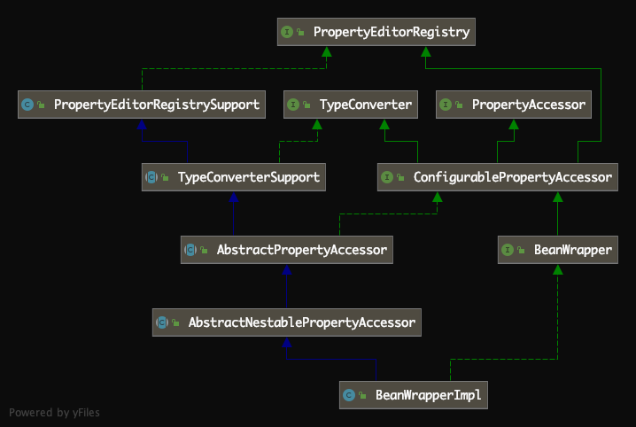

# [Spring源码解读『IOC容器3-Bean初始化』](http://lidol.top/frame/2550/)

2020-04-01 分类：[Spring](http://lidol.top/category/frame/spring/) / [框架](http://lidol.top/category/frame/) 阅读(620) 评论(0)

上篇文章我们介绍了Spring源码阅读的入口，分析了通过xml配置文件到Spring Bean初始化出来的流程。在上篇文章中，我们讲到，**所有非懒加载的bean都是在finishBeanFactoryInitialization方法中完成实例化和初始化**。由于该方法是整个Bean加载流程的核心方法，并且介绍起来篇幅较长，所以该方法单独在本篇文章介绍。在阅读源码之前，我们可以简单想象一下该方法的实现内容。在该方法执行之前，所有的Bean配置（通过xml配置文件或者配置类）都已经转变层BeanDefinition并注册到BeanFactory，该方法结束之后所有的非懒加载Bean都已经被容器生产出来了，那么该方法肯定实现了一个基础功能：

> **从注册中心获取BeanDefinition，反射调用BeanDefinition对应类的构造函数实例化该Bean，并通过BeanDefinition中该Bean的成员变量初始化**

## 1. Bean实例化过程

### 1.1 preInstantiateSingletons

preInstantiateSingletons方法是DefaultListableBeanFactory类中定义的方法，用于实例化并初始化所有非懒加载的Bean。

```java
@Override
public void preInstantiateSingletons() throws BeansException {
	if (logger.isDebugEnabled()) {
		logger.debug("Pre-instantiating singletons in " + this);
	}

	// Iterate over a copy to allow for init methods which in turn register new bean definitions.
	// While this may not be part of the regular factory bootstrap, it does otherwise work fine.
	List<String> beanNames = new ArrayList<>(this.beanDefinitionNames);

	// 遍历所有的Bean Name，初始化非懒加载Bean
	for (String beanName : beanNames) {
		// 1. 获取所有已注册的BeanDefinition
		RootBeanDefinition bd = getMergedLocalBeanDefinition(beanName);
		// 2. 如果BeanDefinition非抽象的、单例的、非懒加载的，就会在下面实例化并初始化Bean
		if (!bd.isAbstract() && bd.isSingleton() && !bd.isLazyInit()) {
			// 如果Bean收集FactoryBean
			if (isFactoryBean(beanName)) {
				Object bean = getBean(FACTORY_BEAN_PREFIX + beanName);
				if (bean instanceof FactoryBean) {
					final FactoryBean<?> factory = (FactoryBean<?>) bean;
					boolean isEagerInit;
					if (System.getSecurityManager() != null && factory instanceof SmartFactoryBean) {
						isEagerInit = AccessController.doPrivileged((PrivilegedAction<Boolean>)
										((SmartFactoryBean<?>) factory)::isEagerInit,
								getAccessControlContext());
					}
					else {
						isEagerInit = (factory instanceof SmartFactoryBean &&
								((SmartFactoryBean<?>) factory).isEagerInit());
					}
					if (isEagerInit) {
						getBean(beanName);
					}
				}
			}
			// 3. 如果Bean是普通的Bean，调用getBean方法实例化并初始化Bean
			else {
				getBean(beanName);
			}
		}
	}

	// 触发所有SmartInitializingSingleton Bean回调
	for (String beanName : beanNames) {
		Object singletonInstance = getSingleton(beanName);
		if (singletonInstance instanceof SmartInitializingSingleton) {
			final SmartInitializingSingleton smartSingleton = (SmartInitializingSingleton) singletonInstance;
			if (System.getSecurityManager() != null) {
				AccessController.doPrivileged((PrivilegedAction<Object>) () -> {
					smartSingleton.afterSingletonsInstantiated();
					return null;
				}, getAccessControlContext());
			}
			else {
				smartSingleton.afterSingletonsInstantiated();
			}
		}
	}
}
```

这里解释一下getMergedLocalBeanDefinition方法的含义。BeanDefinition公共的抽象类是AbstractBeanDefinition，Spring加载普通Bean的BeanDefinition的时候，实例化出来的是GenericBeanDefinition对象，而Spring上下文实例化Bean（构造对象）用的AbstractBeanDefinition是RootBeanDefinition实例，这时候就需要将非RootBeanDefinition转换为RootBeanDefinition，getMergedLocalBeanDefinition方法就完成了该操作。

其次我们可以看到，在遍历所有的BeanName，实例化Bean的过程中，并不是所有定义的Bean都可以进行对象实例化，必须满足以下三个条件：

- 非抽象类
- 单例
- 非懒加载

如果满足上述三个条件，表示当前BeanDefinition可以被实例化为对象。然后又分为两种情况，是否为FactroyBean，如果非FactoryBean比较简单，直接通过getBean方法实例化对象即可。如果是FactoryBean，就需要做特殊处理。关于FactoryBean，我们暂时只需要了解这时一种Bean，通过FactoryBean我们可以自定义控制Bean的实例化，在下篇文章中我们会介绍FactoryBean的用法。所以这里我们可以明确，实例化Bean实在getBean方法中完成的。

### 1.2 getBean

getBean是AbstractBeanFactory类中定义的方法，用来实例化并初始化指定名称的Bean。

```java
@Override
public Object getBean(String name) throws BeansException {
	return doGetBean(name, null, null, false);
}
```

方法实现在doGetBean，在读Spring相关源码时，一般当我们遇到方法名为do****的方法，都是“真正做事情”的方法，需要重点关注。

```java
protected <T> T doGetBean(final String name, @Nullable final Class<T> requiredType,
		@Nullable final Object[] args, boolean typeCheckOnly) throws BeansException {

	final String beanName = transformedBeanName(name);
	Object bean;

	// 1. 检查本地的单例缓存中，是否该Bean已经加载
	Object sharedInstance = getSingleton(beanName);
	// 如果本地缓存中该Bean已经加载，直接从缓存中后去返回的Bean实例，方法为getObjectForBeanInstance
	if (sharedInstance != null && args == null) {
		if (logger.isDebugEnabled()) {
			if (isSingletonCurrentlyInCreation(beanName)) {
				logger.debug("Returning eagerly cached instance of singleton bean '" + beanName +
						"' that is not fully initialized yet - a consequence of a circular reference");
			}
			else {
				logger.debug("Returning cached instance of singleton bean '" + beanName + "'");
			}
		}
		bean = getObjectForBeanInstance(sharedInstance, name, beanName, null);
	}
	// 2. 如果本地缓存中不存在该Bean，说明该bean没有被加载过
	else {
		// Fail if we're already creating this bean instance:
		// We're assumably within a circular reference.
		if (isPrototypeCurrentlyInCreation(beanName)) {
			throw new BeanCurrentlyInCreationException(beanName);
		}

		// 2.1 检查当前BeanFactory中是否包含该BeanDefinition
		BeanFactory parentBeanFactory = getParentBeanFactory();
		// 如果不存在，则让父级BeanFactory去尝试获取Bean
		if (parentBeanFactory != null && !containsBeanDefinition(beanName)) {
			// Not found -> check parent.
			String nameToLookup = originalBeanName(name);
			if (parentBeanFactory instanceof AbstractBeanFactory) {
				return ((AbstractBeanFactory) parentBeanFactory).doGetBean(
						nameToLookup, requiredType, args, typeCheckOnly);
			}
			else if (args != null) {
				// Delegation to parent with explicit args.
				return (T) parentBeanFactory.getBean(nameToLookup, args);
			}
			else {
				// No args -> delegate to standard getBean method.
				return parentBeanFactory.getBean(nameToLookup, requiredType);
			}
		}

		// 2.2 getBean调用doGetBean方法时，typeCheckOnly参数传的是false，所以这里会执行
		// 将当前beanName添加到已创建set，alreadyCreated
		if (!typeCheckOnly) {
			markBeanAsCreated(beanName);
		}

		try {
			final RootBeanDefinition mbd = getMergedLocalBeanDefinition(beanName);
			checkMergedBeanDefinition(mbd, beanName, args);

			// 2.3 检查BeanDefinition的dependsOn属性，保证dependsOn依赖的Bean会优先于当前Bean被加载
			String[] dependsOn = mbd.getDependsOn();
			if (dependsOn != null) {
				for (String dep : dependsOn) {
					if (isDependent(beanName, dep)) {
						throw new BeanCreationException(mbd.getResourceDescription(), beanName,
								"Circular depends-on relationship between '" + beanName + "' and '" + dep + "'");
					}
					registerDependentBean(dep, beanName);
					try {
						getBean(dep);
					}
					catch (NoSuchBeanDefinitionException ex) {
						throw new BeanCreationException(mbd.getResourceDescription(), beanName,
								"'" + beanName + "' depends on missing bean '" + dep + "'", ex);
					}
				}
			}

			// 2.4 如果Bean是单例的，创建单例Bean
			if (mbd.isSingleton()) {
				sharedInstance = getSingleton(beanName, () -> {
					try {
						return createBean(beanName, mbd, args);
					}
					catch (BeansException ex) {
						// Explicitly remove instance from singleton cache: It might have been put there
						// eagerly by the creation process, to allow for circular reference resolution.
						// Also remove any beans that received a temporary reference to the bean.
						destroySingleton(beanName);
						throw ex;
					}
				});
				bean = getObjectForBeanInstance(sharedInstance, name, beanName, mbd);
			}
			// 2.5 如果Bean是protoType的，创建protoType Bean对象
			else if (mbd.isPrototype()) {
				// It's a prototype -> create a new instance.
				Object prototypeInstance = null;
				try {
					beforePrototypeCreation(beanName);
					prototypeInstance = createBean(beanName, mbd, args);
				}
				finally {
					afterPrototypeCreation(beanName);
				}
				bean = getObjectForBeanInstance(prototypeInstance, name, beanName, mbd);
			}
			// 2.6 如果非上述两种类型，创建Bean对象
			else {
				String scopeName = mbd.getScope();
				final Scope scope = this.scopes.get(scopeName);
				if (scope == null) {
					throw new IllegalStateException("No Scope registered for scope name '" + scopeName + "'");
				}
				try {
					Object scopedInstance = scope.get(beanName, () -> {
						beforePrototypeCreation(beanName);
						try {
							return createBean(beanName, mbd, args);
						}
						finally {
							afterPrototypeCreation(beanName);
						}
					});
					bean = getObjectForBeanInstance(scopedInstance, name, beanName, mbd);
				}
				catch (IllegalStateException ex) {
					throw new BeanCreationException(beanName,
							"Scope '" + scopeName + "' is not active for the current thread; consider " +
							"defining a scoped proxy for this bean if you intend to refer to it from a singleton",
							ex);
				}
			}
		}
		catch (BeansException ex) {
			cleanupAfterBeanCreationFailure(beanName);
			throw ex;
		}
	}

	// Check if required type matches the type of the actual bean instance.
	if (requiredType != null && !requiredType.isInstance(bean)) {
		try {
			T convertedBean = getTypeConverter().convertIfNecessary(bean, requiredType);
			if (convertedBean == null) {
				throw new BeanNotOfRequiredTypeException(name, requiredType, bean.getClass());
			}
			return convertedBean;
		}
		catch (TypeMismatchException ex) {
			if (logger.isDebugEnabled()) {
				logger.debug("Failed to convert bean '" + name + "' to required type '" +
						ClassUtils.getQualifiedName(requiredType) + "'", ex);
			}
			throw new BeanNotOfRequiredTypeException(name, requiredType, bean.getClass());
		}
	}
	return (T) bean;
}
```

创建Bean对象的核心逻辑就在上述2.4、2.5、2.6，同时我们可以发现，创建Bean的方法时createBean。

### 1.3 createBean

createBean是AbstractBeanFactory抽象类中定义的抽象方法，具体实现在AbstractAutowireCapableBeanFactory类中。

```java
protected abstract Object createBean(String beanName, RootBeanDefinition mbd, @Nullable Object[] args)
	throws BeanCreationException;
@Override
protected Object createBean(String beanName, RootBeanDefinition mbd, @Nullable Object[] args)
		throws BeanCreationException {

	if (logger.isDebugEnabled()) {
		logger.debug("Creating instance of bean '" + beanName + "'");
	}
	RootBeanDefinition mbdToUse = mbd;

	// Make sure bean class is actually resolved at this point, and
	// clone the bean definition in case of a dynamically resolved Class
	// which cannot be stored in the shared merged bean definition.
	Class<?> resolvedClass = resolveBeanClass(mbd, beanName);
	if (resolvedClass != null && !mbd.hasBeanClass() && mbd.getBeanClassName() != null) {
		mbdToUse = new RootBeanDefinition(mbd);
		mbdToUse.setBeanClass(resolvedClass);
	}

	// Prepare method overrides.
	try {
		mbdToUse.prepareMethodOverrides();
	}
	catch (BeanDefinitionValidationException ex) {
		throw new BeanDefinitionStoreException(mbdToUse.getResourceDescription(),
				beanName, "Validation of method overrides failed", ex);
	}

	try {
		// Give BeanPostProcessors a chance to return a proxy instead of the target bean instance.
		Object bean = resolveBeforeInstantiation(beanName, mbdToUse);
		if (bean != null) {
			return bean;
		}
	}
	catch (Throwable ex) {
		throw new BeanCreationException(mbdToUse.getResourceDescription(), beanName,
				"BeanPostProcessor before instantiation of bean failed", ex);
	}

	try {
		// 1. 调用doCreateBean方法创建Bean
		Object beanInstance = doCreateBean(beanName, mbdToUse, args);
		if (logger.isDebugEnabled()) {
			logger.debug("Finished creating instance of bean '" + beanName + "'");
		}
		return beanInstance;
	}
	catch (BeanCreationException | ImplicitlyAppearedSingletonException ex) {
		// A previously detected exception with proper bean creation context already,
		// or illegal singleton state to be communicated up to DefaultSingletonBeanRegistry.
		throw ex;
	}
	catch (Throwable ex) {
		throw new BeanCreationException(
				mbdToUse.getResourceDescription(), beanName, "Unexpected exception during bean creation", ex);
	}
}
```

按照我们的经验，具体创建的实现应该在doCreateBean方法。

### 1.4 doCreateBean

```java
protected Object doCreateBean(final String beanName, final RootBeanDefinition mbd, final @Nullable Object[] args)
		throws BeanCreationException {

	// Instantiate the bean.
	BeanWrapper instanceWrapper = null;
	if (mbd.isSingleton()) {
		instanceWrapper = this.factoryBeanInstanceCache.remove(beanName);
	}
	// 1. 如果缓存中不存在instanceWrapper，则调用createBeanInstance实例化Bean实例
	if (instanceWrapper == null) {
		instanceWrapper = createBeanInstance(beanName, mbd, args);
	}
	final Object bean = instanceWrapper.getWrappedInstance();
	Class<?> beanType = instanceWrapper.getWrappedClass();
	if (beanType != NullBean.class) {
		mbd.resolvedTargetType = beanType;
	}

	// 2. 执行MergedBeanDefinitionPostProcessor的postProcessMergedBeanDefinition方法
	synchronized (mbd.postProcessingLock) {
		if (!mbd.postProcessed) {
			try {
				applyMergedBeanDefinitionPostProcessors(mbd, beanType, beanName);
			}
			catch (Throwable ex) {
				throw new BeanCreationException(mbd.getResourceDescription(), beanName,
						"Post-processing of merged bean definition failed", ex);
			}
			mbd.postProcessed = true;
		}
	}

	// 3. 提前缓存单例Bean实例，用来解决循环依赖问题
	boolean earlySingletonExposure = (mbd.isSingleton() && this.allowCircularReferences &&
			isSingletonCurrentlyInCreation(beanName));
	if (earlySingletonExposure) {
		if (logger.isDebugEnabled()) {
			logger.debug("Eagerly caching bean '" + beanName +
					"' to allow for resolving potential circular references");
		}
		addSingletonFactory(beanName, () -> getEarlyBeanReference(beanName, mbd, bean));
	}

	// 4. 初始化Bean对象
	Object exposedObject = bean;
	try {
		populateBean(beanName, mbd, instanceWrapper);
		exposedObject = initializeBean(beanName, exposedObject, mbd);
	}
	catch (Throwable ex) {
		if (ex instanceof BeanCreationException && beanName.equals(((BeanCreationException) ex).getBeanName())) {
			throw (BeanCreationException) ex;
		}
		else {
			throw new BeanCreationException(
					mbd.getResourceDescription(), beanName, "Initialization of bean failed", ex);
		}
	}

	if (earlySingletonExposure) {
		Object earlySingletonReference = getSingleton(beanName, false);
		if (earlySingletonReference != null) {
			if (exposedObject == bean) {
				exposedObject = earlySingletonReference;
			}
			else if (!this.allowRawInjectionDespiteWrapping && hasDependentBean(beanName)) {
				String[] dependentBeans = getDependentBeans(beanName);
				Set<String> actualDependentBeans = new LinkedHashSet<>(dependentBeans.length);
				for (String dependentBean : dependentBeans) {
					if (!removeSingletonIfCreatedForTypeCheckOnly(dependentBean)) {
						actualDependentBeans.add(dependentBean);
					}
				}
				if (!actualDependentBeans.isEmpty()) {
					throw new BeanCurrentlyInCreationException(beanName,
							"Bean with name '" + beanName + "' has been injected into other beans [" +
							StringUtils.collectionToCommaDelimitedString(actualDependentBeans) +
							"] in its raw version as part of a circular reference, but has eventually been " +
							"wrapped. This means that said other beans do not use the final version of the " +
							"bean. This is often the result of over-eager type matching - consider using " +
							"'getBeanNamesOfType' with the 'allowEagerInit' flag turned off, for example.");
				}
			}
		}
	}

	// Register bean as disposable.
	try {
		registerDisposableBeanIfNecessary(beanName, bean, mbd);
	}
	catch (BeanDefinitionValidationException ex) {
		throw new BeanCreationException(
				mbd.getResourceDescription(), beanName, "Invalid destruction signature", ex);
	}

	return exposedObject;
}
```

其中最重要的步骤是上述1和4，分别对应bean的实例化和初始化。关于3的解决循环依赖的原理，后续我们通过单独的文章来介绍。这里我们只关注1和4的实现。

### 1.5 createBeanInstance

```java
protected BeanWrapper createBeanInstance(String beanName, RootBeanDefinition mbd, @Nullable Object[] args) {
	// 1. 解析BeanDefinition class
	Class<?> beanClass = resolveBeanClass(mbd, beanName);

	if (beanClass != null && !Modifier.isPublic(beanClass.getModifiers()) && !mbd.isNonPublicAccessAllowed()) {
		throw new BeanCreationException(mbd.getResourceDescription(), beanName,
				"Bean class isn't public, and non-public access not allowed: " + beanClass.getName());
	}

	Supplier<?> instanceSupplier = mbd.getInstanceSupplier();
	if (instanceSupplier != null) {
		return obtainFromSupplier(instanceSupplier, beanName);
	}

	if (mbd.getFactoryMethodName() != null)  {
		return instantiateUsingFactoryMethod(beanName, mbd, args);
	}

	// 2. 快捷实例化已经创建过得Bean对象
	boolean resolved = false;
	boolean autowireNecessary = false;
	if (args == null) {
		synchronized (mbd.constructorArgumentLock) {
			if (mbd.resolvedConstructorOrFactoryMethod != null) {
				resolved = true;
				autowireNecessary = mbd.constructorArgumentsResolved;
			}
		}
	}
	if (resolved) {
		if (autowireNecessary) {
			return autowireConstructor(beanName, mbd, null, null);
		}
		else {
			return instantiateBean(beanName, mbd);
		}
	}

	// 3. 获取所有可用来创建bean对象的构造函数
	Constructor<?>[] ctors = determineConstructorsFromBeanPostProcessors(beanClass, beanName);
	// 4. bean标签使用构造函数注入属性处理
	if (ctors != null || mbd.getResolvedAutowireMode() == AUTOWIRE_CONSTRUCTOR ||
			mbd.hasConstructorArgumentValues() || !ObjectUtils.isEmpty(args))  {
		return autowireConstructor(beanName, mbd, ctors, args);
	}

	// 5. 使用默认无参构造函数构造bean
	return instantiateBean(beanName, mbd);
}
```

这里我们跟一下instantiateBean方法的实现（因为该方法比较好理解==）。

```java
protected BeanWrapper instantiateBean(final String beanName, final RootBeanDefinition mbd) {
	try {
		Object beanInstance;
		final BeanFactory parent = this;
		if (System.getSecurityManager() != null) {
			beanInstance = AccessController.doPrivileged((PrivilegedAction<Object>) () ->
					getInstantiationStrategy().instantiate(mbd, beanName, parent),
					getAccessControlContext());
		}
		else {
			// 1. 调用instantiate方法创建bean实例对象
			beanInstance = getInstantiationStrategy().instantiate(mbd, beanName, parent);
		}
		BeanWrapper bw = new BeanWrapperImpl(beanInstance);
		initBeanWrapper(bw);
		return bw;
	}
	catch (Throwable ex) {
		throw new BeanCreationException(
				mbd.getResourceDescription(), beanName, "Instantiation of bean failed", ex);
	}
}
@Override
public Object instantiate(RootBeanDefinition bd, @Nullable String beanName, BeanFactory owner) {
	// 1. 如果bean class实现了接口，则使用java动态代理实例化bean
	if (!bd.hasMethodOverrides()) {
		Constructor<?> constructorToUse;
		synchronized (bd.constructorArgumentLock) {
			// 1.1 获取需要使用的构造函数
			constructorToUse = (Constructor<?>) bd.resolvedConstructorOrFactoryMethod;
			if (constructorToUse == null) {
				final Class<?> clazz = bd.getBeanClass();
				// 1.2 如果bean class是接口，则报错
				if (clazz.isInterface()) {
					throw new BeanInstantiationException(clazz, "Specified class is an interface");
				}
				try {
					if (System.getSecurityManager() != null) {
						constructorToUse = AccessController.doPrivileged(
								(PrivilegedExceptionAction<Constructor<?>>) clazz::getDeclaredConstructor);
					}
					else {
						// 1.3 获取无参构造函数
						constructorToUse =	clazz.getDeclaredConstructor();
					}
					bd.resolvedConstructorOrFactoryMethod = constructorToUse;
				}
				catch (Throwable ex) {
					throw new BeanInstantiationException(clazz, "No default constructor found", ex);
				}
			}
		}
		// 1.4 构造bean实例
		return BeanUtils.instantiateClass(constructorToUse);
	}
	// 2. 如果bean class没有实现接口，则使用cglib动态代理实例化bean
	else {
		return instantiateWithMethodInjection(bd, beanName, owner);
	}
}
```

instantiate中决定了通过Java动态代理还是CGLIB动态代理实例化bean，如果使用Java动态代理，还获取了需要使用的无参构造函数。下面来看一下通过Java动态代理实现实例化bean对象的实现。

```java
public static <T> T instantiateClass(Constructor<T> ctor, Object... args) throws BeanInstantiationException {
	Assert.notNull(ctor, "Constructor must not be null");
	try {
		ReflectionUtils.makeAccessible(ctor);
		return (KotlinDetector.isKotlinType(ctor.getDeclaringClass()) ?
				KotlinDelegate.instantiateClass(ctor, args) : ctor.newInstance(args));
	}
	catch (InstantiationException ex) {
		throw new BeanInstantiationException(ctor, "Is it an abstract class?", ex);
	}
	catch (IllegalAccessException ex) {
		throw new BeanInstantiationException(ctor, "Is the constructor accessible?", ex);
	}
	catch (IllegalArgumentException ex) {
		throw new BeanInstantiationException(ctor, "Illegal arguments for constructor", ex);
	}
	catch (InvocationTargetException ex) {
		throw new BeanInstantiationException(ctor, "Constructor threw exception", ex.getTargetException());
	}
}
```

实现也比较明确，判断是否为KotlinType，如果是则通过KotlinDelegate实例化bean，否则通过构造函数反射实例化bean。同时我们注意到，在实例化bean前，通过makeAccessible方法将构造函数置为可访问，所以我们在定义bean时，即使构造函数时非public的，也是可以使用的。

以上就是Bean实例化的过程，下面我们来看bean的初始化过程。

## 2. Bean初始化过程

### 2.1 属性注入

#### 2.1.1 populateBean

Bean的初始化在过程是在上述doGetBean方法的第4处注释populateBean方法实现的，看一下代码实现

```java
protected void populateBean(String beanName, RootBeanDefinition mbd, @Nullable BeanWrapper bw) {
	if (bw == null) {
		if (mbd.hasPropertyValues()) {
			throw new BeanCreationException(
					mbd.getResourceDescription(), beanName, "Cannot apply property values to null instance");
		}
		else {
			// Skip property population phase for null instance.
			return;
		}
	}

	// Give any InstantiationAwareBeanPostProcessors the opportunity to modify the
	// state of the bean before properties are set. This can be used, for example,
	// to support styles of field injection.
	boolean continueWithPropertyPopulation = true;

	// 1. 如果BeanPostProcessor类型为InstantiationAwareBeanPostProcessor，
	// 在Bean初始化后，执行InstantiationAwareBeanPostProcessor的postProcessAfterInstantiation方法
	// InstantiationAwareBeanPostProcessor的postProcessBeforeInstantiation方法已经在通过在
	// createBean中调用resolveBeforeInstantiation方法执行
	if (!mbd.isSynthetic() && hasInstantiationAwareBeanPostProcessors()) {
		for (BeanPostProcessor bp : getBeanPostProcessors()) {
			if (bp instanceof InstantiationAwareBeanPostProcessor) {
				InstantiationAwareBeanPostProcessor ibp = (InstantiationAwareBeanPostProcessor) bp;
				if (!ibp.postProcessAfterInstantiation(bw.getWrappedInstance(), beanName)) {
					continueWithPropertyPopulation = false;
					break;
				}
			}
		}
	}

	if (!continueWithPropertyPopulation) {
		return;
	}

	// 2. 获取属性依赖
	PropertyValues pvs = (mbd.hasPropertyValues() ? mbd.getPropertyValues() : null);

	if (mbd.getResolvedAutowireMode() == AUTOWIRE_BY_NAME || mbd.getResolvedAutowireMode() == AUTOWIRE_BY_TYPE) {
		MutablePropertyValues newPvs = new MutablePropertyValues(pvs);
		// Add property values based on autowire by name if applicable.
		if (mbd.getResolvedAutowireMode() == AUTOWIRE_BY_NAME) {
			autowireByName(beanName, mbd, bw, newPvs);
		}
		// Add property values based on autowire by type if applicable.
		if (mbd.getResolvedAutowireMode() == AUTOWIRE_BY_TYPE) {
			autowireByType(beanName, mbd, bw, newPvs);
		}
		pvs = newPvs;
	}

	boolean hasInstAwareBpps = hasInstantiationAwareBeanPostProcessors();
	boolean needsDepCheck = (mbd.getDependencyCheck() != AbstractBeanDefinition.DEPENDENCY_CHECK_NONE);

	if (hasInstAwareBpps || needsDepCheck) {
		if (pvs == null) {
			pvs = mbd.getPropertyValues();
		}
		PropertyDescriptor[] filteredPds = filterPropertyDescriptorsForDependencyCheck(bw, mbd.allowCaching);
		if (hasInstAwareBpps) {
			for (BeanPostProcessor bp : getBeanPostProcessors()) {
				if (bp instanceof InstantiationAwareBeanPostProcessor) {
					InstantiationAwareBeanPostProcessor ibp = (InstantiationAwareBeanPostProcessor) bp;
					pvs = ibp.postProcessPropertyValues(pvs, filteredPds, bw.getWrappedInstance(), beanName);
					if (pvs == null) {
						return;
					}
				}
			}
		}
		if (needsDepCheck) {
			checkDependencies(beanName, mbd, filteredPds, pvs);
		}
	}

	// 3. 属性注入
	if (pvs != null) {
		applyPropertyValues(beanName, mbd, bw, pvs);
	}
}
```

#### 2.1.2 applyPropertyValues

Bean属性的注入是通过applyPropertyValues完成的，该方法最后一个参数pvs传入类型为MutablePropertyValues，里面持有一个List<PropertyValue>，每一个PropertyValue包含了此Bean属性的属性名与属性值。我们来继续看一下方法实现：

```java
protected void applyPropertyValues(String beanName, BeanDefinition mbd, BeanWrapper bw, PropertyValues pvs) {
	if (pvs.isEmpty()) {
		return;
	}

	if (System.getSecurityManager() != null && bw instanceof BeanWrapperImpl) {
		((BeanWrapperImpl) bw).setSecurityContext(getAccessControlContext());
	}

	MutablePropertyValues mpvs = null;
	List<PropertyValue> original;

	if (pvs instanceof MutablePropertyValues) {
		mpvs = (MutablePropertyValues) pvs;
		if (mpvs.isConverted()) {
			// Shortcut: use the pre-converted values as-is.
			try {
				bw.setPropertyValues(mpvs);
				return;
			}
			catch (BeansException ex) {
				throw new BeanCreationException(
						mbd.getResourceDescription(), beanName, "Error setting property values", ex);
			}
		}
		original = mpvs.getPropertyValueList();
	}
	else {
		original = Arrays.asList(pvs.getPropertyValues());
	}

	TypeConverter converter = getCustomTypeConverter();
	if (converter == null) {
		converter = bw;
	}
	BeanDefinitionValueResolver valueResolver = new BeanDefinitionValueResolver(this, beanName, mbd, converter);

	// 1. 将所有的PropertyValue赋值到新的list deepCopy中，用于后面属性注入
	List<PropertyValue> deepCopy = new ArrayList<>(original.size());
	boolean resolveNecessary = false;
	for (PropertyValue pv : original) {
		if (pv.isConverted()) {
			deepCopy.add(pv);
		}
		else {
			String propertyName = pv.getName();
			Object originalValue = pv.getValue();
			Object resolvedValue = valueResolver.resolveValueIfNecessary(pv, originalValue);
			Object convertedValue = resolvedValue;
			boolean convertible = bw.isWritableProperty(propertyName) &&
					!PropertyAccessorUtils.isNestedOrIndexedProperty(propertyName);
			if (convertible) {
				convertedValue = convertForProperty(resolvedValue, propertyName, bw, converter);
			}
			// Possibly store converted value in merged bean definition,
			// in order to avoid re-conversion for every created bean instance.
			if (resolvedValue == originalValue) {
				if (convertible) {
					pv.setConvertedValue(convertedValue);
				}
				deepCopy.add(pv);
			}
			else if (convertible && originalValue instanceof TypedStringValue &&
					!((TypedStringValue) originalValue).isDynamic() &&
					!(convertedValue instanceof Collection || ObjectUtils.isArray(convertedValue))) {
				pv.setConvertedValue(convertedValue);
				deepCopy.add(pv);
			}
			else {
				resolveNecessary = true;
				deepCopy.add(new PropertyValue(pv, convertedValue));
			}
		}
	}
	if (mpvs != null && !resolveNecessary) {
		mpvs.setConverted();
	}

	// 2. Bean属性注入
	try {
		bw.setPropertyValues(new MutablePropertyValues(deepCopy));
	}
	catch (BeansException ex) {
		throw new BeanCreationException(
				mbd.getResourceDescription(), beanName, "Error setting property values", ex);
	}
}
```

#### 2.1.3 setPropertyValues

setPropertyValues方法是PropertyAccessor接口中定义的方法，AbstractPropertyAccessor抽象类中实现了该方法，BeanWrapper接口继承了该接口的实现类BeanWrapperImpl实现了BeanWrapper接口并间接继承了AbstractPropertyAccessor。



```java
void setPropertyValues(PropertyValues pvs) throws BeansException;
@Override
public void setPropertyValues(PropertyValues pvs) throws BeansException {
	setPropertyValues(pvs, false, false);
}
@Override
public void setPropertyValues(PropertyValues pvs, boolean ignoreUnknown, boolean ignoreInvalid)
		throws BeansException {

	List<PropertyAccessException> propertyAccessExceptions = null;
	List<PropertyValue> propertyValues = (pvs instanceof MutablePropertyValues ?
			((MutablePropertyValues) pvs).getPropertyValueList() : Arrays.asList(pvs.getPropertyValues()));
	//1. 遍历propertyValues的PropertyValue属性，进行Bean属性注入
	for (PropertyValue pv : propertyValues) {
		try {
			// 属性注入
			setPropertyValue(pv);
		}
		catch (NotWritablePropertyException ex) {
			if (!ignoreUnknown) {
				throw ex;
			}
			// Otherwise, just ignore it and continue...
		}
		catch (NullValueInNestedPathException ex) {
			if (!ignoreInvalid) {
				throw ex;
			}
			// Otherwise, just ignore it and continue...
		}
		catch (PropertyAccessException ex) {
			if (propertyAccessExceptions == null) {
				propertyAccessExceptions = new ArrayList<>();
			}
			propertyAccessExceptions.add(ex);
		}
	}

	// If we encountered individual exceptions, throw the composite exception.
	if (propertyAccessExceptions != null) {
		PropertyAccessException[] paeArray = propertyAccessExceptions.toArray(new PropertyAccessException[0]);
		throw new PropertyBatchUpdateException(paeArray);
	}
}
```

用于属性注入的setPropertyValue方法最终调用到了AbstractNestablePropertyAccessor类的setPropertyValue方法，如下：

```java
@Override
public void setPropertyValue(String propertyName, @Nullable Object value) throws BeansException {
	AbstractNestablePropertyAccessor nestedPa;
	try {
		// 1. 根据属性名获取确定用于属性注入的BeanWrapImpl对象
		nestedPa = getPropertyAccessorForPropertyPath(propertyName);
	}
	catch (NotReadablePropertyException ex) {
		throw new NotWritablePropertyException(getRootClass(), this.nestedPath + propertyName,
				"Nested property in path '" + propertyName + "' does not exist", ex);
	}
	// 根据该属性对象，获取最终要操作的内嵌对象的属性
	PropertyTokenHolder tokens = getPropertyNameTokens(getFinalPath(nestedPa, propertyName));
	// 2. 设置Bean属性值
	nestedPa.setPropertyValue(tokens, new PropertyValue(propertyName, value));
}
```

继续跟一下setPropertyValue方法：

```java
protected void setPropertyValue(PropertyTokenHolder tokens, PropertyValue pv) throws BeansException {
	if (tokens.keys != null) {
		// 如果存在内嵌对象
		processKeyedProperty(tokens, pv);
	}
	else {
		// 如果没有内嵌对象
		processLocalProperty(tokens, pv);
	}
}
```

接下来没有内嵌对象的方法processLocalProperty本质就是获取PropertyHandler对象，然后通过调用setValue方法将属性值set到Bean的指定成员变量中，PropertyHandler内部的setValue方法的实现是通过反射实现的：

```java
private void processLocalProperty(PropertyTokenHolder tokens, PropertyValue pv) {
	// 1. 获取用于属性值set的PropertyHandler
	PropertyHandler ph = getLocalPropertyHandler(tokens.actualName);
	if (ph == null || !ph.isWritable()) {
		if (pv.isOptional()) {
			if (logger.isDebugEnabled()) {
				logger.debug("Ignoring optional value for property '" + tokens.actualName +
						"' - property not found on bean class [" + getRootClass().getName() + "]");
			}
			return;
		}
		else {
			throw createNotWritablePropertyException(tokens.canonicalName);
		}
	}

	// 2. 获取需要设置的属性值value
	Object oldValue = null;
	try {
		Object originalValue = pv.getValue();
		Object valueToApply = originalValue;
		if (!Boolean.FALSE.equals(pv.conversionNecessary)) {
			if (pv.isConverted()) {
				valueToApply = pv.getConvertedValue();
			}
			else {
				if (isExtractOldValueForEditor() && ph.isReadable()) {
					try {
						oldValue = ph.getValue();
					}
					catch (Exception ex) {
						if (ex instanceof PrivilegedActionException) {
							ex = ((PrivilegedActionException) ex).getException();
						}
						if (logger.isDebugEnabled()) {
							logger.debug("Could not read previous value of property '" +
									this.nestedPath + tokens.canonicalName + "'", ex);
						}
					}
				}
				valueToApply = convertForProperty(
						tokens.canonicalName, oldValue, originalValue, ph.toTypeDescriptor());
			}
			pv.getOriginalPropertyValue().conversionNecessary = (valueToApply != originalValue);
		}
		// 3. set属性值
		ph.setValue(valueToApply);
	}
	catch (TypeMismatchException ex) {
		throw ex;
	}
	catch (InvocationTargetException ex) {
		PropertyChangeEvent propertyChangeEvent = new PropertyChangeEvent(
				getRootInstance(), this.nestedPath + tokens.canonicalName, oldValue, pv.getValue());
		if (ex.getTargetException() instanceof ClassCastException) {
			throw new TypeMismatchException(propertyChangeEvent, ph.getPropertyType(), ex.getTargetException());
		}
		else {
			Throwable cause = ex.getTargetException();
			if (cause instanceof UndeclaredThrowableException) {
				// May happen e.g. with Groovy-generated methods
				cause = cause.getCause();
			}
			throw new MethodInvocationException(propertyChangeEvent, cause);
		}
	}
	catch (Exception ex) {
		PropertyChangeEvent pce = new PropertyChangeEvent(
				getRootInstance(), this.nestedPath + tokens.canonicalName, oldValue, pv.getValue());
		throw new MethodInvocationException(pce, ex);
	}
}
```

setValue方法最终调用到BeanWrapperImpl类的内部类BeanPropertyHandler的setValue方法：

```java
@Override
public void setValue(final @Nullable Object value) throws Exception {
	// 1. 获取反射设置属性的Method
	final Method writeMethod = (this.pd instanceof GenericTypeAwarePropertyDescriptor ?
			((GenericTypeAwarePropertyDescriptor) this.pd).getWriteMethodForActualAccess() :
			this.pd.getWriteMethod());
	// 2. 反射设置属性值 
	if (System.getSecurityManager() != null) {
		AccessController.doPrivileged((PrivilegedAction<Object>) () -> {
			ReflectionUtils.makeAccessible(writeMethod);
			return null;
		});
		try {
			AccessController.doPrivileged((PrivilegedExceptionAction<Object>) () ->
					writeMethod.invoke(getWrappedInstance(), value), acc);
		}
		catch (PrivilegedActionException ex) {
			throw ex.getException();
		}
	}
	else {
		ReflectionUtils.makeAccessible(writeMethod);
		writeMethod.invoke(getWrappedInstance(), value);
	}
}
```

这样就完成了Bean的属性设置

### 2.2 Bean扩展接口

我们知道，Spring为使用者提供了一系列的Bean扩展接口，比如**InitialingBean**、**DisposableBean**、**BeanNameAware**、**ApplicationContextAware**、**BeanPostProcessor**等，关于这些扩展接口的用法，我们再后面的文章单独介绍，这里我们简单来看一下这些扩展接口是在哪里生效的。

上面再介绍Bean属性注入时，我们知道属性注入是在AbstractAutowireCapableBeanFactory的doCreateBean方法中调用populateBean方法完成的，在完成populateBean方法的调用后，又调用了initializeBean方法，而initializeBean方法就是上述扩展接口实现的地方。

```java
protected Object initializeBean(final String beanName, final Object bean, @Nullable RootBeanDefinition mbd) {
	// 1. Aware接口处理
	if (System.getSecurityManager() != null) {
		AccessController.doPrivileged((PrivilegedAction<Object>) () -> {
			invokeAwareMethods(beanName, bean);
			return null;
		}, getAccessControlContext());
	}
	else {
		invokeAwareMethods(beanName, bean);
	}

	// 2. BeanPostProcessor前置方法postProcessBeforeInitialization调用
	Object wrappedBean = bean;
	if (mbd == null || !mbd.isSynthetic()) {
		wrappedBean = applyBeanPostProcessorsBeforeInitialization(wrappedBean, beanName);
	}

	// 3. bean init-method方法调用
	try {
		invokeInitMethods(beanName, wrappedBean, mbd);
	}
	catch (Throwable ex) {
		throw new BeanCreationException(
				(mbd != null ? mbd.getResourceDescription() : null),
				beanName, "Invocation of init method failed", ex);
	}
	// 4. BeanPostProcessor后置方法postProcessAfterInitialization调用
	if (mbd == null || !mbd.isSynthetic()) {
		wrappedBean = applyBeanPostProcessorsAfterInitialization(wrappedBean, beanName);
	}

	return wrappedBean;
}
```

> 参考链接：
>
> \1. Spring源码
>
> \2. [非懒加载的单例Bean初始化过程（上篇）](https://www.cnblogs.com/xrq730/p/6361578.html)
>
> \3. [非懒加载的单例Bean初始化过程（下篇）](https://www.cnblogs.com/xrq730/p/6363055.html)