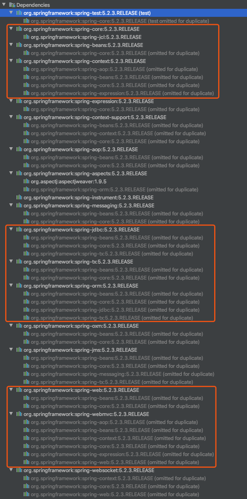

# [Spring源码解读『基本概念』](http://lidol.top/frame/2499/)

2020-02-26 分类：[Spring](http://lidol.top/category/frame/spring/) / [框架](http://lidol.top/category/frame/) 阅读(532) 评论(0)

Spring作为一个优秀的开源框架，作为一名服务端开发人员，在工作中必然是每天都要接触的，相信每个人也都能熟练地使用Spring来完成日常工作。毫不夸张的讲，Spring很大程度上改变了Java开发的方式。但是在工作中，我发现很多数人对Spring的了解都停留在表面，很少去深究Spring这一优秀框架底层的原理。结合我自身的体会而言，在刚开始接触这个框架的时候，仅仅是生硬地去记它的一些使用特性，一旦遇到一些“非常规”问题，就搞不定了。随着使用的深入，疑惑的问题越来越多（比如框架给我们带来什么好处？Spring、Spring MVC、Spring Boot之间有什么联系？为什么要使用Spring MVC来启动web项目，怎么启动的？工作中一直使用dubbo作为rpc框架，往往还结合Spring一起使用，dubbo等开源框架和Spring又是什么关系等等）。所以，从本篇文章开始，我们就来从实现上了解一下Spring。本系列计划会从Spring、介绍Spring MVC，最后简单介绍一下Spring Boot，中间会穿插web容器Tomcat、Servlet、JSP等概念的介绍。希望此系列文章可以为大多数后端开发同学排忧解惑。本篇文章我们先来看一些基本概念。

## 1. 什么是Spring

广义上Spring这个词应该指的是Spring Framework，是一个为Java应用程序提供全方位基础架构支持的Java平台，为开发者提供轻量级和简单地编程模型。使用Spring，我们可以通过”plain old Java objects” (POJOs)来构建应用程序，并且框架不会侵入POJO。同时Spring Framework提供DI、AOP、单元测试、各种开源框架集成支持、web开发支持等功能，极大地简化我们的编程工作。

狭义上我们往往把Spring Framework的两个重要的属性IOC和AOP称为Spring，与Spring Framework的其他模块比如Spring MVC、Sping Boot、Spring Cloud分离开来。比如我们通常把SSM解释为，Spring + Spring MVC/Structs + Mybatis就是这种划分标准。

## 2. Spring Framework模块组成

Spring框架大约由20个模块的功能组成， 这些模块可分为Core Container（核心容器）、Data Access（数据访问）、Web、AOP（面向切面编程）、Instrument（检测）、Messaging（消息）和Test（测试），如下图所示：

### 2.1 Core Container（核心容器）

核心容器由spring-core、spring-beans、spring-context、spring-context-support和spring-expression（Spring表达式语言）模块组成。

spring-core和spring-beans模块提供了框架的基本部分，包括IOC和DI功能。 通过BeanFactory（工厂模式的复杂实现），消除了对编程单例的需求，并允许你将依赖项的配置和规范与实际程序逻辑解耦。

上下文（spring-context）模块建立在spring-core和spring-beans模块的基础上，这是一种以类似于JNDI注册中心的框架式访问对象的方法。 spring-context继承了spring-beans模块的功能，并添加了对国际化（例如，使用资源束）、事件传播、资源加载以及通过Servlet容器透明创建上下文的支持。spring-context模块还支持Java EE功能，例如EJB、JMX和基本远程处理。 ApplicationContext接口是spring-context模块的焦点。 spring-context-support提供了将常见的第三方库集成到Spring应用程序上下文中的支持，比如缓存（EhCache，JCache）和调度（CommonJ，Quartz）等。

spring-expression模块提供了一种功能强大的表达式语言，用于在运行时查询和操作对象，它是对JSP 2.1规范中指定的统一表达语言（统一EL）的扩展。该语言支持设置和获取属性值、属性分配、方法调用、访问数组、集合和索引器、逻辑和算术运算符、命名变量以及按名称从Spring的IoC容器中检索对象的内容。它还支持列表投影和选择以及常见的列表聚合。

### 2.2 AOP和Instrumentation

spring-aop模块提供了面向切面的编程实现，例如，可以定义方法拦截器和切入点，以干净地解耦的方式实现对业务代码的扩展。

spring-aspects模块提供了与AspectJ（一种AOP的实现方案，之后会介绍）的集成。

spring-instrument模块提供了在某些应用程序服务器中使用的类检测支持和类加载器实现。 比如spring-instrument-tomcat模块包含用于Tomcat的Spring工具代理。

### 2.3 Messaging（消息）

Spring Framework 4包含一个Spring-messaging模块，该模块具有来自Spring Integration项目的关键抽象，例如Message，MessageChannel，MessageHandler等，它们充当基于消息的应用程序的基础。 该模块还包括一组注释，用于将消息映射到方法，类似于基于Spring MVC注释的编程模型。

### 2.4 Data Access/Integration

数据访问/集成层由JDBC、ORM、OXM、JMS和事务模块组成。

spring-jdbc模块提供了JDBC抽象层，从而无需进行繁琐的JDBC编码和数据库供应商特定的异常解析。

spring-tx模块支持对实现特殊接口的类以及所有POJO（普通Java对象）进行编程和声明式事务管理。

spring-orm模块为流行的对象关系映射API（包括JPA和Hibernate）提供了集成层支持。通过使用spring-orm模块，可以将这些对象关系映射框架与Spring提供的所有其他功能结合使用，例如前面提到的简单的声明式事务管理功能。

spring-oxm模块提供了一个抽象层，该抽象层支持对象/XML映射实现，例如JAXB，Castor，JiBX和XStream。

spring-jms模块（Java Messaging Service）包含用于生成和使用消息的功能。从Spring Framework 4.1开始，它提供了与spring-messaging模块的集成。

### 2.5 Web

Web层由spring-web、spring-webmvc和spring-websocket模块组成。

spring-web模块提供了面向Web的基本集成功能，例如多部分文件上传功能以及使用Servlet监听器和面向Web的应用程序上下文对IOC容器的初始化。 它还包含HTTP客户端和Spring远程支持的Web相关部分。

spring-webmvc模块（也称为Web-Servlet模块）包含Spring的模型视图控制器（MVC）和针对Web应用程序的REST Web服务实现。 Spring的MVC框架在域模型代码和Web表单之间提供了清晰的分隔，并与Spring框架的所有其他功能集成在一起。

### 2.6 Test

spring-test模块支持使用JUnit或TestNG对Spring组件进行单元测试和集成测试。 它提供了Spring ApplicationContexts的一致加载以及这些上下文的缓存。 它还提供了可用于单独测试代码的mock对象。

## 3. Spring Framework模块依赖

上图可以知道：

- 如果非web项目，我们只依赖spring-context就可以快速构建起spring应用，获得spring容器的IOC支持
- 如果需要访问数据库，可直接引用spring-orm（使用hibernate/JPA），如果不使用上述持久层框架，可以引入spring-jdbc
- 构建web应用，引入spring-webmvc即可

> 参考链接：
>
> \1. [Overview of Spring Framework](https://docs.spring.io/spring/docs/5.0.0.RC2/spring-framework-reference/overview.html)