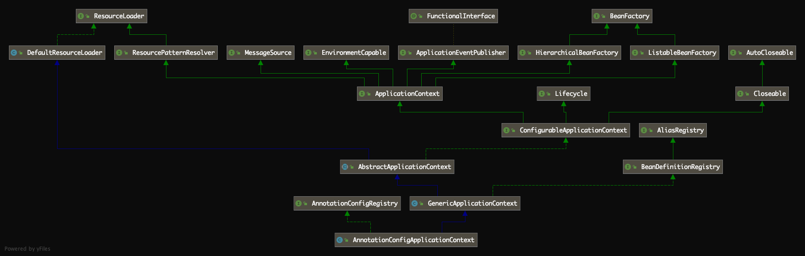

# [Spring源码解读『通过配置类启动spring容器』](http://lidol.top/frame/2654/)

2020-06-11 分类：[Spring](http://lidol.top/category/frame/spring/) / [框架](http://lidol.top/category/frame/) 阅读(805) 评论(0)

之前的介绍中，Spring容器都是通过xml配置文件启动的，在实际开发中，xml配置的使用是逐渐减少的，一般在开发中更建议使用Java Config。本篇文章我们就来看一下Spring容器如何通过配置类启动的。

Spring提供了AnnotationConfigApplicationContext类，实现通过Java Config配置类来启动Spring容器。

## 1. 示例

### 1.1 定义Bean

``` java
public class TestBeanA {
    private String testName;

    public void setTestName(String testName) {
        this.testName = testName;
    }

    public String getTestName() {
        return testName;
    }
}
public class TestBeanB {
    private String testName;

    public void setTestName(String testName) {
        this.testName = testName;
    }

    public String getTestName() {
        return testName;
    }
}
```

### 1.2 定义Java Config配置类

``` java
@Configuration
public class MyConfiguration {

    @Bean
    public TestBeanA configTestBeanA() {
        TestBeanA testBeanA = new TestBeanA();
        testBeanA.setTestName("configTestBeanA");
        return testBeanA;
    }

    @Bean
    public TestBeanB configTestBeanB() {
        TestBeanB testBeanB = new TestBeanB();
        testBeanB.setTestName("configTestBeanB");
        return testBeanB;
    }
}
```

这里我们只存在一个Java Config配置类，如果存在多个配置类，我们可以通过@Import注解指定引入特定的配置类，也可以通过@ComponentScan注解自动扫描指定包下的配置类。或者有些配置时通过xml配置的，也可以通过@ImportResource引入xml配置文件。使用时比较灵活的。

### 1.3 测试类

``` java
public class AnnotationConfigTest {
    public static void main(String[] args) {
        AbstractApplicationContext applicationContext = new AnnotationConfigApplicationContext(MyConfiguration.class);
        TestBeanA configTestBeanA = (TestBeanA) applicationContext.getBean("configTestBeanA");
        TestBeanB configTestBeanB = (TestBeanB) applicationContext.getBean("configTestBeanB");
        System.out.println(configTestBeanA.getTestName());
        System.out.println(configTestBeanB.getTestName());
        applicationContext.close();
    }
}
```

运行结果：

```
configTestBeanA
configTestBeanB
```

说明Spring通过Java Config成功启动。

## 2. 源码分析

上面的示例代码，我们可以看到，AnnotationConfigApplicationContext启动Spring容器的入口在构造函数，所以我们从该构造函数看起。

[](http://cdn.lidol.top/lidol_blog/AnnotationConfigApplicationContext.png)

AnnotationConfigApplicationContext继承了类GenericApplicationContext，该类继承了抽象类AbstractApplicationContext实现了BeanDefinitionRegistry接口，并持有一个DefaultListableBeanFactory类型的成员变量，可以讲GenericApplicationContext既是Bean工厂，又是Bean注册中心（跟之前介绍的AbstractRefreshableApplicationContext非常类似）。可以通过如下方式使用：

``` java
GenericApplicationContext ctx = new GenericApplicationContext();
XmlBeanDefinitionReader xmlReader = new XmlBeanDefinitionReader(ctx);
xmlReader.loadBeanDefinitions(new ClassPathResource("applicationContext.xml"));
PropertiesBeanDefinitionReader propReader = new PropertiesBeanDefinitionReader(ctx);
propReader.loadBeanDefinitions(new ClassPathResource("otherBeans.properties"));
ctx.refresh();

MyBean myBean = (MyBean) ctx.getBean("myBean");
```

关于AbstractApplicationContext，之前介绍xml启动Spring容器的时候已经介绍过，该类中定义了很多Bean工厂的模板方法，并允许子类根据需要覆盖模板方法。最重要的我们知道，该类中定义了Spring容器刷新的流程：

``` java
org.springframework.context.support.AbstractApplicationContext#refresh
```

除此之外，AnnotationConfigApplicationContext实现了AnnotationConfigRegistry接口，该接口定义了配置类的扫描和注册方法，用于为Bean注册中心扫描和注册BeanDefinition。

### 2.1 AnnotationConfigApplicationContext(java.lang.Class…)

``` java
public AnnotationConfigApplicationContext(Class<?>... annotatedClasses) {
    // 1. 调用无参构造函数
    this();
    // 2. 将配置类注册为BeanDefition
    register(annotatedClasses);
    // 3. 刷新容器
    refresh();
}
```

这里第3步refresh方法就是AbstractApplicationContext类中定义的refresh方法，通过xml启动也调用了该方法。通过xml启动时，调用的方法如下：

``` java
public ClassPathXmlApplicationContext(String configLocation) throws BeansException {
	this(new String[] {configLocation}, true, null);
}

public ClassPathXmlApplicationContext(
		String[] configLocations, boolean refresh, @Nullable ApplicationContext parent)
		throws BeansException {

	super(parent);
	setConfigLocations(configLocations);
	if (refresh) {
		refresh();
	}
}
```

之前我们也介绍过，xml启动的核心逻辑都在refresh方法中。通过配置类启动的方式，其实核心流程也在refresh方法中，**只不过跟xml的方式有一些小区别在于BeanDefinition的加载方式的差异**。不过这里我们至少可以统一一个概念，无论是通过配置类还是配置文件启动Spring，核心流程都是一致的（都是通过AbstractApplicationContext的refresh方法）。

这里我们把之前的文章[Spring源码解读『IOC容器2-Bean加载过程』](http://lidol.top/frame/2524/)中介绍的refresh方法的流程拿到这里，来讲一下通过配置类和通过配置文件启动的区别：

``` java
@Override
public void refresh() throws BeansException, IllegalStateException {
	synchronized (this.startupShutdownMonitor) {
		// 1. 准备刷新Spring上下文，主要用来记录Spring上下文加载开始时间，设置一些基础成员变量value
		prepareRefresh();

		// 2. 刷新BeanFactory，此方法内完成配置文件中配置的Bean到BeanDefinition的转化及注册
		ConfigurableListableBeanFactory beanFactory = obtainFreshBeanFactory();

		// 3. 准备Bean工厂，主要用来配置BeanFactory的基础信息，例如上下文的ClassLoader和后处理器
		prepareBeanFactory(beanFactory);

		try {
			// 4. 允许子context添加一些BeanFactoryPostProcessor，
			// 比如Web应用中AbstractRefreshableWebApplicationContext添加ServletContextAwareProcessor，
			// 可以暂时略过这个方法
			postProcessBeanFactory(beanFactory);

			// 5. 执行BeanFactoryPostProcessor中定义的方法
			invokeBeanFactoryPostProcessors(beanFactory);

			// 6. 注册所有的BeanPostProcessor，这部分BeanPostProcessor会在下面finishBeanFactoryInitialization方法
			// 过程中使用
			registerBeanPostProcessors(beanFactory);

			// 7. 初始化MessageSource，MessageSource是Spring定义的用于实现访问国际化的接口
			initMessageSource();

			// 8. 初始化上下文事件广播器
			initApplicationEventMulticaster();

			// 9. 模板方法，可以通过重写它添加特殊上下文刷新的工作
			onRefresh();

			// 10. 注册监听器
			registerListeners();

			// 11. 实例化所有定义的单例Bean
			finishBeanFactoryInitialization(beanFactory);

			// 结束Spring上下文刷新
			finishRefresh();
		}

		catch (BeansException ex) {
			if (logger.isWarnEnabled()) {
				logger.warn("Exception encountered during context initialization - " +
						"cancelling refresh attempt: " + ex);
			}

			// Destroy already created singletons to avoid dangling resources.
			destroyBeans();

			// Reset 'active' flag.
			cancelRefresh(ex);

			// Propagate exception to caller.
			throw ex;
		}

		finally {
			// Reset common introspection caches in Spring's core, since we
			// might not ever need metadata for singleton beans anymore...
			resetCommonCaches();
		}
	}
}
```

在通过xml配置文件启动Spring的方式的第2步obtainFreshBeanFactory方法中，完成了xml配置BeanDefinition的加载和注册。但是**在使用配置类启动Spring容器时，obtainFreshBeanFactory并没有加载注册BeanDefinition定义**（有兴趣的可以跟一下GenericApplicationContext类的refreshBeanFactory方法，并没有做任何加载BeanDefinition的操作，仅仅是set了serializationId）**，加载BeanDefinition是通过之前的文章**[**Spring源码解读『@Configuration配置类』**](http://lidol.top/frame/2606/)**在refresh方法第5步invokeBeanFactoryPostProcessors方法中通过ConfigurationClassPostProcessor的postProcessBeanDefinitionRegistry方法完成的**。那么之后的Bean实例化和初始化过程也就跟xml启动完全一致了。

如果要通过ConfigurationClassPostProcessor的postProcessBeanDefinitionRegistry方法加载BeanDefinition定义，那么需要有两个前提：

- ConfigurationClassPostProcessor成功注册为BeanDefinition
- 配置类成功注册为BeanDefinition

我们接下来重点看一下上述BeanDefinition是如何注册的。

### 2.2 ConfigurationClassPostProcessor注册

回到ConfigurationClassPostProcessor类启动的构造函数，第1步调用了无参构造函数，如下：

``` java
public AnnotationConfigApplicationContext() {
	this.reader = new AnnotatedBeanDefinitionReader(this);
	this.scanner = new ClassPathBeanDefinitionScanner(this);
}
```

构造函数中，为AnnotationConfigApplicationContext的两个成员变量AnnotatedBeanDefinitionReader、ClassPathBeanDefinitionScanner赋了值。

继续跟进AnnotatedBeanDefinitionReader构造函数：

``` java
public AnnotatedBeanDefinitionReader(BeanDefinitionRegistry registry) {
	this(registry, getOrCreateEnvironment(registry));
}

public AnnotatedBeanDefinitionReader(BeanDefinitionRegistry registry, Environment environment) {
	Assert.notNull(registry, "BeanDefinitionRegistry must not be null");
	Assert.notNull(environment, "Environment must not be null");
	this.registry = registry;
	this.conditionEvaluator = new ConditionEvaluator(registry, environment, null);
	AnnotationConfigUtils.registerAnnotationConfigProcessors(this.registry);
}
```

最后调用了AnnotationConfigUtils.registerAnnotationConfigProcessors方法，继续跟进：

``` java
public static void registerAnnotationConfigProcessors(BeanDefinitionRegistry registry) {
	registerAnnotationConfigProcessors(registry, null);
}

public static Set<BeanDefinitionHolder> registerAnnotationConfigProcessors(
		BeanDefinitionRegistry registry, Object source) {

	DefaultListableBeanFactory beanFactory = unwrapDefaultListableBeanFactory(registry);
	if (beanFactory != null) {
		if (!(beanFactory.getDependencyComparator() instanceof AnnotationAwareOrderComparator)) {
			beanFactory.setDependencyComparator(AnnotationAwareOrderComparator.INSTANCE);
		}
		if (!(beanFactory.getAutowireCandidateResolver() instanceof ContextAnnotationAutowireCandidateResolver)) {
			beanFactory.setAutowireCandidateResolver(new ContextAnnotationAutowireCandidateResolver());
		}
	}

	Set<BeanDefinitionHolder> beanDefs = new LinkedHashSet<BeanDefinitionHolder>(4);

	if (!registry.containsBeanDefinition(CONFIGURATION_ANNOTATION_PROCESSOR_BEAN_NAME)) {
		RootBeanDefinition def = new RootBeanDefinition(ConfigurationClassPostProcessor.class);
		def.setSource(source);
		beanDefs.add(registerPostProcessor(registry, def, CONFIGURATION_ANNOTATION_PROCESSOR_BEAN_NAME));
	}

	if (!registry.containsBeanDefinition(AUTOWIRED_ANNOTATION_PROCESSOR_BEAN_NAME)) {
		RootBeanDefinition def = new RootBeanDefinition(AutowiredAnnotationBeanPostProcessor.class);
		def.setSource(source);
		beanDefs.add(registerPostProcessor(registry, def, AUTOWIRED_ANNOTATION_PROCESSOR_BEAN_NAME));
	}

	if (!registry.containsBeanDefinition(REQUIRED_ANNOTATION_PROCESSOR_BEAN_NAME)) {
		RootBeanDefinition def = new RootBeanDefinition(RequiredAnnotationBeanPostProcessor.class);
		def.setSource(source);
		beanDefs.add(registerPostProcessor(registry, def, REQUIRED_ANNOTATION_PROCESSOR_BEAN_NAME));
	}

	// Check for JSR-250 support, and if present add the CommonAnnotationBeanPostProcessor.
	if (jsr250Present && !registry.containsBeanDefinition(COMMON_ANNOTATION_PROCESSOR_BEAN_NAME)) {
		RootBeanDefinition def = new RootBeanDefinition(CommonAnnotationBeanPostProcessor.class);
		def.setSource(source);
		beanDefs.add(registerPostProcessor(registry, def, COMMON_ANNOTATION_PROCESSOR_BEAN_NAME));
	}

	// Check for JPA support, and if present add the PersistenceAnnotationBeanPostProcessor.
	if (jpaPresent && !registry.containsBeanDefinition(PERSISTENCE_ANNOTATION_PROCESSOR_BEAN_NAME)) {
		RootBeanDefinition def = new RootBeanDefinition();
		try {
			def.setBeanClass(ClassUtils.forName(PERSISTENCE_ANNOTATION_PROCESSOR_CLASS_NAME,
					AnnotationConfigUtils.class.getClassLoader()));
		}
		catch (ClassNotFoundException ex) {
			throw new IllegalStateException(
					"Cannot load optional framework class: " + PERSISTENCE_ANNOTATION_PROCESSOR_CLASS_NAME, ex);
		}
		def.setSource(source);
		beanDefs.add(registerPostProcessor(registry, def, PERSISTENCE_ANNOTATION_PROCESSOR_BEAN_NAME));
	}

	if (!registry.containsBeanDefinition(EVENT_LISTENER_PROCESSOR_BEAN_NAME)) {
		RootBeanDefinition def = new RootBeanDefinition(EventListenerMethodProcessor.class);
		def.setSource(source);
		beanDefs.add(registerPostProcessor(registry, def, EVENT_LISTENER_PROCESSOR_BEAN_NAME));
	}
	if (!registry.containsBeanDefinition(EVENT_LISTENER_FACTORY_BEAN_NAME)) {
		RootBeanDefinition def = new RootBeanDefinition(DefaultEventListenerFactory.class);
		def.setSource(source);
		beanDefs.add(registerPostProcessor(registry, def, EVENT_LISTENER_FACTORY_BEAN_NAME));
	}

	return beanDefs;
}
```

可以看到在registerAnnotationConfigProcessors方法中注册了很多BeanPostProcessor和BeanFactoryPostProcessor，其中用于配置类解析的ConfigurationClassPostProcessor也在这里成功注册了。

### 2.3 配置类注册

通过配置类启动Spring容器，我们在AnnotationConfigApplicationContext构造函数中指定了配置类，在构造函数第2步调用了register方法，在这个方法中将配置类注册为BeanDefinition。

``` java
public void register(Class<?>... annotatedClasses) {
	Assert.notEmpty(annotatedClasses, "At least one annotated class must be specified");
	// 使用AnnotatedBeanDefinitionReader将配置类转化为BeanDefinition并注册到BeanFactory
	this.reader.register(annotatedClasses);
}
```

解析注册的细节也比较简单，这里不多介绍了，跟进去就能看明白。所以**在调用AbstractApplicationContext的refresh方法之前，ConfigurationClassPostProcessor和配置类都已经注册为BeanDefinition，所以可以在refresh调用invokeBeanFactoryPostProcessors方法中通过ConfigurationClassPostProcessor将配置类中配置的Bean解析为BeanDefinition并注册到BeanFactory**。之后Bean实例化和初始化的过程跟之前介绍xml启动的方式完全一致，这里不重复介绍了。

> 参考链接：
>
> 1. Spring源码
>
> 2. [@ComponentScan 扫包 @Import添加组件](https://www.cnblogs.com/li-lun/p/12780485.html)
>
> 3. [【译】Spring 4 @PropertySource和@Value注解示例](https://www.cnblogs.com/chenpi/p/6212534.html)