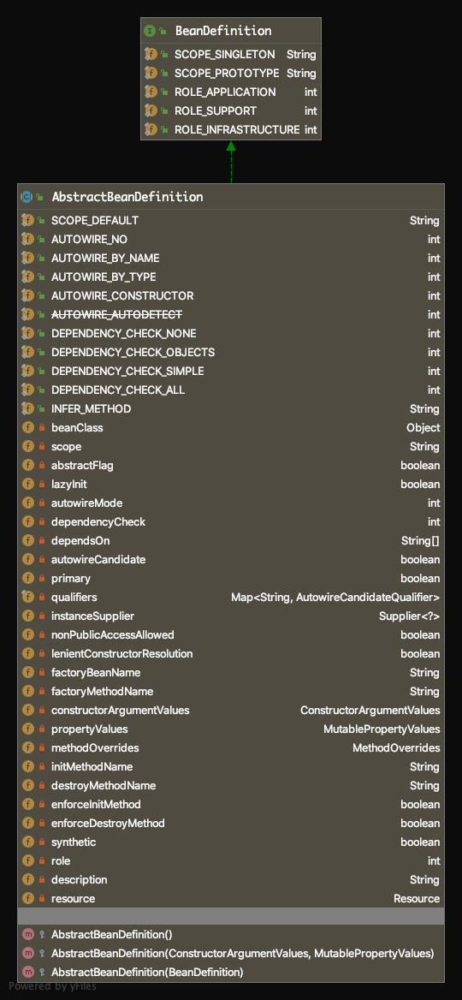

# [Spring源码解读『配置文件解析』](http://lidol.top/frame/2604/)

2020-04-27 分类：[Spring](http://lidol.top/category/frame/spring/) / [框架](http://lidol.top/category/frame/) 阅读(562) 评论(0)

之前的文章详细介绍了Bean的实例化和初始化的过程，但其实Bean能实例化、初始化的前提是Spring容器在启动时，间配置文件（配置类）中的配置加载成BeanDefinition，这一点我们再之前的文章[Spring源码解读『IOC容器1-自定义实现IOC容器』](http://lidol.top/frame/2513/)一文中看得比较清楚。关于Spring对配置文件（配置类）的处理，我们还没有介绍，本篇文章我们就来介绍一下Spring容器启动时是如何加载xml配置文件并加载成BeanDefinition的，在下篇文章来介绍@Configuration配置类。首先来看一下我们之前定义的spring xml配置文件：

``` xml
<?xml version="1.0" encoding="UTF-8"?>
<beans xmlns="http://www.springframework.org/schema/beans"
       xmlns:xsi="http://www.w3.org/2001/XMLSchema-instance"
       xsi:schemaLocation="http://www.springframework.org/schema/beans
http://www.springframework.org/schema/beans/spring-beans-4.1.xsd">
    <bean id="testBean0" class="com.zhuoli.service.spring.explore.beanpostprocessor.TestBean" init-method="initMethod" destroy-method="destroyMethod">
        <property name="testName" value="testName0"/>
    </bean>
    <bean id="testBean1" class="com.zhuoli.service.spring.explore.beanpostprocessor.TestBean" init-method="initMethod" destroy-method="destroyMethod">
        <property name="testName" value="testName1"/>
    </bean>
    <bean id="myBeanPostProcessor" class="com.zhuoli.service.spring.explore.beanpostprocessor.MyBeanPostProcessor" />
</beans>
```

按照之前文章的介绍，我们知道Spring IOC容器实例化Bean的前置条件是，Spring将上述配置文件转化为BeanDefinition，完成这一转化的方法是在**refresh方法中调用obtainFreshBeanFactory方法**。

## 1. BeanDefinition

在文章[Spring源码解读『IOC容器1-自定义实现IOC容器』](http://lidol.top/frame/2513/)中，我们定义了一个BeanDefinition，并且有了一个大致的概念——BeanDefinition类就是用来存储Bean的属性信息的（比如bean名称，bean类信息，bean属性依赖），从而在bean实例化阶段可以根据BeanDefinition实例化对象。实际上Spring中的BeanDefinition类比我们之前定义的复杂的多（因为配置的Bean有很多属性可选，比如lazyInit、protoType等，这些信息都需要存储在BeanDefinition中），但是理念是相通的，BeanDefinition就是为实例化Bean服务的，所以最重要的肯定还是要存储bean名称、bean类信息、bean属性依赖这些信息。

BeanDefinition是一个接口，Bean实例化所需要的信息都是定义在BeanDefinition的实现类——AbstractBeanDefinition抽象类中的。

[](http://cdn.lidol.top/lidol_blog/AbstractBeanDefinition.png)

通过BeanDefinition，就可以实例化Bean对象。而Spring容器解析得到的BeanDefinition都会注册到Spring容器中，这里的“容器”其实就是DefaultListableBeanFactory，该类有两个相关的成员变量。

``` java
/** Map of bean definition objects, keyed by bean name */
private final Map<String, BeanDefinition> beanDefinitionMap = new ConcurrentHashMap<>(256);

/** List of bean definition names, in registration order */
private volatile List<String> beanDefinitionNames = new ArrayList<>(256);
```

分别用来存储所有的BeanDefinition定义及所有的BeanDefinition对应的名称。

## 2. XML配置文件解析流程

### 2.1 refresh()方法

之前的文章，我们介绍到，通过xml启动Spring容器的入口在ClassPathXmlApplicationContext类的构造方法，而该方法的核心就是调用org.springframework.context.support.AbstractApplicationContext#refresh。配置文件读取、Bean的实例化、初始化都是在refresh方法中完成的。由于之前已经介绍过Bean实例化、初始化流程，关于这部分内容，下面的源码解读部分都会被省略。

``` java
@Override
public void refresh() throws BeansException, IllegalStateException {
	synchronized (this.startupShutdownMonitor) {
		// 1. 准备刷新Spring上下文，主要用来记录Spring上下文加载开始时间，设置一些基础成员变量value
		prepareRefresh();

		// 2. 刷新BeanFactory，此方法内完成配置文件中配置的Bean到BeanDefinition的转化及注册
		ConfigurableListableBeanFactory beanFactory = obtainFreshBeanFactory();

		// 3. 准备Bean工厂，主要用来配置BeanFactory的基础信息，例如上下文的ClassLoader和后处理器
		prepareBeanFactory(beanFactory);

		// ……
}
```

### 2.2 obtainFreshBeanFactory()

``` java
protected ConfigurableListableBeanFactory obtainFreshBeanFactory() {
	refreshBeanFactory();
	ConfigurableListableBeanFactory beanFactory = getBeanFactory();
	if (logger.isDebugEnabled()) {
		logger.debug("Bean factory for " + getDisplayName() + ": " + beanFactory);
	}
	return beanFactory;
}
```

getBeanFactory()方法其实就是类的getter方法，获取类的beanFactory成员变量，所以可以推测肯定在refreshBeanFactory()方法中，已经完成了beanFactory的初始化。

### 2.3 refreshBeanFactory()

refreshBeanFactory()最终调用的是AbstractRefreshableApplicationContext类的refreshBeanFactory方法。

``` java
protected final void refreshBeanFactory() throws BeansException {
	if (hasBeanFactory()) {
		destroyBeans();
		closeBeanFactory();
	}
	try {
		DefaultListableBeanFactory beanFactory = createBeanFactory();
		beanFactory.setSerializationId(getId());
		customizeBeanFactory(beanFactory);
		loadBeanDefinitions(beanFactory);
		synchronized (this.beanFactoryMonitor) {
			this.beanFactory = beanFactory;
		}
	}
	catch (IOException ex) {
		throw new ApplicationContextException("I/O error parsing bean definition source for " + getDisplayName(), ex);
	}
}
```

该方法的核心在createBeanFactory()和loadBeanDefinitions(beanFactory)方法的调用上。

其中createBeanFactory()方法创建了DefaultListableBeanFactory实例，这里我们可以想一下为什么是DefaultListableBeanFactory而不是其他的BeanFactory。因为BeanDefinition是存储在Map<String, BeanDefinition>中的，而这个Map是DefaultListableBeanFactory的成员变量。通过createBeanFactory()方法获取的DefaultListableBeanFactory实例会通过方法参数的方式传入到loadBeanDefinitions方法，最终完成在加载BeanDefinition后，将BeanDefinition注册到DefaultListableBeanFactory（注册就是将BeanDefinition put到Map中）。

loadBeanDefinitions方法则完成了BeanDefinition的加载和注册。

### 2.4 loadBeanDefinitions

loadBeanDefinitions方法，是AbstractRefreshableApplicationContext子类AbstractXmlApplicationContext中的一个方法：

``` java
protected void loadBeanDefinitions(DefaultListableBeanFactory beanFactory) throws BeansException, IOException {
	// 1. 通过BeanFactory构建XmlBeanDefinitionReader
	XmlBeanDefinitionReader beanDefinitionReader = new XmlBeanDefinitionReader(beanFactory);

	// Configure the bean definition reader with this context's
	// resource loading environment.
	beanDefinitionReader.setEnvironment(this.getEnvironment());
	beanDefinitionReader.setResourceLoader(this);
	beanDefinitionReader.setEntityResolver(new ResourceEntityResolver(this));

	// Allow a subclass to provide custom initialization of the reader,
	// then proceed with actually loading the bean definitions.
	initBeanDefinitionReader(beanDefinitionReader);

	// 2. 加载Bean定义
	loadBeanDefinitions(beanDefinitionReader);
}
```

第1步，构建XmlBeanDefinitionReader的逻辑没什么好说的，继续来看loadBeanDefinitions方法，该方法最终会调用到AbstractBeanDefinitionReader#loadBeanDefinitions(java.lang.String, java.util.Set)方法。

### 2.5 AbstractBeanDefinitionReader#loadBeanDefinitions

``` java
public int loadBeanDefinitions(String location, @Nullable Set<Resource> actualResources) throws BeanDefinitionStoreException {
	ResourceLoader resourceLoader = getResourceLoader();
	if (resourceLoader == null) {
		throw new BeanDefinitionStoreException(
				"Cannot import bean definitions from location [" + location + "]: no ResourceLoader available");
	}

	if (resourceLoader instanceof ResourcePatternResolver) {
		// Resource pattern matching available.
		try {
			Resource[] resources = ((ResourcePatternResolver) resourceLoader).getResources(location);
			int loadCount = loadBeanDefinitions(resources);
			if (actualResources != null) {
				for (Resource resource : resources) {
					actualResources.add(resource);
				}
			}
			if (logger.isDebugEnabled()) {
				logger.debug("Loaded " + loadCount + " bean definitions from location pattern [" + location + "]");
			}
			return loadCount;
		}
		catch (IOException ex) {
			throw new BeanDefinitionStoreException(
					"Could not resolve bean definition resource pattern [" + location + "]", ex);
		}
	}
	else {
		// Can only load single resources by absolute URL.
		Resource resource = resourceLoader.getResource(location);
		int loadCount = loadBeanDefinitions(resource);
		if (actualResources != null) {
			actualResources.add(resource);
		}
		if (logger.isDebugEnabled()) {
			logger.debug("Loaded " + loadCount + " bean definitions from location [" + location + "]");
		}
		return loadCount;
	}
}
```

该方法的第一个参数其实就是通过ClassPathXmlApplicationContext构造函数指定的配置文件位置，第二个参数这里是空。另外ResourceLoader是在org.springframework.context.support.AbstractXmlApplicationContext#loadBeanDefinitions(org.springframework.beans.factory.support.DefaultListableBeanFactory)方法中通过调用setResourceLoader方法指定的，传入的参数是ClassPathXmlApplicationContext，该类是ResourcePatternResolver的实现类，所以上述方法会进如下的判断分支

``` java
if (resourceLoader instanceof ResourcePatternResolver)
```

该判断分支下，最终会执行到org.springframework.beans.factory.xml.XmlBeanDefinitionReader#loadBeanDefinitions(org.springframework.core.io.support.EncodedResource)方法。

### 2.6 XmlBeanDefinitionReader#loadBeanDefinitions(org.springframework.core.io.support.EncodedResource)

``` java
public int loadBeanDefinitions(EncodedResource encodedResource) throws BeanDefinitionStoreException {
	Assert.notNull(encodedResource, "EncodedResource must not be null");
	if (logger.isInfoEnabled()) {
		logger.info("Loading XML bean definitions from " + encodedResource);
	}

	Set<EncodedResource> currentResources = this.resourcesCurrentlyBeingLoaded.get();
	if (currentResources == null) {
		currentResources = new HashSet<>(4);
		this.resourcesCurrentlyBeingLoaded.set(currentResources);
	}
	if (!currentResources.add(encodedResource)) {
		throw new BeanDefinitionStoreException(
				"Detected cyclic loading of " + encodedResource + " - check your import definitions!");
	}
	try {
		InputStream inputStream = encodedResource.getResource().getInputStream();
		try {
			InputSource inputSource = new InputSource(inputStream);
			if (encodedResource.getEncoding() != null) {
				inputSource.setEncoding(encodedResource.getEncoding());
			}
			// 加载BeanDefinition定义
			return doLoadBeanDefinitions(inputSource, encodedResource.getResource());
		}
		finally {
			inputStream.close();
		}
	}
	catch (IOException ex) {
		throw new BeanDefinitionStoreException(
				"IOException parsing XML document from " + encodedResource.getResource(), ex);
	}
	finally {
		currentResources.remove(encodedResource);
		if (currentResources.isEmpty()) {
			this.resourcesCurrentlyBeingLoaded.remove();
		}
	}
```

按照经验，核心代码肯定在doLoadBeanDefinitions中。

### 2.7 BeanDefinitionReader#doLoadBeanDefinitions

``` java
protected int doLoadBeanDefinitions(InputSource inputSource, Resource resource)
		throws BeanDefinitionStoreException {
	try {
		// 1. 通过xml配置文件DOM得到org.w3c.dom.Document对象
		Document doc = doLoadDocument(inputSource, resource);
		// 2. 解析并注册BeanDefinition
		return registerBeanDefinitions(doc, resource);
	}
	catch (BeanDefinitionStoreException ex) {
		throw ex;
	}
	catch (SAXParseException ex) {
		throw new XmlBeanDefinitionStoreException(resource.getDescription(),
				"Line " + ex.getLineNumber() + " in XML document from " + resource + " is invalid", ex);
	}
	catch (SAXException ex) {
		throw new XmlBeanDefinitionStoreException(resource.getDescription(),
				"XML document from " + resource + " is invalid", ex);
	}
	catch (ParserConfigurationException ex) {
		throw new BeanDefinitionStoreException(resource.getDescription(),
				"Parser configuration exception parsing XML from " + resource, ex);
	}
	catch (IOException ex) {
		throw new BeanDefinitionStoreException(resource.getDescription(),
				"IOException parsing XML document from " + resource, ex);
	}
	catch (Throwable ex) {
		throw new BeanDefinitionStoreException(resource.getDescription(),
				"Unexpected exception parsing XML document from " + resource, ex);
	}
}
```

### 2.8 XmlBeanDefinitionReader#registerBeanDefinitions

``` java
public int registerBeanDefinitions(Document doc, Resource resource) throws BeanDefinitionStoreException {
	// 1. 获取documentReader，用于读取通过xml获得的Document
	BeanDefinitionDocumentReader documentReader = createBeanDefinitionDocumentReader();
	// 2. 获取当前xml文件（Document）解析前，已经注册的BeanDefinition数目
	int countBefore = getRegistry().getBeanDefinitionCount();
	// 3. 解析并注册当前配置文件的BeanDefinition
	documentReader.registerBeanDefinitions(doc, createReaderContext(resource));
	// 4. 用当前注册的BeanDefinition数目减去之前注册的数目，返回该配置文件注册的BeanDefinition数目
	return getRegistry().getBeanDefinitionCount() - countBefore;
}
```

### 2.9 DefaultBeanDefinitionDocumentReader#registerBeanDefinitions

``` java
public void registerBeanDefinitions(Document doc, XmlReaderContext readerContext) {
	this.readerContext = readerContext;
	logger.debug("Loading bean definitions");
	Element root = doc.getDocumentElement();
	doRegisterBeanDefinitions(root);
}
```

### 2.10 DefaultBeanDefinitionDocumentReader#doRegisterBeanDefinitions

``` java
protected void doRegisterBeanDefinitions(Element root) {
	// Any nested <beans> elements will cause recursion in this method. In
	// order to propagate and preserve <beans> default-* attributes correctly,
	// keep track of the current (parent) delegate, which may be null. Create
	// the new (child) delegate with a reference to the parent for fallback purposes,
	// then ultimately reset this.delegate back to its original (parent) reference.
	// this behavior emulates a stack of delegates without actually necessitating one.
	// 1. 造出Bean定义解析器的委托类，该委托类对象中的defaults属性，设置了BeanDefinition加载过程中一些列的默认属性，比如"lazy-init"等
	BeanDefinitionParserDelegate parent = this.delegate;
	this.delegate = createDelegate(getReaderContext(), root, parent);

	if (this.delegate.isDefaultNamespace(root)) {
		String profileSpec = root.getAttribute(PROFILE_ATTRIBUTE);
		if (StringUtils.hasText(profileSpec)) {
			String[] specifiedProfiles = StringUtils.tokenizeToStringArray(
					profileSpec, BeanDefinitionParserDelegate.MULTI_VALUE_ATTRIBUTE_DELIMITERS);
			if (!getReaderContext().getEnvironment().acceptsProfiles(specifiedProfiles)) {
				if (logger.isInfoEnabled()) {
					logger.info("Skipped XML bean definition file due to specified profiles [" + profileSpec +
							"] not matching: " + getReaderContext().getResource());
				}
				return;
			}
		}
	}

	// 2. 空方法，留给子类扩展
	preProcessXml(root);
	// 3. 使用解析器委托类解析并注册BeanDefinition 
	parseBeanDefinitions(root, this.delegate);
	// 4. 空方法，留给子类扩展 
	postProcessXml(root);

	this.delegate = parent;
}
```

关于上述第1点，可以跟进去看一下，其实就是为了解决有嵌套的<beans>标签，这样子标签可以从父标签继承一些属性。这也是为什么第4步执行结束后，要将delegate重新置为parent。

第2、4点，适用于给子类扩展的，DefaultBeanDefinitionDocumentReader类中的实现是空的。

第3点，就是我们要关注的核心内容，解析并注册BeanDefinition。

### 2.11 DefaultBeanDefinitionDocumentReader#parseBeanDefinitions

``` java
/**
 * Parse the elements at the root level in the document:
 * "import", "alias", "bean".
 * @param root the DOM root element of the document
 */
protected void parseBeanDefinitions(Element root, BeanDefinitionParserDelegate delegate) {
	if (delegate.isDefaultNamespace(root)) {
		NodeList nl = root.getChildNodes();
		for (int i = 0; i < nl.getLength(); i++) {
			Node node = nl.item(i);
			if (node instanceof Element) {
				Element ele = (Element) node;
				if (delegate.isDefaultNamespace(ele)) {
					parseDefaultElement(ele, delegate);
				}
				else {
					delegate.parseCustomElement(ele);
				}
			}
		}
	}
	else {
		delegate.parseCustomElement(root);
	}
}
```

**该方法的作用就是遍历xml文件，解析并注册xml中所有的Bean定义。**我们这里只关心<Bean>定义，<beans>和<bean>都是DefaultNamespace标签，所以会调用parseDefaultElement方法。

### 2.12 DefaultBeanDefinitionDocumentReader#parseDefaultElement

``` java
private void parseDefaultElement(Element ele, BeanDefinitionParserDelegate delegate) {
	if (delegate.nodeNameEquals(ele, IMPORT_ELEMENT)) {
		// 解析<import>
		importBeanDefinitionResource(ele);
	}
	else if (delegate.nodeNameEquals(ele, ALIAS_ELEMENT)) {
		// 解析<alias>
		processAliasRegistration(ele);
	}
	else if (delegate.nodeNameEquals(ele, BEAN_ELEMENT)) {
		// 解析<bean>标签
		processBeanDefinition(ele, delegate);
	}
	else if (delegate.nodeNameEquals(ele, NESTED_BEANS_ELEMENT)) {
		// <beans>嵌套标签，所以调用doRegisterBeanDefinitions嵌套处理
		doRegisterBeanDefinitions(ele);
	}
}
```

这里我们关心的是<bean>标签的解析，所以我们继续跟processBeanDefinition方法。

### 2.13 DefaultBeanDefinitionDocumentReader#processBeanDefinition

``` java
protected void processBeanDefinition(Element ele, BeanDefinitionParserDelegate delegate) {
	// 1. 解析<Bean>标签为BeanDefinitionHolder
	BeanDefinitionHolder bdHolder = delegate.parseBeanDefinitionElement(ele);
	if (bdHolder != null) {
		// 2. 装饰Bean定义，比如AOP
		bdHolder = delegate.decorateBeanDefinitionIfRequired(ele, bdHolder);
		try {
			// 3. 注册Bean
			BeanDefinitionReaderUtils.registerBeanDefinition(bdHolder, getReaderContext().getRegistry());
		}
		catch (BeanDefinitionStoreException ex) {
			getReaderContext().error("Failed to register bean definition with name '" +
					bdHolder.getBeanName() + "'", ele, ex);
		}
		// Send registration event.
		getReaderContext().fireComponentRegistered(new BeanComponentDefinition(bdHolder));
	}
}
```

我们的继续关注<Bean>标签的解析，继续看parseBeanDefinitionElement，第2步我们接下来先略过，在讲AOP的时候再讲。然后来看第3步Bean注册过程。

### 2.14 BeanDefinitionParserDelegate#parseBeanDefinitionElement

``` java
public BeanDefinitionHolder parseBeanDefinitionElement(Element ele, @Nullable BeanDefinition containingBean) {
	// 1. 获取<Bean>标签id属性value
	String id = ele.getAttribute(ID_ATTRIBUTE);
	// 2. 获取<Bean>标签name属性value
	String nameAttr = ele.getAttribute(NAME_ATTRIBUTE);

	// 3. 通过分隔符",;"阶段nameAttr，获取Bean别名List
	List<String> aliases = new ArrayList<>();
	if (StringUtils.hasLength(nameAttr)) {
		String[] nameArr = StringUtils.tokenizeToStringArray(nameAttr, MULTI_VALUE_ATTRIBUTE_DELIMITERS);
		aliases.addAll(Arrays.asList(nameArr));
	}

	// 4. beanName默认为id
	String beanName = id;
	// 5. 如果beanId未定义，以name属性中的第一个别名作为beanName
	if (!StringUtils.hasText(beanName) && !aliases.isEmpty()) {
		beanName = aliases.remove(0);
		if (logger.isDebugEnabled()) {
			logger.debug("No XML 'id' specified - using '" + beanName +
					"' as bean name and " + aliases + " as aliases");
		}
	}

	// 6. 检查别名唯一性
	if (containingBean == null) {
		checkNameUniqueness(beanName, aliases, ele);
	}

	// 7. 解析Bean定义
	AbstractBeanDefinition beanDefinition = parseBeanDefinitionElement(ele, beanName, containingBean);
	if (beanDefinition != null) {
		if (!StringUtils.hasText(beanName)) {
			try {
				if (containingBean != null) {
					beanName = BeanDefinitionReaderUtils.generateBeanName(
							beanDefinition, this.readerContext.getRegistry(), true);
				}
				else {
					beanName = this.readerContext.generateBeanName(beanDefinition);
					// Register an alias for the plain bean class name, if still possible,
					// if the generator returned the class name plus a suffix.
					// This is expected for Spring 1.2/2.0 backwards compatibility.
					String beanClassName = beanDefinition.getBeanClassName();
					if (beanClassName != null &&
							beanName.startsWith(beanClassName) && beanName.length() > beanClassName.length() &&
							!this.readerContext.getRegistry().isBeanNameInUse(beanClassName)) {
						aliases.add(beanClassName);
					}
				}
				if (logger.isDebugEnabled()) {
					logger.debug("Neither XML 'id' nor 'name' specified - " +
							"using generated bean name [" + beanName + "]");
				}
			}
			catch (Exception ex) {
				error(ex.getMessage(), ele);
				return null;
			}
		}
		String[] aliasesArray = StringUtils.toStringArray(aliases);
		return new BeanDefinitionHolder(beanDefinition, beanName, aliasesArray);
	}

	return null;
}
public AbstractBeanDefinition parseBeanDefinitionElement(
		Element ele, String beanName, @Nullable BeanDefinition containingBean) {

	this.parseState.push(new BeanEntry(beanName));

	// 1. 获取Bean对应的类路径
	String className = null;
	if (ele.hasAttribute(CLASS_ATTRIBUTE)) {
		className = ele.getAttribute(CLASS_ATTRIBUTE).trim();
	}

	// 2. 获取<bean>标签中的parent属性
	String parent = null;
	if (ele.hasAttribute(PARENT_ATTRIBUTE)) {
		parent = ele.getAttribute(PARENT_ATTRIBUTE);
	}

	try {
		// 3. 根据Bean对应的类路径以及parent，生成一个AbstractBeanDefinition，AbstractBeanDefinition是一个抽象类，生成出来的具体实例为GenericBeanDefinition
		AbstractBeanDefinition bd = createBeanDefinition(className, parent);

		// 4. 解析Bean定义的属性，包括scope、sington、abstract、lazy-init等，如果配置文件中未定义，会使用BeanDefinitionParserDelegate的成员变量defaults
		parseBeanDefinitionAttributes(ele, beanName, containingBean, bd);
		// 5. 设置Bean描述
		bd.setDescription(DomUtils.getChildElementValueByTagName(ele, DESCRIPTION_ELEMENT));

		// 6. 解析<bean>标签meta属性
		parseMetaElements(ele, bd);
		// 7. 解析<bean>标签下<lookup-method>标签
		parseLookupOverrideSubElements(ele, bd.getMethodOverrides());
		// 8. 解析<bean>标签下的<replaced-method>标签
		parseReplacedMethodSubElements(ele, bd.getMethodOverrides());

		// 9. 解析<bean>标签下的<constructor-arg>标签，<constructor-arg>标签用于实现构造函数注入Bean属性
		parseConstructorArgElements(ele, bd);
		// 10. 解析<bean>标签下的<property>标签，<property>标签是最常见的Bean属性注入的方式
		parsePropertyElements(ele, bd);
		// 11. <bean>标签下的<qualifier>标签，用于设置存在同一类型的多个Bean时，依赖的bean名称
		parseQualifierElements(ele, bd);

		bd.setResource(this.readerContext.getResource());
		bd.setSource(extractSource(ele));

		return bd;
	}
	catch (ClassNotFoundException ex) {
		error("Bean class [" + className + "] not found", ele, ex);
	}
	catch (NoClassDefFoundError err) {
		error("Class that bean class [" + className + "] depends on not found", ele, err);
	}
	catch (Throwable ex) {
		error("Unexpected failure during bean definition parsing", ele, ex);
	}
	finally {
		this.parseState.pop();
	}

	return null;
}
```

### 2.15 BeanDefinitionReaderUtils#registerBeanDefinition

bean解析结束后，我们来看最后一步，Bean注册。该过程在上述方法中有调用：

``` java
org.springframework.beans.factory.xml.DefaultBeanDefinitionDocumentReader#processBeanDefinition
public static void registerBeanDefinition(
		BeanDefinitionHolder definitionHolder, BeanDefinitionRegistry registry)
		throws BeanDefinitionStoreException {

	// 1. 注册BeanDefinition
	String beanName = definitionHolder.getBeanName();
	registry.registerBeanDefinition(beanName, definitionHolder.getBeanDefinition());

	// 2. 通过别名注册BeanDefinition
	String[] aliases = definitionHolder.getAliases();
	if (aliases != null) {
		for (String alias : aliases) {
			registry.registerAlias(beanName, alias);
		}
	}
}
```

注册BeanDefinition方法最终会调用到DefaultListableBeanFactory中的registerBeanDefinition方法，如下：

``` java
public void registerBeanDefinition(String beanName, BeanDefinition beanDefinition)
		throws BeanDefinitionStoreException {

	Assert.hasText(beanName, "Bean name must not be empty");
	Assert.notNull(beanDefinition, "BeanDefinition must not be null");

	if (beanDefinition instanceof AbstractBeanDefinition) {
		try {
			((AbstractBeanDefinition) beanDefinition).validate();
		}
		catch (BeanDefinitionValidationException ex) {
			throw new BeanDefinitionStoreException(beanDefinition.getResourceDescription(), beanName,
					"Validation of bean definition failed", ex);
		}
	}

	BeanDefinition existingDefinition = this.beanDefinitionMap.get(beanName);
	if (existingDefinition != null) {
		if (!isAllowBeanDefinitionOverriding()) {
			throw new BeanDefinitionStoreException(beanDefinition.getResourceDescription(), beanName,
					"Cannot register bean definition [" + beanDefinition + "] for bean '" + beanName +
					"': There is already [" + existingDefinition + "] bound.");
		}
		else if (existingDefinition.getRole() < beanDefinition.getRole()) {
			// e.g. was ROLE_APPLICATION, now overriding with ROLE_SUPPORT or ROLE_INFRASTRUCTURE
			if (logger.isWarnEnabled()) {
				logger.warn("Overriding user-defined bean definition for bean '" + beanName +
						"' with a framework-generated bean definition: replacing [" +
						existingDefinition + "] with [" + beanDefinition + "]");
			}
		}
		else if (!beanDefinition.equals(existingDefinition)) {
			if (logger.isInfoEnabled()) {
				logger.info("Overriding bean definition for bean '" + beanName +
						"' with a different definition: replacing [" + existingDefinition +
						"] with [" + beanDefinition + "]");
			}
		}
		else {
			if (logger.isDebugEnabled()) {
				logger.debug("Overriding bean definition for bean '" + beanName +
						"' with an equivalent definition: replacing [" + existingDefinition +
						"] with [" + beanDefinition + "]");
			}
		}
		this.beanDefinitionMap.put(beanName, beanDefinition);
	}
	else {
		if (hasBeanCreationStarted()) {
			// Cannot modify startup-time collection elements anymore (for stable iteration)
			synchronized (this.beanDefinitionMap) {
				this.beanDefinitionMap.put(beanName, beanDefinition);
				List<String> updatedDefinitions = new ArrayList<>(this.beanDefinitionNames.size() + 1);
				updatedDefinitions.addAll(this.beanDefinitionNames);
				updatedDefinitions.add(beanName);
				this.beanDefinitionNames = updatedDefinitions;
				if (this.manualSingletonNames.contains(beanName)) {
					Set<String> updatedSingletons = new LinkedHashSet<>(this.manualSingletonNames);
					updatedSingletons.remove(beanName);
					this.manualSingletonNames = updatedSingletons;
				}
			}
		}
		else {
			// Still in startup registration phase
			this.beanDefinitionMap.put(beanName, beanDefinition);
			this.beanDefinitionNames.add(beanName);
			this.manualSingletonNames.remove(beanName);
		}
		this.frozenBeanDefinitionNames = null;
	}

	if (existingDefinition != null || containsSingleton(beanName)) {
		resetBeanDefinition(beanName);
	}
}
```

注册过程就是像DefaultListableBeanFactory的成员变量beanDefinitionMap添加Entry的过程，key为beanName，value为BeanDefinition。

以上就是xml配置文件的解析过程，文章中只介绍了<bean>标签的解析为BeanDefinition的过程，其他比如AOP相关的标签可以去跟一下，道理类似。

> 参考链接：
>
> 1. Spring源码
>
> 2. [spring5 源码深度解析—– IOC 之 默认标签解析（下）](https://zhuanlan.zhihu.com/p/89023035)
>
> 2. [配置文件读取流程](https://www.cnblogs.com/xrq730/p/6733403.html)