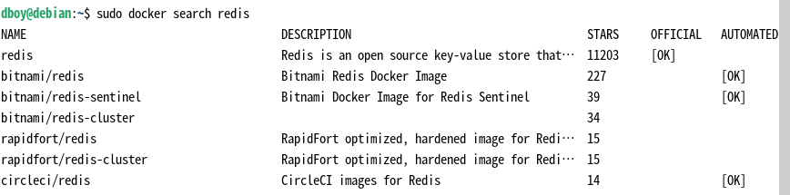
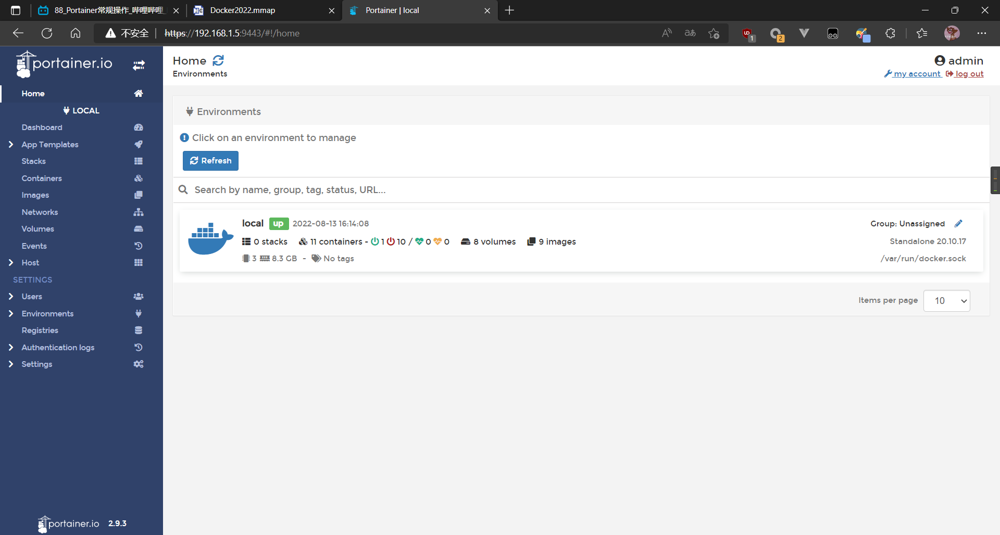

# docker 入门

## 镜像加速

Ubuntu 16.04+、Debian 8+、CentOS 7+

目前主流 Linux 发行版均已使用 [systemd](https://systemd.io/) 进行服务管理，这里介绍如何在使用 systemd 的 Linux 发行版中配置镜像加速器。

请首先执行以下命令，查看是否在 `docker.service` 文件中配置过镜像地址。

```bash
systemctl cat docker | grep '\-\-registry\-mirror'
```

如果该命令有输出，那么请执行 `$ systemctl cat docker` 查看 `ExecStart=` 出现的位置，修改对应的文件内容去掉 `--registry-mirror` 参数及其值，并按接下来的步骤进行配置。

如果以上命令没有任何输出，那么就可以在 `/etc/docker/daemon.json` 中写入如下内容（如果文件不存在请新建该文件）：

```json
{
  "registry-mirrors": [
    "https://hub-mirror.c.163.com",
    "https://mirror.baidubce.com"
  ]
}

```

> 注意，一定要保证该文件符合 json 规范，否则 Docker 将不能启动。

之后重新启动服务。

```bash
sudo systemctl daemon-reload
sudo systemctl restart docker
```

Windows 10

对于使用 `Windows 10` 的用户，在任务栏托盘 Docker 图标内右键菜单选择 `Settings`，打开配置窗口后在左侧导航菜单选择 `Docker Engine`，在右侧像下边一样编辑 json 文件，之后点击 `Apply & Restart` 保存后 Docker 就会重启并应用配置的镜像地址了。

```json
{
  "registry-mirrors": [
   "https://hub-mirror.c.163.com",
   "https://mirror.baidubce.com"
  ]
}
```


docker基本组成

容器（container）、仓库（repository）、镜像（image）

## 命令


### 镜像命令

```shell
docker images 
```

respository 表示镜像仓库源

tag 镜像的标签版本号

iamge id 镜像id

created 镜像的创建时间

size 镜像大小

同一仓库可以有多个tag版本，代表这个仓库的的不同版本，如果不指定镜像的版本tag，会默认使用latest版本，要使用指定的版本，例如要使用debian10版本，debian:10 

#### search

```shell
# 查找镜像
docker search <image-name>

#分页查找
docker search <image-name> --limit 5

# -a 选项显示本地镜像
# -q 仅显示镜像id
```



| name        | 镜像名       |
| -------------|--------------|
| description | 镜像描述     |
| stars       | 点赞数       |
| official    | 是否官方     |
| automated   | 是否自动构建 |


#### pull

```shell
# 拉取镜像
docker pull <image-name>
```

#### tag

```shell
## 标记镜像
docker tag <image-name>:tag <new-image-name>:tag
```


#### system

```shell
# 查看镜像/容器/数据卷占用空间
docker system df
```

#### rmi

```shell
# 根据 <镜像id> or <镜像名> 删除镜像 rmi --> remove id
docker rmi <image-id> or <repository>


# 已经被容器启动的镜像不能直接移除
# 使用 -f 选项 强制移除
# 可以同时删除多个镜像
docker rmi <image-id> or <repository> -f

# 传递参数常量删除镜像
docker rmi -f ${docker images -qa}

```


### 容器命令

#### run

```shell
# 启功 -- 守护进程形式
# 有些容器会启动完成自动退出，要以交互式启功
docker run -d <image-id> 

--name="容器名" # 系统默认随机
-d # 以守护进程形式运行，返回容器id
-i # 交互式运行，通常与-t同时使用
-t # 为容器重新分配一个伪输入终端，通常与-i同时使用

-P # 随机端口映射 -p 6379:6379 宿主机port:容器port
-p # 指定端口映射 
```

#### ps

```shell
# 列出当前运行的容器
docker ps [options]

[options]
-a # 列出所有运行过的容器 正在运行 + 历史记录
-l # 列出最近创建的容器
-n # 显示最近n个创建的容器
-q # 静默模式，只显示容器编号
```

#### exit

```shell
# 退出容器

exit # 同时停止容器

# ctrl+p+q 退出 不停止容器
```

#### start

```shell
# 启动已停止容器
docker start <container-id> <container-name>
```

#### restart

```shell
# 重启
docker restart <id> or <name>
```

#### stop

```shell
# 停止
docker stop <id> or <name>
```

#### kill

```shell
# 强制停止 
docker kill <id> or <name>
```

#### rm

```shell
# 删除容器实例 注意: 只能删除已停止的容器实例
docker rm <id> or <name>

# 强制删除 -f
docker rm -f <id> or <name>

# 删除多个实例
docker rm -f ${docker ps -a -q}
docker ps -a -q | xargs docker rm
```


#### log

```shell
# 容器日志 
docker logs  <id> or <name>
```

#### top

```shell
# 容器进程
docker top <id> or <name>
```

#### inspect

```shell
# 查看容器细节
docker inspect <id>
```

#### exec

```shell
# 重新与容器交互
docker exec 

# 举例: 与已启动的debian11 容器进行命令行交互
docker exec -it debian11 /bin/bash
# 或者
docker attach <id>

```

#### attach

```shell
# 重新与容器交互
docker attach <id>
```

#### exec 与 attach区别

```shell
# attach直接进入容器启动命令的终端，不会启功新的进程，使用exit退出 会导致容器停止

# exec 是在容器中打开行的终端，并且可以启动新的进程，使用exit退出不会导致容器停止

# exec命令常用
# 以redis为例
docker run -d --name="redis-1" redis:6.0.16  # 启动容器
docker ps -l # 查看容器
docker exec -it  redis-1 /bin/bash # 进入容器
exit # 退出容器
docker ps -l # 查看容器，容器没有自动停止
```

#### cp

```shell
docker cp  容器ID:容器内路径 目的主机路径

# 例子
docker cp debian11-1:/tmp/test.txt /tmp/test.txt
```

#### export

```shell
docker export <id> > filename.tar
```

#### import

```shell
# cat filename.tar | docker import - 镜像用户/镜像名:镜像版本号
car abcd.tar | docker import - qibria/ubuntu:3:7
```

#### commit

```shell
## 提交容器实例生成自定义镜像
docker commit -m="描述信息" -a="作者" <container-id> <image-name>:<tag> 
```

#### 自启动

```shell
docker run -d --restart=always --name 设置容器名 使用的镜像
```

或者

```shell
docker update --restart=always 容器ID(或者容器名)
```


## docker hub 

用户也可以在登录后通过 `docker push` 命令来将自己的镜像推送到 Docker Hub。

以下命令中的 `username` 请替换为你的 Docker 账号用户名。

### -  登录

```shell
docker login
```

###  - 标记镜像

```shell
docker tag ubuntu:18.04 username/ubuntu:18.04
```

```shell
docker image ls
# REPOSITORY                                               TAG                    IMAGE ID            CREATED             SIZE
# ubuntu                                                   18.04                  275d79972a86        6 days ago          94.6MB
# username/ubuntu                                          18.04                  275d79972a86        6 days ago          94.6MB
```

### -  推送镜像

```shell
docker push <username>/ubuntu:18.04
```

```shell
docker search <username>
```

## docker私服


### 拉取registry

```shell
## 拉取 registry
docker pull registry
```


### 运行私服 

`--privileged=true` 选项

```shell
## 运行私服 
# docker run -d -p <real-host>:<container-host>  -v <reah-path>:<container-path>--privileged=true registry
docker run -d -p 5000:5000  -v /opt/docker_container/registry/:/tmp/registry --privileged=true registry

##  -v /opt/docker_container/registry/:/tmp/registry
## 容器默认挂载 /var/lib/registry 这里使用 /tmp/registry
```


#### 查看私服仓库

```shell
curl -XGET http://<ip_addr>:5000/v2/_catalog
```


#### 修改配置文件

`/etc/docker/daemon.json` 如果没有请自行创建

添加配置项 `insecure-registries": ["<ip_addr>:<port>"]`

```json
{
    "registry-mirrors": ["https://<aliyuns-mirror-doemon>"], //镜像加速
    "insecure-registries": ["<ip_addr>:<port>"] //允许远程仓库
}

/** 配置
{
  "registry-mirror": [
    "https://hub-mirror.c.163.com",
    "https://mirror.baidubce.com"
  ],
  "insecure-registries": [
    "192.168.199.100:5000"
  ]  
}
*/
```

#### 标记镜像tag

```shell
docker tag debian:latest 192.168.1.5/qibria/debian:latest
```


#### 推送镜像


```sh
# docker push <resository_ip_addr>:<port>/<image-name>:<tag>
docker push 192.168.1.5:5000/qibria/debian11:latest
```


## 容器数据卷

```shell
# docker run -it -v /宿主机目录:/容器内目录 ubuntu /bin/bash
docker run -it --name myu3 --privileged=true -v /tmp/myHostData:/tmp/myDockerData ubuntu /bin/bash
```

```bash
docker volume create my-vol

docker run -d -P \
    --name web \
    # -v my-vol:/usr/share/nginx/html \
    --mount source=my-vol,target=/usr/share/nginx/html \
    nginx:alpine
```


```shell
# 查看容器详细信息
docker inspect 
```

### - 容器卷读写规则

默认rw（可读可写）也可显式指定

```shell
## 默认
# docker run -it --privileged=true -v <宿主机绝对路径>:<容器内绝对路径> <镜像名>

## 显式指定(rw)可读可写
# docker run -it --privileged=true -v <宿主机绝对路径>:<容器内绝对路径>:rw <镜像名>

## 显式指定(ro)可读 
# docker run -it --privileged=true -v <宿主机绝对路径>:<容器内绝对路径>:ro <镜像名>
```

### - 容器卷的继承

```shell
# docker run -it --privileged=true --volumes-from <parent-container> --name u2 ubuntu

docker run -d --privileged=true -v /tmp/myHostData/u1:/tmp/muDockerData/u1 --name u1

docker run -d --privileged=true -v from u1 --name u1
```

> 注意：u1容器实例停止不会导致u2的数据卷丢失，也不会造成本地挂载的数据卷数据丢失


## docker 常规安装

### 常规步骤

#### - 搜索镜像

```shell
docker search <image>
```


#### - 拉取镜像
```shell
docker pull <image>:<tag>
```
#### - 查看镜像
```shell
docker images ls 
```
#### - 启动镜像生成容器实例
```shell
# 后台启动
docker run -d --name="my container name" <image>

# 交互式启动
docker run -it --name="my container name" <image>

# 添加容器卷
docker run -it --name="my container name" --privileged=true -v /tmp/myHostData:/tmp/muDockerData <image>

# 添加容器卷读写规则
docker run -it --name="my container name" --privileged=true -v /tmp/myHostData:/tmp/muDockerData:rw <image>

# 端口映射
docker run -d --name="my redis container" -p 8080:8080 <image>
```
#### - 查看容器
```shell
# 查看全部
docker ps -a

docker top

docker log <container>

docker inspect <container>
```
#### - 停止容器
```shell
# 容器内部停止
exit

# 命令停止
docker stop <container>

# 强制停止
docker kill <container>
```
#### - 移除容器
```shell
docker rm <container>

# 强制移除
docker rm -f <container>

# 移除全部
docker ps -a -q | xargs docker rm
```


### 常用软件安装

#### - tomcat

搜索

```shell
docker search tomcat
```

拉取

```shell
docker pull tomcat
```
运行

```shell
docker run -p 8080:8080 --name "tomcat_1" tomcat
```
访问

```http
http://192.168.1.5:8080
```

```shell
# 404解决方案
docker exec -it tomcat_1  /bin/bash

# 删除空的webapps目录
rm -r webapps
# 将webapps.dist 重命名 为 webapps
mv webapps.dist webapps
```


#### - mysql:5.7

```shell
docker pull mysql:5.7
```

```shell
#docker run --name some-mysql -e MYSQL_ROOT_PASSWORD=my-secret-pw -d mysql:tag
docker run  --name "mysql_1" -p 3305:3306 -e MYSQL_ROOT_PASSWORD=root -d mysql:5.7
```


解决中文乱码问题和数据库持久化问题

```shell
docker run -d  -p 3306:3306 --provileged=true 
-v /var/dcoekr_container/log:/var/log/mysql
-v /var/dcoekr_container/data:/var/lib/mysql 
-v /var/dcoekr_container/conf:/etc/mysql/conf.d
-e MYSQL_ROOT_PASSWORD=root
--name mysql-3305
mysql:5.7
# (已弃用)

# 最新版本
docker run -d -p 3300:3306 --provileged=true 
-v /var/data/docker/volume/mysql/5.7/log:/var/log/mysql
-v /var/data/docker/volume/mysql/5.7/data:/var/lib/mysql 
-v /var/data/docker/volume/mysql/5.7/conf:/etc/mysql/conf.d
-e MYSQL_ROOT_PASSWORD=root
--name mysql-5.7-3300
mysql:5.7
```

新建配置文件my.cnf在conf路径下(已弃用)

```sh
[client]
default_character_set=utf8
[mysqld]
collation_server=utf8_general_ci
character_set_server=utf8
bind-address=0.0.0.0
default-time_zone='+8:00'
```

最新文件

>  **/etc/mysql/conf.d/my.conf**

```shell
[client]
default_character_set=utf8mb4

[mysql]
default-character-set=utf8mb4

[mysqld]
collation_server=utf8mb4_unicode_ci
character_set_server=utf8mb4 
character-set-client-handshake = false #设置为 False, 在客户端字符集和服务端字符集不同的时候将拒绝连接到服务端执行任何操作
init_connect = 'SET NAMES utf8mb4'
bind-address=0.0.0.0
default-time_zone='+8:00' #设置时区
```


#### - redis

```shell
docker pull redis
```

```shell
docker run -d  --name redis-3306 -p 6379:6379 
--privileged=true 
-v /app/redis/redis.conf:/etc/redis/redis.conf
-v /app/redis/data:/data redis:6.0.8 
```

redis.conf

```shell
# bind 127.0.0.1
# 绑定ip地址，为了安全最好都绑定

protected-mode yes
# 保护模式，如果保护模式开了，而且redis既没有bind ip，也没设置密码，那redis只接收127.0.0.1的连接。 默认都开

port 6379
# 端口，设置为0就不会监听

# daemonize yes
# 默认情况redis不会按照守护进程的模式去运行。如果你需要，可以设置来开启 注意，如果开启守护进程模式，会生成/var/run/redis.pid保存pid

databases 16
# 使用集群模式时，database就是0
# 设置数据库的数量。redis默认的数据库就是0，你可以选择不同的数据库，在一个redis连接中执行selcet ，dbid可选的范围是0~(databases-1)，默认就是0~15


requirepass redis
# 给redis设置密码，因为redis快的一逼，一秒钟攻击者能尝试150000次密码，所以你的密码必须非常强壮否则很容易被暴力破解。
```

启动

```shell
docker run  --name redis-3306 -p 6379:6379 
--privileged=true 
-v /app/redis/redis.conf:/etc/redis/redis.conf
-v /app/redis/data:/data 
-d redis:6.0.8 redis-server /etc/redis/redis.conf
```

```shell
docker exec -it redis-3306 /bin/bash
```


####  - nacos(v2.1.0)

拉取镜像

```bash
docker pull nacos/nacos-server
```

```bash
docker images # 查看镜像
```

单机启动

```bash
docker run --env MODE=standalone --name nacos -d -p 8848:8848  nacos/nacos-server
```

```bash
docker ps
```

```bash
docker logs -f ${CONTAINER ID} 
```

```http
http://localhost:8848/nacos
```

数据库持久化

先新建数据库`naocs_config`

```sql
 * Copyright 1999-2018 Alibaba Group Holding Ltd.
 *
 * Licensed under the Apache License, Version 2.0 (the "License");
 * you may not use this file except in compliance with the License.
 * You may obtain a copy of the License at
 *
 *      http://www.apache.org/licenses/LICENSE-2.0
 *
 * Unless required by applicable law or agreed to in writing, software
 * distributed under the License is distributed on an "AS IS" BASIS,
 * WITHOUT WARRANTIES OR CONDITIONS OF ANY KIND, either express or implied.
 * See the License for the specific language governing permissions and
 * limitations under the License.
 */

/******************************************/
/*   数据库全名 = nacos_config   */
/*   表名称 = config_info   */
/******************************************/
CREATE TABLE `config_info` (
  `id` bigint(20) NOT NULL AUTO_INCREMENT COMMENT 'id',
  `data_id` varchar(255) NOT NULL COMMENT 'data_id',
  `group_id` varchar(255) DEFAULT NULL,
  `content` longtext NOT NULL COMMENT 'content',
  `md5` varchar(32) DEFAULT NULL COMMENT 'md5',
  `gmt_create` datetime NOT NULL DEFAULT CURRENT_TIMESTAMP COMMENT '创建时间',
  `gmt_modified` datetime NOT NULL DEFAULT CURRENT_TIMESTAMP COMMENT '修改时间',
  `src_user` text COMMENT 'source user',
  `src_ip` varchar(50) DEFAULT NULL COMMENT 'source ip',
  `app_name` varchar(128) DEFAULT NULL,
  `tenant_id` varchar(128) DEFAULT '' COMMENT '租户字段',
  `c_desc` varchar(256) DEFAULT NULL,
  `c_use` varchar(64) DEFAULT NULL,
  `effect` varchar(64) DEFAULT NULL,
  `type` varchar(64) DEFAULT NULL,
  `c_schema` text,
  `encrypted_data_key` text NOT NULL COMMENT '秘钥',
  PRIMARY KEY (`id`),
  UNIQUE KEY `uk_configinfo_datagrouptenant` (`data_id`,`group_id`,`tenant_id`)
) ENGINE=InnoDB DEFAULT CHARSET=utf8 COLLATE=utf8_bin COMMENT='config_info';

/******************************************/
/*   数据库全名 = nacos_config   */
/*   表名称 = config_info_aggr   */
/******************************************/
CREATE TABLE `config_info_aggr` (
  `id` bigint(20) NOT NULL AUTO_INCREMENT COMMENT 'id',
  `data_id` varchar(255) NOT NULL COMMENT 'data_id',
  `group_id` varchar(255) NOT NULL COMMENT 'group_id',
  `datum_id` varchar(255) NOT NULL COMMENT 'datum_id',
  `content` longtext NOT NULL COMMENT '内容',
  `gmt_modified` datetime NOT NULL COMMENT '修改时间',
  `app_name` varchar(128) DEFAULT NULL,
  `tenant_id` varchar(128) DEFAULT '' COMMENT '租户字段',
  PRIMARY KEY (`id`),
  UNIQUE KEY `uk_configinfoaggr_datagrouptenantdatum` (`data_id`,`group_id`,`tenant_id`,`datum_id`)
) ENGINE=InnoDB DEFAULT CHARSET=utf8 COLLATE=utf8_bin COMMENT='增加租户字段';


/******************************************/
/*   数据库全名 = nacos_config   */
/*   表名称 = config_info_beta   */
/******************************************/
CREATE TABLE `config_info_beta` (
  `id` bigint(20) NOT NULL AUTO_INCREMENT COMMENT 'id',
  `data_id` varchar(255) NOT NULL COMMENT 'data_id',
  `group_id` varchar(128) NOT NULL COMMENT 'group_id',
  `app_name` varchar(128) DEFAULT NULL COMMENT 'app_name',
  `content` longtext NOT NULL COMMENT 'content',
  `beta_ips` varchar(1024) DEFAULT NULL COMMENT 'betaIps',
  `md5` varchar(32) DEFAULT NULL COMMENT 'md5',
  `gmt_create` datetime NOT NULL DEFAULT CURRENT_TIMESTAMP COMMENT '创建时间',
  `gmt_modified` datetime NOT NULL DEFAULT CURRENT_TIMESTAMP COMMENT '修改时间',
  `src_user` text COMMENT 'source user',
  `src_ip` varchar(50) DEFAULT NULL COMMENT 'source ip',
  `tenant_id` varchar(128) DEFAULT '' COMMENT '租户字段',
  `encrypted_data_key` text NOT NULL COMMENT '秘钥',
  PRIMARY KEY (`id`),
  UNIQUE KEY `uk_configinfobeta_datagrouptenant` (`data_id`,`group_id`,`tenant_id`)
) ENGINE=InnoDB DEFAULT CHARSET=utf8 COLLATE=utf8_bin COMMENT='config_info_beta';

/******************************************/
/*   数据库全名 = nacos_config   */
/*   表名称 = config_info_tag   */
/******************************************/
CREATE TABLE `config_info_tag` (
  `id` bigint(20) NOT NULL AUTO_INCREMENT COMMENT 'id',
  `data_id` varchar(255) NOT NULL COMMENT 'data_id',
  `group_id` varchar(128) NOT NULL COMMENT 'group_id',
  `tenant_id` varchar(128) DEFAULT '' COMMENT 'tenant_id',
  `tag_id` varchar(128) NOT NULL COMMENT 'tag_id',
  `app_name` varchar(128) DEFAULT NULL COMMENT 'app_name',
  `content` longtext NOT NULL COMMENT 'content',
  `md5` varchar(32) DEFAULT NULL COMMENT 'md5',
  `gmt_create` datetime NOT NULL DEFAULT CURRENT_TIMESTAMP COMMENT '创建时间',
  `gmt_modified` datetime NOT NULL DEFAULT CURRENT_TIMESTAMP COMMENT '修改时间',
  `src_user` text COMMENT 'source user',
  `src_ip` varchar(50) DEFAULT NULL COMMENT 'source ip',
  PRIMARY KEY (`id`),
  UNIQUE KEY `uk_configinfotag_datagrouptenanttag` (`data_id`,`group_id`,`tenant_id`,`tag_id`)
) ENGINE=InnoDB DEFAULT CHARSET=utf8 COLLATE=utf8_bin COMMENT='config_info_tag';

/******************************************/
/*   数据库全名 = nacos_config   */
/*   表名称 = config_tags_relation   */
/******************************************/
CREATE TABLE `config_tags_relation` (
  `id` bigint(20) NOT NULL COMMENT 'id',
  `tag_name` varchar(128) NOT NULL COMMENT 'tag_name',
  `tag_type` varchar(64) DEFAULT NULL COMMENT 'tag_type',
  `data_id` varchar(255) NOT NULL COMMENT 'data_id',
  `group_id` varchar(128) NOT NULL COMMENT 'group_id',
  `tenant_id` varchar(128) DEFAULT '' COMMENT 'tenant_id',
  `nid` bigint(20) NOT NULL AUTO_INCREMENT,
  PRIMARY KEY (`nid`),
  UNIQUE KEY `uk_configtagrelation_configidtag` (`id`,`tag_name`,`tag_type`),
  KEY `idx_tenant_id` (`tenant_id`)
) ENGINE=InnoDB DEFAULT CHARSET=utf8 COLLATE=utf8_bin COMMENT='config_tag_relation';

/******************************************/
/*   数据库全名 = nacos_config   */
/*   表名称 = group_capacity   */
/******************************************/
CREATE TABLE `group_capacity` (
  `id` bigint(20) unsigned NOT NULL AUTO_INCREMENT COMMENT '主键ID',
  `group_id` varchar(128) NOT NULL DEFAULT '' COMMENT 'Group ID，空字符表示整个集群',
  `quota` int(10) unsigned NOT NULL DEFAULT '0' COMMENT '配额，0表示使用默认值',
  `usage` int(10) unsigned NOT NULL DEFAULT '0' COMMENT '使用量',
  `max_size` int(10) unsigned NOT NULL DEFAULT '0' COMMENT '单个配置大小上限，单位为字节，0表示使用默认值',
  `max_aggr_count` int(10) unsigned NOT NULL DEFAULT '0' COMMENT '聚合子配置最大个数，，0表示使用默认值',
  `max_aggr_size` int(10) unsigned NOT NULL DEFAULT '0' COMMENT '单个聚合数据的子配置大小上限，单位为字节，0表示使用默认值',
  `max_history_count` int(10) unsigned NOT NULL DEFAULT '0' COMMENT '最大变更历史数量',
  `gmt_create` datetime NOT NULL DEFAULT CURRENT_TIMESTAMP COMMENT '创建时间',
  `gmt_modified` datetime NOT NULL DEFAULT CURRENT_TIMESTAMP COMMENT '修改时间',
  PRIMARY KEY (`id`),
  UNIQUE KEY `uk_group_id` (`group_id`)
) ENGINE=InnoDB DEFAULT CHARSET=utf8 COLLATE=utf8_bin COMMENT='集群、各Group容量信息表';

/******************************************/
/*   数据库全名 = nacos_config   */
/*   表名称 = his_config_info   */
/******************************************/
CREATE TABLE `his_config_info` (
  `id` bigint(64) unsigned NOT NULL,
  `nid` bigint(20) unsigned NOT NULL AUTO_INCREMENT,
  `data_id` varchar(255) NOT NULL,
  `group_id` varchar(128) NOT NULL,
  `app_name` varchar(128) DEFAULT NULL COMMENT 'app_name',
  `content` longtext NOT NULL,
  `md5` varchar(32) DEFAULT NULL,
  `gmt_create` datetime NOT NULL DEFAULT CURRENT_TIMESTAMP,
  `gmt_modified` datetime NOT NULL DEFAULT CURRENT_TIMESTAMP,
  `src_user` text,
  `src_ip` varchar(50) DEFAULT NULL,
  `op_type` char(10) DEFAULT NULL,
  `tenant_id` varchar(128) DEFAULT '' COMMENT '租户字段',
  `encrypted_data_key` text NOT NULL COMMENT '秘钥',
  PRIMARY KEY (`nid`),
  KEY `idx_gmt_create` (`gmt_create`),
  KEY `idx_gmt_modified` (`gmt_modified`),
  KEY `idx_did` (`data_id`)
) ENGINE=InnoDB DEFAULT CHARSET=utf8 COLLATE=utf8_bin COMMENT='多租户改造';


/******************************************/
/*   数据库全名 = nacos_config   */
/*   表名称 = tenant_capacity   */
/******************************************/
CREATE TABLE `tenant_capacity` (
  `id` bigint(20) unsigned NOT NULL AUTO_INCREMENT COMMENT '主键ID',
  `tenant_id` varchar(128) NOT NULL DEFAULT '' COMMENT 'Tenant ID',
  `quota` int(10) unsigned NOT NULL DEFAULT '0' COMMENT '配额，0表示使用默认值',
  `usage` int(10) unsigned NOT NULL DEFAULT '0' COMMENT '使用量',
  `max_size` int(10) unsigned NOT NULL DEFAULT '0' COMMENT '单个配置大小上限，单位为字节，0表示使用默认值',
  `max_aggr_count` int(10) unsigned NOT NULL DEFAULT '0' COMMENT '聚合子配置最大个数',
  `max_aggr_size` int(10) unsigned NOT NULL DEFAULT '0' COMMENT '单个聚合数据的子配置大小上限，单位为字节，0表示使用默认值',
  `max_history_count` int(10) unsigned NOT NULL DEFAULT '0' COMMENT '最大变更历史数量',
  `gmt_create` datetime NOT NULL DEFAULT CURRENT_TIMESTAMP COMMENT '创建时间',
  `gmt_modified` datetime NOT NULL DEFAULT CURRENT_TIMESTAMP COMMENT '修改时间',
  PRIMARY KEY (`id`),
  UNIQUE KEY `uk_tenant_id` (`tenant_id`)
) ENGINE=InnoDB DEFAULT CHARSET=utf8 COLLATE=utf8_bin COMMENT='租户容量信息表';


CREATE TABLE `tenant_info` (
  `id` bigint(20) NOT NULL AUTO_INCREMENT COMMENT 'id',
  `kp` varchar(128) NOT NULL COMMENT 'kp',
  `tenant_id` varchar(128) default '' COMMENT 'tenant_id',
  `tenant_name` varchar(128) default '' COMMENT 'tenant_name',
  `tenant_desc` varchar(256) DEFAULT NULL COMMENT 'tenant_desc',
  `create_source` varchar(32) DEFAULT NULL COMMENT 'create_source',
  `gmt_create` bigint(20) NOT NULL COMMENT '创建时间',
  `gmt_modified` bigint(20) NOT NULL COMMENT '修改时间',
  PRIMARY KEY (`id`),
  UNIQUE KEY `uk_tenant_info_kptenantid` (`kp`,`tenant_id`),
  KEY `idx_tenant_id` (`tenant_id`)
) ENGINE=InnoDB DEFAULT CHARSET=utf8 COLLATE=utf8_bin COMMENT='tenant_info';

CREATE TABLE `users` (
	`username` varchar(50) NOT NULL PRIMARY KEY,
	`password` varchar(500) NOT NULL,
	`enabled` boolean NOT NULL
);

CREATE TABLE `roles` (
	`username` varchar(50) NOT NULL,
	`role` varchar(50) NOT NULL,
	UNIQUE INDEX `idx_user_role` (`username` ASC, `role` ASC) USING BTREE
);

CREATE TABLE `permissions` (
    `role` varchar(50) NOT NULL,
    `resource` varchar(255) NOT NULL,
    `action` varchar(8) NOT NULL,
    UNIQUE INDEX `uk_role_permission` (`role`,`resource`,`action`) USING BTREE
);

INSERT INTO users (username, password, enabled) VALUES ('nacos', '$2a$10$EuWPZHzz32dJN7jexM34MOeYirDdFAZm2kuWj7VEOJhhZkDrxfvUu', TRUE);

INSERT INTO roles (username, role) VALUES ('nacos', 'ROLE_ADMIN');
```


持久化启动

- -Xms: 设定程序启动时占用内存大小
- -Xmx: 设定程序运行期间最大可占用的内存大小
- -Xmn：新生代大小

```bash
docker run -d \
-e MODE=standalone \
-e SPRING_DATASOURCE_PLATFORM=mysql \
-e MYSQL_SERVICE_HOST=172.27.111.100 \
-e MYSQL_SERVICE_PORT=3306 \
-e MYSQL_SERVICE_USER=root \
-e MYSQL_SERVICE_PASSWORD=123456 \
-e MYSQL_SERVICE_DB_NAME=nacos_config \
-e JVM_XMS=512m
-e JVM_XMX=512m
-e JVM_XMN=256m
-p 8848:8848 \
--restart=always \
--name nacos \
nacos/nacos-server
```

使用compose编排启动

```bash
version: '3'
services:
  nacos:
    image: nacos/nacos-server:latest                             # 镜像`nacos/nacos-server:latest`
    container_name: nacos_server                                 # 容器名为'nacos_server'
    restart: always                                              # 指定容器退出后的重启策略为始终重启
    volumes:                                                     # 数据卷挂载路径设置,将本机目录映射到容器目录
      - "/opt/nacous/nacos_docker/logs:/home/nacos/logs"
      - "/opt/nacous/nacos_docker/init.d/custom.properties:/home/nacos/init.d/custom.properties"
    environment:                        # 设置环境变量,相当于docker run命令中的-e
      - PREFER_HOST_MODE=hostname       # 是否支持hostname
      - MODE=standalone                           # 单机模式启动
      - SPRING_DATASOURCE_PLATFORM=mysql
      - MYSQL_SERVICE_HOST=127.0.0.1    # 注：这里不能为`127.0.0.1`或`localhost`方式！！！
      - MYSQL_SERVICE_DB_NAME=nacos_config        # 所需sql脚本位于 `nacos-mysql/nacos-mysql.sql`
      - MYSQL_SERVICE_PORT=3306
      - MYSQL_SERVICE_USER=root
      - MYSQL_SERVICE_PASSWORD=123456
       # JVM调优参数
      - JVM_XMS=64m   #-Xms default :2g
      - JVM_XMX=64m   #-Xmx default :2g
      - JVM_XMN=16m   #-Xmn default :1g
      - JVM_MS=128m     #-XX:MetaspaceSize default :128m
      - JVM_MMS=8m    #-XX:MaxMetaspaceSize default :320m
      - NACOS_DEBUG=n #是否开启远程debug，y/n，默认n
      - TOMCAT_ACCESSLOG_ENABLED=false #是否开始tomcat访问日志的记录，默认false
    ports:                              # 映射端口
      - "8848:8848"
      - "9555:9555"
    # mem_limit: 300m   # 最大使用内存
```


集群启动方案

在数据库创建了相应的表之后我们就可以执行以下的指令创建三个Nacos服务器 

**注意:请将下面指令中的IP地址改为你机器的IP地址,数据库的库名以及账号密码请按需更改**

 my-nacos1->使用端口8846

```bash
docker run -d \
-e PREFER_HOST_MODE=hostname \
-e MODE=cluster \
-e NACOS_APPLICATION_PORT=8846 \
-e NACOS_SERVERS="192.168.248.129:8846 192.168.248.129:8847 192.168.248.129:8848" \
-e SPRING_DATASOURCE_PLATFORM=mysql \
-e MYSQL_SERVICE_HOST=192.168.248.129 \
-e MYSQL_SERVICE_PORT=3306 \
-e MYSQL_SERVICE_USER=root \
-e MYSQL_SERVICE_PASSWORD=1234 \
-e MYSQL_SERVICE_DB_NAME=nacos_config \
-e NACOS_SERVER_IP=192.168.248.129 \
-p 8846:8846 \
--name my-nacos1 \
nacos/nacos-server
```

my-nacos2->使用端口8847

```bash
docker run -d \
-e PREFER_HOST_MODE=hostname \
-e MODE=cluster \
-e NACOS_APPLICATION_PORT=8847 \
-e NACOS_SERVERS="192.168.248.129:8846 192.168.248.129:8847 192.168.248.129:8848" \
-e SPRING_DATASOURCE_PLATFORM=mysql \
-e MYSQL_SERVICE_HOST=192.168.248.129 \
-e MYSQL_SERVICE_PORT=3306 \
-e MYSQL_SERVICE_USER=root \
-e MYSQL_SERVICE_PASSWORD=1234 \
-e MYSQL_SERVICE_DB_NAME=nacos_config \
-e NACOS_SERVER_IP=192.168.248.129 \
-p 8847:8847 \
--name my-nacos2 \
nacos/nacos-server
```

my-nacos3->使用端口8848

```bash
docker run -d \
-e PREFER_HOST_MODE=hostname \
-e MODE=cluster \
-e NACOS_APPLICATION_PORT=8848 \
-e NACOS_SERVERS="192.168.248.129:8846 192.168.248.129:8847 192.168.248.129:8848" \
-e SPRING_DATASOURCE_PLATFORM=mysql \
-e MYSQL_SERVICE_HOST=192.168.248.129 \
-e MYSQL_SERVICE_PORT=3306 \
-e MYSQL_SERVICE_USER=root \
-e MYSQL_SERVICE_PASSWORD=1234 \
-e MYSQL_SERVICE_DB_NAME=nacos_config \
-e NACOS_SERVER_IP=192.168.248.129 \
-p 8848:8848 \
--name my-nacos3 \
nacos/nacos-server
```


## dockerfile

### 构建命令

#### - FROM 

from

#### - MATINTAINER

matintainer

#### - RUN 

```dockerfile
# RUM ["./test.php","dev","offline"] 
等于 RUM ./test.php dev offline
```

#### - EXPOSE 

expose 当前容器对外暴露出的端口号

#### - WORKDIR 

workdir 指定创建容器后，终端默认登录进来的工作目录，一个落脚点

#### - USER 

user 指定该镜像以什么样的用户去执行，如果不指定，默认是root

#### - ENV 

env 用来构建镜像过程中设置的环境变量

#### - ADD 

add 将宿主机目录下的文件拷贝进镜像且会自动处理URL和解压tar压缩包

#### - COPY 

copy

#### - VOLUME

volume 容器数据卷，用于数据保存和持久化工作

#### - CMD 

cmd 

Dockerfile中可以有多个CMD指令，但只有最后一个生效，CMD会被docker run 之后的参数替换

#### - ENTRYPOINT 

entrypoint 


### 构建脚本

```dockerfile
FROM debian

MAINTAINER gerry_gqj@outlook.com

 

ENV MYPATH /usr/local

WORKDIR $MYPATH


#ENV DEBIAN_FRONTEND=noninteractive


RUN apt-get update

# install nano

RUN apt-get -y install nano

#安装vim编辑器

#RUN yum -y install vim

#安装ifconfig命令查看网络IP

#RUN yum -y install net-tools

#安装java8及lib库

#RUN yum -y install glibc.i686

RUN mkdir /usr/local/java

#ADD 是相对路径jar,把jdk-8u171-linux-x64.tar.gz添加到容器中,安装包必须要和Dockerfile文件在同一位置

ADD OpenJDK8U-jdk_x64_linux_hotspot_8u332b09.tar.gz /usr/local/java/

#配置java环境变量

ENV JAVA_HOME /usr/local/java/jdk8u332-b09

ENV JRE_HOME $JAVA_HOME/jre

ENV CLASSPATH $JAVA_HOME/lib/dt.jar:$JAVA_HOME/lib/tools.jar:$JRE_HOME/lib:$CLASSPATH

ENV PATH $JAVA_HOME/bin:$PATH

 

EXPOSE 80

 

CMD echo $MYPATH

CMD echo "success--------------ok"

CMD /bin/bash

```


执行构建命令

```shell
docker build -t mydebian11:1.1 . 
```


运行容器

```shell
docker run -it mydebian11:1.1
```


删除虚悬镜像

```shell
docker image prune
```


### 运行微服务

```dockerfile
# 基础镜像使用java

FROM java:8

# 作者

MAINTAINER zzyy

# VOLUME 指定临时文件目录为/tmp，在主机/var/lib/docker目录下创建了一个临时文件并链接到容器的/tmp

VOLUME /tmp

# 将jar包添加到容器中并更名为zzyy_docker.jar

ADD docker_boot-0.0.1-SNAPSHOT.jar zzyy_docker.jar

# 运行jar包

RUN bash -c 'touch /zzyy_docker.jar'

ENTRYPOINT ["java","-jar","/zzyy_docker.jar"]

#暴露6001端口作为微服务

EXPOSE 6001
```


## docker 网络

```shell
docker network --help
  connect     Connect a container to a network
  create      Create a network
  disconnect  Disconnect a container from a network
  inspect     Display detailed information on one or more networks
  ls          List networks
  prune       Remove all unused networks
  rm          Remove one or more networks
```

### 常用命令

```shell
# 查看docker网络
docker network ls
```

```shell
# 查看网络源数据
dokcer network inspect <network-name>
```

```shell
# 新建网络
docker network create aa_network
```

```shell
# 删除网络
docker network rm <network-name>
```

### 网络模式


* bridge模式：使用`--network bridge`指定，默认使用`docker0`

* host模式：使用`--network host`指定

* none模式：使用`--network none`指定

* container模式：使用--network container：NAME或者容器ID指定


### 自定义网络

```shell
# 创建自定义网络
docker network create my_network
```

```sh
# 以自定义网络形式启动容器
docker run -d -p 8081:8080 --network my_network --name tomcat81 billygoo/tomcat8-jdk8
docker run -d -p 8082:8080 --network my_network --name tomcat82 billygoo/tomcat8-jdk8
```

使用服务名可以互相ping通，意味着两个服务之间可以通过容器名进行服务调用

```shell
# 容器tomcat81中pingtomcat82
docker exec -it tomcat81 /bin/bash
ping tomcat82

# 容器tomcat82中pingtomcat81
docker exec -it tomcat82 /bin/bash
ping tomcat81
```


## docker compose

 docker建议我们每一个容器中只运行一个服务,因为docker容器本身占用资源极少,所以最好是将每个服务单独的分割开来但是这样我们又面临了一个问题？

如果我需要同时部署好多个服务,难道要每个服务单独写Dockerfile然后在构建镜像,构建容器,这样累都累死了,所以docker官方给我们提供了docker-compose多服务部署的工具

例如要实现一个Web微服务项目，除了Web服务容器本身，往往还需要再加上后端的数据库mysql服务容器，redis服务器，注册中心eureka，甚至还包括负载均衡容器等等

Compose允许用户通过一个单独的docker-compose.yml模板文件（YAML 格式）来定义一组相关联的应用容器为一个项目（project）。

可以很容易地用一个配置文件定义一个多容器的应用，然后使用一条指令安装这个应用的所有依赖，完成构建。Docker-Compose 解决了容器与容器之间如何管理编排的问题。


### - 下载安装

```shell
# https://docs.docker.com/compose/install/
sudo apt-get update
sudo apt-get install docker-compose-plugin
```

```shell
# 查看版本
docker compose version
```


### Compose核心概念

一个文件`docker-compose.yml`, 两个要素(工程，服务)

**服务(service):** 一个个容器实例，比如mysql，redis，webappp等等

**工程(project):** 由一组关联的应用容器组成的完整业务单元，在`docker-compose.yml`中定义

### Compose常用命令

```shell
docker-compose -h              # 查看帮助

docker-compose up              # 启动所有docker-compose服务

docker-compose up -d             # 启动所有docker-compose服务并后台运行

docker-compose down             # 停止并删除容器、网络、卷、镜像。

docker-compose exec  yml里面的服务id         # 进入容器实例内部 docker-compose exec docker-compose.yml文件中写的服务id /bin/bash

docker-compose ps            # 展示当前docker-compose编排过的运行的所有容器

docker-compose top           # 展示当前docker-compose编排过的容器进程

 

docker-compose logs  yml里面的服务id   # 查看容器输出日志

dokcer-compose config   # 检查配置

dokcer-compose config -q # 检查配置，有问题才有输出

docker-compose restart  # 重启服务

docker-compose start   # 启动服务

docker-compose stop    # 停止服务
```


```bash
#启动 
docker-compose -f standalone-derby.yaml up
#关闭
docker-compose -f standalone-derby.yaml stop
#移除
docker-compose -f standalone-derby.yaml rm
#关闭并移除
docker-compose -f standalone-derby.yaml down

```


### docker-compose.yml

```yaml
version: "3"
services:
  mymicroService:
    image: zzyy_docker:1.6
    container_name: ms01
    ports:
      - "6001:6001"
    volumes:
      - /app/microService:/data
    networks: 
      - atguigu_net 
    depends_on: 
      - redis
      - mysql
# docker run -d -p 6001:6001 --network atguigu_net -v /app/microService:/data --name ms01 zzyy_docker:1.6
  redis:
    image: redis:6.0.8
    ports:
      - "6379:6379"
    volumes:
      - /app/redis/redis.conf:/etc/redis/redis.conf
      - /app/redis/data:/data
    networks: 
      - atguigu_net
    command: redis-server /etc/redis/redis.conf
  mysql:
    image: mysql:5.7
    environment:
      MYSQL_ROOT_PASSWORD: '123456'
      MYSQL_ALLOW_EMPTY_PASSWORD: 'no'
      MYSQL_DATABASE: 'db2021'
      MYSQL_USER: 'zzyy'
      MYSQL_PASSWORD: 'zzyy123'
    ports:
       - "3306:3306"
    volumes:
       - /app/mysql/db:/var/lib/mysql
       - /app/mysql/conf/my.cnf:/etc/my.cnf
       - /app/mysql/init:/docker-entrypoint-initdb.d
    networks:
      - atguigu_net
    command: --default-authentication-plugin=mysql_native_password #解决外部无法访问
networks: # docker network create atguigu_net
   atguigu_net: 
  
```


## pontainer 图形化

 ```http
https://www.portainer.io/
 ```


### 安装

```shell

# docker run -d -p 8000:8000 -p 9000:9000 --name portainer     --restart=always     -v /var/run/docker.sock:/var/run/docker.sock     -v portainer_data:/data     portainer/portainer

docker run -d -p 8000:8000 -p 9443:9443 --name portainer \
    --restart=always \
    -v /var/run/docker.sock:/var/run/docker.sock \
    -v portainer_data:/data \
    portainer/portainer-ce:2.9.3
```


### 登录

```sh
http://<ip_addr>:8000
```

```shell
https://<ip_addr>:9443
```

账号密码自行创建登录

```shell
# 账号
admin
# 密码
88888888
```




