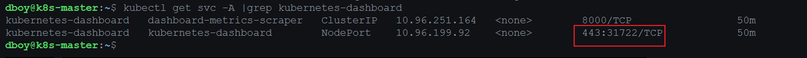
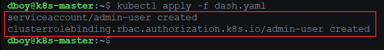
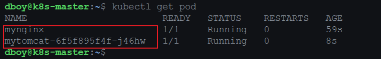
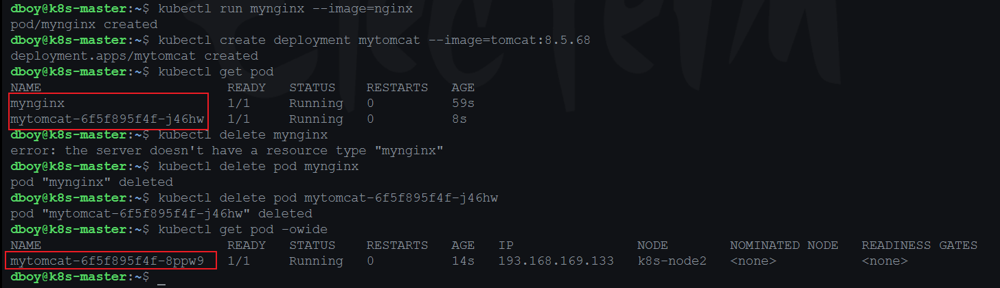
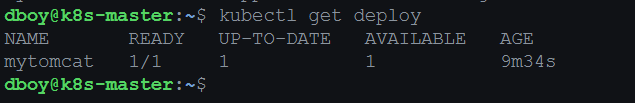
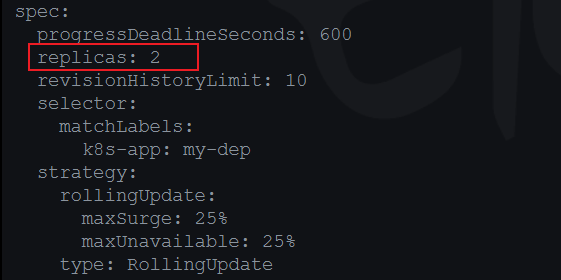

# k8s基础


## 安装

三台机器（debian）

### 设置主机名

```shell
# 查看主机名
hostname
```

机器一

```shell
hostnamectl set-hostname k8s-master
```

机器二

```shell
hostnamectl set-hostname k8s-node1
```

机器三

```shell
hostnamectl set-hostname k8s-node2
```


### docker 环境

三台机器相同

```shell
sudo apt-get remove docker docker-engine docker.io containerd runc
```

```shell
sudo apt-get update
sudo apt-get install \
    ca-certificates \
    curl \
    gnupg \
    lsb-release
```

```shell
sudo mkdir -p /etc/apt/keyrings
```

```shell
curl -fsSL https://download.docker.com/linux/debian/gpg | sudo gpg --dearmor -o /etc/apt/keyrings/docker.gpg
```

```shell
echo \
  "deb [arch=$(dpkg --print-architecture) signed-by=/etc/apt/keyrings/docker.gpg] https://download.docker.com/linux/debian \
  $(lsb_release -cs) stable" | sudo tee /etc/apt/sources.list.d/docker.list > /dev/null
```

```shell
sudo apt-get update
# 指定版本安装
# sudo apt-get install docker-ce docker-ce-cli containerd.io docker-compose-plugin
sudo apt-get install docker-ce=5:20.10.7~3-0~debian-bullseye docker-ce-cli=5:20.10.7~3-0~debian-bullseye containerd.io=1.4.6-1
```

```shell
# 设置镜像加速
sudo mkdir -p /etc/docker
sudo tee /etc/docker/daemon.json <<-'EOF'
{
  "registry-mirrors": ["https://82m9ar63.mirror.aliyuncs.com"],
  "exec-opts": ["native.cgroupdriver=systemd"],
  "log-driver": "json-file",
  "log-opts": {
    "max-size": "100m"
  },
  "storage-driver": "overlay2"
}
EOF
sudo systemctl daemon-reload
sudo systemctl restart docker
```


### k8s环境准备

```shell
# 查看主机名
hostname

#各个机器设置自己的域名
hostnamectl set-hostname xxxx


# 将 SELinux 设置为 permissive 模式（相当于将其禁用）
sudo setenforce 0
sudo sed -i 's/^SELINUX=enforcing$/SELINUX=permissive/' /etc/selinux/config

#关闭swap
free -m
swapoff -a  
sed -ri 's/.*swap.*/#&/' /etc/fstab

#允许 iptables 检查桥接流量
cat <<EOF | sudo tee /etc/modules-load.d/k8s.conf
br_netfilter
EOF

cat <<EOF | sudo tee /etc/sysctl.d/k8s.conf
net.bridge.bridge-nf-call-ip6tables = 1
net.bridge.bridge-nf-call-iptables = 1
EOF
sudo sysctl --system
```


### 设置镜像加速

```shell
curl https://mirrors.aliyun.com/kubernetes/apt/doc/apt-key.gpg | apt-key add - 
cat <<EOF >/etc/apt/sources.list.d/kubernetes.list
deb https://mirrors.aliyun.com/kubernetes/apt/ kubernetes-xenial main
EOF
```

### 安装 kubelet kubeadm kubectl 环境

```shell
apt-get update
# apt-get install -y kubelet kubeadm kubectl
sudo apt install -y kubelet=1.20.9 kubeadm=1.20.9 kubectl=1.20.9
sudo systemctl enable kubelet
```

### 拉取k8s组件

```shell
sudo tee ./images.sh <<-'EOF'
#!/bin/bash
images=(
kube-apiserver:v1.20.9
kube-proxy:v1.20.9
kube-controller-manager:v1.20.9
kube-scheduler:v1.20.9
coredns:1.7.0
etcd:3.4.13-0
pause:3.2
)
for imageName in ${images[@]} ; do
docker pull registry.cn-hangzhou.aliyuncs.com/lfy_k8s_images/$imageName
done
EOF
```

```shell
# 执行脚本下载
chmod +x ./images.sh && ./images.sh
```


## 使用kubeadm创建集群(主节点)

```shell
echo "master-ip  cluster-endpoint" >> /etc/hosts
```


```shell
sudo kubeadm init --apiserver-advertise-address=192.168.1.7 --control-plane-endpoint=cluster-endpoint --image-repository registry.cn-hangzhou.aliyuncs.com/lfy_k8s_images --kubernetes-version v1.20.9 --service-cidr=10.96.0.0/16 --pod-network-cidr=193.168.0.0/16
```

```bash
Your Kubernetes control-plane has initialized successfully!

To start using your cluster, you need to run the following as a regular user:

  mkdir -p $HOME/.kube
  sudo cp -i /etc/kubernetes/admin.conf $HOME/.kube/config
  sudo chown $(id -u):$(id -g) $HOME/.kube/config

Alternatively, if you are the root user, you can run:

  export KUBECONFIG=/etc/kubernetes/admin.conf

You should now deploy a pod network to the cluster.
Run "kubectl apply -f [podnetwork].yaml" with one of the options listed at:
  https://kubernetes.io/docs/concepts/cluster-administration/addons/

You can now join any number of control-plane nodes by copying certificate authorities
and service account keys on each node and then running the following as root:

  kubeadm join cluster-endpoint:6443 --token g00zwx.f3llyqfotllz0y54 \
    --discovery-token-ca-cert-hash sha256:e49e524adf539a22b36d6df318c165e3bbfa4401ad3dd66956c14d1697f631f5 \
    --control-plane 

Then you can join any number of worker nodes by running the following on each as root:

kubeadm join cluster-endpoint:6443 --token g00zwx.f3llyqfotllz0y54 \
    --discovery-token-ca-cert-hash sha256:e49e524adf539a22b36d6df318c165e3bbfa4401ad3dd66956c14d1697f631f5 
```


```shell
# curl https://docs.projectcalico.org/manifests/calico.yaml -O
curl https://docs.projectcalico.org/v3.20/manifests/calico.yaml -O

nano calica.yaml
# 
#-name:... 取消注释
# value: 192.168... 修改成自己的，默认不用修改
kubectl apply -f calico.yaml
```


### kubectl常用命令

```bash
#查看集群所有节点
kubectl get nodes

#根据配置文件，给集群创建资源
kubectl apply -f xxxx.yaml

#查看集群部署了哪些应用？
docker ps   ===   kubectl get pods -A
# 运行中的应用在docker里面叫容器，在k8s里面叫Pod
kubectl get pods -A
```


## woker节点加入集群

```bash
# 创建新令牌
# kubeadm token create --print-join-command 

kubeadm join cluster-endpoint:6443 --token g00zwx.f3llyqfotllz0y54 \
    --discovery-token-ca-cert-hash sha256:e49e524adf539a22b36d6df318c165e3bbfa4401ad3dd66956c14d1697f631f5 
```


## dashboard部署

```bash
# kubectl apply -f https://raw.githubusercontent.com/kubernetes/dashboard/v2.6.1/aio/deploy/recommended.yaml
kubectl apply -f https://raw.githubusercontent.com/kubernetes/dashboard/v2.3.1/aio/deploy/recommended.yaml

#http://localhost:8001/api/v1/namespaces/kubernetes-dashboard/services/https:kubernetes-dashboard:/proxy/.
```

```bash
# KUBE_EDITOR="nano" kubectl edit svc/docker-registry

KUBE_EDITOR="nano" kubectl edit svc kubernetes-dashboard -n kubernetes-dashboard
```

```bash
#修改  type: ClusterIP
type: NodePort
```

```bash
kubectl get svc -A |grep kubernetes-dashboard
## 找到端口，在安全组放行
```



```bash
https://192.168.1.7:31722
```

```yaml
#创建访问账号，准备一个yaml文件； nano dash.yaml
apiVersion: v1
kind: ServiceAccount
metadata:
  name: admin-user
  namespace: kubernetes-dashboard
---
apiVersion: rbac.authorization.k8s.io/v1
kind: ClusterRoleBinding
metadata:
  name: admin-user
roleRef:
  apiGroup: rbac.authorization.k8s.io
  kind: ClusterRole
  name: cluster-admin
subjects:
- kind: ServiceAccount
  name: admin-user
  namespace: kubernetes-dashboard
```

```bash
# 运行配置文件
kubectl apply -f dash.yaml
```



```bash
# 获取密钥
#获取访问令牌
kubectl -n kubernetes-dashboard get secret $(kubectl -n kubernetes-dashboard get sa/admin-user -o jsonpath="{.secrets[0].name}") -o go-template="{{.data.token | base64decode}}"
```

```bash
eyJhbGciOiJSUzI1NiIsImtpZCI6Imx1M3c4RE40M3VHakkyOXMwMVNTUVRuTHA0WU1TQUkyUzBDTkVnOFJfU1UifQ.eyJpc3MiOiJrdWJlcm5ldGVzL3NlcnZpY2VhY2NvdW50Iiwia3ViZXJuZXRlcy5pby9zZXJ2aWNlYWNjb3VudC9uYW1lc3BhY2UiOiJrdWJlcm5ldGVzLWRhc2hib2FyZCIsImt1YmVybmV0ZXMuaW8vc2VydmljZWFjY291bnQvc2VjcmV0Lm5hbWUiOiJhZG1pbi11c2VyLXRva2VuLXR0dHJtIiwia3ViZXJuZXRlcy5pby9zZXJ2aWNlYWNjb3VudC9zZXJ2aWNlLWFjY291bnQubmFtZSI6ImFkbWluLXVzZXIiLCJrdWJlcm5ldGVzLmlvL3NlcnZpY2VhY2NvdW50L3NlcnZpY2UtYWNjb3VudC51aWQiOiIwYTkxYTlhYS1jYzdiLTQyZmEtOTE4Ni1hM2NmOTFhOWExNzEiLCJzdWIiOiJzeXN0ZW06c2VydmljZWFjY291bnQ6a3ViZXJuZXRlcy1kYXNoYm9hcmQ6YWRtaW4tdXNlciJ9.RHAhsIHeKlIsoZnoUPlykYLW75hFBdd35YL9GP7NqACT1pWAvV7cS4iOy_Apg8QrppE3kJiv2cYHUTCurU7xWQF5vlpBQJ3Qw4Q4IucVo7GL01eJAI5WoiIx1r5vtSfbK5IVt1LsXCOG1XnQMgZGLwXbIg5UTeFWRGsE_3LYqGfFkRm30WNtIBBfLoJqzMrPg0MBnm5pbHxvhsaXY49QXIE7IxyN7eh9ODSJrrdPASvaiH9tPkkimgi1UyCkA05ZtWT-HEfYYBT7OsPuHTGV4FDJLtrXA-j3ozRSBWDeoG4gUzJiFa6CsbT4O7RuPXhS--MsEGDFh1aSUirAqocScA
```

## k8s核心概念

### Namespace命名空间

作用: 隔离资源

#### - 创建命名空间

```bash
# 创建命名空间hello
kubectl create ns hello
```

或者

```bash
nano hello.yaml
```

```yaml
apiVersion: v1
kind: Namespace
metadata:
  name: hello
```

```bash
kubectl apply -f hello.yaml
```


#### - 获取命名空间

```bash
kubectl get ns
```

```bash
# -n 选项 获取命名空间pods资源
kubectl get pods -n <namespace>
```

#### - 删除命名空间

```bash
kubectl delete ns hello
```

或者

```bash
kubectl delete hello.yaml
```

### Pod

#### - 运行pod

```bash
# 运行pod
# kubectl run <pod-name> --image=<images-name>
kubectl run mynginx --image=nginx
```

#### - 查看pod

```bash
# 查看default名称空间的Pod
kubectl get pod 
# 描述
kubectl describe pod <pod-name>
```

#### - 删除pod

```bash
# 删除
kubectl delete pod <pod-name> -n <namespace>
```

#### - pod日志

```bash
# 查看Pod的运行日志
kubectl logs Pod名字
```

```bash
# 每个Pod - k8s都会分配一个ip
kubectl get pod -owide
# 使用Pod的ip+pod里面运行容器的端口
curl 192.168.169.136
# 集群中的任意一个机器以及任意的应用都能通过Pod分配的ip来访问这个Pod
```

使用资源文件配置

```yaml
apiVersion: v1
kind: Pod
metadata:
  labels:
    run: mynginx 
  name: mynginx # pod名
  namespace: default
spec:
  containers:
  - image: nginx # 镜像名
    name: mynginx # 这个是容器名称，任意取
```

```yaml
apiVersion: v1
kind: Pod
metadata:
  labels:
    run: myapp
  name: myapp
spec:
  containers:
  - image: nginx
    name: nginx
  - image: tomcat:8.5.68
    name: tomcat
```


### Deployment

#### - 概述

控制Pod，使Pod拥有多副本，自愈，扩缩容等能力

```bash
# 清除所有Pod，比较下面两个命令有何不同效果？
kubectl run mynginx --image=nginx

kubectl create deployment mytomcat --image=tomcat:8.5.68
# 自愈能力？ no 这个叫做卷土重来
```

```bash
kubectl get pod
```



```bash
kubectl delete pod mynginx 
# pod会直接删除

kubectl delete pod mytomcat-6f5f895f4f-j46hw
# 这个pod会删除，同时也会创建一个新的pod
```




#### - 命令

##### - 创建

```bash
kubectl create deployment mytomcat --image=tomcat:8.5.68
```

##### - 查看

```bash
kubectl get deploy
```




##### - 删除

```bash
kubectl delete deployment mytomcat
```


#### - 部署多实例

```bash
# 使用deployment部署三个pod
kubectl create deployment my-dep --image=nginx --replicas=3
```


## k8s扩缩容

```bash
kubectl scale --replicas=5 deployment/my-dep
```

或者

```bash
KUBE_EDITOR="nano" kubectl edit deployment my-dep

#修改 replicas
```



## k8s滚动发布

```bash
kubectl get deploy -oyaml
kubectl set image deployment/my-dep my-dep=nginx:1.16.1 --record
kubectl rollout status deployment/my-dep
```

```bash
# 修改 kubectl edit deployment/my-dep
```


## k8s版本回退与发布历史

### 发布历史

```bash
#历史记录
kubectl rollout history deployment/my-dep
```

```bash
#查看某个历史详情
kubectl rollout history deployment/my-dep --revision=2
```

### 版本回滚

```bash
#回滚(回到上次)
kubectl rollout undo deployment/my-dep
```

```bash

#回滚(回到指定版本)
kubectl rollout undo deployment/my-dep --to-revision=2
```


> 除了Deployment，k8s还有 `StatefulSet` 、`DaemonSet` 、`Job`  等 类型资源。我们都称为 `工作负载`。
>
> 有状态应用使用  `StatefulSet`  部署，无状态应用使用 `Deployment` 部署
>
> https://kubernetes.io/zh/docs/concepts/workloads/controllers/

## Service

将一组 [Pods](https://kubernetes.io/docs/concepts/workloads/pods/pod-overview/) 公开为网络服务的抽象方法。

```bash
cat /usr/share/nginx/html/index.html 

cd /usr/share/nginx/html 

echo 111 > index.html
```

```bash
# kubectl delete service my-dep

#暴露Deploy
kubectl expose deployment my-dep --port=8000 --target-port=80

# 
kubectl get service

#使用标签检索Pod
kubectl get pod -l app=my-dep
```

