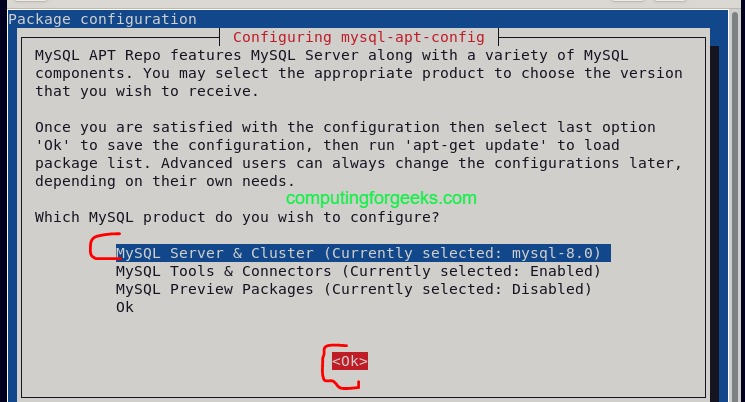
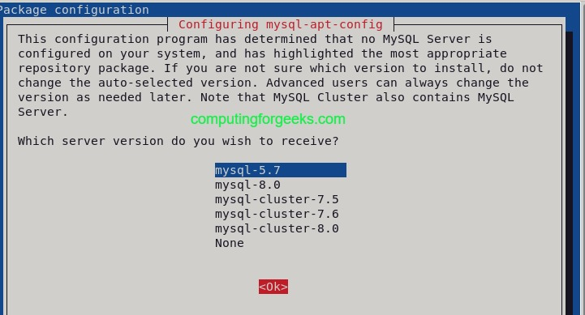
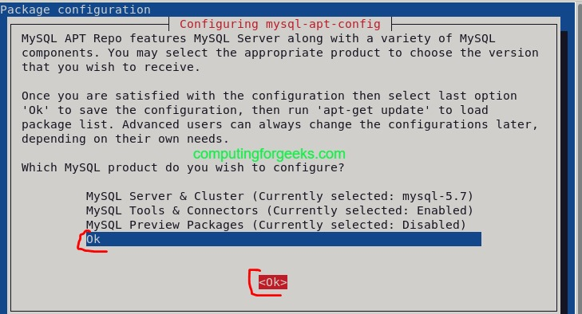
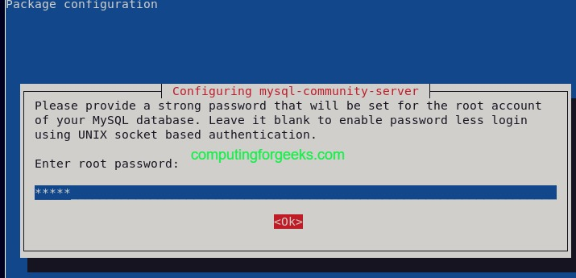
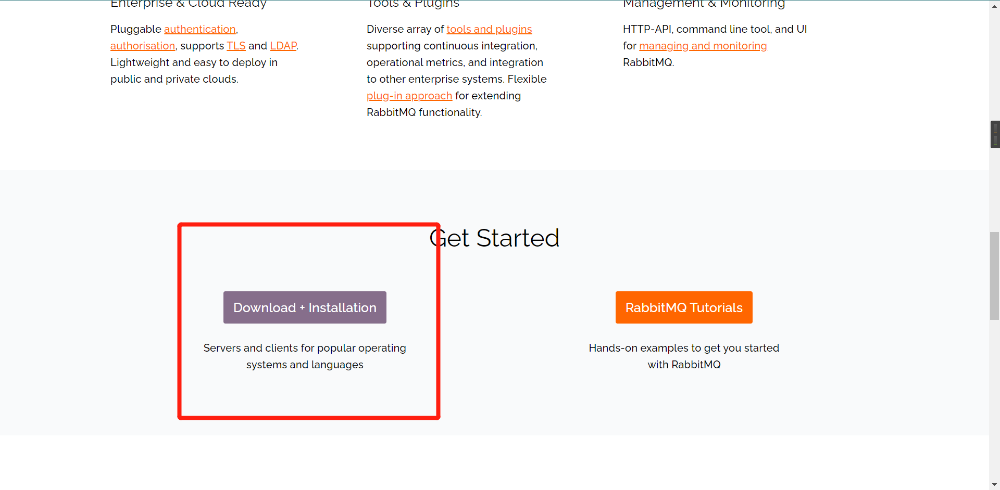
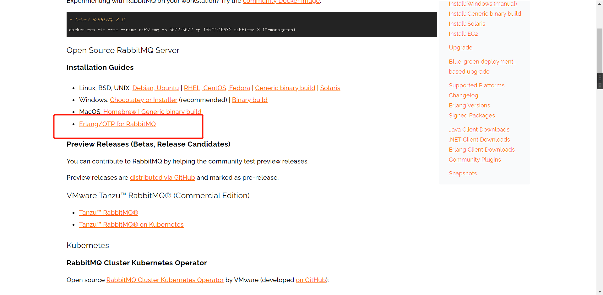
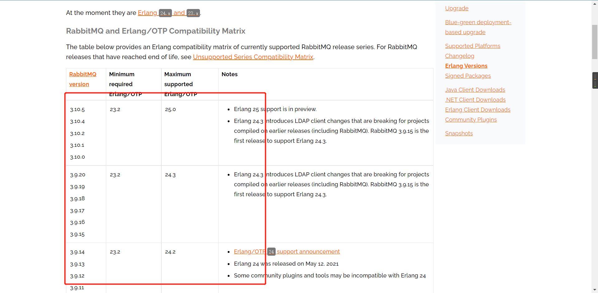
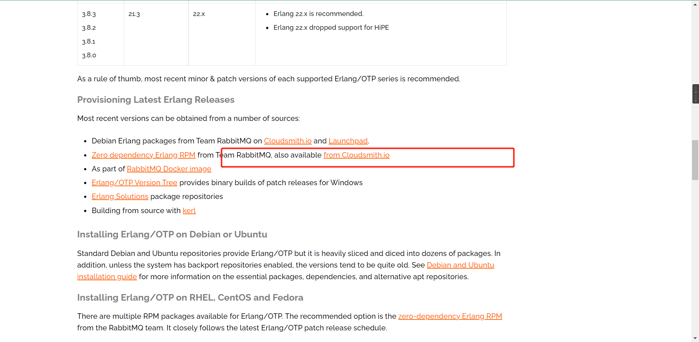
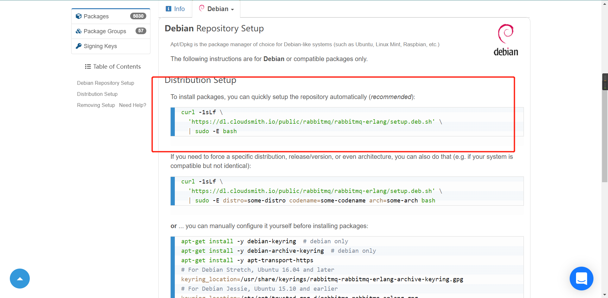
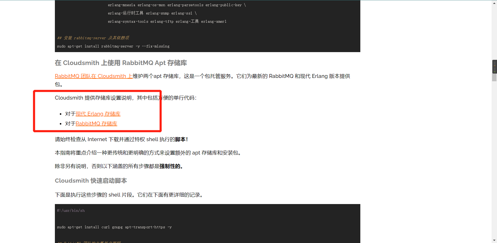

## 服务器环境配置记录

## debian11


### apt

apt source

/etc/apt/sources.list

```sh
deb http://mirrors.huaweicloud.com/debian bullseye main contrib non-free
deb https://mirrors.huaweicloud.com/debian/ bullseye-updates main contrib non-free
deb https://mirrors.huaweicloud.com/debian/ bullseye-backports main contrib non-free
deb http://mirrors.huaweicloud.com/debian-security bullseye-security main contrib non-free
```

```shell
sudo echo -e \
"\ndeb http://mirrors.huaweicloud.com/debian bullseye main contrib non-free"\
"\ndeb https://mirrors.huaweicloud.com/debian/ bullseye-updates main contrib non-free"\
"\ndeb https://mirrors.huaweicloud.com/debian/ bullseye-backports main contrib non-free"\
"\ndeb http://mirrors.huaweicloud.com/debian-security bullseye-security main contrib non-free">> /etc/apt/sources.list
```


### sudo

/etc/sudoer

```bash
dboy ALL=(ALL:ALL) ALL
dboy ALL=NOPASSWD:  /usr/lib/openssh/sftp-server
```


### java

环境变量

/etc/profile.d/java.sh

```sh
#java env
export PATH=$PATH:/opt/jdk8u332-b09/bin/

#java home
export JAVA_HOME=/opt/jdk8u332-b09/
```


### minio

#### 安装

```sh
wget https://dl.min.io/server/minio/release/linux-amd64/minio
```

工作目录/opt/minio/minio

```shell
rm minio /opt/minio/minio
```

存储目录

```shell
mkdir /opt/minio/data
```

权限

```shell
chmod +x minio
```

#### 启动

```sh
MINIO_ROOT_USER=admin MINIO_ROOT_PASSWORD=admin ./minio server /opt/minio/data --console-address ":9001"
```

```shell
sudo MINIO_ROOT_USER=admin MINIO_ROOT_PASSWORD=password ./minio server /opt/minio/data --console-address ":9001"
```

后台启动

```shell
nohup /usr/local/minio/minio server --address 0.0.0.0:9001 /opt/data1 /opt/data2 /opt/data3 /opt/data4 /opt/data5 /opt/data6 /opt/data7 /opt/data8 > /opt/miniodata/minio.log 2>&1 &
```

软连接

```shell
ln -s minio /opt/minio/minio
```


#### 环境变量

/etc/profile.d/minio.sh

```sh
export PATH=$PATH:/opt/minio/
export MINIO_ROOT_USER=admin
export MINIO_ROOT_PASSWORD=password
```

```shell
minio server /opt/minio/data --console-address ":9001"
#指定端口启动    
minio server /opt/minio/data --address ":9000" --console-address ":9001"
```

```sh
nohup minio server /opt/minio/data --address ":9000" --console-address ":9001"  > /opt/minio/minio.log 2>&1 &
```

```shell
pidof firefox
以上命令将显示所有Firefox进程：

ps -ef | grep minio
```

```shell
kill -9 pid
```

```shell
ctrl + z：将正在前台执行的命令放到后台，且让命令处于暂停状态。
jobs：查看当前有多少在后台运行的命令，-l选项可显示所有任务的PID。
fg：将后台命令放回前台运行。
bg：将嵌套命令放到后台运行。
```


开机启动(已弃用)

```shell
cd /etc/init.d/
```

```shell
sudo touch minio.sh
sudo nano minio.sh

#!/bin/sh

### BEGIN INIT INFO
# Provides: [程序名称，唯一]
# Required-Start: $network $remote_fs $local_fs
# Required-Stop: $network $remote_fs $local_fs
# Default-Start: 2 3 4 5
# Default-Stop: 0 1 6
# Short-Description: [启动项的简短说明]
# Description: [启动项的完整说明]
### END INIT INFO

[需要执行的命令]

exit 0

```

```shell
chmod +x minio.sh
```

添加启动项

```shell
update-rc.d minio.sh defaults
```

移除启动项

```shell
update-rc.d -f MyTest remove
```


#### 开机启动

添加服务项

```shell
sudo touch /lib/systemd/system/minio.service
sudo nano /lib/systemd/system/minio.service
```

```shell
# 检测配置文件是否存在[当指定文件存在时才能正常启动服务]；

After=network.target
# 表示在[network.target]相关服务启动完成后再启动本服务；
# [network.target]包含了系统上所有默认基础的网络服务；
# 对于自定义添加的网络的服务，在系统所有默认网络服务启动完成后，
# 再加载自定义网络服务，是避免意外错误的理想方式；


[Service]
Type=simple
# 自定义服务的启动方式，本处采用默认值；

ExecStart=/opt/minio/minio server /opt/minio/data --console-address ":9001"
# 本服务需要执行的命令；

ExecReload=/bin/kill -HUP $MAINPID
# 重新加载服务配置时，以何种方式结束原进程；
# [$MAINPID]为系统变量，记录了该服务的PID值；

StandardOutput=file:/opt/minio/log/minio_out.log
StandardError=file:/opt/minio/log/minio_err.log
#systemd 应用日志配置
#每次重启都重置日志文件为空，重新写入：


#StandardOutput=append:/opt/minio/log/minio_out.log
#StandardError=append:/opt/minio/log/minio_err.log
#保留所有日志历史，每次都 append：


[Install]
WantedBy=multi-user.target
# 本服务正常运行需要依赖的单元；
# 若自定义服务可在命令行界面下运行，则配置为[multi-user.target]即可；
# 若自定义服务需要依赖图形化界面，则可配置为[graphical.target]；
# 更多[multi-user.target]与[graphical.target]的信息请自行搜索；

```


```shell
[Unit]
Description=minio daemon
# 关于本服务的功能描述性信息；

ConditionPathExists=/opt/minio
# 检测配置文件是否存在[当指定文件存在时才能正常启动服务]；

After=network.target
# 表示在[network.target]相关服务启动完成后再启动本服务；
# [network.target]包含了系统上所有默认基础的网络服务；
# 对于自定义添加的网络的服务，在系统所有默认网络服务启动完成后，
# 再加载自定义网络服务，是避免意外错误的理想方式；


[Service]
Type=simple
#Type=forking
# 自定义服务的启动方式，本处采用默认值；

ExecStart=/opt/minio/minio server /opt/minio/data --console-address ":9001"

#systemd 应用日志配置
#每次重启都重置日志文件为空，重新写入：
StandardOutput=file:/opt/minio/log/minio_out.log
StandardError=file:/opt/minio/log/minio_err.log

#保留所有日志历史，每次都 append：
#StandardOutput=append:/var/my.log
#StandardError=append:/var/my_err.log


# 本服务需要执行的命令；

ExecReload=/bin/kill -HUP $MAINPID
# 重新加载服务配置时，以何种方式结束原进程；
# [$MAINPID]为系统变量，记录了该服务的PID值；


[Install]
WantedBy=multi-user.target
# 本服务正常运行需要依赖的单元；
# 若自定义服务可在命令行界面下运行，则配置为[multi-user.target]即可；
# 若自定义服务需要依赖图形化界面，则可配置为[graphical.target]；
# 更多[multi-user.target]与[graphical.target]的信息请自行搜索；


```


```shell
#使新配置生效
#即重新加载 Unit 定义文件
sudo systemctl daemon-reload

#重启服务
systemctl restart minio.service

# 将服务加入开机自启动
systemctl enable minio.service

# 禁止服务开机自启动
systemctl disable minio.service

# 查看服务是否开机自启动
systemctl is-enabled minio.service

# 查看所有开机自启动服务
systemctl list-unit-files --type service | grep 'enabled'

```


添加运行脚本(弃用)

```shell
sudo touch /opt/minio/minio.sh

sudo nano /opt/minio/minio.sh
```

```sh
#!/bin/sh

### BEGIN INIT INFO
# Provides: [程序名称，唯一]
# Required-Start: $network $remote_fs $local_fs
# Required-Stop: $network $remote_fs $local_fs
# Default-Start: 2 3 4 5
# Default-Stop: 0 1 6
# Short-Description: [minio start]
# Description: [minio start server --address:9000  --console-address:9001 --dir:/opt/minio/  --datadir:/opt/minio/data --logdir:/opt/minio/log]
### END INIT INFO

nohup /opt/minio/minio server --address ':9000' --console-address ":9001"  /opt/minio/data > /opt/minio/log/minio.log 2>&1 &

exit 0
```


### mysql 

安装

```shell
wget https://dev.mysql.com/get/mysql-apt-config_0.8.18-1_all.deb
```

```shell
sudo dpkg -i mysql-apt-config_0.8.18-1_all.deb
```

```shell
sudo apt update
```

```shell
sudo apt-key adv --keyserver keyserver.ubuntu.com --recv-keys 467B942D3A79BD29
```

```shell
sudo apt install -y mysql-community-server
```

```sh
sudo systemctl restart mysql
sudo systemctl enable mysql
```

```shell
systemctl status mysql
```

环境配置

/etc/mysql/mysql.conf.d/mysqld.cnf

```shell
#bind-address	= 127.0.0.1

bind-address	= 0.0.0.0
default-time_zone = '+8:00'
character-set-server=utf8
```

或

```shell
# -e 开启转义 \c 不换行
#sudo echo -e "OK! \n \"

sudo echo -e "bind-address	= 0.0.0.0"\
"default-time_zone = '+8:00'"\
"character-set-server=utf8" >> /etc/mysql/mysql.conf.d/mysqld.cnf
```


#### Step 1: Add MySQL Repository on Debian 11 / Debian 10

Let’s download and install mysql repository set up package on Debian 11 and Debian 10. Run the below command

```
wget https://dev.mysql.com/get/mysql-apt-config_0.8.18-1_all.deb
```

Once downloaded, we need to install the repository package.

```
sudo dpkg -i mysql-apt-config_0.8.18-1_all.deb
```

Note that MySQL 5.7 repository is not yet availaible for Debian 11 (Bullseye). In this case, we are going to select Debian 10 (Buster) for both Debian 11 and Debian 10.

[](https://computingforgeeks.com/wp-content/uploads/2022/01/Install_mysql_5.7_on_debian_11_10.jpeg?ezimgfmt=ng%3Awebp%2Fngcb23%2Frs%3Adevice%2Frscb23-1)

Ensure mysql-8.0 is selected.

[](https://computingforgeeks.com/wp-content/uploads/2022/01/Install_mysql_5.7_on_debian_11_10-1.jpeg?ezimgfmt=rs:696x376/rscb23/ng:webp/ngcb23)

Next select mysql-5.7 as shown

[](data:image/svg+xml,)

Next, use the down arrow key to select **Ok** then click **Ok** and the package will be installed.

[](data:image/svg+xml,)

#### Step 2: Install MySQL 5.7 Server on Debian 11 / Debian 10

Since we have installed the repository for MySQL 5.7, we will now proceed to install MySQL 5.7 on Debian 11 and Debian 10. First update repository index

```
sudo apt update
```

#### Import missing GPG keys on Debian 11

If you encounter ***signatures couldn’t be verified\*** errors similar to below:

```
The following signatures couldn't be verified because the public key is not available: NO_PUBKEY 467B942D3A79BD29
```

Then import missing GPG key(s) with below command:

```sh
$ sudo apt-key adv --keyserver keyserver.ubuntu.com --recv-keys 467B942D3A79BD29
Warning: apt-key is deprecated. Manage keyring files in trusted.gpg.d instead (see apt-key(8)).
Executing: /tmp/apt-key-gpghome.lBFUIjtfz9/gpg.1.sh --keyserver keyserver.ubuntu.com --recv-keys 467B942D3A79BD29
gpg: key 467B942D3A79BD29: public key "MySQL Release Engineering <mysql-build@oss.oracle.com>" imported
gpg: Total number processed: 1
gpg:               imported: 1
```

Rerun apt update command to check if it works:

```
sudo apt update
```

#### Install MySQL 5.7 server package on Debian 11 / Debian 10

Then install mysql server as below

```
sudo apt install -y mysql-community-server
```

Set your preferred root password when prompted

[](data:image/svg+xml,)

Installation success output sample:

```
...
Unpacking libnuma1:amd64 (2.0.12-1+b1) ...
Selecting previously unselected package mysql-community-client.
Preparing to unpack .../mysql-community-client_5.7.37-1debian10_amd64.deb ...
Unpacking mysql-community-client (5.7.37-1debian10) ...
Selecting previously unselected package mysql-client.
Preparing to unpack .../mysql-client_5.7.37-1debian10_amd64.deb ...
Unpacking mysql-client (5.7.37-1debian10) ...
Selecting previously unselected package libmecab2:amd64.
Preparing to unpack .../libmecab2_0.996-14+b4_amd64.deb ...
Unpacking libmecab2:amd64 (0.996-14+b4) ...
Selecting previously unselected package mysql-community-server.
Preparing to unpack .../mysql-community-server_5.7.37-1debian10_amd64.deb ...
Unpacking mysql-community-server (5.7.37-1debian10) ...
Setting up libmecab2:amd64 (0.996-14+b4) ...
Setting up libnuma1:amd64 (2.0.12-1+b1) ...
Setting up mysql-community-client (5.7.37-1debian10) ...
Setting up mysql-client (5.7.37-1debian10) ...
Setting up mysql-community-server (5.7.37-1debian10) ...
update-alternatives: using /etc/mysql/mysql.cnf to provide /etc/mysql/my.cnf (my.cnf) in auto mode
Created symlink /etc/systemd/system/multi-user.target.wants/mysql.service → /lib/systemd/system/mysql.service.
```

#### Step 3: Start MySQL Service

When installed MySQL service is not started by default. Start it and also enable it to be automatically starting whenever the server is rebooted.


```
sudo systemctl restart mysql
sudo systemctl enable mysql
```

Confirm status as below:

```
$ systemctl status mysql
● mysql.service - MySQL Community Server
     Loaded: loaded (/lib/systemd/system/mysql.service; enabled; vendor preset:>
     Active: active (running) since Thu 2022-01-06 13:04:38 EAT; 10s ago
   Main PID: 3666 (mysqld)
      Tasks: 27 (limit: 2322)
     Memory: 174.6M
        CPU: 250ms
     CGroup: /system.slice/mysql.service
```

#### Step 4: Secure MySQL 5.7 on Debian 11 / Debian 10

Secure your MySQL DB installation. Since we had already set the root password, you will be prompted to enter it to continue and you will also be asked if you would like to change. Respond accordingly as you wish.


```
$ sudo mysql_secure_installation

Securing the MySQL server deployment.

Enter password for user root: 
The 'validate_password' plugin is installed on the server.
The subsequent steps will run with the existing configuration
of the plugin.
Using existing password for root.

Estimated strength of the password: 25 
Change the password for root ? ((Press y|Y for Yes, any other key for No) : n

 ... skipping.
By default, a MySQL installation has an anonymous user,
allowing anyone to log into MySQL without having to have
a user account created for them. This is intended only for
testing, and to make the installation go a bit smoother.
You should remove them before moving into a production
environment.

Remove anonymous users? (Press y|Y for Yes, any other key for No) : Y
Success.


Normally, root should only be allowed to connect from
'localhost'. This ensures that someone cannot guess at
the root password from the network.

Disallow root login remotely? (Press y|Y for Yes, any other key for No) : Y
Success.

By default, MySQL comes with a database named 'test' that
anyone can access. This is also intended only for testing,
and should be removed before moving into a production
environment.


Remove test database and access to it? (Press y|Y for Yes, any other key for No) : Y
 - Dropping test database...
Success.

 - Removing privileges on test database...
Success.

Reloading the privilege tables will ensure that all changes
made so far will take effect immediately.

Reload privilege tables now? (Press y|Y for Yes, any other key for No) : Y
Success.

All done!
```

#### Step 5: Connect To MySQL Server using mysql client

At this point, we have successfully installed MySQL 5.7 on Debian. We can connect to it as below using the root password set earlier


```
$ mysql -u root -p
Enter password: 
Welcome to the MySQL monitor.  Commands end with ; or \g.
Your MySQL connection id is 6
Server version: 5.7.36 MySQL Community Server (GPL)

Copyright (c) 2000, 2021, Oracle and/or its affiliates.

Oracle is a registered trademark of Oracle Corporation and/or its
affiliates. Other names may be trademarks of their respective
owners.

Type 'help;' or '\h' for help. Type '\c' to clear the current input statement.

mysql>
```

Let’s create a test database


```
mysql> CREATE DATABASE testdb;
Query OK, 1 row affected (0.00 sec)

mysql> SHOW DATABASES;
+--------------------+
| Database           |
+--------------------+
| information_schema |
| mysql              |
| performance_schema |
| sys                |
| testdb             |
+--------------------+
5 rows in set (0.01 sec)

mysql>
```

You can confirm MySQL installed version as shown below:

```
mysql> SHOW VARIABLES LIKE "%version%";
+-------------------------+------------------------------+
| Variable_name           | Value                        |
+-------------------------+------------------------------+
| innodb_version          | 5.7.36                       |
| protocol_version        | 10                           |
| slave_type_conversions  |                              |
| tls_version             | TLSv1,TLSv1.1,TLSv1.2        |
| version                 | 5.7.36                       |
| version_comment         | MySQL Community Server (GPL) |
| version_compile_machine | x86_64                       |
| version_compile_os      | Linux                        |
+-------------------------+------------------------------+
8 rows in set (0.01 sec)
```

#### Step 6: Allow MySQL Remote Connections

If you want to be accessing MySQL database remotely, you can allow with the below commands

```
# open MySQL port 3306 on the firewall
sudo ufw allow mysql

# allow specific addresses to connect to mysql
sudo ufw allow from 192.168.100.222 to any port 3306
```

That’s it for the installation of MySQL 5.7 on Debian 11 and Debian 10. I hope the guide has been helpful. Check other articles you might be interested in below:


### redis

```shell
apt-get update -y; apt-get upgrade -y

apt-get install redis-server -y

systemctl status redis-server

● redis-server.service - Advanced key-value store
     Loaded: loaded (/lib/systemd/system/redis-server.service; enabled; vendor preset: enabled)
     Active: active (running) since Sat 2021-11-27 01:54:46 EST; 49s ago
       Docs: http://redis.io/documentation,
             man:redis-server(1)
   Main PID: 14406 (redis-server)
     Status: "Ready to accept connections"
      Tasks: 5 (limit: 4678)
     Memory: 7.2M
        CPU: 244ms
     CGroup: /system.slice/redis-server.service
             └─14406 /usr/bin/redis-server 127.0.0.1:6379

Nov 27 01:54:46 server.domain.com systemd[1]: Starting Advanced key-value store...
Nov 27 01:54:46 server.domain.com systemd[1]: Started Advanced key-value store.
```

配置文件

/etc/redis/redis.conf

```shell
#内存大小
maxmemory 500mb maxmemory-policy allkeys-lru

#bind 127.0.0.1 ::1
protected-mode no

service redis restart

ss -tulpn | grep redis

tcp   LISTEN 0      511          0.0.0.0:6379      0.0.0.0:*    users:(("redis-server",pid=14634,fd=7))
tcp   LISTEN 0      511             [::]:6379         [::]:*    users:(("redis-server",pid=14634,fd=6))


```


### rabbitmq

> https://www.rabbitmq.com/#getstarted

erlang 环境安装


















```shell
sudo apt install erlang

sudo apt-get install rabbitmq-server -y --fix-missing
```


```shell
sudo systemctl start rabbitmq-server

sudo systemctl status rabbitmq-server

```


运行以下命令，启动RabbitMQ并后台运行。

```undefined
rabbitmq-server -detached
```

**注意** 该命令只在当前运行的系统环境下启动RabbitMQ，一旦服务器重启，RabbitMQ服务将不会自动启动。因此，建议您通过阿里云的云助手功能，设置RabbitMQ开机自启动。具体操作，请参见[通过云助手设置RabbitMQ开机自启动](https://help.aliyun.com/document_detail/53100.html#section-9ke-67a-pwt)。

运行以下命令，启动RabbitMQ监控插件。

```bash
rabbitmq-plugins enable rabbitmq_management
```

如果您需要关闭RabbitMQ监控插件，可以运行`rabbitmq-plugins disable rabbitmq_management`命令。

为保证数据安全，建议您运行以下命令，删除默认用户。

RabbitMQ默认的账号用户名和密码都是`guest`。

```undefined
rabbitmqctl delete_user guest
```

创建RabbitMQ管理员用户。

1. 运行以下命令，创建一个

   新用户

   ```undefined
   rabbitmqctl add_user <用户名> <密码>
   ```

   其中，<用户名>和<密码>为您自定义的信息。

2. 运行以下命令，将创建的新用户设置为管理员。

   ```undefined
   rabbitmqctl set_user_tags <用户名> administrator
   ```

3. 运行以下命令，赋予新创建的用户所有权限。

   ```javascript
   rabbitmqctl set_permissions -p / <用户名> ".*" ".*" ".*"
   ```